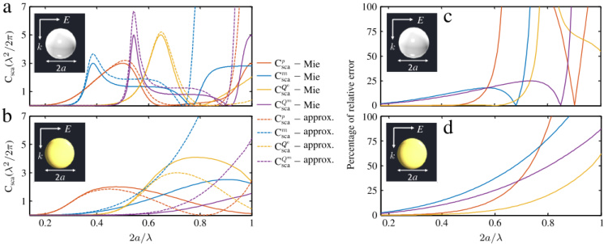
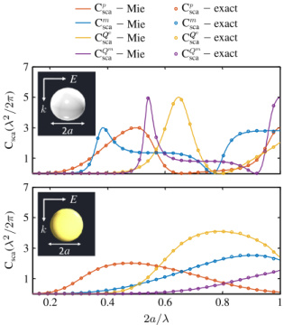
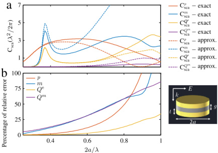

# An electromagnetic multipole expansion beyond the long-wavelength approximation

Rasoul Alae$^{a,b,*}$, Carsten Rockstuhl$^{a,c}$, I. Fernandez-Corbaton$^{c}$

$^{a}$ Institute of Theoretical Solid State Physics, Karlsruhe Institute of Technology, 76131 Karlsruhe, Germany

$^{b}$ Max Planck Institute for the Science of Light, Erlangen 91058, Germany

$^{c}$ Institute of Nanotechnology, Karlsruhe Institute of Technology, 76021 Karlsruhe, Germany

# ARTICLE INFO

# ABSTRACT

Keywords: Multipole moments Scattering Plasmonics Metamaterials

The multipole expansion is a key tool in the study of light-matter interactions. All the information about the radiation of and coupling to electromagnetic fields of a given charge-density distribution is condensed into few numbers: The multipole moments of the source. These numbers are frequently computed with expressions obtained after the long-wavelength approximation. Here, we derive exact expressions for the multipole moments of dynamic sources that resemble in their simplicity their approximate counterparts. We validate our new expressions against analytical results for a spherical source, and then use them to calculate the induced moments for some selected sources with a non-trivial shape. The comparison of the results to those obtained with approximate expressions shows a considerable disagreement even for sources of subwavelength size. Our expressions are relevant for any scientific area dealing with the interaction between the electromagnetic field and material systems.

© 2017 Elsevier B.V. All rights reserved.

# 1. Introduction

The multipolar decomposition of a given charge-current distribution is taught in every undergraduate course in physics. The resulting set of numbers are called the multipolar moments. They are classified according to their order, i.e. dipoles, quadrupoles etc. For each order, there are electric and magnetic multipolar moments. Each multipolar moment is uniquely connected to a corresponding multipolar field. Their importance stems from the fact that the multipolar moments of a charge-current distribution completely characterize both the radiation of electromagnetic fields by the source, and the coupling of external fields onto it. The multipolar decomposition is important in any scientific area dealing with the interaction between the electromagnetic field and material systems. In particle physics, the multipole moments of the nuclei provide information on the distribution of charges inside the nucleus. In chemistry, the dipole and quadrupolar polarizabilities of a molecule determine most of its properties. In electrical engineering, the multipole expansion is used to quantify the radiation from antennas. And the list goes on.

In this contribution, we present new exact expressions for the multipolar decomposition of an electric charge-current distribution. They provide a straightforward path for upgrading analytical and

numerical models currently using the long-wavelength approximation. After the upgrade, the models become exact. The expressions that we provide are directly applicable to the many areas where the multipole decomposition of electrical current density distributions is used. For the sake of concreteness, in this article we apply them to a specific field: Nanophotonics.

In nanophotonics, one purpose is to control and manipulate light on the nanoscale. Plasmonic or high-index dielectric nanoparticles are frequently used for this purpose [1,2]. The multipole expansion provides insight into several optical phenomena, such as Fano resonances [3,4], electromagnetically-induced-transparency [5], directional light emission [6–11], manipulating and controlling spontaneous emission [12–14], light perfect absorption [15–17], electromagnetic cloaking [18,19], and optical (pulling, pushing, and lateral) forces [20–24]. In all these cases, an external field induces displacement or conductive currents into the particles. These induced currents are the source of the scattered field. But: How can we calculate the multipole moments of these induced current distributions?

Exact expressions exists and can be found in standard textbooks, e.g. Eq. (7.20) in [25] or Eq. (9.165) in [26] (without the magnetization current therein) and a new formulation have been recently derived

in [27]. However, up to now they are not frequently used in the literature. One reason for this may be their complexity, i.e. they feature differential operators like the curl and/or vector spherical harmonics. Instead, a long-wavelength approximation that considerably simplifies the expressions is very often used in nanophotonics [28-34]. Their integrands contain algebraic functions of the coordinate and current density vectors. Moreover, the approximate expressions resemble those for the multipole moments derived in the context of electro-statics and magneto-statics. To set a starting point, these expressions are documented in Table 1. The so-called toroidal moments are also included in these expression as the second term in the electric multipole moments [30,34,35]. It is important to mention that there is an alternative approach to calculate the multipole moments which is based on the scattered fields [26,36,37]. They are exact and valid for any particle's size. We note that the multipole moments, just as any other quantity in physics, have identical physical meaning independent on their basis (Cartesian or spherical) or which approaches (scattered fields or induced currents) has been used to extract them. The change of basis (Cartesian to spherical and vise versa) will not change the physical meaning of the multipole moments (see the supplementary material for the relation between two basis).

# 2. Derivation of the multipole moments

Let us first investigate the range of validity of the expressions in Table 1 by comparing them with Mie theory. In Mie theory, the solution for the scattering of a plane wave by a sphere is obtained without any approximation, i.e. it is valid for any wavelength and size of the sphere. For example, Mie theory allows to compute the individual contributions of each induced electric and magnetic multipole moment to the total scattering cross-section. We will compare those exact individual contributions to the ones obtained using the formulas in Table 1. We consider a high-index dielectric nanosphere and a gold nanosphere. Both are illuminated with a linearly x-polarized plane wave that propagates in the z-direction. The induced multipole moments in both cases can be computed using the expressions in Table 1. The induced electric current density is obtained by using $J_{\omega}(\mathbf{r}) = i\omega\epsilon_0\left(e_{\tau} - 1\right) \mathbf{E}_{\omega}(\mathbf{r})$, where $\mathbf{E}_{\omega}(\mathbf{r})$ is the electric field distribution, $\epsilon_0$ is the permittivity of free space, and $\epsilon_{\tau}$ is the relative permittivity of the sphere. The permittivity of the dielectric sphere is assumed to be $\epsilon_{\tau} = 2.5^2$. Dispersive material properties as documented in the literature are considered for gold [38]. We assume air as the host medium. We used a numerical finite element solver to obtain the electric field distributions [39].

Using the multipole moments, it is easy to obtain the total scattering cross section, i.e. the sum of the contributions from different multipole moments, as [26]:

$$
\begin{array}{rl} { C _ { \mathrm { { s c a } } } ^{\mathrm { { t o t a l} } } } & { = C _ { \mathrm { { s c a } } } ^{p} + C _ { \mathrm { { s c a } } } ^{m} + C _ { \mathrm { { s c a } } } ^{Q ^ { e} } + C _ { \mathrm { { s c a } } } ^{Q ^ { m} } + \cdots } \\& { = \frac { k ^{4} } { 6 \pi \epsilon _ { 0 } ^{2} | \mathbf { E } _ { \mathrm { { i n c } } } | ^{2} } \left[ \sum _ { \alpha } \left( \left| p _ { \alpha } \right| ^{2} + \frac { | m _ { \alpha } | ^{2} } { c } \right) + \right. } \\& { \left. \frac { 1 } { 12 0 } \sum _ { \alpha \beta } \left( \left| k Q _ { \alpha \beta } ^{e} \right| ^{2} + \left| \frac { k Q _ { \alpha \beta } ^{m} } { c } \right| ^{2} \right) + \cdots \right] } \end{array}
$$

where, $p_{a}$, $m_{a}$ are the electric and magnetic dipole moments, respectively. $Q_{a\beta}^{e}$, $Q_{a\beta}^{m}$ are the electric and magnetic quadrupole moments, respectively. $|\mathbf{E}_{\mathrm{inc}}|$ is the electric field amplitude of the incident plane wave, $k$ is the wavenumber, and $c$ is the speed of light.

Fig. 1 shows the contribution of each multipole moment to the scattering cross section for a high-index dielectric as well as a gold nanosphere. The results obtained using the approximate expression are compared with those obtained from Mie theory. It can be seen that, upon increasing the $a/\lambda$ ratio, there is a large deviation between the scattering cross section obtained from the expressions in Table 1 and the Mie theory. The relative error between the two approaches is shown in Fig. 1(c) and (d). The relative error is more than 100% for the

dielectric sphere at $2a/\lambda \approx 0.75$ for both electric and magnetic dipole moments. This large deviation occurs because the expressions in Table 1 are obtained in the long-wavelength approximation [26], i.e. they are only valid for particles small compared to the wavelength of the incident light (i.e. $D \ll \lambda$ where $D$ is the biggest dimension of the particle).

Thus, the long-wavelength expressions in Table 1 can not be used for large particles (compared to the wavelength). The large deviation observed in Fig. 1(c) and (d) for different multipole moments will significantly affect the quantitative prediction of multipolar interference, which is the main physical mechanism behind Fano resonances [3,4], directional light emission [8–11], and light perfect absorption [15,16]. Moreover, any physical quantity obtained using the multipole moments of Table 1, e.g. absorption/extension cross section, or optical torque/force, carries a corresponding error. Therefore, the application of the exact expressions for the multipole moments is important since it provides a better understanding of all the highlighted optical phenomena and enables its quantitative prediction.

To improve the situation and indeed to provide error-free expressions, we now derive exact expressions for the induced electric and magnetic multipole moments that are valid for any wavelength and size (see Table 2). They can be used to compute the multipole moments of arbitrarily shaped particles. Our exact expressions for multipole moments are very similar to the well-known expression obtained in long-wavelength approximation (see Table 1).

Our starting point are the hybrid integrals in Fourier and coordinate space in Eq. 14 of [35] (see the supplementary material). These integrals are exact expressions for all the multipolar moments of a spatially confined electric current density distribution. They are valid for any size of the distribution. Crucially, the Fourier space part of the integrals does not depend on the current density. The results in Table 2 are obtained after carrying out the Fourier space integrals for the electric and magnetic dipolar and quadrupolar orders (see the supplementary material). Our results have two main advantages with respect to other exact expressions [25–27]. One is that our formulas are simpler: The previously existing expressions contain differential operators and/or vector spherical harmonics inside the integrands, while ours contain algebraic functions of the coordinate and current density vectors, and spherical Bessel functions. The other advantage is that the previous expressions lack the similarity to their long-wavelength approximations that ours have (compare Tables 1 and 2). Therefor, our expressions allow a straightforward upgrade of analytical and numerical models using the approximated long-wavelength expressions. After the upgrade, the models become exact.

Basically, any code that has been previously implemented to compute the multipole moments with the approximate expression can be made to be accurate with a marginal change.

In order to show the correctness of the expressions in Table 2, we compute the contributions of different multipole moments to the scattering cross section and compare them to those obtained with Mie theory. Fig. 2 shows the different contributions as a function of the particle's size parameter $2a/\lambda$ for both the previously considered dielectric and gold spheres. It can be seen that the results from our exact expressions are in excellent agreement with those from Mie theory, irrespective of the particle's size parameter. Indeed, they are indistinguishable up to a numerical noise level.

Up to now, we have considered only spherical particles that could also be studied with Mie theory. We now use the new expressions in Table 2 to calculate the induced moments of a canonical particle made of two coupled nanopatches. Its geometry and the results are shown in Fig. 3. The coupled nanopatches support a strong electric and magnetic response. The radius and thickness of the coupled disk is assumed to be $a = 250$ nm, $t = 80$ nm, respectively. The spacer between the two disks is $g = 120$ nm. It can be seen that there is a significant deviation between the contributions to the scattering cross section from the different multipole moments as predicted by the approximate (Table 1) and by the exact (Table 2) expressions. The relative error is shown in Fig. 3(b). Some of them reach 25% for a particle size of about half the wavelength.

{width=60%} Fig. 1. Contribution of each multipole moment to the scattering cross section calculated with Mie theory and calculated with the approximate expressions (Table 1): (a) For a dielectric sphere as a function of the particle's size parameter $2a/\lambda$. (b) For a gold sphere with a fixed radius of $a=250$ nm. (c) and (d) Relative error between the multipole moments calculated with the Mie theory and calculated with the approximate expressions. Note that the contribution of each multipole moment to the scattering cross section is normalized to $\lambda^2/2\pi$. For spherical particle, there is a universal limit for each multipole, i.e. $(2j+1)\lambda^2/2\pi$. For example, for a dipolar particle (i.e. $j=1$), the maximum cross section is $3\lambda^2/2\pi$ [24,40].

Table 1

Multipole moments in long-wavelength approximation; electric dipole moment (ED, i.e. $p_{\alpha}$), magnetic dipole moment (MD, i.e. $m_{\alpha}$), electric quadrupole moment (EQ, i.e. $Q_{\alpha\beta}^{e}$) and magnetic quadrupole moment (MQ, i.e. $Q_{\alpha\beta}^{e}$) where $\alpha, \beta = x, y, z$.

| ED : 1 | $p_s \approx -\frac{1}{10} \left\{ \int d^3 \mathbf{r} J_a^\rho + \frac{k^2}{10} \int d^3 \mathbf{r} \left[ (\mathbf{r} \cdot \mathbf{J}_\omega) r_a - 2 \mathbf{r}^2 J_a^\rho \right] \right\} $ | (T1 - 1) |
| --- | --- | --- |
| MD : 1 | $m_s \approx \frac{1}{2} \int d^3 \mathbf{r} \left[ (\mathbf{r} \times \mathbf{J}_\omega) a \right] $ | (T1 - 2) |
| EQ : 1 | $Q_{\alpha\beta}^c \approx -\frac{1}{10} \left\{ \int d^3 \mathbf{r} \left[ 3 \left( r_\beta J_a^\rho + r_\alpha J_\beta^\rho \right) - 2 \left( \mathbf{r} \cdot \mathbf{J}_\omega \right) \delta_{\alpha\beta} \right] \right.$ | (T1 - 3) |
| MQ : 1 | $Q_{\alpha\beta}^c \approx \int d^3 \mathbf{r} \left[ 4 r_{\alpha^\beta} \left( \mathbf{r} \cdot \mathbf{J}_\omega \right) - 5 r^2 \left( r_\alpha J_\beta + r_\beta J_\alpha \right) + 2 r^2 \left( \mathbf{r} \cdot \mathbf{J}_\omega \right) \delta_{\alpha\beta} \right] \right\}$ | (T1 - 4) |
| MQ : 1 | $Q_{\alpha\beta}^c \approx \int d^3 \mathbf{r} \left\{ r_a \left( \mathbf{r} \times \mathbf{J}_\omega \right) _\beta + r_\beta \left( \mathbf{r} \times \mathbf{J}_\omega \right) _\alpha \right\}$ | (T1 - 4) |

Table 2

Exact multipole moments; electric dipole moment (ED, i.e. $p_{s}$), magnetic dipole moment (MD, i.e. $m_{s}$), electric quadrupole moment (EQ, i.e. $Q_{s\beta}^{m}$) and magnetic quadrupole moment (MQ, i.e. $Q_{s\beta}^{m}$) where $\alpha, \beta = x, y, z$. The derivation can be found in the supplementary material.

Finally, there are a few important facts about the expressions shown in Table 2 that are worth highlighting:

The exact multipole moments are valid for any particle's size (i.e. $a/\lambda$) and arbitrarily shaped particles. Note, any physical quantities obtained from the these multipole moments will be exact.

There is no need to introduce a third family of multipole (i.e. toroidal multipole moments). Our new expressions reveal that toroidal multipole moments are only the higher order terms in the expansion of the electric multipole moments [41].

The well known approximate multipole moments in Table 1 can be obtained from the expressions in Table 2 by using a long-wavelength approximation. This means that the approximate expression in Table 1 can be easily recovered by making a small argument approximation to the spherical Bessel functions (see the supplementary material):$j_{0}(kr) \approx 1 - (kr)^{2}/6,$j_{1}(kr) \approx kr/3,$j_{2}(kr) \approx (kr)^{2}/15$.

Note that for a particle on top of a substrate, the expressions in Table 2 can be used to obtain the induced multipole moments. After the induced current density inside the particle (i.e. $J_{\omega}$) is found, typically by numerical approaches, our exact expressions provide its multipolar decomposition. The final fields produced in the system by each multipolar term can then be obtained by expressing the Green's tensor of the multilayer in the multipolar basis. The main difference with respect to the homogeneous case is that the Green's tensor of the multilayer is not diagonal in the multipolar basis, and each of the multipolar terms in the current will give rise to a linear combination of radiated multipolar fields.

# 3. Conclusion

In summary, we have introduced new expressions for multipole moments Table 2 which are valid for arbitrarily sized particles of any shape. The well-known long-wavelength expression (Table 1) are recovered as the lowest order terms of our new exact expressions (Table 2). We have shown the correctness of our expressions by comparing their results with those of Mie theory and obtaining a complete agreement. We are

{width=25%} Fig. 2. Contribution of each multipole moment to the scattering cross section calculated with Mie theory and calculated with the exact expressions (Table 2). (a) For a dielectric sphere with a relative permittivity of $\epsilon_{r}=2.5^{2}$ as a function of the particle's size parameter $2a/i$. (b) For a gold sphere with a fixed radius of $a$=250 nm.

{width=35%} Fig. 3. (a) Contribution of each multipole moment to the scattering cross section calculated with the approximate expressions (Table 1) and calculated with the exact expressions (Table 2) for a coupled nanopatch with given geometrical parameters as a function of the wavelength. (b) Relative error between the multipole moments calculated with the approximate expression (Table 1) and calculated with the exact expression (Table 2).

confident that our new exact expressions in Table 2 have the potential to be used in every electrodynamics textbook and actually should be taught in undergraduate courses in physics.

Beyond the particular case of multipolar moments induced by an incident field in a structure, our expressions can be directly applied in the many areas where the multipole decomposition of electrical current density distributions is used.

# Acknowledgments

The authors warmly thank Dr. Zeinab Mokhtari, Renwen Yu and Burak Gürlek for their constructive comments and suggestions. We acknowledge the German Science Foundation for support within the project RO 3640/7-1. R.A. would like to acknowledge financial support from the Max Planck Society.

# Appendix A. Supplementary data

Supplementary material related to this article can be found online at http://dx.doi.org/10.1016/j.optcom.2017.08.064.

# References

[1] S.A. Maier, Plasmonics: Fundamentals and Applications, Springer, 2007.

[2] S. Jahani, Z. Jacob, All-dielectric metamaterials, Nat. Nano 11 (2016) 23-36.

[3] B. Lukyanchuk, N.I. Zheludev, S.A. Maier, N.J. Halas, P. Nordlander, H. Giessen, C.T. Chong, The faint resonance in plasmonic nanostructures and metamaterials, Nature Mater. 9 (2010) 707-715.

[4] A.E. Mirohnichenko, S. Flach, Y.S. Kivshar, Fano resonances in nanoscale structures, Rev. Modern Phys. 82 (2010) 2257-2298.

[5] S.-Y. Chiam, R. Singh, C. Rockstuhl, F. Lederer, W. Zhang, A.A. Bettiol, Analogue of electromagnetically induced transparency in a terahertz metamaterial, Phys. Rev. B 80 (2009) 153103.

[6] J.M. Geffring, B. García-Cámará, R. Gómez-Medina, P. Albella, L.S. Froufe-Pérez, C. Eyraud, A. Litman, R. Vaillon, F. González, M. Nieto-Vesperinas, J.J. Sáenz, Magnetic and electric coherence in forward-back-scattered electromagnetic waves by a single dielectric subwavelength sphere. Nature Commun. 3 (2012) 1171.

[7] S. Person, M. Jain, Z. Lapin, J.J. Saenz, G. Wicks, L. Novotny, Demonstration of zero optical backscattering from single nanoparticles, Nano Lett. 13 (2013) 1806-1809.

[8] I.M. Hancu, A.G. Curto, M. Castro-López, M. Kuttge, N.F. van Hult, Multipolar interference for directed light emission, Nano Lett. 14 (2013) 166-171.

[9] Y.H. Fu, A.I. Kuznetsov, A.E. Mirohnichenko, Y.F. Yu, B. Lukýanchuk, Directional visible light scattering by silicon nanoparticles, Nature Commun. 4 (2013) 1527.

[10] T. Coenen, F. Bernal Arango, A. Femius Koenderink, A. Polman, Directional emission from a single plasmonic scatterer, Nature Commun. 5 (2014) 3250.

[11] R. Alaeer, R. Filter, D. Lehr, F. Lederer, C. Rockstuhl, A. Generalized kerker condition for highly directive nanoantennas, Opt. Lett. 40 (2015) 2645-2648.

[12] L. Rogobete, F. Kaminski, M. Agio, V. Sandoghdar, Design of plasmonic nanoantennae for enhancing spontaneous emission, Opt. Lett. 32 (2007) 1623-1625.

[13] X. Zambrina-Puyalto, N. Bonod, Purcell factor of spherical Mie resonators, Phys. Rev. B 91 (2015) 195422.

[14] H.M. Doeleman, E. Verhagen, A.F. Koenderink, Antenna-cavity hybrids: Matching polar opposites for purcell enhancements at any linewidth, ACS Photonics 3 (2016) 1943-1951.

[15] N. Landy, S. Sajuyiagh, J. Mock, D. Smith, W. Padilla, Perfect metamaterial absorber, Phys. Rev. Lett. 100 (2008) 207402.

[16] R. Alaeer, M. Albooyeh, M. Yazdi, N. Komjani, C. Simovski, F. Lederer, C. Rockstuhl, Magnetoelectric coupling in nonidentical plasmonic nanoparticles: Theory and applications, Phys. Rev. B 91 (2015) 115119.

[17] R. Alaeer, M. Albooyeh, S. Tretyakov, C. Rockstuhl, Phase-change material-based nanoantennas with tunable radiation patterns, Opt. Lett. 41 (2016) 4099-4102.

[18] A. Alü, N. Engheta, Multifrequency optical invisibility cloak with layered plasmonic shells, Phys. Rev. Lett. 100 (2008) 113901.

[19] A. Alü, N. Engheta, Cloaking a sensor, Phys. Rev. Lett. 102 (2009) 233901.

[20] J.P. Barton, D.R. Alexander, S.A. Schaub, Theoretical determination of net radiation force and torque for a spherical particle illuminated by a focused laser beam, J. Appl. Phys. 66 (1989) 4594.

[21] M. Nieto-Vesperinas, R. Gomez-Medina, J.J. Saenz, Angle-suppressed scattering and optical forces on submicrometer dielectric particles, J. Opt. Soc. Am. A 28 (2011) 54-60.

[22] J. Chen, N. Ng, Z. Lin, C. Chan, Optical pulling force, Nat. Photonics 5 (2011) 531-534.

[23] F.J. Rodríguez-Fortuño, N. Engheta, A. Martínez, A.V. Zayats, Lateral forces on circularly polarizable particles near a surface, Nature Commun. 6 (2015) 8799.

[24] A. Rahimzadegan, R. Alaeer, I. Fernandez-Corbon, C. Rockstuhl, Fundamental limits of optical force and torque, Phys. Rev. B 95 (2017) 035106.

[25] J.D. Jackson, Classical Electrodynamics, third ed., Wiley, 1998.

[27] P. Grahn, A. Shevchenko, M. Kaivola, Electromagnetic multipole theory for optical nanomaterials, New J. Phys. 14 (2012) 093033.

[28] F. Shafiei, F. Monticone, K.Q. Le, X.X. Liu, T. Hartsfield, A. Alu, X. Li, A. subwavelength plasmonic metamolecule exhibiting magnetic-based optical fano resonance, Nat. Nanotechnol. 8 (2013) 95-99.

[29] A.B. Evlyukhin, C. Reinhardt, E. Evlyukhin, B.N. Chichkov, Multipole analysis of light scattering by arbitrary-shaped nanoparticles on a plane surface, J. Opt. Soc. Amer. B 30 (2013) 2589-2598.

[30] X.L. Zhang, S.B. Wang, Z. Lin, L.H. B. Sun, C.T. Chan, Optical force on toroidal nanostructures: Toroidal dipole versus renormalized electric dipole, Phys. Rev. A 94 (2015) 043804.

[31] A.E. Mirohnichenko, A.B. Evlyukhin, Y.F. Yu, R.M. Bakker, A. Chipouline, A.I. Kuznetsov, B. Lukyanchuk, B.N. Chichkov, Y.S. Kivshar, Nonradiating anapole modes in dielectric nanoparticles, Nature Commun. 6 (2015).

[32] D. Sikdar, W. Cheng, M. Premaratne, Optically resonant magneto-electric cubic nanoantennas for ultra-directional light scattering, J. Appl. Phys. 117 (2015) 083101.

[33] L. Wei, Z. Xi, N. Bhattacharya, H.P. Urbach, Excitation of the radiationless anapole mode, Optica 3 (2016) 799-802.

[34] N. Papasimakis, V.A

[35] I. Fernandez-Corbaton, S. Nanz, R. Alaee, C. Rockstuhl, Exact dipolar moments of a localized electric current distribution, Opt. Express 23 (2015) 33044–33064.

[36] C.F. Bohren, D.R. Huffman, Absorption and Scattering of Light By Small Particles, John Wiley and Sons, 2008.

[37] S. Mühlig, C. Menzel, C. Rockstuhl, F. Lederer, Multipole analysis of meta-atoms, Metamaterials 5 (2011) 64–73.

[38] P.B. Johnson, R.W. Christy, Optical constants of the noble metals, Phys. Rev. B 6 (1972) 4370–4379.

[39] Comsol Multiphysics. See http://dx.doi.org/www.comsol.com for the details of computational modeling, 2012.

[40] Z. Ruan, S. Fan, Superscattering of light from subwavelength nanostructures, Phys. Rev. Lett. 105 (2010) 013901.

[41] I. Fernandez-Corbaton, S. Nanz, C. Rockstuhl, On the dynamic toroidal multipoles from localized electric current distributions, Sci. Rep. 7 (2007) 7527.