# CHAPTER 4

# Multipoles, Electrostatics of Macroscopic Media, Dielectrics

This chapter is first concerned with the potential due to localized charge distributions and its expansion in multipoles. The development is made in terms of spherical harmonics, but contact is established with the rectangular components for the first few multipoles. The energy of a multipole in an external field is then discussed. An elementary derivation of the macroscopic equations of electrostatics is sketched, but a careful treatment is deferred to Chapter 6. Dielectrics and the appropriate boundary conditions are then described, and some typical boundary-value problems with dielectrics are solved. Simple classical models are used to illustrate the main features of atomic polarizability and susceptibility. Finally the question of electrostatic energy and forces in the presence of dielectrics is discussed.

# 4.1 Multipole Expansion

A localized distribution of charge is described by the charge density $\rho(\mathbf{x}^{\prime})$, which is nonvanishing only inside a sphere of radius $R$ around some origin.* The potential outside the sphere can be written as an expansion in spherical harmonics:

$$
\Phi ( \mathbf { x } ) = \frac { 1 } { 4 \pi \epsilon _ { 0 } } \sum _ { l = 0 } ^{\infty} \sum _ { m = - l } ^{l} \frac { 4 \pi } { 2 l + 1 } \frac { Y _ { l m } ( \theta , \phi ) } { r ^{l + 1} }
$$

where the particular choice of constant coefficients is made for later convenience. Equation (4.1) is called a multipole expansion; the $l=0$ term is called the monopole term, $l=1$ are the dipole terms, etc. The reason for these names becomes clear below. The problem to be solved is the determination of the constants $q_{lm}$ in terms of the properties of the charge density $\rho(\mathbf{x}')$. The solution is very easily obtained from the integral (1.17) for the potential:

$$
\Phi ( \mathbf { x } ) = \frac { 1 } { 4 \pi \epsilon _ { 0 } } \int \frac { \rho ( \mathbf { x } ^{\prime} ) } { | \mathbf { x } - \mathbf { x } ^{\prime} | } \, d ^{3} x ^{\prime}
$$

with expansion (3.70) for $1/|\mathbf{x} - \mathbf{x}'|$. Since we are interested at the moment in the potential outside the charge distribution, $r_{<} = r'$ and $r_{>} = r$. Then we find:

$$
\Phi ( \mathbf { x } ) = \frac { 1 } { \epsilon _ { 0 } } \sum _ { l , m } \frac { 1 } { 2 l + 1 } \left[ \int Y _ { l m } ^{*} ( \theta ^{\prime} , \, \phi ^{\prime} ) r ^{\prime l} \rho ( \mathbf { x } ^{\prime} ) \, d ^{3} x ^{\prime} \right] \frac { Y _ { l m } ( \theta , \, \phi ) } { r ^{l + 1} }
$$

*The sphere of radius $R$ is an arbitrary conceptual device employed merely to divide space into regions with and without charge. If the charge density falls off with distance faster than any power, the expansion in multipoles is valid at large enough distances.

Consequently the coefficients in (4.1) are:

$$
q _ { l m } = \int Y _ { l m } ^{*} ( \theta ^{\prime} , \phi ^{\prime} ) r ^{\prime \prime} \rho ( \mathbf { x } ^{\prime} ) \; d ^{3} x ^{\prime}
$$

These coefficients are called multipole moments. To see the physical interpretation of them we exhibit the first few explicitly in terms of Cartesian coordinates:

$$
q _ { 00 } = \frac { 1 } { \sqrt { 4 \pi } } \int \rho ( { \bf x } ^{\prime} ) \ d ^{3} x ^{\prime} = \frac { 1 } { \sqrt { 4 \pi } } \, q
$$

$$
\begin{array}{r} { q _ { 11 } = - \sqrt { \frac { 3 } { 8 \pi } } \int \, ( x ^{\prime} - i y ^{\prime} ) \rho ( { \bf x } ^{\prime} ) \, d ^{3} x ^{\prime} = - \sqrt { \frac { 3 } { 8 \pi } } \, ( p _ { x } - i p _ { y } ) \biggr \} } \\{ q _ { 10 } = \sqrt { \frac { 3 } { 4 \pi } } \int \, z ^{\prime} \rho ( { \bf x } ^{\prime} ) \, d ^{3} x ^{\prime} = \sqrt { \frac { 3 } { 4 \pi } } p _ { z } } \\{ q _ { 22 } = \frac { 1 } { 4 } \, \sqrt { \frac { 15 } { 2 \pi } } \int \, ( x ^{\prime} - i y ^{\prime} ) ^{2} \rho ( { \bf x } ^{\prime} ) \, d ^{3} x ^{\prime} = \frac { 1 } { 12 } \, \sqrt { \frac { 15 } { 2 \pi } } \, ( Q _ { 11 } - 2 i Q _ { 12 } - Q _ { 22 } ) } \\{ q _ { 21 } = - \sqrt { \frac { 15 } { 8 \pi } } \int \, z ^{\prime} ( x ^{\prime} - i y ^{\prime} ) \rho ( { \bf x } ^{\prime} ) \, d ^{3} x ^{\prime} = - \frac { 1 } { 3 } \, \sqrt { \frac { 15 } { 8 \pi } } \, ( Q _ { 13 } - i Q _ { 23 } ) } \\{ q _ { 20 } = \frac { 1 } { 2 } \, \sqrt { \frac { 5 } { 4 \pi } } \int \, ( 3 z ^{\prime 2} - r ^{\prime 2} ) \rho ( { \bf x } ^{\prime} ) \, d ^{3} x ^{\prime} = \frac { 1 } { 2 } \, \sqrt { \frac { 5 } { 4 \pi } } \, Q _ { 33 } } \end{array}
$$

Only the moments with $m \geq 0$ have been given, since (3.54) shows that for a real charge density the moments with $m < 0$ are related through

$$
q _ { l , - m } = ( - 1 ) ^{m} q _ { l m } ^{*}
$$

In equations (4.4)–(4.6), $q$ is the total charge, or monopole moment, $\mathbf{p}$ is the electric dipole moment:

$$
\mathbf { p } = \int \mathbf { x } ^{\prime} \rho ( \mathbf { x } ^{\prime} ) \ d ^{3} x ^{\prime}
$$

and $Q_{ij}$ is the traceless quadrupole moment tensor:

$$
Q _ { i j } = \int ( 3 x _ { i } ^{\prime} x _ { j } ^{\prime} - r ^{\prime 2} \delta _ { i j } ) \rho ( { \bf x } ^{\prime} ) \; d ^{3} x _ { i } ^{\prime}
$$

We see that the $l$th multipole coefficients [(2$l + 1$) in number] are linear combinations of the corresponding multipoles expressed in rectangular coordinates. The expansion of $\Phi(\mathbf{x})$ in rectangular coordinates

$$
\Phi ( \mathbf { x } ) = \frac { 1 } { 4 \pi \epsilon _ { 0 } } \left[ \frac { q } { r } + \frac { \mathbf { p } \cdot \mathbf { x } } { r ^{3} } + \frac { 1 } { 2 } \sum _ { i , j } Q _ { i j } \frac { x _ { i } x _ { j } } { r ^{5} } + \cdots \right]
$$

by direct Taylor series expansion of $1/|\mathbf{x} - \mathbf{x}'|$ will be left as an exercise for the reader. It becomes increasingly cumbersome to continue the expansion in (4.10) beyond the quadrupole terms.

The electric field components for a given multipole can be expressed most

easily in terms of spherical coordinates. The negative gradient of a term in (4.1) with definite $l$, $m$ has spherical components:

$$
\begin{array}{r} { E _ { r } = \frac { ( l + 1 ) } { ( 2 l + 1 ) \epsilon _ { 0 } } \, q _ { l m } \, \frac { Y _ { l m } ( \theta , \, \phi ) } { r ^{l + 2} } } \\{ E _ { \theta } = - \frac { 1 } { ( 2 l + 1 ) \epsilon _ { 0 } } \, q _ { l m } \, \frac { 1 } { r ^{l + 2} } \, \frac { \partial } { \partial \theta } \, Y _ { l m } ( \theta , \, \phi ) } \\{ E _ { \phi } = - \frac { 1 } { ( 2 l + 1 ) \epsilon _ { 0 } } \, q _ { l m } \, \frac { 1 } { r ^{l + 2} } \, \frac { i m } { \sin \theta } \, Y _ { l m } ( \rho , \, \phi ) } \end{array}
$$

$\partial Y_{lm}/\partial\theta$ and $Y_{lm}/\sin\theta$ can be expressed as linear combinations of other $Y_{lm}$'s, but the expressions are not particularly illuminating and so will be omitted. The proper way to describe a vector multipole field is by vector spherical harmonics, discussed in Chapter 9.

For a dipole $\mathbf{p}$ along the $z$ axis, the fields in (4.11) reduce to the familiar form:

$$
\begin{array}{rl} { E _ { r } = { \frac { 2 p \ \cos \theta } { 4 \pi \epsilon _ { 0 } r ^{3} } } } \\{ E _ { \theta } = { \frac { p \ \sin \theta } { 4 \pi \epsilon _ { 0 } r ^{3} } } } \\{ E _ { \phi } = 0 } \end{array}
$$

These dipole fields can be written in vector form by recombining (4.12) or by directly operating with the gradient on the dipole term in (4.10). The result for the field at a point x due to a dipole p at the point x_0 is:

$$
\mathbf { E } ( \mathbf { x } ) = { \frac { 3 \mathbf { n } ( \mathbf { p } \cdot \mathbf { n } ) - \mathbf { p } } { 4 \pi \epsilon _ { 0 } | \mathbf { x } - \mathbf { x } _ { 0 } | ^{3} } }
$$

where $\mathbf{n}$ is a unit vector directed from $\mathbf{x}_0$ to $\mathbf{x}$.

There are two important remarks to be made. The first concerns the relationship of the Cartesian multipole moments like (4.8) to the spherical multipole moments (4.3). The former are $(l+1)(l+2)/2$ in number and for $l>1$ are more numerous than the $(2l+1)$ spherical components. There is no contradiction here. The root of the differences lies in the different rotational transformation properties of the two types of multipole moments; the Cartesian tensors are reducible, the spherical, irreducible—see Problem 4.3. Note that for $l=2$ we have recognized the difference by defining a traceless Cartesian quadrupole moment (4.9).

The second remark is that in general the multipole moment coefficients in the expansion (4.1) depend on the choice of origin. As a blatant example, consider a point charge $e$ located at $\mathbf{x}_0 = (r_0, \theta_0, \phi_0)$. Its potential has a multipole expansion of the form (4.1) with multipole moments,

$$
q _ { l m } = e r _ { 0 } ^{l} Y _ { l m } ^{*} ( \theta _ { 0 } , \, \phi _ { 0 } )
$$

These are nonvanishing for all $l$, $m$ in general. Only the $l=0$ multipole $q_{00}=e/\sqrt{4\pi}$ is independent of the location of the point charge. For two point charges $+e$ and $-e$ at $\mathbf{x}_0$ and $\mathbf{x}_1$, respectively, the multipole moments are

$$
q _ { l m } = e [ r _ { 0 } ^{l} Y _ { l m } ^{*} ( \theta _ { 0 } , \ \phi _ { 0 } ) - r _ { 1 } ^{l} Y _ { l m } ^{*} ( \theta _ { 1 } , \ \phi _ { 1 } ) ]
$$

Now the $l=0$ multipole moment of the system vanishes, and the $l=1$ moments are

$$
\begin{array}{rl} { q _ { 10 } = \sqrt { \frac { 3 } { 4 \pi } } \, e ^{( z _ { 0} - z _ { 1 } ) } } & { } \\{ q _ { 11 } = - \sqrt { \frac { 3 } { 8 \pi } } \, e ^{[ ( x _ { 0} - x _ { 1 } ) - i ( y _ { 0 } - y _ { 1 } ) ] } } & { } \end{array}
$$

These moments are independent of the location of the origin, depending only on the relative position of the two charges, but all higher moments depend on the location of the origin as well. These simple examples are special cases of general theorem (see Problem 4.4). The values of $q_{lm}$ for the lowest nonvanishing multipole moment of any charge distribution are independent of the choice of origin of the coordinates, but all higher multipole moments do in general depend on the location of the origin.

Before leaving the general formulation of multipoles, we consider a result that is useful in elucidating the basic difference between electric and magnetic dipoles (see Section 5.6) as well as in other contexts. Consider a localized charge distribution $\rho(\mathbf{x})$ that gives rise to an electric field $\mathbf{E}(\mathbf{x})$ throughout space. We wish to calculate the integral of $\mathbf{E}$ over the volume of a sphere of radius $R$. We begin by examining the problem in general, but then specialize to the two extremes shown in Fig. 4.1, one in which the sphere contains all of the charge and the other in which the charge lies external to the sphere. Choosing the origin of coordinates at the center of the sphere, we have the volume integral of the electric field,

$$
\int _ { r < R } \mathbf { E } ( \mathbf { x } ) \ d ^{3} x = - \int _ { r < R } \nabla \Phi \ d ^{3} x
$$

This can be converted to an integral over the surface of the sphere:

$$
\int _ { r < R } \mathbf { E } ( \mathbf { x } ) \ d ^{3} x = - \int _ { r = R } R ^{2} \ d \Omega \ \Phi ( \mathbf { x } ) \mathbf { n }
$$

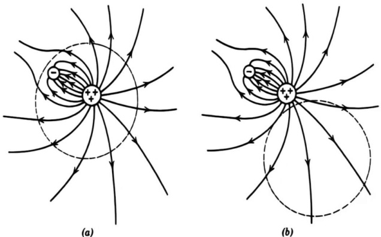{width=51%} Figure 4.1 Two configurations of charge density and the spheres within which the volume integral of electric field is to be calculated.

where $\mathbf{n}$ is the outwardly directed normal ($\mathbf{n} = \mathbf{x}/R$). Substitution of (1.17) for the potential leads to

$$
\int _ { r < R } \mathbf { E } ( \mathbf { x } ) \ d ^{3} x = - { \frac { R ^{2} } { 4 \pi \epsilon _ { 0 } } } \int d ^{3} x ^{\prime} \ \rho ( \mathbf { x } ^{\prime} ) \int _ { r = R } d \Omega \, { \frac { \mathbf { n } } { | \mathbf { x } - \mathbf { x } ^{\prime} | } }
$$

To perform the angular integration we first observe that $\mathbf{n}$ can be written in terms of the spherical angles $(\theta, \phi)$ as

$$
\mathbf { n } = \mathbf { i } \, \sin \theta \cos \phi + \mathbf { j } \, \sin \theta \sin \phi + \mathbf { k } \, \cos \theta
$$

Evidently the different components of $\mathbf{n}$ are linear combinations of $Y_{lm}$ for $l=1$ only. When (3.38) or (3.70) is inserted into (4.16), orthogonality of the $Y_{lm}$ will eliminate all but the $l=1$ term in the series. Thus we have

$$
\int _ { r = R } d \Omega \, \frac { \mathbf { n } } { | \mathbf { x } - \mathbf { x } ^{\prime} | } = \frac { r _ { < } } { r _ { > } ^{2} } \int d \Omega \, \mathbf { n } \, \cos \gamma
$$

where $\cos \gamma = \cos \theta \cos \theta' + \sin \theta \sin \theta' \cos(\phi - \phi')$. The angular integral is equal to $4\pi\mathbf{n}'/3$, where $\mathbf{n}' = \mathbf{r}'/r'$. Thus the integral (4.16) is

$$
\int _ { r < R } \mathbf { E } ( \mathbf { x } ) \ d ^{3} x \overset { ! } { = } - \frac { R ^{2} } { 3 \epsilon _ { 0 } } \int d ^{3} x ^{\prime} \frac { r _ { < } } { r _ { > } ^{2} } \mathbf { n } ^{\prime} \rho ( \mathbf { x } ^{\prime} )
$$

where $(r_{<}, r_{>}) = (r', R)$ or $(R, r')$ depending on which of $r'$ and $R$ is larger.

If the sphere of radius $R$ completely encloses the charge density, as indicated in Fig. 4.1a, then $r_{<} = r'$ and $r_{>} = R$ in (4.17). The volume integral of the electric field over the sphere then becomes

$$
\int _ { r < R } \mathbf { E } ( \mathbf { x } ) \ d ^{3} x = - { \frac { \mathbf { p } } { 3 \epsilon _ { 0 } } }
$$

where $\mathbf{p}$ is the electric dipole moment (4.8) of the charge distribution with respect to the center of the sphere. Note that this volume integral is independent of the size of the spherical region of integration provided all the charge is inside.

If, on the other hand, the situation is as depicted in Fig. 4.1b, with the charge all exterior to the sphere of interest, $r_{<} = R$ and $r_{>} = r'$ in (4.17). Then we have

$$
\int _ { r < R } \mathbf { E } ( \mathbf { x } ) \ d ^{3} x = - { \frac { R ^{3} } { 3 \epsilon _ { 0 } } } \int d ^{3} x ^{\prime} { \frac { \mathbf { n } ^{\prime} } { r ^{\prime 2} } } \, \rho ( \mathbf { x } ^{\prime} )
$$

From Coulomb's law (1.5) the integral can be recognized to be the negative of $4\pi\epsilon_0$ times the electric field at the center of the sphere. Thus the volume integral of $\mathbf{E}$ is

$$
\int _ { r < R } \mathbf { E } ( \mathbf { x } ) \ d ^{3} x = { \frac { 4 \pi } { 3 } } \, R ^{3} \mathbf { E } ( 0 )
$$

In other words, the average value of the electric field over a spherical volume containing no charge is the value of the field at the center of the sphere.

The result (4.18) implies modification of (4.13) for the electric field of a dipole. To be consistent with (4.18), the dipole field must be written as

$$
\mathbf { E } ( \mathbf { x } ) = { \frac { 1 } { 4 \pi \epsilon _ { 0 } } } \left[ { \frac { 3 \mathbf { n } ( \mathbf { p } \cdot \mathbf { n } ) - \mathbf { p } } { | \mathbf { x } - \mathbf { x } _ { 0 } | ^{3} } } - { \frac { 4 \pi } { 3 } } \, \mathbf { p } \, \delta ( \mathbf { x } - \mathbf { x } _ { 0 } ) \right]
$$

The added delta function does not contribute to the field away from the site of the dipole. Its purpose is to yield the required volume integral (4.18), with the convention that the spherically symmetric (around $\mathbf{x}_0$) volume integral of the first term is zero (from angular integration), the singularity at $\mathbf{x} = \mathbf{x}_0$ causing an otherwise ambiguous result. Equation (4.20) and its magnetic dipole counterpart (5.64), when handled carefully, can be employed as if the dipoles were idealized point dipoles, the delta function terms carrying the essential information about the actually finite distributions of charge and current.

# 4.2 Multipole Expansion of the Energy of a Charge Distribution in an External Field

If a localized charge distribution described by $\rho(\mathbf{x})$ is placed in an external potential $\Phi(\mathbf{x})$, the electrostatic energy of the system is:

$$
W = \int \rho ( \mathbf { x } ) \Phi ( \mathbf { x } ) \ d ^{3} x
$$

If the potential $\Phi$ is slowly varying over the region where $\rho(\mathbf{x})$ is nonnegligible, then it can be expanded in a Taylor series around a suitably chosen origin:

$$
\Phi ( \mathbf { x } ) = \Phi ( 0 ) + \mathbf { x } \cdot \nabla \Phi ( 0 ) + \frac { 1 } { 2 } \sum _ { i } \sum _ { j } x _ { i } x _ { j } \frac { \partial ^{2} \Phi } { \partial x _ { i } \, \partial x _ { j } } \left( 0 \right) + \cdots
$$

Utilizing the definition of the electric field $\mathbf{E} = -\nabla\Phi$, the last two terms can be rewritten. Then (4.22) becomes:

$$
\Phi ( \mathbf { x } ) = \Phi ( 0 ) - \mathbf { x } \cdot \mathbf { E } ( 0 ) - \frac { 1 } { 2 } \sum _ { i } \sum _ { j } x _ { i } x _ { j } \frac { \partial E _ { j } } { \partial x _ { i } } ( 0 ) + \cdots
$$

Since $\nabla \cdot \mathbf{E} = 0$ for the external field, we can subtract

$$
\begin{array}{r} { \frac { 1 } { \delta } r ^{2} \nabla \cdot \mathbf { E } ( 0 ) } \end{array}
$$

from the last term to obtain finally the expansion:

$$
\Phi ( \mathbf { x } ) = \Phi ( 0 ) - \mathbf { x } \cdot \mathbf { E } ( 0 ) - \frac { 1 } { 6 } \sum _ { i } \sum _ { j } \left( 3 x _ { i } x _ { j } - r ^{2} \delta _ { i j } \right) \frac { \partial E _ { j } } { \partial x _ { i } } ( 0 ) + \cdots
$$

When this is inserted into (4.21) and the definitions of total charge, dipole moment (4.8), and quadrupole moment (4.9) are employed, the energy takes the form:

$$
W = q \Phi ( 0 ) - \mathbf { p } \cdot \mathbf { E } ( 0 ) - \frac { 1 } { 6 } \sum _ { i } \sum _ { j } Q _ { i j } \frac { \partial E _ { j } } { \partial x _ { i } } ( 0 ) + \cdots
$$

This expansion shows the characteristic way in which the various multipoles interact with an external field—the charge with the potential, the dipole with the electric field, the quadrupole with the field gradient, and so on.

In nuclear physics the quadrupole interaction is of particular interest. Atomic nuclei can possess electric quadrupole moments, and their magnitudes and signs reflect the nature of the forces between neutrons and protons, as well as the

shapes of the nuclei themselves. The energy levels or states of a nucleus are described by the quantum numbers of total angular momentum $J$ and its projection $M$ along the $z$ axis, as well as others, which we will denote by a general index $\alpha$. A given nuclear state has associated with it a quantum-mechanical charge density* $\rho_{JMa}(\mathbf{x})$, which depends on the quantum numbers $(J, M, \alpha)$ but is cylindrically symmetric about the $z$ axis. Thus the only nonvanishing quadrupole moment is $q_{20}$ in (4.6), or $Q_{33}$ in (4.9).† The quadrupole moment of a nuclear state is defined as the value of (1/e) $Q_{33}$ with the charge density $\rho_{JMa}(\mathbf{x})$, where $e$ is the protonic charge:

$$
Q _ { J M a } = \frac { 1 } { e } \int \, ( 3 z ^{2} - r ^{2} ) \rho _ { J M a } ( \mathbf { x } ) \ d ^{3} x
$$

The dimensions of $Q_{JMa}$ are consequently (length)$^{2}$. Unless the circumstances are exceptional (e.g., nuclei in atoms with completely closed electronic shells), nuclei are subjected to electric fields that possess field gradients in the neighborhood of the nuclei. Consequently, according to (4.24), the energy of the nuclei will have a contribution from the quadrupole interaction. The states of different $M$ value for the same $J$ will have different quadrupole moments $Q_{JMa}$, and so a degeneracy in $M$ value that may have existed will be removed by the quadrupole coupling to the "external" (crystal lattice, or molecular) electric field. Detection of these small energy differences by radiofrequency techniques allows the determination of the quadrupole moment of the nucleus.†

The interaction energy between two dipoles $\mathbf{p}_{1}$ and $\mathbf{p}_{2}$ can be obtained directly from (4.24) by using the dipole field (4.20). Thus, the mutual potential energy is

$$
W _ { 12 } = \frac { \mathbf { p _ { 1 } } \cdot \mathbf { p _ { 2 } } - 3 ( \mathbf { n } \cdot \mathbf { p _ { 1 } } ) ( \mathbf { n } \cdot \mathbf { p _ { 2 } } ) } { 4 \pi \epsilon _ { 0 } | \mathbf { x _ { 1 } } - \mathbf { x _ { 2 } } | ^{3} }
$$

where $\mathbf{n}$ is a unit vector in the direction ($\mathbf{x}_1 - \mathbf{x}_2$) and it is assumed that $\mathbf{x}_1 \neq \mathbf{x}_2$. The dipole-dipole interaction is attractive or repulsive, depending on the orientation of the dipoles. For fixed orientation and separation of the dipoles, the value of the interaction, averaged over the relative positions of the dipoles, is zero. If the moments are generally parallel, attraction (repulsion) occurs when the moments are oriented more or less parallel (perpendicular) to the line joining their centers. For antiparallel moments the reverse is true. The extreme values of the potential energy are equal in magnitude.

# 4.3 Elementary Treatment of Electrostatics with Ponderable Media

In Chapters 1, 2, and 3 we considered electrostatic potentials and fields in the presence of charges and conductors, but no other ponderable media. We there

# CHAPTER 9

# Radiating Systems, Multipole Fields and Radiation

In Chapters 7 and 8 we discussed the properties of electromagnetic waves and their propagation in both bounded and unbounded geometries, but very little was said about the generation of such waves. In the present chapter we turn to this question and discuss the emission of radiation by localized systems of oscillating charge and current densities. The initial treatment is straightforward, without elaborate formalism. It addresses simple systems in which electric dipole, magnetic dipole, or electric quadrupole radiation dominates, or the sources are sufficiently simple that direct evaluation of the radiation fields is easy. The simple multipole expansion of a source in a waveguide is also treated, and the effective multipole moments of apertures. These "elementary" discussions are followed by the systematic development of multipole fields of arbitrary order ($l$, $m$) and the derivation of exact formulas for multipole radiation of any order by localized harmonic systems. Some comparisons of the simple and systematic approaches are made. Applications to scattering are presented in Chapter 10, along with diffraction and the optical theorem. Considerations of the relativistic Lénard–Wiechert fields and radiation by rapidly moving charged particles are deferred to Chapters 14 and 15.

# 9.1 Fields and Radiation of a Localized Oscillating Source

For a system of charges and currents varying in time we can make a Fourier analysis of the time dependence and handle each Fourier component separately. We therefore lose no generality by considering the potentials, fields, and radiation from a localized system of charges and currents that vary sinusoidally in time:

$$
\begin{array}{r} { \rho ( \mathbf { x } , \, t ) = \rho ( \mathbf { x } ) e ^{- i \omega t} } \\{ \mathbf { J } ( \mathbf { x } , \, t ) = \mathbf { J } ( \mathbf { x } ) e ^{- i \omega t} } \end{array}
$$

As usual, the real part of such expressions is to be taken to obtain physical quantities.* The electromagnetic potentials and fields are assumed to have the same time dependence. The sources are located in otherwise empty space.

It was shown in Chapter 6 that the solution for the vector potential $\mathbf{A}(\mathbf{x}, t)$ in the Lorenz gauge is

$$
\mathbf { A } ( \mathbf { x } , \ t ) = \frac { \mu _ { 0 } } { 4 \pi } \int d ^{3} x ^{\prime} \int d t ^{\prime} \, \frac { \mathbf { J } ( \mathbf { x } ^{\prime} , \ t ^{\prime} ) } { | \mathbf { x } - \mathbf { x } ^{\prime} | } \, \delta  \left( t ^{\prime} + \frac { | \mathbf { x } - \mathbf { x } ^{\prime} | } { c } - t \right)
$$

provided no boundary surfaces are present. The Dirac delta function assures the causal behavior of the fields. With the sinusoidal time dependence (9.1), the solution for $\mathbf{A}$ becomes

$$
\mathbf { A } ( \mathbf { x } ) = { \frac { \mu _ { 0 } } { 4 \pi } } \int \mathbf { J } ( \mathbf { x } ^{\prime} ) \, { \frac { e ^{i k | \mathbf { x} - \mathbf { x } ^{\prime} | } } { | \mathbf { x } - \mathbf { x } ^{\prime} | } } \, d ^{3} x ^{\prime}
$$

where $k=\omega/c$ is the wave number, and a sinusoidal time dependence is understood. The magnetic field is given by

$$
\mathbf { H } = { \frac { 1 } { \mu _ { 0 } } } \nabla \times \mathbf { A }
$$

while, outside the source, the electric field is

$$
\mathbf { E } = { \frac { i Z _ { 0 } } { k } } \nabla \times \mathbf { H }
$$

where $Z_{0}=\sqrt{\mu_{0}/\epsilon_{0}}$ is the impedance of free space.

Given a current distribution $\mathbf{J}(\mathbf{x}^{\prime})$, the fields can, in principle at least, be determined by calculating the integral in (9.3). We will consider one or two examples of direct integration of the source integral in Section 9.4. But at present we wish to establish certain simple, but general, properties of the fields in the limit that the source of current is confined to a small region, very small in fact compared to a wavelength. If the source dimensions are of order $d$ and the wavelength is $\lambda = 2\pi c/\omega$, and if $d \ll \lambda$, then there are three spatial regions of interest:

The near (static) zone: $d \ll r \ll \lambda$

The intermediate (induction) zone: $d \ll r \sim \lambda$

The far (radiation) zone: $d \ll \lambda \ll r$

We will see that the fields have very different properties in the different zones. In the near zone the fields have the character of static fields, with radial components and variation with distance that depend in detail on the properties of the source. In the far zone, on the other hand, the fields are transverse to the radius vector and fall off as $r^{-1}$, typical of radiation fields.

For the near zone where $r \ll \lambda$ (or $kr \ll 1$) the exponential in (9.3) can be replaced by unity. Then the vector potential is of the form already considered in Chapter 5. The inverse distance can be expanded using (3.70), with the result,

$$
\operatorname* { l i m } _ { k r \rightarrow 0 } \mathbf { A } ( \mathbf { x } ) = \frac { \mu _ { 0 } } { 4 \pi } \sum _ { l , m } \frac { 4 \pi } { 2 l + 1 } \frac { Y _ { l m } ( \theta , \phi ) } { r ^{l + 1} } \int \mathbf { J } ( \mathbf { x } ^{\prime} ) r ^{\prime l} Y _ { l m } ^{*} ( \theta ^{\prime} , \phi ^{\prime} ) \, d ^{3} x ^{\prime}
$$

This shows that the near fields are quasi-stationary, oscillating harmonically as $e^{-i\omega t}$, but otherwise static in character.

In the far zone ($kr \gg 1$) the exponential in (9.3) oscillates rapidly and de

termines the behavior of the vector potential. In this region it is sufficient to approximate*

$$
| \mathbf { x } - \mathbf { x } ^{\prime} | = r - \mathbf { n } \cdot \mathbf { x } ^{\prime}
$$

where n is a unit vector in the direction of x. Furthermore, if only the leading term in $kr$ is desired, the inverse distance in (9.3) can be replaced by $r$. Then the vector potential is

$$
\operatorname* { l i m } _ { k \rightarrow \infty } \mathbf { A } ( \mathbf { x } ) = { \frac { \mu _ { 0 } } { 4 \pi } } { \frac { e ^{i k r} } { r } } \int \mathbf { J } ( \mathbf { x } ^{\prime} ) e ^{- i k \mathbf { x} \cdot \mathbf { x } ^{\prime} } \, d ^{3} x ^{\prime}
$$

This demonstrates that in the far zone the vector potential behaves as an outgoing spherical wave with an angular dependent coefficient. It is easy to show that the fields calculated from (9.4) and (9.5) are transverse to the radius vector and fall off as $r^{-1}$. They thus correspond to radiation fields. If the source dimensions are small compared to a wavelength it is appropriate to expand the integral in (9.8) in powers of $k$:

$$
\operatorname* { l i m } _ { k \to \infty } \mathbf { A } ( \mathbf { x } ) = { \frac { \mu _ { 0 } } { 4 \pi } } { \frac { e ^{\mu _ { k} } } { r } } \sum _ { n } { \frac { ( - i k ) ^{n} } { n ! } } \int \mathbf { J } ( \mathbf { x } ^{\prime} ) ( \mathbf { n } \cdot \mathbf { x } ^{\prime} ) ^{n} \, d ^{3} x ^{\prime}
$$

The magnitude of the $n$th term is given by

$$
\frac { 1 } { n ! } \int \mathbf { J } ( \mathbf { x } ^{\prime} ) ( k \mathbf { n } \cdot \mathbf { x } ^{\prime} ) ^{n} \ d ^{3} x ^{\prime}
$$

Since the order of magnitude of $\mathbf{x}^{\prime}$ is $d$ and $kd$ is small compared to unity by assumption, the successive terms in the expansion of $\mathbf{A}$ evidently fall off rapidly with $n$. Consequently the radiation emitted from the source will come mainly from the first nonvanishing term in the expansion (9.9). We will examine the first few of these in the following sections.

In the intermediate or induction zone the two alternative approximations leading to (9.6) and (9.8) cannot be made; all powers of $kr$ must be retained. Without marshalling the full apparatus of vector multipole fields, described in Sections 9.6 and beyond, we can abstract enough for our immediate purpose. The key result is the exact expansion (9.98) for the Green function appearing in (9.3). For points outside the source (9.3) then becomes

*Actually (9.7) is valid for $r \gg d$, independent of the value of $kr$. It is therefore an adequate approximation even in the near zone.

$$
\mathbf { A } ( \mathbf { x } ) = \mu _ { 0 } i k \sum _ { l , m } h _ { l } ^{( 1 )} ( k r ) Y _ { l m } ( \theta , \phi ) \int \mathbf { J } ( \mathbf { x } ^{\prime} ) j _ { l } ( k r ^{\prime} ) Y _ { l m } ^{*} ( \theta ^{\prime} , \phi ^{\prime} ) \; d ^{3} x ^{\prime}
$$

If the source dimensions are small compared to a wavelength, $j_{l}(kr')$ can be approximated by (9.88). Then the result for the vector potential is of the form of (9.6), but with the replacement,

$$
\frac { 1 } { r ^{l + 1} } \rightarrow \frac { e ^{i k r} } { r ^{l + 1} } \left[ 1 + a _ { 1 } ( i k r ) + a _ { 2 } ( i k r ) ^{2} + \cdots + a _ { l } ( i k r ) ^{l} \right]
$$

The numerical coefficients $a_{i}$ come from the explicit expressions for the spherical Hankel functions. The right-hand side of (9.12) shows the transition from the static-zone result (9.6) for $kr \ll 1$ to the radiation-zone form (9.9) for $kr \gg 1$.

Before discussing electric dipole and other types of radiation, we examine the question of electric monopole fields when the sources vary in time. The analog of (9.2) for the scalar potential is

$$
\Phi ( \mathbf { x } , \, t ) = \frac { 1 } { 4 \pi \epsilon _ { 0 } } \int d ^{3} x ^{\prime} \int d t ^{\prime} \, \frac { \rho ( \mathbf { x } ^{\prime} , \, t ^{\prime} ) } { | \mathbf { x } - \mathbf { x } ^{\prime} | } \, \delta  \left( t ^{\prime} + \frac { | \mathbf { x } - \mathbf { x } ^{\prime} | } { c } - t \right)
$$

The electric monopole contribution is obtained by replacing $|\mathbf{x} - \mathbf{x}'| \rightarrow |\mathbf{x}| \equiv r$ under the integral. The result is

$$
\Phi _ { \mathrm { m o n o p o l e } } ( \mathbf { x } , t ) = \frac { q ( t ^{\prime} = t - r / c ) } { 4 \pi \epsilon _ { 0 } }
$$

where $q(t)$ is the total charge of the source. Since charge is conserved and a localized source is by definition one that does not have charge flowing into or away from it, the total charge $q$ is independent of time. Thus the electric monopole part of the potential (and fields) of a localized source is of necessity static. The fields with harmonic time dependence $e^{-i\omega t}$, $\omega \neq 0$, have no monopole terms.

We now turn to the lowest order multipole fields for $\omega \neq 0$. Because these fields can be calculated from the vector potential alone via (9.4) and (9.5), we omit explicit reference to the scalar potential in what follows.

# 9.2 Electric Dipole Fields and Radiation

If only the first term in (9.9) is kept, the vector potential is

$$
\mathbf { A } ( \mathbf { x } ) = { \frac { \mu _ { 0 } } { 4 \pi } } { \frac { e ^{i k r} } { r } } \int \mathbf { J } ( \mathbf { x } ^{\prime} ) d ^{3} x ^{\prime}
$$

Examination of (9.11) and (9.12) shows that (9.13) is the $l=0$ part of the series and that it is valid everywhere outside the source, not just in the far zone. The integral can be put in more familiar terms by an integration by parts:

$$
\int \mathbf { J } \; d ^{3} x ^{\prime} = - \int \mathbf { x } ^{\prime} ( \nabla ^{\prime} \cdot \mathbf { J } ) d ^{3} x ^{\prime} = - i \omega \int \mathbf { x } ^{\prime} \rho ( \mathbf { x } ^{\prime} ) d ^{3} x ^{\prime}
$$

since from the continuity equation,

$$
i \omega p = \nabla \cdot \mathbf { J }
$$

Thus the vector potential is

$$
\mathbf { A } ( \mathbf { x } ) = - { \frac { i \mu _ { 0 } \omega } { 4 \pi } } \mathbf { p } { \frac { e ^{i k r} } { r } }
$$

where

$$
\mathbf { p } = \int \mathbf { x } ^{\prime} \rho ( \mathbf { x } ^{\prime} ) d ^{3} x ^{\prime}
$$

is the electric dipole moment, as defined in electrostatics by (4.8).

The electric dipole fields from (9.4) and (9.5) are

$$
\begin{array}{r} { \mathbf { H } = \frac { c k ^{2} } { 4 \pi } ( \mathbf { n } \times \mathbf { p } ) \frac { e ^{i k r} } { r } \left( 1 - \frac { 1 } { i k r } \right) } \\{ \mathbf { E } = \frac { 1 } { 4 \pi \epsilon _ { 0 } } \left\{ k ^{2} ( \mathbf { n } \times \mathbf { p } ) \times \mathbf { n } \frac { e ^{i k r} } { r } + [ 3 \mathbf { n } ( \mathbf { n } \cdot \mathbf { p } ) - \mathbf { p } ] \Big ( \frac { 1 } { r ^{3} } - \frac { i k } { r ^{2} } \Big ) e ^{i k r} \right\} } \end{array}
$$

We note that the magnetic field is transverse to the radius vector at all distances, but that the electric field has components parallel and perpendicular to $\mathbf{n}$.

In the radiation zone the fields take on the limiting forms,

$$
\begin{array}{r} { \mathbf { H } = \frac { c k ^{2} } { 4 \pi } \left( \mathbf { n } \times \mathbf { p } \right) \frac { e ^{i k r} } { r } } \\{ \mathbf { E } = Z _ { 0 } \mathbf { H } \times \mathbf { n } } \end{array}
$$

showing the typical behavior of radiation fields.

In the near zone, on the other hand, the fields approach

$$
\begin{array}{rl} { \mathbf { H } = { \frac { i \omega } { 4 \pi } } \left( \mathbf { n } \times \mathbf { p } \right) { \frac { 1 } { r ^{2} } } } \\{ \mathbf { E } = { \frac { 1 } { 4 \pi \epsilon _ { 0 } } } \left[ 3 \mathbf { n } ( \mathbf { n } \cdot \mathbf { p } ) - \mathbf { p } \right] { \frac { 1 } { r ^{3} } } } \end{array}
$$

The electric field, apart from its oscillations in time, is just the static electric dipole field (4.13). The magnetic field times $Z_0$ is a factor ($kr$) smaller than the electric field in the region where $kr \ll 1$. Thus the fields in the near zone are dominantly electric in nature. The magnetic field vanishes, of course, in the static limit $k \to 0$. Then the near zone extends to infinity.

The time-averaged power radiated per unit solid angle by the oscillating dipole moment $\mathbf{p}$ is

$$
\frac { d P } { d \Omega } = \frac { 1 } { 2 } \operatorname { R e } [ r ^{2} \mathbf { n } \cdot \mathbf { E } \times \mathbf { H } ^{*} ]
$$

where $\mathbf{E}$ and $\mathbf{H}$ are given by (9.19). Thus we find

$$
\frac { d P } { d \Omega } = \frac { c ^{2} Z _ { 0 } } { 32 \pi ^{2} } \, k ^{4} \, | ( { \bf n } \times { \bf p } ) \times { \bf n } | ^{2}
$$

The state of polarization of the radiation is given by the vector inside the absolute value signs.* If the components of $\mathbf{p}$ all have the same phase, the angular distribution is a typical dipole pattern,

$$
\frac { d P } { d \Omega } = \frac { c ^{2} Z _ { 0 } } { 32 \pi ^{2} } \, k ^{4} \, | { \bf p } | ^{2} \, \sin ^{2} \theta
$$

*In writing angular distributions of radiation we will always exhibit the polarization explicitly by writing the absolute square of a vector that is proportional to the electric field. If the angular distribution for some particular polarization is desired, it can then be obtained by taking the scalar product of the vector with the appropriate polarization vector before squaring.

where the angle $\theta$ is measured from the direction of $\mathbf{p}$. The total power radiated, independent of the relative phases of the components of $\mathbf{p}$, is

$$
P = \frac { c ^{2} Z _ { 0 } k ^{4} } { 12 \pi } \left| \mathbf { p } \right| ^{2}
$$

A simple example of an electric dipole radiator is a center-fed, linear antenna whose length $d$ is small compared to a wavelength. The antenna is assumed to be oriented along the $z$ axis, extending from $z = (d/2)$ to $z = -(d/2)$ with a narrow gap at the center for purposes of excitation, as shown in Fig. 9.1. The current is in the same direction in each half of the antenna, having a value $I_0$ at the gap and falling approximately linearly to zero at the ends:

$$
I ( z ) e ^{- i \omega t} = I _ { 0 } \bigg ( 1 - \frac { 2 \left| z \right| } { d } \bigg ) e ^{- i \omega t}
$$

From the continuity equation (9.15) the linear-charge density $\rho'$ (charge per unit length) is constant along each arm of the antenna, with the value,

$$
\rho ^{\prime} ( z ) = \pm \frac { 2 i I _ { 0 } } { \omega d }
$$

the upper (lower) sign being appropriate for positive (negative) values of $z$. The dipole moment (9.17) is parallel to the $z$ axis and has the magnitude

$$
p = \int _ { - ( d / 2 ) } ^{( d / 2 )} z \rho ^{\prime} ( z ) \ d z = \frac { i I _ { 0 } d } { 2 \omega }
$$

The angular distribution of radiated power is

$$
\frac { d P } { d \Omega } = \frac { Z _ { 0 } J _ { 0 } ^{2} } { 12 8 \pi ^{2} } \, ( k d ) ^{2} \sin ^{2} \theta
$$

while the total power radiated is

$$
P = \frac { Z _ { 0 } I _ { 0 } ^{2} ( k d ) ^{2} } { 48 \pi }
$$

We see that for a fixed input current the power radiated increases as the square of the frequency, at least in the long-wavelength domain where $kd \ll 1$.

The coefficient of $I_{0}^{2}/2$ in (9.29) has the dimensions of a resistance and is called the radiation resistance $R_{\mathrm{rad}}$ of the antenna. It corresponds to the second term in (6.137) and is the total resistance of the antenna if the conductivity is

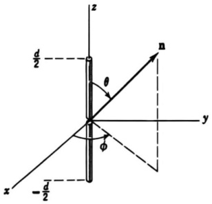{width=25%} Figure 9.1 Short, center-fed, linear antenna.

perfect. For this short center-fed antenna $R_{\mathrm{rad}}=5(kd)^{2}$ ohms. In principle the input reactance for the antenna can be calculated by applying (6.138) or (6.140) of Section 6.9. Unfortunately the calculation depends crucially on the strong fields near the gap and thus is sensitive to the exact shape and method of excitation. Since the system is an electric dipole and the electrostatic dipole field dominates near the antenna, we can nevertheless say with certainty that the reactance is negative (capacitive) for small $kd$.

# 9.3 Magnetic Dipole and Electric Quadrupole Fields

The next term in expansion (9.9) leads to a vector potential,

$$
\mathbf { A } ( \mathbf { x } ) = { \frac { \mu _ { 0 } } { 4 \pi } } { \frac { e ^{i k r} } { r } } \left( { \frac { 1 } { r } } - i k \right) \int \mathbf { J } ( \mathbf { x } ^{\prime} ) ( \mathbf { n } \cdot \mathbf { x } ^{\prime} ) \ d ^{3} \mathbf { x } ^{\prime}
$$

where we have included the correct terms from (9.12) to make (9.30) valid everywhere outside the source. This vector potential can be written as the sum of two terms: One gives a transverse magnetic induction and the other gives a transverse electric field. These physically distinct contributions can be separated by writing the integrand in (9.30) as the sum of a part symmetric in $\mathbf{J}$ and $\mathbf{x}'$ and a part that is antisymmetric. Thus

$$
( \mathbf { n } \cdot \mathbf { x } ^{\prime} ) \mathbf { J } = { \frac { 1 } { 2 } } [ ( \mathbf { n } \cdot \mathbf { x } ^{\prime} ) \mathbf { J } + ( \mathbf { n } \cdot \mathbf { J } ) \mathbf { x } ^{\prime} ] + { \frac { 1 } { 2 } } ( \mathbf { x } ^{\prime} \times \mathbf { J } ) \times \mathbf { n }
$$

The second, antisymmetric part is recognizable as the magnetization due to the current $\mathbf{J}$:

$$
\mathcal { M } = \frac { 1 } { 2 } ( \mathbf { x } \times \mathbf { J } )
$$

The first, symmetric term will be shown to be related to the electric quadrupole moment density.

Considering only the magnetization term, we have the vector potential,

$$
\mathbf { A } ( \mathbf { x } ) = { \frac { i k \mu _ { 0 } } { 4 \pi } } ( \mathbf { n } \times \mathbf { m } ) { \frac { e ^{i k r} } { r } } \left( 1 - { \frac { 1 } { i k r } } \right)
$$

where $\mathbf{m}$ is the magnetic dipole moment,

$$
\mathbf { m } = \int { \mathcal { M } } d ^{3} x = { \frac { 1 } { 2 } } \int \left( \mathbf { x } \times \mathbf { J } \right) d ^{3} x
$$

The fields can be determined by noting that the vector potential (9.33) is proportional to the magnetic field (9.18) for an electric dipole. This means that the magnetic field for the present magnetic dipole source will be equal to $1/Z_0$ times the electric field for the electric dipole, with the substitution $\mathbf{p} \rightarrow \mathbf{m}/c$. Thus we find

$$
\mathbf { H } = { \frac { 1 } { 4 \pi } } \left\{ k ^{2} ( \mathbf { n } \times \mathbf { m } ) \times \mathbf { n } { \frac { e ^{i k r} } { r } } + [ 3 \mathbf { n } ( \mathbf { n } \cdot \mathbf { m } ) - \mathbf { m } ] \left( { \frac { 1 } { r ^{3} } } - { \frac { i k } { r ^{2} } } \right) e ^{i k r} \right\}
$$

Similarly, the electric field for a magnetic dipole source is the negative of $Z_0$ times the magnetic field for an electric dipole (with $\mathbf{p} \rightarrow \mathbf{m}/c$):

$$
\mathbf { E } = - { \frac { Z _ { 0 } } { 4 \pi } } k ^{2} ( \mathbf { n } \times \mathbf { m } ) { \frac { e ^{i k r} } { r } } \left( 1 - { \frac { 1 } { i k r } } \right)
$$

All the arguments concerning the behavior of the fields in the near and far zones are the same as for the electric dipole source, with the interchange $\mathbf{E} \rightarrow Z_{0}\mathbf{H}$, $Z_{0}\mathbf{H} \rightarrow -\mathbf{E}$, $\mathbf{p} \rightarrow \mathbf{m}/c$. Similarly the radiation pattern and total power radiated are the same for the two kinds of dipole. The only difference in the radiation fields is in the polarization. For an electric dipole the electric vector lies in the plane defined by $\mathbf{n}$ and $\mathbf{p}$, while for a magnetic dipole it is perpendicular to the plane defined by $\mathbf{n}$ and $\mathbf{m}$.

The integral of the symmetric term in (9.31) can be transformed by an integration by parts and some rearrangement:

$$
\frac { 1 } { 2 } \int \left[ ( { \bf n } \cdot { \bf x } ^{\prime} ) { \bf J } + ( { \bf n } \cdot { \bf J } ) { \bf x } ^{\prime} \right] \, d ^{3} x ^{\prime} = - \frac { i \omega } { 2 } \int { \bf x } ^{\prime} ( { \bf n } \cdot { \bf x } ^{\prime} ) \rho ( { \bf x } ^{\prime} ) \, d ^{3} x ^{\prime}
$$

The continuity equation (9.15) has been used to replace $\nabla \cdot \mathbf{J}$ by $i \omega p$. Since the integral involves second moments of the charge density, this symmetric part corresponds to an electric quadrupole source. The vector potential is

$$
\mathbf { A } ( \mathbf { x } ) = - { \frac { \mu _ { 0 } c k ^{2} } { 8 \pi } } { \frac { e ^{i k r} } { r } } \left( 1 - { \frac { 1 } { i k r } } \right) \int \mathbf { x } ^{\prime} ( \mathbf { n } \cdot \mathbf { x } ^{\prime} ) \rho ( \mathbf { x } ^{\prime} ) \; d ^{3} x ^{\prime}
$$

The complete fields are somewhat complicated to write down. We content ourselves with the fields in the radiation zone. Then it is easy to see that

$$
\left. \begin{array}{l} { { \mathbf { H } = i k \mathbf { n } \times \mathbf { A } / \mu _ { 0 } } } \\{ { \mathbf { E } = i k Z _ { 0 } ( \mathbf { n } \times \mathbf { A } ) \times \mathbf { n } / \mu _ { 0 } } } \end{array} \right\}
$$

Consequently the magnetic field is

$$
\mathbf { H } = - { \frac { i c k ^{3} } { 8 \pi } } { \frac { e ^{i k r} } { r } } \int \left( \mathbf { n } \times \mathbf { x } ^{\prime} \right) ( \mathbf { n } \cdot \mathbf { x } ^{\prime} ) \rho ( \mathbf { x } ^{\prime} ) \, d ^{3} x ^{\prime}
$$

With definition (4.9) for the quadrupole moment tensor,

$$
Q _ { \alpha \beta } = \int ( 3 x _ { \alpha } x _ { \beta } - r ^{2} \delta _ { \alpha \beta } ) \rho ( \mathbf { x } ) \ d ^{3} x
$$

the integral in (9.40) can be written

$$
\mathbf { n } \times \int \mathbf { x } ^{\prime} ( \mathbf { n } \cdot \mathbf { x } ^{\prime} ) \rho ( \mathbf { x } ^{\prime} ) \ d ^{3} x ^{\prime} = { \frac { 1 } { 3 } } \mathbf { n } \times \mathbf { Q } ( \mathbf { n } )
$$

The vector $\mathbf{Q}(\mathbf{n})$ is defined as having components,

$$
\mathcal { Q } _ { \alpha } = \sum _ { \beta } \mathcal { Q } _ { \alpha \beta } n _ { \beta }
$$

We note that it depends in magnitude and direction on the direction of observation as well as on the properties of the source. With these definitions we have the magnetic induction,

$$
\mathbf { H } = - { \frac { i c k ^{3} } { 24 \pi } } { \frac { e ^{i k r} } { r } } \mathbf { n } \times \mathbf { Q } ( \mathbf { n } )
$$

and the time-averaged power radiated per unit solid angle,

$$
\frac { d P } { d \Omega } = \frac { c ^{2} Z _ { 0 } } { 11 52 \pi ^{2} } \, k ^{6} \, \left| [ { \bf n } \times { \bf Q } ( { \bf n } ) ] \, \times \, { \bf n } \right| ^{2}
$$

where again the direction of the radiated electric field is given by the vector inside the absolute value signs.

The general angular distribution is complicated. But the total power radiated can be calculated in a straightforward way. With the definition of $\mathbf{Q}(\mathbf{n})$ we can write the angular dependence as

$$
\begin{array}{rl} { | [ { \bf n } \times { \bf Q } ( { \bf n } ) ] \times { \bf n } | ^{2} = { \bf Q } ^{*} \cdot { \bf Q } - | { \bf n } \cdot { \bf Q } | ^{2} } & { { } } \\{ = \sum _ { \alpha , \beta , \gamma } Q _ { \alpha \beta } ^{*} Q _ { \alpha \gamma } n _ { \beta } n _ { \gamma } - \sum _ { \alpha , \beta , \gamma , \delta } Q _ { \alpha \beta } ^{*} Q _ { \gamma \delta } n _ { \alpha } n _ { \beta } n _ { \gamma } n _ { \delta } } & { { } } \end{array}
$$

The necessary angular integrals over products of the rectangular components of $\mathbf{n}$ are readily found to be

$$
\left. \begin{array}{l} { { \displaystyle \int n _ { \beta } n _ { \gamma } \, d \Omega = \frac { 4 \pi } { 3 } \, \delta _ { \beta \gamma } } } \\{ { \displaystyle \int n _ { \alpha } n _ { \beta } n _ { \gamma } n _ { \delta } \, d \Omega = \frac { 4 \pi } { 15 } \, ( \delta _ { \alpha \beta } \delta _ { \gamma \delta } + \delta _ { \alpha \gamma } \delta _ { \beta \delta } + \delta _ { \alpha \delta } \delta _ { \beta \gamma } ) } } \end{array} \right\}
$$

Then we find

$$
\begin{array}{r} { \int | [ { \bf n } \times { \bf Q } ( { \bf n } ) ] \times { \bf n } | ^{2} \, d \Omega = 4 \pi \Big \{ \frac { 1 } { 3 } \sum _ { \alpha , \beta } | Q _ { \alpha \beta } | ^{2} } \\{ - \frac { 1 } { 15 } \left[ \sum _ { \alpha } Q _ { \alpha \alpha } ^{*} \sum _ { \gamma } Q _ { \gamma \gamma } + 2 \sum _ { \alpha , \beta } | Q _ { \alpha \beta } | ^{2} \right] \Big \} } \end{array}
$$

Since $Q_{\alpha\beta}$ is a tensor whose main diagonal sum is zero, the first term in the square brackets vanishes identically. Thus we obtain the final result for the total power radiated by a quadrupole source:

$$
P = \frac { c ^{2} Z _ { 0 } k ^{6} } { 14 40 \pi } \sum _ { \alpha , \beta } | Q _ { \alpha \beta } | ^{2}
$$

The radiated power varies as the sixth power of the frequency for fixed quadrupole moments, compared to the fourth power for dipole radiation.

A simple example of a radiating quadrupole source is an oscillating spheroidal distribution of charge. The off-diagonal elements of $Q_{\alpha\beta}$ vanish. The diagonal elements may be written

$$
Q _ { 33 } = Q _ { 0 } ,  Q _ { 11 } = Q _ { 22 } = - \frac { 1 } { 2 } Q _ { 0 }
$$

Then the angular distribution of radiated power is

$$
\frac { d P } { d \Omega } = \frac { c ^{2} Z _ { 0 } k ^{6} } { 51 2 \pi ^{2} } \, Q _ { 0 } ^{2} \sin ^{2} \theta \, \cos ^{2} \theta
$$

This is a four-lobed pattern, as shown in Fig. 9.2, with maxima at $\theta = \pi/4$ and $3\pi/4$. The total power radiated by this quadrupole is

$$
P = \frac { c ^{2} Z _ { 0 } k ^{6} Q _ { 0 } ^{2} } { 96 0 \pi }
$$

The labor involved in manipulating higher terms in expansion (9.9) of the vector potential (9.8) becomes increasingly prohibitive as the expansion is extended beyond the electric quadrupole terms. Another disadvantage of the present approach is that physically distinct fields such as those of the magnetic dipole

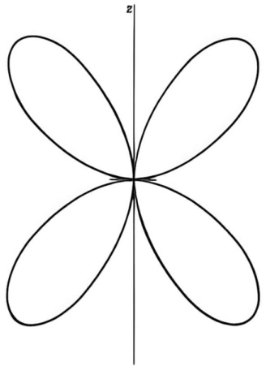{width=26%} Figure 9.2 A quadrupole radiation pattern.

and the electric quadrupole must be disentangled from the separate terms in (9.9). Finally, the present technique is useful only in the long-wavelength limit. A systematic development of multipole radiation begins in Section 9.6. It involves a fairly elaborate mathematical apparatus, but the price paid is worthwhile. The treatment allows all multipole orders to be handled in the same way; the results are valid for all wavelengths; the physically different electric and magnetic multipoles are clearly separated from the beginning.

# 9.4 Center-Fed Linear Antenna

# A. Approximation of Sinusoidal Current

For certain radiating systems the geometry of current flow is sufficiently simple that integral (9.3) for the vector potential can be found in relatively simple, closed form if the form of the current is assumed known. As an example of such a system we consider a thin, linear antenna of length $d$ which is excited across a small gap at its midpoint. The antenna is assumed to be oriented along the $z$ axis with its gap at the origin, as indicated in Fig. 9.3. If damping due to the emission of radiation is neglected and the antenna is thin enough, the current along the antenna can be taken as sinusoidal in time and space with wave number $k=\omega/c$, and is symmetric on the two arms of the antenna. The current vanishes at the ends of the antenna. Hence the current density can be written

$$
\mathbf { J } ( \mathbf { x } ) = I \sin \left( \frac { k d } { 2 } - k | z | \right) \delta ( x ) \ \delta ( y ) \epsilon _ { 3 }
$$

for $|z|<(d/2)$. The delta functions assure that the current flows only along the $z$ axis. $I$ is the peak value of the current if $kd\geq\pi$. The current at the gap is $I_0=I\sin(kd/2)$.

With the current density (9.53) the vector potential is in the $z$ direction and in the radiation zone has the form [from (9.8)]:

$$
\mathbf { A } ( \mathbf { x } ) = \hat { \mathbf { z } } \, \frac { \mu _ { 0 } } { 4 \pi } \frac { I e ^{i k r} } { r } \int _ { - ( d / 2 ) } ^{( d / 2 )} \sin \left( \frac { k d } { 2 } - k | z | \right) e ^{- i k z \cos \theta} \, d z
$$

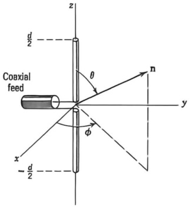{width=26%} Figure 9.3 Center-fed, linear antenna.

The result of straightforward integration is

$$
\mathbf { A } ( \mathbf { x } ) = \hat { \mathbf { z } } \, \frac { \mu _ { 0 } } { 4 \pi } \frac { 2 I e ^{i k r} } { k r } \left[ \frac { \cos \left( \frac { k d } { 2 } \, \cos \theta \right) - \cos \left( \frac { k d } { 2 } \right) } { \sin ^{2} \theta } \right]
$$

Since the magnetic field in the radiation zone is given by $\mathbf{H} = i\mathbf{k}\mathbf{n} \times \mathbf{A}/\mu_0$, its magnitude is $|\mathbf{H}| = k \sin \theta \left|A_3\right|/\mu_0$. Thus the time-averaged power radiated per unit solid angle is

$$
\frac { d P } { d \Omega } = \frac { Z _ { 0 } I ^{2} } { 8 \pi ^{2} } \left| \frac { \cos \left( \frac { k d } { 2 } \cos \theta \right) - \cos \left( \frac { k d } { 2 } \right) } { \sin \theta } \right| ^{2}
$$

The electric vector is in the direction of the component of $\mathbf{A}$ perpendicular to $\mathbf{n}$. Consequently the polarization of the radiation lies in the plane containing the antenna and the radius vector to the observation point.

The angular distribution (9.56) depends on the value of $kd$. In the long-wavelength limit ($kd \ll 1$) it is easy to show that it reduces to the dipole result (9.28). For the special values $kd = \pi(2\pi)$, corresponding to a half (two halves) of a wavelength of current oscillation along the antenna, the angular distributions are

$$
\frac { d P } { d \Omega } = \frac { Z _ { 0 } I ^{2} } { 8 \pi ^{2} } \left\{ \begin{array}{cc} { { \displaystyle \frac { \cos ^{2} \left( \frac { \pi } { 2 } \cos \theta \right) } { \sin ^{2} \theta } , } } & { { k d = \pi } } \\{ { 4 \cos ^{4} \left( \frac { \pi } { 2 } \cos \theta \right) } } & { { } } \\{ { \displaystyle \frac { \sin ^{2} \theta } { \sin ^{2} \theta } , } } & { { k d = 2 \pi } } \end{array} \right.
$$

These angular distributions are shown in Fig. 9.7, where they are compared to multipole expansions. The half-wave antenna distribution is seen to be quite similar to a simple dipole pattern, but the full-wave antenna has a considerably sharper distribution.

The full-wave antenna distribution can be thought of as due to the coherent superposition of the fields of two half-wave antennas, one above the other, excited in phase. The intensity at $\theta = \pi/2$, where the waves add algebraically, is

four times that of a half-wave antenna. At angles away from $\theta=\pi/2$ the amplitudes tend to interfere, giving the narrower pattern. By suitable arrangement of a set of basic antennas, such as the half-wave antenna, with the phasing of the currents appropriately chosen, arbitrary radiation patterns can be formed by coherent superposition. The interested reader should refer to the electrical engineering literature for detailed treatments of antenna arrays.

# B. The Antenna as a Boundary-Value Problem

Only for infinitely thin conductors are we justified in assuming that the current along the antenna is sinusoidal, or indeed has any other $known$ form. A finite-sized antenna with a given type of excitation is actually a complicated boundary-value problem. Without attempting solution of such problems, we give some preliminary considerations on setting up the boundary-value problem for a straight antenna with circular cross section of radius $a$ and length $d$, of which the center-fed antenna of Fig. 9.3 is one example. We assume that the conductor is perfectly conducting and has a small enough radius compared to both a wavelength $\lambda$ and the length $d$ that current flow on the surface has only a longitudinal ($z$) component, and that the fields have azimuthal symmetry. Then the vector potential $\mathbf{A}$ will have only a $z$ component. With harmonic time dependence of frequency $\omega$ and in the Lorentz gauge, the scalar potential and the electric field are given in terms of $\mathbf{A}$ by

$$
\begin{array}{rl} { \Phi ( \mathbf { x } ) = \frac { - i c } { k } \, \nabla \cdot \mathbf { A } } & { } \\{ \mathbf { E } ( \mathbf { x } ) = \frac { i c } { k } \, [ \nabla ( \nabla \cdot \mathbf { A } ) + k ^{2} \mathbf { A } ] } & { } \end{array}
$$

Since $\mathbf{A}=\hat{z}A_{z}(\mathbf{x})$, the $z$ component of the electric field is

$$
E _ { z } ( \mathbf { x } ) = \frac { i c } { k } \left( \frac { \partial ^{2} } { \partial z ^{2} } + k ^{2} \right) A _ { z } ( \mathbf { x } )
$$

But on the surface of the perfectly conducting antenna the tangential component of $\mathbf{E}$ vanishes. We thus establish the important fact that the vector potential $A_{z}$ (and also the scalar potential) on the surface of the antenna are strictly sinusoidal:

$$
\left( \frac { \partial ^{2} } { \partial z ^{2} } + k ^{2} \right) A _ { z } ( \rho = a , z ) = 0
$$

This is an exact statement, in contrast to the much rougher assumption that the current is sinusoidal.

An integral equation for the current can be found from (9.3). If the total current flow in the $z$ direction is $I(z)$, then (9.3) gives for $A_{z}$ on the surface of the antenna,

$$
A _ { z } ( \rho = a , \, z ) = \frac { \mu _ { 0 } } { 4 \pi } \int _ { z _ { 0 } } ^{z _ { 0} + d } I ( z ^{\prime} ) K ( z - z ^{\prime} ) \, d z ^{\prime}
$$

where

$$
K ( z - z ^{\prime} ) = \frac { 1 } { \pi } \int _ { 0 } ^{\pi} \frac { \exp [ i k \sqrt { ( z - z ^{\prime} ) ^{2} + 4 a ^{2} \sin ^{2} \beta } ] } { \sqrt { ( z - z ^{\prime} ) ^{2} + 4 a ^{2} \sin ^{2} \beta } } \, d \beta
$$

is the azimuthal average of the Green function $e^{ikR}/R$. The condition (9.59) leads to the integro-differential equation

$$
0 = \left( \frac { d ^{2} } { d z ^{2} } + k ^{2} \right) \int _ { z _ { 0 } } ^{z _ { 0} + d } I ( z ^{\prime} ) K ( z - z ^{\prime} ) \; d z ^{\prime}
$$

This can be regarded as a differential equation for the integral, or equivalently one can integrate (9.59) and equate it to $A_{z}(\rho=a,z)$. The result is the integral equation

$$
a _ { 1 } \cos k z \, + \, a _ { 2 } \, \sin k z \, = \int _ { z _ { 0 } } ^{z _ { 0} + d } I ( z ^{\prime} ) K ( z - z ^{\prime} ) \, d z ^{\prime}
$$

The constants $a_{1}$ and $a_{2}$ are determined by the method of excitation and by the boundary conditions that the current vanishes at the ends of the antenna.

The solution of the integral equation is not easy. From the form of (9.60) it is clear that when $z' = z$ care must be taken and the finite radius is important. For $a \rightarrow 0$, the current can be shown to be sinusoidal, but the expansion parameter for corrections turns out to be the reciprocal of $\ln(d/a)$. This means that even for $d/a = 10^3$ there can be corrections of the order of 10–15%. When there is a current node near the place of excitation, such corrections can change the antenna's input impedance drastically. Various approximate methods of solution of (9.61) are described by Jones. A detailed discussion of his version of the theory and the results of numerical calculations for the current, resistance, and reactance of a linear center-fed antenna are given by Hallén. Other references are cited in the suggested reading at the end of the chapter.

# 9.5 Multipole Expansion for Localized Source or Aperture in Waveguide

If a source in the form of a probe or loop or aperture in a waveguide is sufficiently small in dimensions compared to the distances over which the fields vary appreciably, it can be usefully approximated by its lowest order multipole moments, usually electric and magnetic dipoles. Different sources possessing the same lowest order multipole moments will produce sensibly the same excitations in the waveguide. Often the electric dipole or magnetic dipole moments can be calculated from static fields, or even estimated geometrically. Even if the source is not truly small, the multipole expansion gives a qualitative, and often semiquantitative, understanding of its properties.

# A. Current Source Inside Guide

In Section 8.12 it was shown that the amplitudes $A_{\lambda}^{(\pm)}$ for excitation of the $\lambda$th mode are proportional to the integral

$$
\int \mathbf { J } \cdot \mathbf { E } _ { \lambda } ^{( \tau )} \, d ^{3} x
$$

where the integral is extended over the region where $\mathbf{J}$ is different from zero. If the mode fields $\mathbf{E}_{\lambda}^{(\tau)}$ do not vary appreciably over the source, they can be ex

panded in Taylor series around some suitably chosen origin. The integral is thus written, dropping the sub- and superscripts on $\mathbf{E}_{\lambda}^{(\pm)}$:

$$
\int \mathbf { J } \cdot \mathbf { E } \ d ^{3} x = \sum _ { \alpha = 1 } ^{3} \int J _ { \alpha } ( \mathbf { x } ) \bigg [ E _ { \alpha } ( 0 ) \ + \sum _ { \beta = 1 } ^{3} x _ { \beta } \, \frac { \partial E _ { \alpha } } { \partial x _ { \beta } } \, ( 0 ) + \cdots \bigg ] \ d ^{3} x
$$

From (9.14) and (9.17) we see that the first term is

$$
\mathbf { E } ( 0 ) \cdot \int \mathbf { J } ( \mathbf { x } ) \ d ^{3} x = - i \omega \mathbf { p } \cdot \mathbf { E } ( 0 )
$$

where $\mathbf{p}$ is the electric dipole moment of the source:

$$
\mathbf { p } = { \frac { i } { \omega } } \int \mathbf { J } ( \mathbf { x } ) \ d ^{3} x
$$

This can be transformed into the more familiar form (9.17) by the means of the steps in (9.14), provided the surface integral at the walls of the waveguide can be dropped. This necessitates choosing the origin for the multipole expansion such that $J_{\alpha}x_{\beta}$ vanishes at the walls. This remark applies to all the multipole moments. The use of the forms involving the electric and magnetic charge densities $\rho$ and $\rho_{\mathrm{M}}$ requires that $(x_{\alpha}J_{\beta} \pm x_{\beta}J_{\alpha})x_{\gamma} \cdots x_{\nu}$ vanish at the walls of the guide. The above-mentioned form for the electric dipole and the usual expression (9.34) for the magnetic dipole are correct as they stand, without concern about choice of origin.

The second term in (9.62) is of the same general form as (9.30) and is handled the same way. The product $J_{\alpha}x_{\beta}$ is written as the sum of symmetric and antisymmetric terms, just as in (9.31):

$$
\begin{array}{r} { \sum _ { \alpha , \beta } J _ { \alpha } x _ { \beta } \frac { \partial E _ { \alpha } } { \partial x _ { \beta } } \left( 0 \right) = \frac { 1 } { 4 } \sum _ { \alpha , \beta } \left( J _ { \alpha } x _ { \beta } - J _ { \beta } x _ { \alpha } \right) \bigg [ \frac { \partial E _ { \alpha } } { \partial x _ { \beta } } \left( 0 \right) - \frac { \partial E _ { \beta } } { \partial x _ { \alpha } } \left( 0 \right) \bigg ] } \\{ + \frac { 1 } { 2 } \sum _ { \alpha , \beta } \left( J _ { \alpha } x _ { \beta } + J _ { \beta } x _ { \alpha } \right) \frac { \partial E _ { \alpha } } { \partial x _ { \beta } } \left( 0 \right) } \end{array}
$$

The first (antisymmetric) part has been written so that the magnetic moment density and the curl of the electric field are clearly visible. With the help of Faraday's law $\nabla \times \mathbf{E} = i\omega\mathbf{B}$, the antisymmetric contribution to the right side of (9.62) can be written

$$
\int \left[ \sum _ { \alpha , \beta } J _ { \alpha } x _ { \beta } \, \frac { \partial E _ { \alpha } } { \partial x _ { \beta } } \left( 0 \right) \right] _ { \mathrm { a n t i s y m } } d ^{3} x = i \omega \mathbf { m } \cdot \mathbf { B } ( 0 )
$$

where $\mathbf{m}$ is the magnetic dipole moment (9.34) of the source. Equations (9.63) and (9.65) give the leading order multipole moment contributions to the source integral (9.62).

Other terms in the expansion in (9.62) give rise to higher order multipoles. The symmetric part of (9.64) can be shown, just as in Section 9.3, to involve the traceless electric quadrupole moment (9.41). The first step is to note that if the surface integrals vanish (see above),

$$
\int \left( J _ { \alpha } x _ { \beta } + J _ { \beta } x _ { \alpha } \right) d ^{3} x = - i \omega \int x _ { \alpha } x _ { \beta } \rho ( { \bf x } ) \ d ^{3} x
$$

Then the second double sum in (9.64), integrated over the volume of the current distribution, takes the form

$$
- \frac { i \omega } { 2 } \sum _ { \alpha , \beta } \frac { \partial E _ { \alpha } } { \partial x _ { \beta } } \left( 0 \right) \int \rho ( { \bf x } ) \; x _ { \alpha } x _ { \beta } \; d ^{3} x
$$

The value of the double sum is unchanged by the replacement $x_{\alpha}x_{\beta} \rightarrow (x_{\alpha}x_{\beta} - \frac{1}{3}r^{2}\delta_{\alpha\beta})$ because $\nabla \cdot \mathbf{E} = 0$. Thus the symmetric part of the second term in (9.62) is

$$
\int \left[ \sum _ { \alpha , \beta } J _ { \alpha } x _ { \beta } \, \frac { \partial E _ { \alpha } } { \partial x _ { \beta } } \left( 0 \right) \right] _ { \mathrm { s y m } } \, d ^{3} x = - \frac { i \omega } { 6 } \sum _ { \alpha , \beta } Q _ { \alpha \beta } \, \frac { \partial E _ { \alpha } } { \partial x _ { \beta } } \left( 0 \right)
$$

Similarly an antisymmetric part of the next terms in (9.62), involving $x_{\beta}x_{\gamma}$, gives a contribution

$$
\int \left[ \frac { 1 } { 2 } \sum _ { \alpha , \beta , \gamma } J _ { \alpha } x _ { \beta } x _ { \gamma } \frac { \partial ^{2} E _ { \alpha } } { \partial x _ { \beta } \, \partial x _ { \gamma } } \left( 0 \right) \right] _ { \mathrm { a n t i s y m } } d ^{3} x = \frac { i \omega } { 6 } \sum _ { \alpha , \beta } Q _ { \alpha \beta } ^{M} \frac { \partial B _ { \alpha } } { \partial x _ { \beta } } \left( 0 \right)
$$

where $Q_{\alpha\beta}^{M}$ is the magnetic quadrupole moment of the source, given by (9.41) with the electric charge density $\rho(\mathbf{x})$ replaced by the magnetic charge density,

$$
\rho ^{M} ( \mathbf { x } ) = - \nabla \cdot \mathcal { M } = - \frac { 1 } { 2 } \nabla \cdot ( \mathbf { x } \times \mathbf { J } )
$$

If the various contributions are combined, the expression (8.146) for the amplitude $A_{\lambda}^{(\pm)}$ has as its multipole expansion,

$$
\begin{array}{r} { A _ { \lambda } ^{( \pm )} = i \, \frac { \omega Z _ { \lambda } } { 2 } \left\{ \mathbf { p } \cdot \mathbf { E } _ { \lambda } ^{( \mp )} ( 0 ) - \mathbf { m } \cdot \mathbf { B } _ { \lambda } ^{( \mp )} ( 0 ) \right. } \\{ \left. + \, \frac { 1 } { 6 } \sum _ { \alpha , \beta } \left[ Q _ { \alpha \beta } \, \frac { \partial E _ { \lambda \alpha } ^{( \mp )} } { \partial x _ { \beta } } \, ( 0 ) - Q _ { \alpha \beta } ^{\mathcal { M} } \, \frac { \partial B _ { \lambda \alpha } ^{( \mp )} } { \partial x _ { \beta } } \, ( 0 ) \right] + \cdots \right\} } \end{array}
$$

It should be remembered that here the mode fields $E_{\lambda}^{(\pm)}$ are normalized according to (8.131). The expansion is most useful if the source is such that the series converges rapidly and is adequately approximated by its first terms. The positioning and orientation of probes or antennas to excite preferentially certain modes can be accomplished simply by considering the directions of the electric and magnetic dipole (or higher) moments of the source and the normal mode fields. For example, the excitation of TE modes, with their axial magnetic fields, can be produced by a magnetic dipole antenna whose dipole moment is parallel to the axis of the guide. TM modes cannot be excited by such an antenna, except via higher multipole moments.

# B. Aperture in Side Walls of Guide

Apertures in the walls of a waveguide can be considered as sources (or sinks) of energy. In Section 8.12 it was noted that if the guide walls have openings in the volume considered to contain the sources, the amplitudes $A_{\lambda}^{(\pm)}$ are given by

(8.147) instead of (8.146). With the assumption that there is only one aperture, and no actual current density, the amplitude for excitation of the $\lambda$th mode is

$$
A _ { \lambda } ^{( z )} = - \frac { Z _ { \lambda } } { 2 } \int _ { a p p e r t u r e } \mathbf { n } \cdot \left( \mathbf { E } \times \mathbf { H } _ { \lambda } ^{( z )} \right) \, d a \ .
$$

where n is an inwardly directed normal and the integral is over the aperture in the walls of the guide. If the aperture is small compared to a wavelength or other scale of variation of the fields, the mode field $\mathbf{H}_{\lambda}^{(z)}$ can be expanded just as before. The lowest order term, with $\mathbf{H}_{\lambda}^{(z)}$ treated as constant over the aperture, evidently leads to a coupling of the magnetic dipole type. The next terms, with linear variation of the mode field, give rise to electric dipole and magnetic quadrupole couplings, exactly as for (9.64)-(9.66), but with the roles of electric and magnetic interactions interchanged. The result is an expansion of (9.70) like (9.69):

$$
A _ { \lambda } ^{( \pm )} = i \, \frac { \omega Z _ { \lambda } } { 4 } \left[ \mathbf { p } _ { \mathrm { e f f } } \cdot \mathbf { E } _ { \lambda } ^{( \pm )} ( 0 ) - \mathbf { m } _ { \mathrm { e f f } } \cdot \mathbf { B } _ { \lambda } ^{( \pm )} ( 0 ) + \cdots \right]
$$

where the effective electric and magnetic dipole moments are

$$
\begin{array}{r} { \mathbf { p } _ { \mathrm { o f f } } = \epsilon \mathbf { n } \int \left( \mathbf { x } \cdot \mathbf { E } _ { \mathrm { t a n } } \right) \, d a } \\{ \mathbf { m } _ { \mathrm { e f f } } = \frac { 2 } { i \mu \omega } \int \left( \mathbf { n } \times \mathbf { E } _ { \mathrm { t a n } } \right) \, d a } \end{array}
$$

In these expressions the integration is over the aperture, the electric field $\mathbf{E}_{\mathrm{tan}}$ is the exact tangential field in the opening, and in (9.71) the mode fields are evaluated at (the center of) the aperture. The effective moments (9.72) are the equivalent dipoles whose fields (9.18) and (9.35)-(9.36) represent the radiation fields of a small aperture in a flat, perfectly conducting screen (see Problem 10.10). Comparison of (9.71) and (9.69) shows that the dipole moments (9.72) are only half as effective in producing a given amplitude as are the real dipole moments of a source located inside the guide. The effective dipoles of an aperture are in some sense half in and half out of the guide.

# C. Effective Dipole Moments of Apertures

On first encounter the effective dipole moments (9.72) are somewhat mysterious. As already mentioned, they have a precise meaning in terms of the electric and magnetic dipole parts of the multipole expansion of the fields radiated through an aperture in a flat perfectly conducting screen (considered later: Problem 10.10). For small apertures they can also be related to the solutions of appropriate static or quasi-static boundary-value problems. Such problems have already been discussed (Sections 3.13 and 5.13), and the results are appropriated below.

If an aperture is very small compared to the distance over which the fields change appreciably, the boundary-value problem can be approximated by one in which the fields "far from the aperture" (measured in units of the aperture dimension) are those that would exist if the aperture were absent. Except for very elongated apertures, it will be sufficiently accurate to take the surface to be flat and the "asymptotic" fields to be the same in all directions away from the ap

terure. For an opening in a perfectly conducting surface, then, the boundary-value problem is specified by the normal electric field $\mathbf{E}_0$ and the tangential magnetic field $\mathbf{H}_0$ that would exist in the absence of the opening. The fields $\mathbf{E}_0$ and $\mathbf{H}_0$ are themselves the result of some boundary-value problem, of propagation in a waveguide or reflection of a plane wave from a screen, for example. But for the purpose at hand, they are treated as given. To lowest order their time dependence can be ignored, provided the effective electric dipole moment is related to $\mathbf{E}_0$ and the magnetic moment to $\mathbf{H}_0$. (See, however, Problem 9.20.)

The exact form of the fields around the opening depends on its shape, but some qualitative observations can be made by merely examining the general behavior of the lines of force. Outside a sphere enclosing the aperture the fields may be represented by a multipole expansion. The leading terms will be dipole fields. Figure 9.4 shows the qualitative behavior. The loop of magnetic field protruding above the plane on the left has the appearance of a line of force from a magnetic dipole whose moment is directed oppositely to $\mathbf{H}_0$, as indicated by the direction of the moment $\mathbf{m}^{(+)}$ shown below. The magnetic field below the plane can be viewed as the unperturbed $\mathbf{H}_0$, plus an opposing dipole field (dashed lines in Fig. 9.4) whose moment is oriented parallel to $\mathbf{H}_0$ (denoted by $\mathbf{m}^{(-)}$ below). Similarly, the electric field lines above the plane appear to originate from a vertical dipole moment $\mathbf{p}^{(+)}$ directed along $\mathbf{E}_0$, while below the plane the field has the appearance of the unperturbed normal field $\mathbf{E}_0$, plus the field from a dipole $\mathbf{p}^{(-)}$, directed oppositely to $\mathbf{E}_0$. The use of effective dipole fields is of course restricted to regions some distance from the aperture. Right in the aperture the fields bear no resemblance to dipole fields. Nevertheless, the dipole approximation is useful qualitatively everywhere, and the effective moments are all that are needed to evaluate the couplings of small apertures.

The preceding qualitative discussion has one serious deficiency. While it is correct to state that the electric dipole moment is always directed parallel or antiparallel to $\mathbf{E}_0$ and so is normal to the aperture, the magnetic dipole moment is not necessarily parallel or antiparallel to $\mathbf{H}_0$. There are two directions in the tangent plane, and the relative orientation of the aperture and the direction of $\mathbf{H}_0$ are relevant in determining the direction of $\mathbf{m}_{\mathrm{eff}}$. Since the effective moments are obviously proportional to the field strength, it is appropriate to speak of the electric and magnetic polarizabilities of the aperture. The dipole moments can be written

$$
\begin{array}{r} { \mathbf { p } _ { \mathrm { e f f } } = \epsilon _ { 0 } \gamma ^{E} \mathbf { E } _ { 0 } } \\{ ( \mathbf { m } _ { \mathrm { e f f } } ) _ { \alpha } = \sum _ { \beta } \gamma _ { \alpha \beta } ^{M} ( \mathbf { H } _ { 0 } ) _ { \beta } } \end{array}
$$

where $\gamma^{E}$ is the scalar electric polarizability and $\gamma_{\alpha\beta}^{M}$ is the $2\times2$ magnetic polarizability tensor. The magnetic tensor can be diagonalized by choosing principal axes for the aperture. There are thus three polarizabilities (one electric and two magnetic) to characterize an arbitrary small aperture. It should be remembered that the signs of the $\gamma$'s in (9.73) depend on the side of the surface from which the dipole is viewed, as shown in Fig. 9.4. If there are fields on both sides of the surface, the expressions in (9.73) must be modified. For example, if there is a vertically directed electric field $\mathbf{E}_{1}$ above the surface in Fig. 9.4b, as well as $\mathbf{E}_{0}$ below, then $\mathbf{E}_{0}$ in (9.73) is replaced by ($\mathbf{E}_{0}-\mathbf{E}_{1}$). Other possibilities can be worked out from (9.73) by linear superposition.

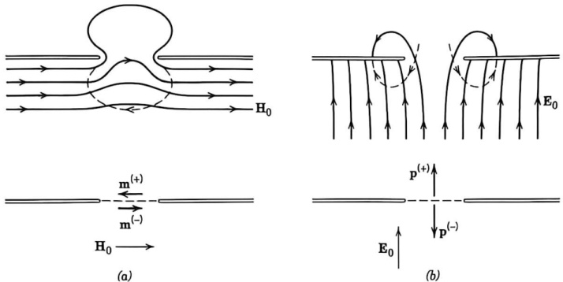{width=57%} Figure 9.4 Distortion of (a) the tangential magnetic field and (b) the normal electric field by a small aperture in a perfectly conducting surface. The effective dipole moments, as viewed from above and below the surface, are indicated beneath.

The polarizabilities $\gamma^{E}$ and $\gamma_{\alpha\beta}^{M}$ have the dimensions of length cubed. If a typical dimension of the aperture is $d$, then it can be expected that the polarizabilities will be $d^{3}$ times numerical coefficients of the order of unity, or smaller. The expression (9.72) for $\mathbf{p}_{\mathrm{eff}}$ can be seen to be of the form to yield such a result, since $\mathbf{E}_{\mathrm{tan}}$ is proportional to $E_{0}$, and the two-dimensional integral will give $E_{0}$ times the cube of a length that is characteristic of the aperture. Furthermore, the vectorial properties of $\mathbf{p}_{\mathrm{eff}}$ in (9.72) correspond to (9.73). On the other hand, the expression in (9.72) for $\mathbf{m}_{\mathrm{eff}}$ is less transparently of the proper form, even though dimensionally correct. Some integrations by parts and use of the Maxwell equations puts it into the equivalent and more satisfying form:

$$
\mathbf { m } _ { \mathrm { e f f } } = 2 \int \mathbf { x } ( \mathbf { n } \cdot \mathbf { H } ) \ d a
$$

where $\mathbf{n} \cdot \mathbf{H}$ is the exact normal component of $\mathbf{H}$ in the aperture and the integration is over the plane of the aperture. It is now evident that the connection between $\mathbf{H}_0$ and $\mathbf{m}_{\text{eff}}$ is of the general form shown in (9.73). For a circular opening of radius $R$ the effective dipole moments can be taken from the static solutions of Sections 3.13 and 5.13. The results are

$$
\mathbf { p } _ { \mathrm { e f f } } = - { \frac { 4 \epsilon _ { 0 } R ^{3} } { 3 } } \mathbf { E } _ { 0 } ,  \mathbf { m } _ { \mathrm { e f f } } = { \frac { 8 R ^{3} } { 3 } } \mathbf { H } _ { 0 }
$$

where the signs are appropriate for the apertures viewed from the side of the surface where $\mathbf{E}$ and $\mathbf{H}$ are nonvanishing, as can be checked from Fig. 9.4. The electric and magnetic polarizabilities are thus

$$
\gamma ^{E} = - \frac { 4 R ^{3} } { 3 } ,  \gamma _ { \alpha \beta } ^{M} = \frac { 8 R ^{3} } { 3 } \, \delta _ { \alpha \beta }
$$

The use of effective dipole moments to describe the electromagnetic properties of small holes can be traced back to Lord Rayleigh.* The general theory was developed by H. A. Bethe$^{\dagger}$ and has been applied fruitfully to waveguide and

diffraction problems. It is significant in practical applications that the effective dipole moments of arbitrary apertures can be determined experimentally by electrolytic tank measurements.$^{\dagger}$

Examples of the use of multipoles to describe excitation and scattering in waveguides and diffraction are left to several problems at the end of the chapter. Other material can be found in the list of suggested reading.

# 9.6 Spherical Wave Solutions of the Scalar Wave Equation

In Chapters 3 and 4 spherical harmonic expansions for the solutions of the Laplace or Poisson equations were used in potential problems with spherical boundaries or to develop multipole expansions of charge densities and their fields. Our approach so far for radiating sources has been "brute force," with creation of the lowest order multipoles more or less by hand. Clearly, treatment of higher multipoles demands a more systematic approach. We therefore turn to the development of vector spherical waves and their relation to time-varying sources.

As a prelude to the vector spherical wave problem, we consider the scalar wave equation. A scalar field $\psi(\mathbf{x}, t)$ satisfying the source-free wave equation,

$$
\nabla ^{2} \psi - \frac { 1 } { c ^{2} } \frac { \partial ^{2} \psi } { \partial t ^{2} } = 0
$$

can be Fourier-analyzed in time as

$$
\psi ( \mathbf { x } , t ) = \int _ { - \infty } ^{\infty} \psi ( \mathbf { x } , \omega ) e ^{- i \omega t} \, d \omega
$$

with each Fourier component satisfying the Helmholtz wave equation

$$
( \nabla ^{2} + k ^{2} ) \psi ( \mathbf { x } , \omega ) = 0
$$

with $k^{2}=\omega^{2}/c^{2}$. For problems possessing symmetry properties about some origin, it is convenient to have fundamental solutions appropriate to spherical coordinates. The representation of the Laplacian operator in spherical coordinates is given in equation (3.1). The separation of the angular and radial variables follows the well-known expansion

$$
\psi ( \mathbf { x } , \, \omega ) = \sum _ { l , m } f _ { l m } ( r ) Y _ { l m } ( \theta , \, \phi )
$$

where the spherical harmonics $Y_{lm}$ are defined by (3.53). The radial functions $f_{lm}(r)$ satisfy the radial equation, independent of $m$,

$$
\left[ { \frac { d ^{2} } { d r ^{2} } } + { \frac { 2 } { r } } { \frac { d } { d r } } + k ^{2} - { \frac { l ( l + 1 ) } { r ^{2} } } \right] f _ { l } ( r ) = 0
$$

With the substitution,

$$
f _ { l } ( r ) = \frac { 1 } { r ^{1 / 2} } \, u _ { l } ( r )
$$

$^{1}$S. B. Cohn, Proc. IRE 39, 1416 (1951); 40, 1069 (1952).

equation (9.81) is transformed into

$$
\left[ \frac { d ^{2} } { d r ^{2} } + \frac { 1 } { r } \frac { d } { d r } + k ^{2} - \frac { ( l + \frac { 1 } { 2 } ) ^{2} } { r ^{2} } \right] u _ { l } ( r ) = 0
$$

This equation is just the Bessel equation (3.75) with $\nu = l + \frac{1}{2}$. Thus the solutions for $f_{lm}(r)$ are

$$
f _ { l m } ( r ) = \frac { A _ { l m } } { r ^{1 / 2} } \, J _ { l + 1 / 2 } ( k r ) + \frac { B _ { l m } } { r ^{1 / 2} } \, N _ { l + 1 / 2 } ( k r )
$$

It is customary to define spherical Bessel and Hankel functions, denoted by $j_{l}(x)$, $n_{l}(x)$, $h_{l}^{(1,2)}(x)$, as follows:

$$
\begin{array}{rl} { j _ { l } ( x ) = \left( \frac { \pi } { 2 x } \right) ^{1 / 2} J _ { l + 1 / 2 } ( x ) } & { } \\{ n _ { l } ( x ) = \left( \frac { \pi } { 2 x } \right) ^{1 / 2} N _ { l + 1 / 2 } ( x ) } & { } \\{ h _ { l } ^{( 1 , 2 )} ( x ) = \left( \frac { \pi } { 2 x } \right) ^{1 / 2} \left[ J _ { l + 1 / 2 } ( x ) \pm i N _ { l + 1 / 2 } ( x ) \right] } & { } \end{array}
$$

For real $x$, $h_{l}^{(2)}(x)$ is the complex conjugate of $h_{l}^{(1)}(x)$. From the series expansions (3.82) and (3.83) one can show that

$$
\begin{array}{r} { j _ { l } ( x ) = ( - x ) ^{l} \bigg ( \frac { 1 } { x } \frac { d } { d x } \bigg ) ^{l} \bigg ( \frac { \sin x } { x } \bigg ) } \\{ n _ { l } ( x ) = - ( - x ) ^{l} \bigg ( \frac { 1 } { x } \frac { d } { d x } \bigg ) ^{l} \bigg ( \frac { \cos x } { x } \bigg ) } \end{array}
$$

For the first few values of $l$ the explicit forms are:

$$
\begin{array}{rl} { j _ { 0 } ( x ) = \frac { \sin x } { x } , } & { n _ { 0 } ( x ) = - \frac { \cos x } { x } ,  h _ { 0 } ^{( 1 )} ( x ) = \frac { e ^{i x} } { i x } } \\{ j _ { 1 } ( x ) = \frac { \sin x } { x ^{2} } - \frac { \cos x } { x } , } & { n _ { 1 } ( x ) = - \frac { \cos x } { x ^{2} } - \frac { \sin x } { x } } \\{ h _ { 1 } ^{( 1 )} ( x ) = - \frac { e ^{i x} } { x } \left( 1 + \frac { i } { x } \right) } \\{ j _ { 2 } ( x ) = \left( \frac { 3 } { x ^{3} } - \frac { 1 } { x } \right) \sin x - \frac { 3 \cos x } { x ^{2} } , } & { n _ { 2 } ( x ) = - \left( \frac { 3 } { x ^{3} } - \frac { 1 } { x } \right) \cos x - 3 \frac { \sin x } { x ^{2} } } \\{ h _ { 2 } ^{( 1 )} ( x ) = \frac { i e ^{i x} } { x } \left( 1 + \frac { 3 i } { x } - \frac { 3 } { x ^{2} } \right) } \\{ j _ { 3 } ( x ) = \left( \frac { 15 } { x ^{4} } - \frac { 6 } { x ^{2} } \right) \sin x - \left( \frac { 15 } { x ^{3} } - \frac { 1 } { x } \right) \cos x } \\{ n _ { 3 } ( x ) = - \left( \frac { 15 } { x ^{4} } - \frac { 6 } { x ^{2} } \right) \cos x - \left( \frac { 15 } { x ^{3} } - \frac { 1 } { x } \right) \sin x } \\{ h _ { 3 } ^{( 1 )} ( x ) = \frac { e ^{i x} } { x } \left( 1 + \frac { 6 i } { x } - \frac { 15 } { x ^{2} } - \frac { 15 i } { x ^{3} } \right) } \end{array}
$$

From the series (3.82), (3.83), and the definition (3.85) it is possible to calculate the small argument limits ($x \ll 1$, $l$) to be

$$
\begin{array}{r} { j _ { l } ( x ) \rightarrow \frac { x ^{l} } { ( 2 l + 1 ) ! ! } \left( 1 - \frac { x ^{2} } { 2 ( 2 l + 3 ) } + \cdots \right) } \\{ n _ { l } ( x ) \rightarrow - \frac { ( 2 l - 1 ) ! ! } { x ^{l + 1} } \left( 1 - \frac { x ^{2} } { 2 ( 1 - 2 l ) } + \cdots \right) , } \end{array}
$$

where $(2l+1)!!=(2l+1)(2l-1)(2l-3)\cdots(5)\cdot(3)\cdot(1)$. Similarly the large argument limits $(x\gg l)$ are

$$
\begin{array}{r} { j _ { l } ( x ) \rightarrow \frac { 1 } { x } \sin \left( x - \frac { l \pi } { 2 } \right) } \\{ n _ { l } ( x ) \rightarrow - \frac { 1 } { x } \cos \left( x - \frac { l \pi } { 2 } \right) } \\{ h _ { l } ^{( 1 )} ( x ) \rightarrow \left( - i \right) ^{l + 1} \frac { e ^{i x} } { x } } \end{array}
$$

The spherical Bessel functions satisfy the recursion formulas,

$$
\begin{array}{rl} { \frac { 2 l + 1 } { x } z _ { l } ( x ) = z _ { l - 1 } ( x ) + z _ { l + 1 } ( x ) } & { } \\{ z _ { l } ^{\prime} ( x ) = \frac { 1 } { 2 l + 1 } \left[ z _ { l - 1 } ( x ) - ( l + 1 ) z _ { l + 1 } ( x ) \right] } & { } \\{ \frac { d } { d x } \left[ x z _ { l } ( x ) \right] = x z _ { l - 1 } ( x ) - l z _ { l } ( x ) } & { } \end{array}
$$

where $z_{i}(x)$ is any one of the functions $j_{i}(x)$, $n_{i}(x)$, $h_{i}^{(1)}(x)$, $h_{i}^{(2)}(x)$. The Wronskians of the various pairs are

$$
W ( j _ { l } , n _ { l } ) = \frac { 1 } { i } \, W ( j _ { l } , h _ { l } ^{( 1 )} ) = - W ( n _ { l } , h _ { l } ^{( 1 )} ) = \frac { 1 } { x ^{2} }
$$

The general solution of (9.79) in spherical coordinates can be written

$$
\psi ( \mathbf { x } ) = \sum _ { l , m } [ A _ { l m } ^{( 1 )} h _ { l } ^{( 1 )} ( k r ) + A _ { l m } ^{( 2 )} h _ { l } ^{( 2 )} ( k r ) ] Y _ { l m } ( \theta , \phi )
$$

where the coefficients $A_{lm}^{(1)}$ and $A_{lm}^{(2)}$ will be determined by the boundary conditions.

For reference purposes we present the spherical wave expansion for the outgoing wave Green function $G(\mathbf{x}, \mathbf{x}^{\prime})$, which is appropriate to the equation,

$$
( \nabla ^{2} + k ^{2} ) G ( \mathbf { x } , \mathbf { x } ^{\prime} ) = - \delta ( \mathbf { x } - \mathbf { x } ^{\prime} )
$$

in the infinite domain. This Green function, as was shown in Chapter 6, is

$$
G ( \mathbf { x } , \mathbf { x } ^{\prime} ) = \frac { e ^{i k | \mathbf { x} - \mathbf { x } ^{\prime} | } } { 4 \pi \left| \mathbf { x } - \mathbf { x } ^{\prime} \right| }
$$

The spherical wave expansion for $G(\mathbf{x}, \mathbf{x}^{\prime})$ can be obtained in exactly the same way as was done in Section 3.9 for the Poisson equation [see especially (3.117) and text following]. An expansion of the form

$$
G ( \mathbf { x } , \mathbf { x } ^{\prime} ) = \sum _ { l , m } g _ { l } ( r , r ^{\prime} ) Y _ { l m } ^{*} ( \theta ^{\prime} , \phi ^{\prime} ) Y _ { l m } ( \theta , \phi )
$$

substituted into (9.93) leads to an equation for $g_{l}(\tau,r')$:

$$
\left[ \frac { d ^{2} } { d r ^{2} } + \frac { 2 } { r } \frac { d } { d r } + k ^{2} - \frac { I ( I + 1 ) } { r ^{2} } \right] g _ { I } = - \frac { 1 } { r ^{2} } \, \delta ( r - r ^{\prime} )
$$

The solution that satisfies the boundary conditions of finiteness at the origin and outgoing waves at infinity is

$$
g _ { l } ( r , r ^{\prime} ) = A j _ { l } ( k r _ { > } ) h ^{( 1 )} ( k r _ { > } )
$$

The correct discontinuity in slope is assured if $A = ik$. Thus the expansion of the Green function is

$$
\frac { e ^{i k | \mathbf { r} - \mathbf { r } ^{\prime} | } } { 4 \pi \left| \mathbf { r } - \mathbf { \hat { x } } ^{\prime} \right| } = i k \sum _ { l = 0 } ^{\infty} j _ { l } ( k \tau _ { < } ) h _ { l } ^{( 1 )} ( k \tau _ { > } ) \sum _ { m = - l } ^{l} Y _ { l n } ^{*} ( \theta ^{\prime} , \, \phi ^{\prime} ) Y _ { l n } ( \theta , \, \phi )
$$

Our emphasis so far has been on the radial functions appropriate to the scalar wave equation. We now reexamine the angular functions in order to introduce some concepts of use in considering the vector wave equation. The basic angular functions are the spherical harmonics $Y_{lm}(\theta, \phi)$ (3.53), which are solutions of the equation

$$
- \left[ \frac { 1 } { \sin \theta } \frac { \partial } { \partial \theta } \left( \sin \theta \frac { \partial } { \partial \theta } \right) + \frac { 1 } { \sin ^{2} \theta } \frac { \partial ^{2} } { \partial \phi ^{2} } \right] Y _ { l m } = l ( l + 1 ) Y _ { b n }
$$

As is well known in quantum mechanics, this equation can be written in the form:

$$
L ^{2} Y _ { l m } = l ( l + 1 ) Y _ { l m }
$$

The differential operator $L^{2}=L_{x}^{2}+L_{y}^{2}+L_{z}^{2}$, where

$$
\mathbf { L } = { \frac { 1 } { i } } \left( \mathbf { r } \times \nabla \right)
$$

is $\hbar^{-1}$ times the orbital angular-momentum operator of wave mechanics.

The components of L can be written conveniently in the combinations,

$$
\begin{array}{rl} & { L _ { + } = L _ { x } + i L _ { y } = e ^{i \phi} \bigg ( \frac { \partial } { \partial \theta } + i \cot \theta \frac { \partial } { \partial \phi } \bigg ) } \\& { L _ { - } = L _ { x } - i L _ { y } = e ^{- i \phi} \bigg ( - \frac { \partial } { \partial \theta } + i \cot \theta \frac { \partial } { \partial \phi } \bigg ) } \\& { L _ { z } = - i \frac { \partial } { \partial \phi } } \end{array}
$$

We note that $\mathbf{L}$ operates only on angular variables and is independent of $r$. From definition (9.101) it is evident that

$$
\mathbf { r } \cdot \mathbf { L } = 0
$$

holds as an operator equation. From the explicit forms (9.102) it is easy to verify that $L^2$ is equal to the operator on the left side of (9.99).

From the explicit forms (9.102) and recursion relations for $Y_{lm}$ the following useful relations can be established:

$$
\begin{array}{r} { L _ { + } Y _ { l m } = \sqrt { ( l - m ) ( l + m + 1 ) } \ Y _ { l , m + 1 } } \\{ L _ { - } Y _ { l m } = \sqrt { ( l + m ) ( l - m + 1 ) } \ Y _ { l , m - 1 } } \\{ L _ { z } Y _ { l m } = m Y _ { l m } } \end{array}
$$

Finally we note the following operator equations concerning the commutation properties of $\mathbf{L}$, $L^{2}$, and $\nabla^{2}$:

$$
\left. \begin{array}{l} { { L ^{2} { \bf L } = { \bf L } L ^{2} } } \\{ { { \bf L } \times { \bf L } = i { \bf L } } } \\{ { L _ { j } \nabla ^{2} = \nabla ^{2} L _ { j } } } \end{array} \right\}
$$

where

$$
\nabla ^{2} = \frac { 1 } { r } \frac { \partial ^{2} } { \partial r ^{2} } ( r ) - \frac { L ^{2} } { r ^{2} }
$$

# 9.7 Multipole Expansion of the Electromagnetic Fields

With the assumption of a time dependence $e^{-iot}$ the Maxwell equations in a source-free region of empty space may be written

$$
\begin{array}{rl} { \nabla \times \mathbf { E } = i k Z _ { 0 } \mathbf { H } , } & { { }  \nabla \times \mathbf { H } = - i k \mathbf { E } / Z _ { 0 } } \\{ \nabla \cdot \mathbf { E } = 0 } & { { }  \nabla \cdot \mathbf { H } = 0 } \end{array}
$$

where $k=\omega/c$. If $\mathbf{E}$ is eliminated by combining the two curl equations, we obtain for $\mathbf{H}$,

$$
( \nabla ^{2} + k ^{2} ) \mathbf { H } = 0 ,  \nabla \cdot \mathbf { H } = 0
$$

with E given by

$$
\mathbf { E } = { \frac { i Z _ { 0 } } { k } } \nabla \times \mathbf { H }
$$

Alternatively, $\mathbf{H}$ can be eliminated to yield

$$
( \nabla ^{2} + k ^{2} ) \mathbf { E } = 0 ,  \nabla \cdot \mathbf { E } = 0
$$

with $\mathbf{H}$ given by

$$
\mathbf { H } = - { \frac { i } { k Z _ { 0 } } } \, \nabla \times \mathbf { E }
$$

Either (9.108) or (9.109) is a set of three equations that is equivalent to the Maxwell equations (9.107).

We wish to find multipole solutions for $\mathbf{E}$ and $\mathbf{H}$. From (9.108) and (9.109) it is evident that each Cartesian component of $\mathbf{H}$ and $\mathbf{E}$ satisfies the Helmholtz wave equation (9.79). Hence each such component can be written as an expansion of the general form (9.92). There remains, however, the problem of orchestrating the different components in order to satisfy $\nabla \cdot \mathbf{H} = 0$ and $\nabla \cdot \mathbf{E} = 0$ and to give a pure multipole field of order $(l, m)$. We follow a different and somewhat easier path suggested by Bouwkamp and Casimir.* Consider the scalar quantity $\mathbf{r} \cdot \mathbf{A}$, where $\mathbf{A}$ is a well-behaved vector field. It is straightforward to verify that the Laplacian operator acting on this scalar gives

$$
\nabla ^{2} ( \mathbf { r } \cdot \mathbf { A } ) = \mathbf { r } \cdot ( \nabla ^{2} \mathbf { A } ) + 2 \nabla \cdot \mathbf { A }
$$

*C. J. Bouwkamp and H. B. G. Casimir, Physica 20, 539 (1954). This paper discusses the relationship among a number of different, but equivalent, approaches to multipole radiation.

From (9.108) and (9.109) it therefore follows that the scalars, $\mathbf{r} \cdot \mathbf{E}$ and $\mathbf{r} \cdot \mathbf{H}$, both satisfy the Helmholtz wave equation:

$$
( \nabla ^{2} + k ^{2} ) ( \mathbf { r } \cdot \mathbf { E } ) = 0 ,  ( \nabla ^{2} + k ^{2} ) ( \mathbf { r } \cdot \mathbf { H } ) = 0
$$

The general solution for $r \cdot E$ is given by (9.92), and similarly for $r \cdot H$.

We now define a magnetic multipole field of order $(l,m)$ by the conditions,

$$
\begin{array}{r} { \mathbf { r } \cdot \mathbf { H } _ { l m } ^{( M )} = \frac { l ( l + 1 ) } { k } \, g _ { l } ( k r ) Y _ { l m } ( \theta , \, \phi ) } \\{ \mathbf { r } \cdot \mathbf { E } _ { l m } ^{( M )} = 0 } \end{array}
$$

where

$$
g _ { l } ( k r ) = A _ { l } ^{( 1 )} h _ { l } ^{( 1 )} ( k r ) + A _ { l } ^{( 2 )} h _ { l } ^{( 2 )} ( k r )
$$

The presence of the factor of $l(l + 1)/k$ is for later convenience. Using the curl equation in (9.109) we can relate $\mathbf{r} \cdot \mathbf{H}$ to the electric field:

$$
Z _ { 0 } k \, \mathbf { r } \cdot \mathbf { H } = \frac { 1 } { i } \, \mathbf { r } \cdot \left( \nabla \times \mathbf { E } \right) = \frac { 1 } { i } \, \left( \mathbf { r } \times \nabla \right) \cdot \mathbf { E } = \mathbf { L } \cdot \mathbf { E }
$$

where $\mathbf{L}$ is given by (9.101). With $\mathbf{r} \cdot \mathbf{H}$ given by (9.112), the electric field of the magnetic multipole must satisfy

$$
\mathbf { L } \cdot \mathbf { E } _ { l m } ^{( M )} ( r , \, \theta , \, \phi ) = l ( l + 1 ) Z _ { 0 } g _ { l } ( k r ) Y _ { l m } ( \theta , \, \phi )
$$

and $\mathbf{r} \cdot \mathbf{E}_{lm}^{(M)} = 0$. To determine the purely transverse electric field from (9.115), we first observe that the operator $\mathbf{L}$ acts only on the angular variables $(\theta, \phi)$. This means that the radial dependence of $\mathbf{E}_{lm}^{(M)}$ must be given by $g_{l}(kr)$. Second, the operator $\mathbf{L}$ acting on $Y_{lm}$ transforms the $m$ value according to (9.104), but does not change the $l$ value. Thus the components of $\mathbf{E}_{lm}^{(M)}$ can be at most linear combinations of $Y_{lm}$'s with different $m$ values and a common $l$, equal to the $l$ value on the right-hand side of (9.115). A moment's thought shows that for $\mathbf{L} \cdot \mathbf{E}_{lm}^{(M)}$ to yield a single $Y_{lm}$, the components of $\mathbf{E}_{lm}^{(M)}$ must be prepared beforehand to compensate for whatever raising or lowering of $m$ values is done by $\mathbf{L}$. Thus, in the term $L_{-}E_{+}$, for example, it must be that $E_{+}$ is proportional to $L_{+}Y_{lm}$. What this amounts to is that the electric field should be

$$
\mathbf { E } _ { l m } ^{( M )} = Z _ { 0 } g _ { l } ( k r ) \mathbf { L } Y _ { l m } ( \theta , \phi )
$$

together with

$$
\mathbf { H } _ { l m } ^{( M )} = - \frac { i } { k Z _ { 0 } } \nabla \times \mathbf { E } _ { l m } ^{( M )}
$$

Equation (9.116) specifies the electromagnetic fields of a magnetic multipole of order $(l,m)$. Because the electric field (9.116) is transverse to the radius vector, these multipole fields are sometimes called transverse electric (TE) rather than magnetic.

The fields of an electric or transverse magnetic (TM) multipole of order $(l,m)$ are specified similarly by the conditions,

$$
\begin{array}{r} { \mathbf { r } \cdot \mathbf { E } _ { l m } ^{( E )} = - \ Z _ { 0 } \frac { l ( l + 1 ) } { k } \ f _ { l } ( k r ) Y _ { l m } ( \theta , \ \phi ) } \\{ \mathbf { r } \cdot \mathbf { H } _ { l m } ^{( E )} = 0 } \end{array}
$$

Then the electric multipole fields are

$$
\begin{array}{r} { \mathbf { H } _ { l m } ^{( E )} = f _ { l } ( k r ) \mathbf { L } Y _ { l m } ( \theta , \, \phi ) } \\{ \mathbf { E } _ { l m } ^{( E )} = \frac { i Z _ { 0 } } { k } \, \nabla \times \, \mathbf { H } _ { l m } ^{( E )} } \end{array}
$$

The radial function $f_{j}(kr)$ is given by an expression like (9.113).

The fields (9.116) and (9.118) are the spherical wave analogs of the TE and TM cylindrical modes of Chapter 8. Just as in the cylindrical waveguide, the two sets of multipole fields (9.116) and (9.118) can be shown to form a complete set of vector solutions to the Maxwell equations in a source-free region. The terminology electric and magnetic multipole fields will be used, rather than TM and TE, since the sources of each type of field will be seen to be the electric-charge density and the magnetic-moment density, respectively. Since the vector spherical harmonic, $\mathbf{LY}_{lm}$, plays an important role, it is convenient to introduce the normalized form,*

$$
\mathbf { X } _ { l m } ( \theta , \phi ) = { \frac { 1 } { \sqrt { l ( l + 1 ) } } } \, \mathbf { L } Y _ { l m } ( \theta , \phi )
$$

with the orthogonality properties,

$$
\int \mathbf { X } _ { l ^{\prime} m ^{\prime} } ^{*} \cdot \mathbf { X } _ { l m } \; d \Omega \; = \; \delta _ { l l ^{\prime} } \delta _ { m m ^{\prime} }
$$

and

$$
\int \mathbf { X } _ { l ^{\prime} m ^{\prime} } ^{*} \cdot ( \mathbf { r } \times \mathbf { X } _ { l m } ) \ d \Omega = 0
$$

for all $l, l', m, m'$.

By combining the two types of fields we can write the general solution to the Maxwell equations (9.107):

$$
\begin{array}{r} { \mathbf { H } = \sum _ { i , m } \left[ a _ { E } ( l , m ) f _ { l } ( k r ) \mathbf { X } _ { l m } - \frac { i } { k } a _ { M } ( l , m ) \nabla \times g _ { l } ( k r ) \mathbf { X } _ { l m } \right] } \\{ \mathbf { E } = Z _ { 0 } \sum _ { l , m } \left[ \frac { i } { k } a _ { E } ( l , m ) \nabla \times f _ { l } ( k r ) \mathbf { X } _ { l m } + a _ { M } ( l , m ) g _ { l } ( k r ) \mathbf { X } _ { l m } \right] } \end{array}
$$

where the coefficients $a_{E}(l,m)$ and $a_{M}(l,m)$ specify the amounts of electric $(l,m)$ multipole and magnetic $(l,m)$ multipole fields. The radial functions $f_{i}(kr)$ and $g_{i}(kr)$ are of the form (9.113). The coefficients $a_{E}(l,m)$ and $a_{M}(l,m)$, as well as the relative proportions in (9.113), are determined by the sources and boundary conditions. To make this explicit, we note that the scalars $\mathbf{r}\cdot\mathbf{H}$ and $\mathbf{r}\cdot\mathbf{E}$ are sufficient to determine the unknowns in (9.122) according to

$$
\begin{array}{r} { a _ { M } ( l , m ) g _ { l } ( k r ) = \frac { k } { \sqrt { l ( l + 1 ) } } \int Y _ { l m } ^{*} \mathbf { r } \cdot \mathbf { H } \ d \Omega } \\{ Z _ { 0 } a _ { E } ( l , m ) f _ { l } ( k r ) = - \frac { k } { \sqrt { l ( l + 1 ) } } \int Y _ { l m } ^{*} \mathbf { r } \cdot \mathbf { E } \ d \Omega } \end{array}
$$

*${\bf X}_{lm}$ is defined to be identically zero for $l=0$. Spherically symmetric solutions to the source-free Maxwell's equations exist only in the static limit $k\to0$. See Section 9.1.

Knowledge of $\mathbf{r} \cdot \mathbf{H}$ and $\mathbf{r} \cdot \mathbf{E}$ at two different radii, $r_{1}$ and $r_{2}$, in a source-free region will therefore permit a complete specification of the fields, including determination of the relative proportions of $h_{l}^{(1)}$ and $h_{l}^{(2)}$ in $f_{l}$ and $g_{l}$. The use of the scalars $\mathbf{r} \cdot \mathbf{H}$ and $\mathbf{r} \cdot \mathbf{E}$ permits the connection between the sources $\rho$, $\mathbf{J}$ and the multipole coefficients $a_{E}(l, m)$ and $a_{M}(l, m)$ to be established with relative ease (see Section 9.10).

# 9.8 Properties of Multipole Fields; Energy and Angular Momentum of Multipole Radiation

Before considering the connection between the general solution (9.122) and a localized source distribution, we examine the properties of the individual multipole fields (9.116) and (9.118). In the near zone ($kr \ll 1$) the radial function $f_{l}(kr)$ is proportional to $n_{l}$, given by (9.88), unless its coefficient vanishes identically. Excluding this possibility, the limiting behavior of the magnetic field for an electric ($l,m$) multipole is

$$
\mathbf { H } _ { l m } ^{( E )} \rightarrow - \frac { k } { l } \mathbf { L } \frac { Y _ { l m } } { r ^{l + 1} }
$$

where the proportionality coefficient is chosen for later convenience. To find the electric field we must take the curl of the right-hand side. A useful operator identity is

$$
i \nabla \times \mathbf { L } = \mathbf { r } \nabla ^{2} - \nabla  \left( 1 + r { \frac { \partial } { \partial r } } \right)
$$

The electric field (9.118) is

$$
\mathbf { E } _ { l m } ^{( E )} \rightarrow \frac { - i } { l } \, Z _ { 0 } \nabla \times \mathbf { L } \bigg ( \frac { Y _ { l m } } { r ^{l + 1} } \bigg )
$$

Since $(Y_{lm}/r'^{l+1})$ is a solution of the Laplace equation, the first term in (9.125) vanishes. Consequently the electric field at close distances for an electric $(l,m)$ multipole is

$$
\mathbf { E } _ { l m } ^{( E )} \rightarrow - Z _ { 0 } \nabla \left( \frac { Y _ { l m } } { r ^{l + 1} } \right)
$$

This is exactly the electrostatic multipole field of Section 4.1. We note that the magnetic field $\mathbf{H}_{lm}^{(E)}$ is smaller in magnitude than $\mathbf{E}_{lm}^{(E)}/Z_{0}$ by a factor $kr$. Hence, in the near zone, the magnetic field of an electric multipole is always much smaller than the electric field. For the magnetic multipole fields (9.116) evidently the roles of $\mathbf{E}$ and $\mathbf{H}$ are interchanged according to the transformation,

$$
\mathbf { E } ^{( E )} \rightarrow - \mathbf { Z } _ { 0 } \mathbf { H } ^{( M )} ,  \mathbf { H } ^{( E )} \rightarrow \mathbf { E } ^{( M )} / \mathbf { Z } _ { 0 }
$$

In the far or radiation zone ($kr \gg 1$) the multipole fields depend on the boundary conditions imposed. For definiteness we consider the example of outgoing waves, appropriate to radiation by a localized source. Then the radial function $f_{l}(kr)$ is proportional to the spherical Hankel function $h_{l}^{(1)}(kr)$. From the

asymptotic form (9.89) we see that in the radiation zone the magnetic induction for an electric $(l,m)$ multipole goes as

$$
\mathbf { H } _ { l m } ^{( E )} \rightarrow ( - i ) ^{l + 1} \frac { e ^{i k r} } { k r } \mathbf { L } Y _ { l m }
$$

Then the electric field can be written

$$
\mathbf { E } _ { l m } ^{( E )} = Z _ { 0 } \frac { ( - i ) ^{l} } { k ^{2} } \left[ \nabla  \left( \frac { e ^{i k r} } { r } \right) \times \mathbf { L } Y _ { l m } + \frac { e ^{i k r} } { r } \nabla \times \mathbf { L } Y _ { l m } \right]
$$

Since we have already used the asymptotic form of the spherical Hankel function, we are not justified in keeping powers higher than the first in $(1/r)$. With this restriction and use of the identity (9.125) we find

$$
\mathbf { E } _ { l m } ^{( E )} = - Z _ { 0 } ( - i ) ^{l + 1} \frac { e ^{i k r} } { k r } \left[ \mathbf { n } \times \mathbf { L } Y _ { l m } - \frac { 1 } { k } ( \mathbf { r } \nabla ^{2} - \nabla ) Y _ { l m } \right]
$$

where $\mathbf{n} = (\mathbf{r}/r)$ is a unit vector in the radial direction. The second term is evidently $1/kr$ times some dimensionless function of angles and can be omitted in the limit $kr \gg 1$. Then we find that the electric field in the radiation zone is

$$
\mathbf { E } _ { l m } ^{( E )} = \mathbf { Z } _ { 0 } \mathbf { H } _ { l m } ^{( E )} \times \mathbf { n }
$$

where $\mathbf{H}_{lm}^{(E)}$ is given by (9.129). These fields are typical radiation fields, transverse to the radius vector and falling off as $r^{-1}$. For magnetic multipoles the same relation holds because the Poynting vector is directed radially outward for both types of multipole.

The multipole fields of a radiating source can be used to calculate the energy and angular momentum carried off by the radiation. For definiteness we consider a linear superposition of electric $(l,m)$ multipoles with different $m$ values, but all having the same $l$, and, following (9.122), write the fields as

$$
\begin{array}{r} { \mathbf { H } _ { l } = \sum _ { m } a _ { E } ( l , m ) \mathbf { X } _ { l m } h _ { l } ^{( 1 )} ( k r ) e ^{- i \omega t} } \\{ \mathbf { E } _ { l } = \frac { i } { k } Z _ { 0 } \nabla \times \mathbf { H } _ { l } } \end{array}
$$

For harmonically varying fields the time-averaged energy density is

$$
u = \frac { \epsilon _ { 0 } } { 4 } \left( \mathbf { E } \cdot \mathbf { E } ^{*} + Z _ { 0 } ^{2} \mathbf { H } \cdot \mathbf { H } ^{*} \right)
$$

In the radiation zone the two terms are equal. Consequently the energy in a spherical shell between $r$ and $(r + dr)$ (for $kr \gg 1$) is

$$
d U = \frac { \mu _ { 0 } d r } { 2 k ^{2} } \sum _ { m , m ^{\prime} } a _ { E } ^{*} ( l , m ^{\prime} ) a _ { E } ( l , m ) \int \mathbf { X } _ { l m ^{\prime} } ^{*} \cdot \mathbf { X } _ { l m } \; d \Omega
$$

where the asymptotic form (9.89) of the spherical Hankel function has been used. With the orthogonality integral (9.120) this becomes

$$
\frac { d U } { d r } = \frac { \mu _ { 0 } } { 2 k ^{2} } \sum _ { m } | a _ { E } ( l , m ) | ^{2}
$$

independent of the radius. For a general superposition of electric and magnetic multipoles the sum over $m$ becomes a sum over $l$ and $m$ and $|a_E|^2$ becomes $|a_E|^2 + |a_M|^2$. The total energy in a spherical shell in the radiation zone is thus an incoherent sum over all multipoles.

The time-averaged angular-momentum density is

$$
\mathbf { m } = { \frac { 1 } { 2 c ^{2} } } \operatorname { R e } [ \mathbf { r } \times ( \mathbf { E } \times \mathbf { H } ^{*} ) ]
$$

The triple cross product can be expanded and the electric field (9.133) substituted to yield, for a superposition of electric multipoles,

$$
\mathbf { m } = { \frac { \mu _ { 0 } } { 2 \omega } } \operatorname { R e } [ \mathbf { H } ^{*} ( \mathbf { L } \cdot \mathbf { H } ) ]
$$

Then the angular momentum in a spherical shell between $r$ and $(r + dr)$ in the radiation zone is

$$
d \mathbf { M } = \frac { \mu _ { 0 } d r } { 2 \omega k ^{2} } \operatorname { R e } \sum _ { m , m ^{\prime} } a _ { E } ^{*} ( l , m ^{\prime} ) a _ { E } ( l , m ) \int ( \mathbf { L } \cdot \mathbf { X } _ { l m ^{\prime} } ) ^{*} \mathbf { X } _ { l m } \, d \Omega
$$

With the explicit form (9.119) for $\mathbf{X}_{lm}$, (9.139) can be written

$$
\frac { d \mathbf { M } } { d r } = \frac { \mu _ { 0 } } { 2 \omega k ^{2} } \operatorname { R e } \sum _ { m , m ^{\prime} } a _ { E } ^{*} ( l , m ^{\prime} ) a _ { E } ( l , m ) \int Y _ { l m } ^{*} . \mathbf { L } Y _ { l m } \ d \Omega
$$

From the properties of $\mathbf{L}Y_{lm}$ listed in (9.104) and the orthogonality of the spherical harmonics we obtain the following expressions for the Cartesian components of $d\mathbf{M}/dr$:

$$
\begin{array}{r} { \frac { d M _ { x } } { d r } = \frac { \mu _ { 0 } } { 4 \omega k ^{2} } \operatorname { R e } \sum _ { m } \left[ \sqrt { ( l - m ) ( l + m + 1 ) } \, a _ { E } ^{*} ( l , m + 1 ) \right. } \\{ \left. + \, \sqrt { ( l + m ) ( l - m + 1 ) } \, a _ { E } ^{*} ( l , m - 1 ) \right] a _ { E } ( l , m ) } \end{array}
$$

$$
\begin{array}{r} { \frac { d M _ { y } } { d r } = \frac { \mu _ { 0 } } { 4 \omega k ^{2} } \operatorname { I m } \sum _ { m } \left[ \sqrt { ( l - m ) ( l + m + 1 ) } \right] a _ { E } ^{*} ( l , m + 1 ) } \\{ - \sqrt { ( l + m ) ( l - m + 1 ) } \, a _ { E } ^{*} ( l , m - 1 ) ] a _ { E } ( l , m ) } \end{array}
$$

$$
\frac { d M _ { z } } { d r } = \frac { \mu _ { 0 } } { 2 \omega k ^{2} } \sum _ { m } m \left| a _ { E } ( l , m ) \right| ^{2}
$$

These equations show that for a general $l$th-order electric multipole that consists of a superposition of different $m$ values only the $z$ component of angular momentum is relatively simple.

For a multipole with a single $m$ value, $M_{x}$ and $M_{y}$ vanish, while a comparison of (9.143) and (9.136) shows that

$$
\frac { d M _ { z } } { d r } = \frac { m } { \omega } \frac { d U } { d r }
$$

independent of $r$. This has the obvious quantum interpretation that the radiation from a multipole of order $(l,m)$ carries off $m\hbar$ units of $z$ component of angular momentum per photon of energy $\hbar\omega$. Even with a superposition of different $m$ values, the same interpretation of (9.143) holds, with each multipole of definite

$m$ contributing incoherently its share of the $z$ component of angular momentum. Now, however, the $x$ and $y$ components are in general nonvanishing, with multipoles of adjacent $m$ values contributing in a weighted coherent sum. The behavior contained in (9.140) and exhibited explicitly in (9.141)-(9.143) is familiar in the quantum mechanics of a vector operator and its representation with respect to basis states of $J^2$ and $J_z$.* The angular momentum of multipole fields affords a classical example of this behavior, with the $z$ component being diagonal in the $(l,m)$ multipole basis and the $x$ and $y$ components not.

The characteristics of the angular momentum just presented hold true generally, even though our example (9.133) was somewhat specialized. For a superposition of both electric and magnetic multipoles of various $(l, m)$ values, the angular momentum expression (9.139) is generalized to

$$
\begin{array}{rl} & { \frac { d \mathbf { M } } { d r } = \frac { \mu _ { 0 } } { 2 \omega k ^{2} } \operatorname { R e } \sum _ { l , m ^{\prime} } \Bigg \{ [ a _ { E } ^{*} ( l ^{\prime} , m ^{\prime} ) a _ { E } ( l , m ) + a _ { M } ^{*} ( l ^{\prime} , m ^{\prime} ) a _ { M } ( l , m ) ] \int ( \mathbf { L } \cdot \mathbf { X } _ { l ^{\prime} m ^{\prime} } ) ^{*} \mathbf { X } _ { l m } \ d \Omega } \\& {  + \ i ^{\prime \prime - l} [ a _ { E } ^{*} ( l ^{\prime} , m ^{\prime} ) a _ { M } ( l , m ) - a _ { M } ^{*} ( l ^{\prime} , m ^{\prime} ) a _ { E } ( l , m ) ] \int ( \mathbf { L } \cdot \mathbf { X } _ { l m } ) ^{*} \mathbf { n } \times \mathbf { X } _ { l m } \ d \Omega \Bigg \} } \end{array}
$$

The first term in (9.145) is of the same form as (9.139) and represents the sum of the electric and magnetic multipoles separately. The second term is an interference between electric and magnetic multipoles. Examination of the structure of its angular integral shows that the interference is between electric and magnetic multipoles whose $l$ values differ by unity. This is a necessary consequence of the parity properties of the multipole fields (see below). Apart from this complication of interference, the properties of $d\mathbf{M}/dr$ are as before.

The quantum-mechanical interpretation of (9.144) concerned the z component of angular momentum carried off by each photon. In further analogy with quantum mechanics we would expect the ratio of the square of the angular momentum to the square of the energy to have value

$$
\frac { M ^{( q ) ^ { 2} } } { U ^{2} } = \frac { ( M _ { x } ^{2} + M _ { y } ^{2} + M _ { z } ^{2} ) _ { q } } { U ^{2} } = \frac { l ( l + 1 ) } { \omega ^{2} }
$$

But from (9.136) and (9.141)–(9.143) the classical result for a pure $(l,m)$ multipole is

$$
\frac { M ^{( c ) ^ { 2} } } { U ^{2} } = \frac { | M _ { z } | ^{2} } { U ^{2} } = \frac { m ^{2} } { \omega ^{2} }
$$

The reason for this difference lies in the quantum nature of the electromagnetic fields for a single photon. If the z component of angular momentum of a single photon is known precisely, the uncertainty principle requires that the other components be uncertain, with mean square values such that (9.146) holds. On the other hand, for a state of the radiation field containing many photons (the classical limit), the mean square values of the transverse components of angular momentum can be made negligible compared to the square of the z component.

Then the classical limit (9.147) applies. For a $(l,m)$ multipole field containing $N$ photons it can be shown* that

$$
\frac { [ M ^{( q )} ( N ) ] ^{2} } { [ U ( N ) ] ^{2} } = \frac { N ^{2} m ^{2} + N l ( l + 1 ) - m ^{2} } { N ^{2} \omega ^{2} }
$$

This contains (9.146) and (9.147) as limiting cases.

The quantum-mechanical interpretation of the radiated angular momentum per photon for multipole fields contains the selection rules for multipole transitions between quantum states. A multipole transition of order $(l,m)$ will connect an initial quantum state specified by total angular momentum $J$ and $z$ component $M$ to a final quantum state with $J'$ in the range $|J-l| \leq J' \leq J+l$ and $M' = M - m$. Or, alternatively, with two states $(J,M)$ and $(J',M')$, possible multipole transitions have $(l,m)$ such that $|J - J'| \leq l \leq J + J'$ and $m = M - M'$.

To complete the quantum-mechanical specification of a multipole transition it is necessary to state whether the parities of the initial and final states are the same or different. The parity of the initial state is equal to the product of the parities of the final state and the multipole field. To determine the parity of a multipole field we merely examine the behavior of the magnetic field $\mathbf{H}_{lm}$ under the parity transformation of inversion through the origin ($\mathbf{r} \rightarrow -\mathbf{r}$). One way of seeing that $\mathbf{H}_{lm}$ specifies the parity of a multipole field is to recall that the interaction of a charged particle and the electromagnetic field is proportional to ($\mathbf{v} \cdot \mathbf{A}$). If $\mathbf{H}_{lm}$ has a certain parity (even or odd) for a multipole transition, then the corresponding $\mathbf{A}_{lm}$ will have the opposite parity, since the curl operation changes parity. Then, because $\mathbf{v}$ is a polar vector with odd parity, the states connected by the interaction operator ($\mathbf{v} \cdot \mathbf{A}$) will differ in parity by the parity of the magnetic field $\mathbf{H}_{lm}$.

For electric multipoles the magnetic field is given by (9.133). The parity transformation ($\mathbf{r} \rightarrow -\mathbf{r}$) is equivalent to $(r \rightarrow r, \theta \rightarrow \pi - \theta, \phi \rightarrow \phi + \pi)$ in spherical coordinates. The operator $\mathbf{L}$ is invariant under inversion. Consequently the parity properties of $\mathbf{H}_{lm}$ for electric multipoles are specified by the transformation of $Y_{lm}(\theta, \phi)$. From (3.53) and (3.50) it is evident that the parity of $Y_{lm}$ is $(-1)^l$. Thus we see that the parity of fields of an electric multipole of order $(l, m)$ is $(-1)^l$. Specifically, the magnetic induction $\mathbf{H}_{lm}$ has parity $(-1)^l$, while the electric field $\mathbf{E}_{lm}$ has parity $(-1)^{l+1}$, since $\mathbf{E}_{lm} = iZ_0 \nabla \times \mathbf{H}_{lm}/k$.

For a magnetic multipole of order $(l,m)$ the parity is $(-1)^{l+1}$. In this case the electric field $\mathbf{E}_{lm}$ is of the same form as $\mathbf{H}_{lm}$ for electric multipoles. Hence the parities of the fields are just opposite to those of an electric multipole of the same order.

Correlating the parity changes and angular-momentum changes in quantum transitions, we see that only certain combinations of multipole transitions can occur. For example, if the states have $J=\frac{1}{2}$ and $J'=\frac{3}{2}$, the allowed multipole orders are $l=1,2$. If the parities of the two states are the same, we see that parity conservation restricts the possibilities, so that only magnetic dipole and electric quadruple transitions occur. If the states differ in parity, then electric dipole and magnetic quadrupole radiation can be emitted or absorbed.

# 9.9 Angular Distribution of Multipole Radiation

For a general localized source distribution, the fields in the radiation zone are given by the superposition

$$
\begin{array}{r} { \mathbf { H } \rightarrow \frac { e ^{i k r - i \omega t} } { k r } \sum _ { l , m } ( - i ) ^{l + 1} [ a _ { E } ( l , m ) \mathbf { X } _ { l m } + a _ { M } ( l , m ) \mathbf { n } \times \mathbf { X } _ { l m } ] } \\{ \mathbf { E } \rightarrow Z _ { 0 } \mathbf { H } \times \mathbf { n } } \end{array}
$$

The coefficients $a_{E}(l,m)$ and $a_{M}(l,m)$ will be related to the properties of the source in the next section. The time-averaged power radiated per unit solid angle is

$$
\frac { d P } { d \Omega } = \frac { Z _ { 0 } } { 2 k ^{2} } \left| \sum _ { l , m } ( - i ) ^{l + 1} [ a _ { E } ( l , m ) \mathbf { X } _ { l m } \times \mathbf { n } + a _ { M } ( l , m ) \mathbf { X } _ { l m } ] \right| ^{2}
$$

Within the absolute value signs the dimensions are those of magnetic field, but the polarization of the radiation is specified by the directions of the vectors. We note that electric and magnetic multipoles of a given $(l,m)$ have the same angular dependence but have polarizations at right angles to one another. Thus the multipole order may be determined by measurement of the angular distribution of radiated power, but the character of the radiation (electric or magnetic) can be determined only by a polarization measurement.

For a pure multipole of order $(l,m)$ the angular distribution (9.150) reduces to a single term,

$$
\frac { d P ( l , m ) } { d \Omega } = \frac { Z _ { 0 } } { 2 k ^{2} } \left| a ( l , m ) \right| ^{2} \left| \mathbf { X } _ { l m } \right| ^{2}
$$

From definition (9.119) of $\mathbf{X}_{lm}$ and properties (9.104), this can be transformed into the explicit form:

$$
\frac { d P ( l , m ) } { d \Omega } = \frac { Z _ { 0 } \left| a ( l , m ) \right| ^{2} } { 2 k ^{2} l ( l + 1 ) } \left\{ \begin{array}{c} { \frac { 1 } { 2 } ( l - m ) ( l + m + 1 ) \left| Y _ { l , m + 1 } \right| ^{2} } \\{ + \frac { 1 } { 2 } ( l + m ) ( l - m + 1 ) \left| Y _ { l , m - 1 } \right| ^{2} + m ^{2} \left| Y _ { l m } \right| ^{2} } \end{array} \right\}
$$

Table 9.1 lists some of the simpler angular distributions.

The dipole distributions are seen to be those of a dipole oscillating parallel to the z axis ($m = 0$) and of two dipoles, one along the x axis and one along the y axis, 90° out of phase ($m = \pm 1$). The dipole and quadrupole angular distributions are plotted as polar intensity diagrams in Fig. 9.5. These are representative of $l = 1$ and $l = 2$ multipole angular distributions, although a general multipole

Table 9.1 Some Angular Distributions: $|\mathbf{X}_{lm}(\theta, \phi)|^2$

| l | m |
| --- | --- |
| 0 | ±1 | ±2 |
| 1 Dipole | $3/8$\pi$$ | $3/16$\pi$$ |  |
| 2 Quadrupole | $15/8$\pi$$ | $5/16$\pi$$ | $5/16$\pi$$ |

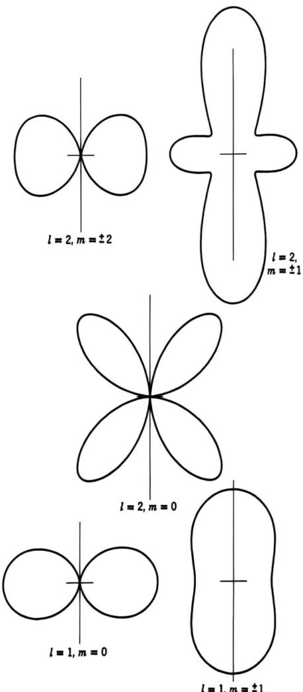{width=37%} Figure 9.5 Dipole and quadrupole radiation patterns for pure $(l,m)$ multipoles.

distribution of order $l$ will involve a coherent superposition of the $(2l+1)$ amplitudes for different $m$, as shown in (9.150).

It can be shown by means of (3.69) that the absolute squares of the vector spherical harmonics obey the sum rule,

$$
\sum _ { m = - l } ^{l} | \mathbf { X } _ { l m } ( \theta , \phi ) | ^{2} = \frac { 2 l + 1 } { 4 \pi }
$$

Hence the radiation distribution will be isotropic from a source that consists of a set of multipoles of order $l$, with coefficients $a(l,m)$ independent of $m$, super

posed incoherently. This situation usually prevails in atomic and nuclear radiative transitions unless the initial state has been prepared in a special way.

The total power radiated by a pure multipole of order $(l,m)$ is given by the integral of (9.151) over all angles. Since the $\mathbf{X}_{lm}$ are normalized to unity, the power radiated is

$$
P ( l , m ) = \frac { Z _ { 0 } } { 2 k ^{2} } \left| a ( l , m ) \right| ^{2}
$$

For a general source the angular distribution is given by the coherent sum (9.150). On integration over angles it is easy to show that the interference terms do not contribute. Hence the total power radiated is just an incoherent sum of contributions from the different multipoles:

$$
P = \frac { Z _ { 0 } } { 2 k ^{2} } \sum _ { l , m } [ | a _ { E } ( l , m ) | ^{2} + | a _ { M } ( l , m ) | ^{2} ]
$$

# 9.10 Sources of Multipole Radiation; Multipole Moments

Having discussed the properties of multipole fields, the radiation patterns, and the angular momentum and energy carried off, we now turn to the connection of the fields with the sources that generate them. We assume that there exist localized well-behaved distributions of charge $\rho(\mathbf{x},t)$, current $\mathbf{J}(\mathbf{x},t)$, and intrinsic magnetization $\mathbf{M}(\mathbf{x},t)$. Furthermore, we assume that the time dependence can be analyzed into its Fourier components, and we consider only harmonically varying sources,

$$
\rho ( \mathbf { x } ) e ^{- i \omega t} ,  \mathbf { J } ( \mathbf { x } ) e ^{- i \omega t} ,  \mathcal { M } ( \mathbf { x } ) e ^{- i \omega t}
$$

where it is understood that we take the real part of such complex quantities. A more general time dependence can be obtained by linear superposition (see also Problem 9.1).

The Maxwell equations for $\mathbf{E}$ and $\mathbf{H}^{\prime}=\mathbf{B}/\mu_{0}$ are

$$
\begin{array}{rl} { \nabla \cdot \mathbf { H } ^{\prime} = 0 , } & { { }  \nabla \times \mathbf { E } - i k Z _ { 0 } \mathbf { H } ^{\prime} = 0 } \\{ \nabla \cdot \mathbf { E } = \rho / \epsilon _ { 0 } , } & { { }  \nabla \times \mathbf { H } ^{\prime} + i k \mathbf { E } / Z _ { 0 } = \mathbf { J } + \nabla \times \mathcal { M } } \end{array}
$$

with the continuity equation,

$$
i \omega \rho = \nabla \cdot \mathbf { J }
$$

It is convenient to deal with divergenceless fields. Accordingly, we use as field variables, $\mathbf{H}^{\prime}$ and

$$
\mathbf { E } ^{\prime} = \mathbf { E } + { \frac { i } { \omega \epsilon _ { 0 } } } \mathbf { J }
$$

In the region outside the sources, $\mathbf{E}^{\prime}$ reduces to $\mathbf{E}$ and $\mathbf{H}^{\prime}$ to $\mathbf{H}$. In terms of these fields the Maxwell equations read

$$
\begin{array}{rl} { \nabla \cdot \mathbf { H } ^{\prime} = 0 , } & { { }  \nabla \times \mathbf { E } ^{\prime} - i k Z _ { 0 } \mathbf { H } ^{\prime} = \frac { i } { \omega \epsilon _ { 0 } } \nabla \times \mathbf { J } } \\{ \nabla \cdot \mathbf { E } ^{\prime} = 0 , } & { { }  \nabla \times \mathbf { H } ^{\prime} + i k \mathbf { E } ^{\prime} / Z _ { 0 } = \nabla \times \mathcal { M } } \end{array}
$$

The curl equations can be combined to give the inhomogeneous Helmholtz wave equations

$$
( \nabla ^{2} + k ^{2} ) \mathbf { H } ^{\prime} = - \nabla \times ( \mathbf { J } + \nabla \times \mathcal { M } )
$$

and

$$
( \nabla ^{2} + k ^{2} ) \mathbf { E } ^{\prime} = - i Z _ { 0 } k \nabla \times \left( \mathcal { M } + \frac { 1 } { k ^{2} } \nabla \times \mathbf { J } \right)
$$

These wave equations, together with $\nabla\cdot\mathbf{H}'=0$, $\nabla\cdot\mathbf{E}'=0$, and the curl equations giving $\mathbf{E}'$ in terms of $\mathbf{H}'$ or vice versa, are the counterparts of (9.108) and (9.109) when sources are present.

Since the multipole coefficients in (9.122) are determined according to (9.123) from the scalars $\mathbf{r} \cdot \mathbf{H}^{\prime}$ and $\mathbf{r} \cdot \mathbf{E}^{\prime}$, it is sufficient to consider wave equations for them, rather than the vector fields $\mathbf{E}^{\prime}$ and $\mathbf{H}^{\prime}$. From (9.110), (9.161) and the vector relation, $\mathbf{r} \cdot (\nabla \times \mathbf{A}) = (\mathbf{r} \times \nabla) \cdot \mathbf{A} = i \mathbf{L} \cdot \mathbf{A}$ for any vector field $\mathbf{A}$, we find the inhomogeneous wave equations

$$
\begin{array}{rl} & { ( \nabla ^{2} + k ^{2} ) \mathbf { r } \cdot \mathbf { H } ^{\prime} = - i \mathbf { L } \cdot ( \mathbf { J } + \nabla \times \mathcal { M } ) } \\& { ( \nabla ^{2} + k ^{2} ) \mathbf { r } \cdot \mathbf { E } ^{\prime} = Z _ { 0 } k \mathbf { L } \cdot \left( \mathcal { M } + \frac { 1 } { k ^{2} } \nabla \times \mathbf { J } \right) } \end{array}
$$

The solutions of these scalar wave equations follow directly from the development in Section 6.4. With the boundary condition of outgoing waves at infinity, we have

$$
\begin{array}{rl} & { \mathbf { r } \cdot \mathbf { H } ^{\prime} ( \mathbf { x } ) = \frac { i } { 4 \pi } \int \frac { e ^{i k | \mathbf { x} - \mathbf { x } ^{\prime} | } } { | \mathbf { x } - \mathbf { x } ^{\prime} | } \, \mathbf { L } ^{\prime} \cdot \left[ \mathbf { J } ( \mathbf { x } ^{\prime} ) + \nabla ^{\prime} \times \mathcal { M } ( \mathbf { x } ^{\prime} ) \right] \, d ^{3} x ^{\prime} } \\& { \mathbf { r } \cdot \mathbf { E } ^{\prime} ( \mathbf { x } ) = - \, \frac { Z _ { 0 } k } { 4 \pi } \int \frac { e ^{i k | \mathbf { x} - \mathbf { x } ^{\prime} | } } { | \mathbf { x } - \mathbf { x } ^{\prime} | } \, \mathbf { L } ^{\prime} \cdot \left[ \mathcal { M } ( \mathbf { x } ^{\prime} ) + \frac { 1 } { k ^{2} } \nabla ^{\prime} \times \mathbf { J } ( \mathbf { x } ^{\prime} ) \right] \, d ^{3} x ^{\prime} } \end{array}
$$

To evaluate the multipole coefficients by means of (9.123), we first observe that the requirement of outgoing waves at infinity makes $A_{l}^{(2)}=0$ in (9.113). Thus we choose $f_{l}(kr)=g_{l}(kr)=h_{l}^{(1)}(kr)$ in (9.122) as the representation of $\mathbf{E}$ and $\mathbf{H}$ outside the sources. Next we consider the spherical wave representation (9.98) for the Green function in (9.163) and assume that the point $\mathbf{x}$ is outside a spherical surface completely enclosing the sources. Then in the integrations in (9.163), $r_{<}=r'$, $r_{>}=r$. The spherical wave projection needed for (9.123) is

$$
\frac { 1 } { 4 \pi } \int d \Omega \ Y _ { l m } ^{*} ( \theta , \ \phi ) \ \frac { e ^{i k | \mathbf { x} - \mathbf { x } ^{\prime} | } } { | \mathbf { x } - \mathbf { x } ^{\prime} | } = i k \ h _ { l } ^{( 1 )} ( k r ) j _ { l } ( k r ^{\prime} ) Y _ { l m } ^{*} ( \theta ^{\prime} , \ \phi ^{\prime} )
$$

By means of this projection we see that $a_{M}(l,m)$ and $a_{E}(l,m)$ are given in terms of the integrands in (9.163) by

$$
\begin{array}{r} { a _ { E } ( l , m ) = \frac { i k ^{3} } { \sqrt { l ( l + 1 ) } } \int j _ { l } ( k r ) Y _ { l m } ^{*} \mathbf { L } \cdot \left( \mathcal { M } + \frac { 1 } { k ^{2} } \nabla \times \mathbf { J } \right) d ^{3} x } \\{ a _ { M } ( l , m ) = \frac { - k ^{2} } { \sqrt { l ( l + 1 ) } } \int j _ { l } ( k r ) Y _ { l m } ^{*} \mathbf { L } \cdot \left( \mathbf { J } + \nabla \times \mathcal { M } \right) d ^{3} x } \end{array}
$$

The expressions in (9.165) give the strengths of the various multipole fields outside the source in terms of integrals over the source densities $\mathbf{J}$ and $\mathbf{M}$. They

can be transformed into more useful forms by means of the following identities: Let $\mathbf{A}(\mathbf{x})$ be any well-behaved vector field. Then

$$
\begin{array}{rl} { \mathbf { L } \cdot \mathbf { A } = i \nabla \cdot ( \mathbf { r } \times \mathbf { A } ) } & { } \\{ \mathbf { L } \cdot ( \nabla \times \mathbf { A } ) = i \nabla ^{2} ( \mathbf { r } \cdot \mathbf { A } ) - \frac { i } { r } \frac { \partial } { \partial r } \left( r ^{2} \nabla \cdot \mathbf { A } \right) } & { } \end{array}
$$

These follow from the definition (9.101) of $\mathbf{L}$ and simple vector identities. With $\mathbf{A} = \mathcal{M}$ in the first equation and $\mathbf{A} = \mathbf{J}$ in the second, the integral for $a_{\mathcal{E}}(l, m)$ in (9.165) becomes

$$
\begin{array}{rl} { a _ { E } ( l , m ) = - \frac { k ^{3} } { \sqrt { l ( l + 1 ) } } \int j _ { l } ( k r ) Y _ { l m } ^{*} \bigg [ \nabla \cdot ( \mathbf { r } \times \mathcal { M } ) } & { { } } \\{ + \frac { 1 } { k ^{2} } \nabla ^{2} ( \mathbf { r } \cdot \mathbf { J } ) - \frac { i c } { k } \frac { 1 } { r } \frac { \partial } { \partial r } \left( r ^{2} \rho \right) \bigg ] d ^{3} x } & { { } } \end{array}
$$

where we have used (9.158) to express $\nabla \cdot \mathbf{J}$ in terms of $\rho$. Use of Green's theorem on the second term replaces $\nabla^2$ by $-k^2$, while a radial integration by parts on the third term casts the radial derivative over onto the spherical Bessel function. The result for the electric multipole coefficient is

$$
a _ { E } ( l , \, m ) = \frac { k ^{2} } { i \sqrt { l ( l + 1 ) } } \int Y _ { l m } ^{*} \biggl \{ \frac { c \rho \, \frac { \partial } { \partial r } \, [ r j _ { l } ( k r ) ] \, + \, i k ( \mathbf { r } \cdot \mathbf { J } ) j _ { l } ( k r ) } { - \, i k \nabla \cdot ( \mathbf { r } \times \mathcal { M } ) j _ { l } ( k r ) } \biggr \} \, d ^{3} x
$$

The analogous manipulation with the second equation in (9.165) leads to the magnetic multipole coefficient,

$$
a _ { M } ( l , m ) = \frac { k ^{2} } { i \sqrt { l ( l + 1 ) } } \int Y _ { l m } ^{*} \left\{ \nabla \cdot ( \mathbf { r } \times \mathbf { J } ) j _ { l } ( k r ) + \nabla \cdot \mathbf { M } \frac { \partial } { \partial r } \left[ r j _ { l } ( k r ) \right] \right\} d ^{3} x
$$

These results are exact expressions, valid for arbitrary frequency and source size.

For many applications in atomic and nuclear physics the source dimensions are very small compared to a wavelength ($kr_{\mathrm{max}} \ll 1$). Then the multipole coefficients can be simplified considerably. The small argument limit (9.88) can be used for the spherical Bessel functions. Keeping only the lowest powers in $kr$ for terms involving $\rho$ or $\mathbf{J}$ and $\mathbf{M}$, we find the approximate electric multipole coefficient,

$$
a _ { E } ( l , m ) = \frac { c k ^{l + 2} } { i ( 2 l + 1 ) ! ! } \left( \frac { l + 1 } { l } \right) ^{1 / 2} ( Q _ { l m } + Q _ { l m } ^{\prime} )
$$

where the multipole moments are

and

$$
\begin{array}{r} { Q _ { l m } = \int r ^{\prime} Y _ { l m } ^{*} \rho \ d ^{3} x } \\{ Q _ { l m } ^{\prime} = \frac { - i k } { ( l + 1 ) c } \int r ^{\prime} Y _ { l m } ^{*} \nabla \cdot ( \mathbf { r } \times \mathcal { M } ) \ d ^{3} x \biggr \} } \end{array}
$$

The moment $Q_{lm}$ is seen to be the same in form as the electrostatic multipole moment $q_{lm}$ (4.3). The moment $Q'_{lm}$ is an induced electric multipole moment due

to the magnetization. It is generally at least a factor $kr$ smaller than the normal moment $Q_{lm}$. For the magnetic multipole coefficient $a_{M}(l,m)$ the corresponding long-wavelength approximation is

$$
a _ { M } ( l , m ) = \frac { i k ^{l + 2} } { ( 2 l + 1 ) ! ! } \left( \frac { l + 1 } { l } \right) ^{1 / 2} ( M _ { l m } + M _ { l m } ^{\prime} )
$$

where the magnetic multipole moments are

and

$$
\begin{array}{r} { M _ { l m } = - \frac { 1 } { l + 1 } \int r ^{l} Y _ { l m } ^{*} \, \nabla \cdot \left( \mathbf { r } \times \mathbf { J } \right) \, d ^{3} x \biggr \} } \\{ M _ { l m } ^{\prime} = - \int r ^{l} Y _ { l m } ^{*} \, \nabla \cdot \mathcal { M } \, d ^{3} x } \end{array}
$$

In contrast to the electric multipole moments $Q_{lm}$ and $Q'_{lm}$, for a system with intrinsic magnetization the magnetic moments $M_{lm}$ and $M'_{lm}$ are generally of the same order of magnitude.

In the long-wavelength limit we see clearly that electric multipole fields are related to the electric-charge density $\rho$, while the magnetic multipole fields are determined by the magnetic-moment densities, $(\mathbf{r} \times \mathbf{J})/2$ and $\mathcal{M}$.

# 9.11 Multipole Radiation in Atoms and Nuclei

Although a full discussion of radiative transitions in atoms and nuclei requires a quantum-mechanical treatment, the qualitative aspects can be gleaned from our classical formulas by means of semiclassical arguments and simple estimates of the effective multipole moments. First of all, we note that the transition probability $\Gamma$ (reciprocal mean life) for emission of a photon of energy $\hbar\omega$ is given by the radiated power divided by $\hbar\omega$. From (9.154) for the power and (9.169) and (9.171) for the amplitudes $a_E$ and $a_M$ in terms of the long-wavelength multipoles, we find the transition probability for an electric multipole $(l,m)$,

$$
\Gamma _ { E } ( l , m ) = \frac { \omega Z _ { 0 } k ^{2 l} } { 2 \hbar [ ( 2 l + 1 ) ! ! ] ^{2} } \left( \frac { l + 1 } { l } \right) | Q _ { l m } + Q _ { l m } ^{\prime} | ^{2}
$$

For a magnetic multipole, $Q_{lm} + Q'_{lm} \rightarrow (1/c)[M_{lm} + M'_{lm}]$.

The effective multipole moments can be estimated as to order of magnitude as follows. Suppose that for the system under consideration the effective charge is $e$, the effective mass of the radiating constituents is $m$, and the effective size is $R$. Then the effective magnetization is $|\mathcal{M}| = O(e\hbar/mR^3)$, where $e\hbar/m$ is the effective magnetic moment of the constituents. The most naive estimates of the multipole coefficients are then

$$
| Q _ { l m } | = O ( e R ^{l} ) ;  | Q _ { l m } ^{\prime} | = O \bigg ( \frac { \hbar \omega } { m c ^{2} } \, e R ^{l} \bigg )
$$

and

$$
\frac { 1 } { c } \left| M _ { l m } + M _ { l m } ^{\prime} \right| = O \left( \frac { e \hbar } { m c } \, R ^{l - 1} \right)
$$

With these order-of-magnitude estimates some qualitative features of atomic and nuclear radiative transitions can be abstracted. In atoms and in nuclei the transition energies $\hbar\omega$ are invariably small compared to the rest energy $mc^2$ of the constituents. We thus see that $|Q'_{lm}| << |Q_{lm}|$ is a universal expectation. Electric multipole transitions of order $l$ (denoted by $El$) are dominated by the transitional charge density, with negligible contribution from the "magnetization charge." On the other hand, magnetic multipole transitions ($MI$) generally have comparable contributions from the orbital and intrinsic magnetizations.

In atoms the electrons are the radiating constituents. The size of the system is $R = O(a_0/Z_{\rm eff})$, where $a_0$ is the Bohr radius and $Z_{\rm eff}$ is of order unity for valence electron transitions and of order $Z$ for K- or L-shell x-ray transitions. From (9.174) the relative size of the magnetic multipole moments with respect to the electric of the same order $l$ is $|M|/c|Q| = O(\hbar/mcR) = O(Z_{\rm eff}/137)$. For the same transition energy, the transition probabilities will be in the ratio

$$
\frac { \Gamma _ { M } ( l ) } { \Gamma _ { E } ( l ) } = O \bigg ( \frac { Z _ { \mathrm { e f f } } ^{2} } { ( 13 7 ) ^{2} } \bigg )
$$

Only for x-ray transitions in heavy elements are magnetic multipoles even remotely competitive with electric multipoles of the same order. [Note, however, that the $Ml$ transitions have the opposite parity properties to the $El$ for the same $l$.]

Of interest is the relative size of transition probabilities for multipoles differing by one unit in order. Ignoring factors of order unity, we see from (9.173) and (9.174) that

$$
\frac { \Gamma _ { E , M } ( l + 1 ) } { \Gamma _ { E , M } ( l ) } = O ( k ^{2} R ^{2} )
$$

In atoms the transition energies are of order $Z_{\mathrm{eff}}^{2}mc^{2}/(137)^{2}$, while the size is $R=O(137\ \hbar/mcZ_{\mathrm{eff}})$. We thus find $kR=O(Z_{\mathrm{eff}}/137)$ and the ratio for successive $El$ multipoles is of the same order as (9.175). For atomic transitions in which the angular-momentum selection rules permit several multipoles, the lowest multipole generally dominates. For example, if the initial and final angular momenta are $J=\frac{1}{2}$ and $J'=\frac{3}{2}$ and the states have the opposite parity, the allowed multipoles are $E1$ and $M2$. The $E1$ transition will dominate by a factor of order $(Z_{\mathrm{eff}}/137)^{4}$. If the parities are the same, the allowed transitions are $M1$ and $E2$. Now the two transition mechanisms may be comparable, with transition probabilities much smaller than for opposite parities. In atoms the dominant transitions are $E1$; high angular momentum states de-excite by a cascade of $E1$ transitions, if at all possible.

In nuclei the situation is somewhat different. Successive multipoles of the same type still obey the estimate (9.176), but the transition energies vary significantly. With the nuclear radius $R = 1.4 \, A^{1/3} \times 10^{-15} \, \text{m}$ as the effective size, numerically we have $kR \cong [\hbar\omega(\text{MeV})] \, A^{1/3}/140$. Energies vary from a few keV to several MeV. In heavy nuclei, this corresponds to a range, $kR \cong 10^{-4}$–$10^{-1}$. Evidently, for energetic nuclear transitions successive multipoles of the same type are not as suppressed as in atoms. For low energies, however, the suppression of rate with multipole order is dramatic. $M4$ isomeric transitions with energies of the order of 100 keV or less can have mean lives of hours. The nuclear estimates

for magnetic relative to electric transition rates of the same order, and for an electric multipole of one higher order relative to a magnetic transition, are

$$
\frac { \Gamma _ { M } ( l ) } { \Gamma _ { E } ( l ) } = O ( 0 . 2 \ A ^{- 2 / 3} ) ;  \frac { \Gamma _ { E } ( l + 1 ) } { \Gamma _ { M } ( l ) } = O \bigg ( \frac { ( \hbar \omega [ \mathrm { M e V } ] ) ^{2} \ A ^{4 / 3} } { 40 00 } \bigg )
$$

In these estimates we have taken the effective magnetization to be roughly $3\ e\hbar/m_{N}R^{3}$, with a $g$ factor of 3 to account for the magnetic moments of nucleons.

Our estimates of the nuclear transition rates are subject to exceptions ascribable to special properties of the nuclear states and interactions. In light to medium mass nuclei, $E1$ transitions are strongly suppressed by the isospin symmetry of nuclear forces, at least at low energies. $M1$ transitions are far commoner than $E1$ transitions and just as intense. In rare earth and transuranic nuclei, $E2$ transitions are often 100 times stronger than our estimate because of significant static and transitional quadrupole moments in these nonspherical nuclei. If allowed by spin-parity, $E2$ transitions then compete favorably with $M1$ transitions.

A proper quantum-mechanical treatment of multipole radiation can be found in Blatt and Weisskopf, Chapter XII. Applications to nuclear transitions are cited in the References and Suggested Reading at the end of the chapter.

# 9.12 Multipole Radiation from a Linear, Center-Fed Antenna

As an illustration of the use of a multipole expansion for a source whose dimensions are comparable to a wavelength, we consider the radiation from a thin, linear, center-fed antenna, as shown in Fig. 9.6. We have already given in Section 9.4 a direct solution for the fields when the current distribution is taken to be sinusoidal. This will serve as a basis of comparison to test the convergence of the multipole expansion. We assume the antenna to lie along the $z$ axis from $-(d/2) \leq z \leq (d/2)$, and to have a small gap at its center so that it can be suitably

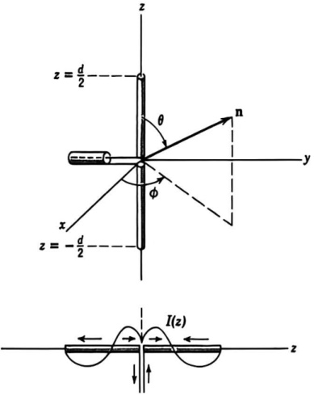{width=31%} Figure 9.6 Linear, center-fed antenna.

excited. The current along the antenna vanishes at the end points and is an even function of $z$. For the moment we will not specify it more than to write

$$
I ( z , \, t ) = I ( | z | ) e ^{- i \omega t} ,  I  \left( { \frac { d } { 2 } } \right) = 0
$$

Since the current flows radially, ($\mathbf{r} \times \mathbf{J}$) = 0. Furthermore there is no intrinsic magnetization. Consequently all magnetic multipole coefficients $a_{M}(l,m)$ vanish. To calculate the electric multipole coefficient $a_{E}(l,m)$ (9.167) we need expressions for the charge and current densities. The current density $\mathbf{J}$ is a radial current, confined to the $z$ axis. In spherical coordinates this can be written for $r < (d/2)$

$$
\mathbf { J } ( \mathbf { x } ) = \hat { \mathbf { r } } \frac { I ( r ) } { 2 \pi r ^{2} } \left[ \delta ( \cos \theta - 1 ) - \delta ( \cos \theta + 1 ) \right]
$$

where the delta functions cause the current to flow only upward (or downward) along the $z$ axis. From the continuity equation (9.158) we find the charge density

$$
\rho ( \mathbf { x } ) = \frac { 1 } { i \omega } \frac { d I ( r ) } { d r } \left[ \frac { \delta ( \cos \theta - 1 ) - \delta ( \cos \theta + 1 ) } { 2 \pi r ^{2} } \right]
$$

These expressions for $\mathbf{J}$ and $\rho$ can be inserted into (9.167) to give

$$
\begin{array}{r} { a _ { E } ( l , m ) = \frac { k ^{2} } { 2 \pi \sqrt { l ( l + 1 ) } } \int _ { 0 } ^{d / 2} d r \Bigg \{ k r j _ { l } ( k r ) I ( r ) - \frac { 1 } { k } \frac { d I } { d r } \frac { d } { d r } \left[ r j _ { l } ( k r ) \right] \Bigg \} } \\{ \times \int d \Omega \; Y _ { l m } ^{*} [ \delta ( \cos \theta - 1 ) - \delta ( \cos \theta + 1 ) ] } \end{array}
$$

The integral over angles is

$$
\int d \Omega = 2 \pi \delta _ { m , 0 } [ Y _ { I 0 } ( 0 ) - Y _ { I 0 } ( \pi ) ]
$$

showing that only $m = 0$ multipoles occur. This is obvious from the cylindrical symmetry of the antenna. The Legendre polynomials are even (odd) about $\theta = \pi/2$ for $l$ even (odd). Hence, the only nonvanishing multipoles have $l$ odd. The the angular integral has the value,

$$
\int d \Omega = \sqrt { 4 \pi ( 2 l + 1 ) } ,  l { \mathrm { ~ o d d } } , \, m = 0
$$

With slight manipulation (9.181) can be written

$$
\begin{array}{r} { a _ { E } ( l , 0 ) = \frac { k } { 2 \pi } \left[ \frac { 4 \pi ( 2 l + 1 ) } { l ( l + 1 ) } \right] ^{1 / 2} \int _ { 0 } ^{d l / 2} \left\{ - \frac { d } { d r } \left[ r j _ { l } ( k r ) \frac { d I } { d r } \right] \right. } \\{ \left. + \; r j _ { l } ( k r ) \left( \frac { d ^{2} I } { d r ^{2} } + k ^{2} I \right) \right\} \, d r } \end{array}
$$

To evaluate (9.182) we must specify the current $I(z)$ along the antenna. If no radiation occurred, the sinusoidal variation in time at frequency $\omega$ would imply a sinusoidal variation in space with wave number $k=\omega/c$. But as discussed in Section 9.4.B, the emission of radiation modifies the current distribution unless

the antenna is infinitely thin. The correct current $I(z)$ can be found only by solving a complicated boundary-value problem. Since our purpose here is to compare a multipole expansion with a closed form of solution for a known current distribution, we make the same assumption about $I(z)$ as in Section 9.4.A, namely,

$$
I ( z ) = I \sin \left( \frac { k d } { 2 } - k | z | \right)
$$

where $I$ is the peak current, and the phase is chosen to ensure that the current vanishes at the ends of the antenna. With a sinusoidal current the second part of the integrand in (9.182) vanishes. The first part is a perfect differential. Consequently we immediately obtain, with $I(z)$ from (9.183),

$$
a _ { E } ( l , \, 0 ) = \frac { I } { \pi d } \left[ \frac { 4 \pi ( 2 l + 1 ) } { l ( l + 1 ) } \right] ^{1 / 2}   \left[ \left( \frac { k d } { 2 } \right) ^{2} j _ { l }  \left( \frac { k d } { 2 } \right) \right] ,  l \mathrm { ~ o d d }
$$

Since we wish to test the multipole expansion when the source dimensions are comparable to a wavelength, we consider the special cases of a half-wave antenna ($kd=\pi$) and a full-wave antenna ($kd=2\pi$). Table 9.2 shows the $l=1$ coefficient for these two values of $kd$, along with the relative values for $l=3,5$. From the table it is evident that (a) the coefficients decrease rapidly in magnitude as $l$ increases, and (b) higher $l$ coefficients are more important the larger the source dimensions. But even for the full-wave antenna it is probably adequate to keep only $l=1$ and $l=3$ in the angular distribution and certainly adequate for the total power (which involves the squares of the coefficients).

With only dipole and octupole terms in the angular distribution we find that the power radiated per unit solid angle (9.150) is

$$
\frac { d P } { d \Omega } = \frac { Z _ { 0 } \left| a _ { E } ( 1 , 0 ) \right| ^{2} } { 4 k ^{2} } \bigg | \mathbf { L } Y _ { 1 , 0 } - \frac { a _ { E } ( 3 , 0 ) } { \sqrt { 6 } \ a _ { E } ( 1 , 0 ) } \mathbf { L } Y _ { 3 , 0 } \bigg | ^{2}
$$

The various factors in the absolute square are

$$
\begin{array}{rl} & { | { \bf L } Y _ { 1 , 0 } | ^{2} = \frac { 3 } { 4 \pi } \sin ^{2} \theta } \\& { | { \bf L } Y _ { 3 , 0 } | ^{2} = \frac { 63 } { 16 \pi } \sin ^{2} \theta ( 5 \cos ^{2} \theta - 1 ) ^{2} } \\& { ( { \bf L } Y _ { 1 , 0 } ) ^{*} \cdot ( { \bf L } Y _ { 3 , 0 } ) = \frac { 3 \sqrt { 21 } } { 8 \pi } \sin ^{2} \theta ( 5 \cos ^{2} \theta - 1 ) } \end{array}
$$

Table 9.2 Multipole Coefficients for Linear Antenna

| kd | $a_E(1,0)$ | $a_E(3,0)/a_E(1,0)$ | $a_E(5,0)/a_E(1,0)$ |
| --- | --- | --- | --- |
| $\pi$ | $\sqrt{\frac{6}{\pi} \frac{I}{d}}$ | $4.95 \times 10^{-2}$ | $1.02 \times 10^{-3}$ |
| $2\pi$ | $\sqrt{6\pi} \frac{I}{d}$ | $0.3242$ | $2.39 \times 10^{-2}$ |

With these angular factors (9.185) becomes

$$
\frac { d P } { d \Omega } = \lambda \, \frac { 3 Z _ { 0 } I ^{2} } { \pi ^{3} } \left( \frac { 3 } { 8 \pi } \sin ^{2} \theta \right) \Bigg | 1 - \sqrt { \frac { 7 } { 8 } } \, \frac { a _ { E } ( 3 , \, 0 ) } { a _ { E } ( 1 , \, 0 ) } \, ( 5 \, \cos ^{2} \theta - 1 ) \Bigg | ^{2}
$$

where the factor $\lambda$ is equal to 1 for the half-wave antenna and $(\pi^{2}/4)$ for the full wave. The coefficient of $(5\cos^{2}\theta - 1)$ in (9.187) is 0.0463 and 0.3033 for the half-wave and full-wave antenna, respectively.

A numerical comparison of the exact and approximate angular distributions, (9.57) and (9.187), is shown in Fig. 9.7. The solid curves are the exact results, the dashed curves the two-term multipole expansions. For the half-wave case (Fig. 9.7a) the simple dipole result [first term in (9.187)] is also shown as a dotted curve. The two-term multipole expansion is almost indistinguishable from the exact result for $kd=\pi$. Even the lowest order approximation is not very far off in this case. For the full-wave antenna (Fig. 9.7b) the dipole approximation is evidently quite poor. But the two-term multipole expansion is reasonably good, differing by less than 5% in the region of appreciable radiation.

The total power radiated is, according to (9.155),

$$
P = \frac { Z _ { 0 } } { 2 k ^{2} } \sum _ { l \mathrm { ~ o d d } } | a _ { E } ( l , 0 ) | ^{2}
$$

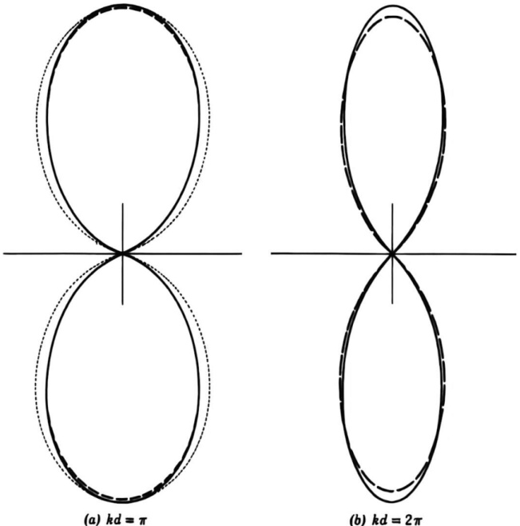{width=53%} Figure 9.7 Comparison of exact radiation patterns (solid curves) for half-wave ($kd=\pi$) and full-wave ($kd=2\pi$) center-fed antennas with two-term multipole expansions (dashed curves). For the half-wave pattern, the dipole approximation (dotted curve) is also shown. The agreement between the exact and two-term multipole results is excellent, especially for $kd=\pi$.

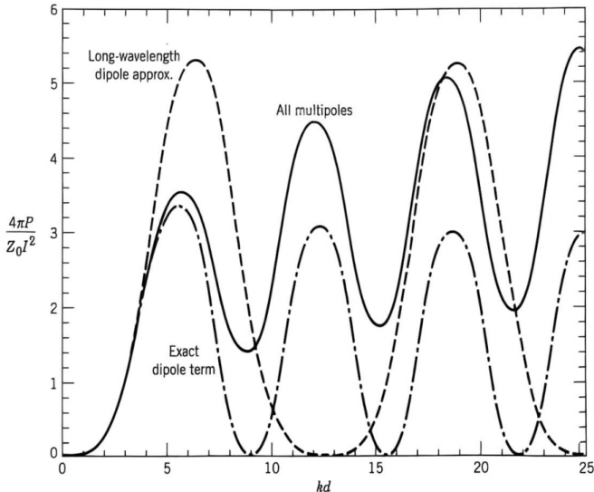{width=53%} Figure 9.8 Total power radiated by center-fed antenna with sinusoidal current distribution (9.183) versus $kd$. The ordinate is $4\pi P/Z_0I^2$, with $I$ the peak current in (9.183). The curve labeled "Long-wavelength dipole approx." employs the long-wavelength dipole moment (9.170) rather than the exact (9.167) used for the curve labeled "Exact dipole term." The curve labeled "All multipoles" is the sum (9.188) [actually up to $E9$].

For the half-wave antenna the coefficients in Table 9.2 show that the power radiated is a factor 1.00244 times larger than the simple dipole result, $(3Z_0I^2/\pi^3)$. For the full-wave antenna, the power is a factor 1.10565 times larger than the dipole form $(3Z_0I^2/4\pi)$.

A comparison of the total power (9.188) for the center-fed linear antenna with the lowest multipole power, for both the exact lowest multipole and its long-wavelength approximation, is shown in Fig. 9.8 versus $kd$. For $kd \leq 2\pi$, the power is dominated by the $E1$ multipole, as we have just seen, but for larger $kd$ the higher multipoles contribute more and more. It is noteworthy that the long-wavelength dipole approximation departs significantly from the exact dipole result (and the total power) for $kd > \pi$. The departure, which becomes gross for larger $kd$, is a consequence of differences between exact multipole moments and the long-wavelength approximations to them when the wavelength becomes comparable to or smaller than source size.

# References and Suggested Reading

The simple theory of radiation from a localized source distribution is discussed in all modern textbooks. Treatments analogous to that given here may be found in Panofsky and Phillips, Chapter 13Smythe, Chapter 12Stratton, Chapter 8

More complete discussions of antennas and antenna arrays are given in applied works, such as

Jordan and Balmain Kraus Schelkunoff and Friis Silver

Treatments of antennas as boundary-value problems from various points of view can be found in Hallén Jones Schelkunoff, Advanced Antenna Theory

The subject of excitation of waveguides by localized sources and the use of multipole moments is discussed by Collin

The original literature on the description of small apertures (Bethe holes) in terms of effective dipole moments has been cited in Section 9.5. The basic theory and some applications appear in

CollinMontgomery, Dicke, and Purcell (pp. 176 ff. and pp. 296 ff.)Van Bladel

The theory of vector spherical harmonics and multipole vector fields is discussed thoroughly by

Blatt and Weisskopf, Appendix B

Morse and Feshbach, Section 13.3

Applications to nuclear multipole radiation are given inBlatt and Weisskopf, Chapter XIISiegbahn, Chapter XIII by S. A. Moszkowski and Chapter XVI (II) by M.Goldhaber and A. W. Sunyar

# Problems

9.1 A common textbook example of a radiating system (see Problem 9.2) is a configuration of charges fixed relative to each other but in rotation. The charge density is obviously a function of time, but it is not in the form of (9.1).

(a) Show that for rotating charges one alternative is to calculate real time-dependent multipole moments using $\rho(\mathbf{x},t)$ directly and then compute the multipole moments for a given harmonic frequency with the convention of (9.1) by inspection or Fourier decomposition of the time-dependent moments. Note that care must be taken when calculating $q_{lm}(t)$ to form linear combinations that are real before making the connection.

(b) Consider a charge density $\rho(\mathbf{x},t)$ that is periodic in time with period $T=2\pi/\omega_0$. By making a Fourier series expansion, show that it can be written as

$$
\rho ( \mathbf { x } , \ t ) = \rho _ { 0 } ( \mathbf { x } ) + \sum _ { n = 1 } ^{\infty} \mathrm { R e } [ 2 \rho _ { n } ( \mathbf { x } ) e ^{- i n \omega _ { 0} t } ]
$$

where

$$
\rho _ { n } ( \mathbf { x } ) = \frac { 1 } { T } \int _ { 0 } ^{T} \rho ( \mathbf { x } , t ) e ^{i n \omega t} \, d t
$$

This shows explicitly how to establish connection with (9.1).

(c) For a single charge $q$ rotating about the origin in the $x$-$y$ plane in a circle of radius $R$ at constant angular speed $\omega_{0}$, calculate the $l=0$ and $l=1$ multipole moments by the methods of parts a and b and compare. In method b express the charge density $\rho_{n}(\mathbf{x})$ in cylindrical coordinates. Are there higher multipoles, for example, quadrupole? At what frequencies?

9.2 A radiating quadrupole consists of a square of side $a$ with charges $\pm q$ at alternate corners. The square rotates with angular velocity $\omega$ about an axis normal to the plane of the square and through its center. Calculate the quadrupole moments, the radiation fields, the angular distribution of radiation, and the total radiated power, all in the long-wavelength approximation. What is the frequency of the radiation?

9.3 Two halves of a spherical metallic shell of radius $R$ and infinite conductivity are separated by a very small insulating gap. An alternating potential is applied between the two halves of the sphere so that the potentials are $\pm V \cos \omega t$. In the long-wavelength limit, find the radiation fields, the angular distribution of radiated power, and the total radiated power from the sphere.

9.4 Apply the approach of Problem 9.1b to the current and magnetization densities of the particle of charge $q$ rotating about the origin in the $x$-$y$ plane in a circle of radius $R$ at constant angular speed $\omega_0$. The motion is such that $\omega_0R \ll c$.

(a) Find $(J_x)_n$, $(J_y)_n$, and $(J_z)_n$ in terms of cylindrical coordinates for all $n$. Also determine the components of the orbital "magnetization," ($\mathbf{x} \times \mathbf{J}_n$)/2, and its divergence [which plays the role of a magnetic charge density for magnetic multipoles, as in $M_{lm}$ (9.172)].

(b) What long-wavelength magnetic multipoles $(l,m)$ occur and at what frequencies? [Remember that the multipole order $l$ does not necessarily equal the harmonic number $n$.]

(c) Use linear superposition to generalize your argument to the four charges rotating in Problem 9.2 at radius $R = a/\sqrt{2}$. What harmonics occur, and what magnetic multipoles at each harmonic? Is there a magnetic multipole contribution at the $E2$ frequency of Problem 9.2? Is it significant relative to the $E2$ radiation?

9.5 (a) Show that for harmonic time variation at frequency $\omega$ the electric dipole scalar and vector potentials in the Lorenz gauge and the long-wavelength limit are

$$
\begin{array}{rl} { \Phi ( \mathbf { x } ) = \frac { e ^{i k r} } { 4 \pi \epsilon _ { 0 } r ^{2} } \mathbf { n } \cdot \mathbf { p } ( 1 - i k r ) } & { { } } \\{ \mathbf { A } ( \mathbf { x } ) = - i \frac { \mu _ { 0 } \omega } { 4 \pi } \frac { e ^{i k r} } { r } \mathbf { p } } & { { }  [ \mathrm { t h i s ~ i s ~ ( 9 . 16 ) } ] } \end{array}
$$

where $k=\omega/c$, $\mathbf{n}$ is a unit vector in the radial direction, $\mathbf{p}$ is the dipole moment (9.17), and the time dependence $e^{-i\omega t}$ is understood.

(b) Calculate the electric and magnetic fields from the potentials and show that they are given by (9.18).

9.6 (a) Starting from the general expression (9.2) for $\mathbf{A}$ and the corresponding expression for $\Phi$, expand both $R = |\mathbf{x} - \mathbf{x}'|$ and $t' = t - R/c$ to first order in $|\mathbf{x}'|/r$ to obtain the electric dipole potentials for arbitrary time variation

$$
\begin{array}{r} { \Phi ( \mathbf { x } , \ t ) = \frac { 1 } { 4 \pi \epsilon _ { 0 } } \left[ \frac { 1 } { r ^{2} } \mathbf { n } \cdot \mathbf { p } _ { \mathrm { r e t } } + \frac { 1 } { c r } \mathbf { n } \cdot \frac { \partial \mathbf { p } _ { \mathrm { r e t } } } { \partial t } \right] } \\{ \mathbf { A } ( \mathbf { x } , \ t ) = \frac { \mu _ { 0 } } { 4 \pi r } \frac { \partial \mathbf { p } _ { \mathrm { r e t } } } { \partial t } } \end{array}
$$

where $\mathbf{p}_{\mathrm{ret}}=\mathbf{p}(t^{\prime}=t-r/c)$ is the dipole moment evaluated at the retarded time measured from the origin.

(b) Calculate the dipole electric and magnetic fields directly from these potentials and show that

$$
\begin{array}{r} { \mathbf { B } ( \mathbf { x } , \ t ) = \frac { \mu _ { 0 } } { 4 \pi } \left[ - \frac { 1 } { c r ^{2} } \mathbf { n } \times \frac { \partial \mathbf { p } _ { \mathrm { r e t } } } { \partial t } - \frac { 1 } { c ^{2} r } \mathbf { n } \times \frac { \partial ^{2} \mathbf { p } _ { \mathrm { r e t } } } { \partial t ^{2} } \right] } \\{ \mathbf { E } ( \mathbf { x } , \ t ) = \frac { 1 } { 4 \pi \epsilon _ { 0 } } \left\{ \left( 1 + \frac { r } { c } \frac { \partial } { \partial t } \right) \left[ \frac { 3 \mathbf { n } ( \mathbf { n } \cdot \mathbf { p } _ { \mathrm { r e t } } ) - \mathbf { p } _ { \mathrm { r e t } } } { r ^{3} } \right] + \frac { 1 } { c ^{2} r } \mathbf { n } \times \left( \mathbf { n } \times \frac { \partial ^{2} \mathbf { p } _ { \mathrm { r e t } } } { \partial t ^{2} } \right) \right\} } \end{array}
$$

(c) Show explicitly how you can go back and forth between these results and the harmonic fields of (9.18) by the substitutions $-i\omega\leftrightarrow\partial/\partial t$ and $\mathbf{p}\mathbf{e}^{ikr-t\omega t}\leftrightarrow\mathbf{p}_{\mathrm{ret}}(t')$.

9.7 (a) By means of Fourier superposition of different frequencies or equivalent means, show for a real electric dipole $\mathbf{p}(t)$ that the instantaneous radiated power per unit solid angle at a distance $r$ from the dipole in a direction $\mathbf{n}$ is

$$
\frac { d P ( t ) } { d \Omega } = \frac { Z _ { 0 } } { 16 \pi ^{2} c ^{2} } \bigg | \bigg [ \mathbf { n } \times \frac { d ^{2} \mathbf { p } } { d t ^{\prime 2} } \left( t ^{\prime} \right) \bigg ] \times \mathbf { n } \bigg | ^{2}
$$

where $t' = t - r/c$ is the retarded time. For a magnetic dipole $\mathbf{m}(t)$, substitute $(1/c)\mathbf{\ddot{m}} \times \mathbf{n}$ for $(\mathbf{n} \times \mathbf{\ddot{p}}) \times \mathbf{n}$.

(b) Show similarly for a real quadrupole tensor $Q_{\alpha\beta}(t)$ given by (9.41) with a real charge density $\rho(\mathbf{x},t)$ that the instantaneous radiated power per unit solid angle is

$$
\frac { d P ( t ) } { d \Omega } = \frac { Z _ { 0 } } { 57 6 \pi ^{2} c ^{4} } \bigg | \bigg [ \mathbf { n } \times \frac { d ^{3} \mathbf { Q } } { d t ^{3} } \left( \mathbf { n } , \ t ^{\prime} \right) \bigg ] \times \mathbf { n } \bigg | ^{2}
$$

where $\mathbf{Q}(\mathbf{n}, t)$ is defined by (9.43).

9.8 (a) Show that a classical oscillating electric dipole $\mathbf{p}$ with fields given by (9.18) radiates electromagnetic angular momentum to infinity at the rate

$$
\frac { d \mathbf { L } } { d t } = \frac { k ^{3} } { 12 \pi \epsilon _ { 0 } } \operatorname { I m } [ \mathbf { p } ^{*} \times \mathbf { p } ]
$$

(b) What is the ratio of angular momentum radiated to energy radiated? Interpret.

(c) For a charge $e$ rotating in the $x$-$y$ plane at radius $a$ and angular speed $\omega$, show that there is only a $z$ component of radiated angular momentum with magnitude $dL_z/dt = e^2k^3a^2/6\pi\epsilon_0$. What about a charge oscillating along the $z$ axis?

(d) What are the results corresponding to parts a and b for magnetic dipole radiation?

Hint: The electromagnetic angular momentum density comes from more than the transverse (radiation zone) components of the fields.

9.9 (a) From the electric dipole fields with general time dependence of Problem 9.6, show that the total power and the total rate of radiation of angular momentum through a sphere at large radius $r$ and time $t$ are

$$
\begin{array}{r} { P ( t ) = \frac { 1 } { 6 \pi \epsilon _ { 0 } c ^{3} } \left( \frac { \partial ^{2} \mathbf { p } _ { \mathrm { r e t } } } { \partial t ^{2} } \right) ^{2} } \\{ \frac { d \mathbf { L } _ { e m } } { d t } = \frac { 1 } { 6 \pi \epsilon _ { 0 } c ^{3} } \left( \frac { \partial \mathbf { p } _ { \mathrm { r e t } } } { \partial t } \times \frac { \partial ^{2} \mathbf { p } _ { \mathrm { r e t } } } { \partial t ^{2} } \right) } \end{array}
$$

where the dipole moment $\mathbf{p}$ is evaluated at the retarded time $t' = t - r/c$.

(b) The dipole moment is caused by a particle of mass $m$ and charge $e$ moving nonrelativistically in a fixed central potential $V(r)$. Show that the radiated power and angular momentum for such a particle can be written as

$$
\begin{array}{r} { P ( t ) = \frac { \tau } { m } \left( \frac { d V } { d r } \right) ^{2} } \\{ \frac { d { \bf L } _ { e m } } { d t } = \frac { \tau } { m } \left( \frac { d V } { r d r } \right) { \bf L } } \end{array}
$$

where $\tau = e^{2}/6\pi\epsilon_{\theta}nc^{3}$ ($=2e^{2}/3mc^{3}$ in Gaussian units) is a characteristic time, $\mathbf{L}$ is the particle's angular momentum, and the right-hand sides are evaluated at the retarded time. Relate these results to those from the Abraham–Lorentz equation for radiation damping [Section 16.2].

(c) Suppose the charged particle is an electron in a hydrogen atom. Show that the inverse time defined by the ratio of the rate of angular momentum radiated to the particle's angular momentum is of the order of $\alpha^{4}c/a_{0}$, where $\alpha = e^{2/4\pi\epsilon_{0}\hbar c} \approx 1/137$ is the fine structure constant and $a_{0}$ is the Bohr radius. How does this inverse time compare to the observed rate of radiation in hydrogen atoms?

(d) Relate the expressions in parts a and b to those for harmonic time dependence in Problem 9.8.

9.10 The transitional charge and current densities for the radiative transition from the $m=0,2p$ state in hydrogen to the 1s ground state are, in the notation of (9.1) and with the neglect of spin,

$$
\begin{array}{r} { \rho ( r , \ \theta , \ \phi , \ t ) = \frac { 2 e } { \sqrt { 6 } \ \alpha _ { 0 } ^{4} } \cdot \, r e ^{- 3 r / 2 \alpha _ { 0} } Y _ { 00 } Y _ { 10 } e ^{- i \omega _ { 0} t } } \\{ \mathbf { J } ( r , \ \theta , \cdot \phi , \ t ) = \frac { - i v _ { 0 } } { 2 } \left( \frac { \hat { \mathbf { r } } } { 2 } + \frac { a _ { 0 } } { z } \, \hat { \mathbf { z } } \right) \rho ( r , \ \theta , \ \phi , \ t ) } \end{array}
$$

where $a_{0}=4\pi\epsilon_{0}\hbar^{2}/me^{2}=0.529\times10^{-10}$ m is the Bohr radius, $\omega_{0}=3e^{2}/32\pi\epsilon_{0}\hbar a_{0}$ is the frequency difference of the levels, and $v_{0}=e^{2}/4\pi\epsilon_{0}\hbar=\alpha c\approx c/137$ is the Bohr orbit speed.

(a) Show that the effective transitional (orbital) "magnetization" is

$$
\mathcal { M } ^{\prime} ( r , \, \theta , \, \phi , \, t ) = - i \frac { \alpha c a _ { 0 } } { 4 } \, \tan \theta ( \hat { \mathbf { x } } \sin \phi - \hat { \mathbf { y } } \cos \phi ) \cdot \rho ( r , \, \theta , \, \phi , \, t )
$$

Calculate $\nabla \cdot \mathcal{M}$ and evaluate all the nonvanishing radiation multipoles in the long-wavelength limit.

(b) In the electric dipole approximation calculate the total time-averaged power radiated. Express your answer in units of $(\hbar \omega_0) \cdot (\alpha^4 c/a_0)$, where $\alpha = e^2/4\pi e_0 \hbar c$ is the fine structure constant.

(c) Interpreting the classically calculated power as the photon energy $(\hbar \omega_0)$ times the transition probability, evaluate numerically the transition probability in units of reciprocal seconds.

(d) If, instead of the semiclassical charge density used above, the electron in the $2p$ state was described by a circular Bohr orbit of radius $2a_0$, rotating with the transitional frequency $\omega_0$, what would the radiated power be? Express your answer in the same units as in part b and evaluate the ratio of the two powers numerically.

9.11 Three charges are located along the $z$ axis, a charge $+2q$ at the origin, and charges $-q$ at $z = \pm a \cos \omega t$. Determine the lowest nonvanishing multipole moments,

the angular distribution of radiation, and the total power radiated. Assume that $ka \ll 1$.

9.12 An almost spherical surface defined by

$$
R ( \theta ) = R _ { 0 } [ 1 + \beta P _ { 2 } ( \cos \theta ) ]
$$

has inside of it a uniform volume distribution of charge totaling $Q$. The small parameter $\beta$ varies harmonically in time at frequency $\omega$. This corresponds to surface waves on a sphere. Keeping only lowest order terms in $\beta$ and making the long-wavelength approximation, calculate the nonvanishing multipole moments, the angular distribution of radiation, and the total power radiated.

9.13 The uniform charge density of Problem 9.12 is replaced by a uniform density of intrinsic magnetization parallel to the z axis and having total magnetic moment $M$. With the same approximations as above calculate the nonvanishing radiation multipole moments, the angular distribution of radiation, and the total power radiated.

9.14 An antenna consists of a circular loop of wire of radius $a$ located in the $x$-$y$ plane with its center at the origin. The current in the wire is

$$
I = I _ { 0 } \cos \omega t = \mathrm { R e } \; I _ { 0 } e ^{- i \omega t}
$$

(a) Find the expressions for $\mathbf{E}$, $\mathbf{H}$ in the radiation zone without approximations as to the magnitude of $ka$. Determine the power radiated per unit solid angle.

(b) What is the lowest nonvanishing multipole moment ($Q_{l,m}$ or $M_{l,m}$)? Evaluate this moment in the limit $ka \ll 1$.

9.15 Two fixed electric dipoles of dipole moment $p$ are located in the $x$-$y$ plane a distance $2a$ apart, their axes parallel and perpendicular to the plane, but their moments directed oppositely. The dipoles rotate with constant angular speed $\omega$ about a $z$ axis located halfway between them. The motion is nonrelativistic ($\omega a/c \ll 1$).

(a) Find the lowest nonvanishing multipole moments.

(b) Show that the magnetic field in the radiation zone is, apart from an overall phase factor,

$$
\mathbf { H } = \frac { c p a } { 2 \pi } k ^{3} [ ( \hat { \mathbf { x } } + i \hat { \mathbf { y } } ) \cos \theta - \hat { \mathbf { z } } \sin \theta \, e ^{i \phi} ] \cos \theta \, \frac { e ^{i k r} } { r }
$$

(c) Show that the angular distribution of the radiation is proportional to $(\cos^{2}\theta + \cos^{4}\theta)$ and the total time-averaged power radiated is

$$
P = \frac { 4 } { 15 \pi \epsilon _ { 0 } } \, c k ^{6} p ^{2} a ^{2}
$$

Hint: Problem 6.21 is relevant.

9.16 A thin linear antenna of length $d$ is excited in such a way that the sinusoidal current makes a full wavelength of oscillation as shown in the figure.

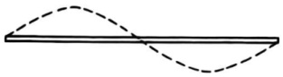{width=25%}

# Problem 9.16

(a) Calculate exactly the power radiated per unit solid angle and plot the angular distribution of radiation.

(b) Determine the total power radiated and find a numerical value for the radiation resistance.

9.17 Treat the linear antenna of Problem 9.16 by the multipole expansion method.

(a) Calculate the multipole moments (electric dipole, magnetic dipole, and electric quadrupole) exactly and in the long-wavelength approximation.

(b) Compare the shape of the angular distribution of radiated power for the lowest nonvanishing multipole with the exact distribution of Problem 9.16.

(c) Determine the total power radiated for the lowest multipole and the corresponding radiation resistance using both multipole moments from part a. Compare with Problem 9.16b. Is there a paradox here?

9.18 A qualitative understanding of the result for the reactance of a short antenna whose radiation fields are described by the electric dipole fields of Section 9.2 can be achieved by considering the idealized dipole fields (9.18).

(a) Show that the integral over all angles at fixed distance $r$ of $\epsilon_0|\mathbf{E}|^2 - \mu_0|\mathbf{H}|^2$ is

$$
\int \left[ \epsilon _ { 0 } \left| \mathbf { E } \right| ^{2} - \mu _ { 0 } \left| \mathbf { H } \right| ^{2} \right] d \Omega = \frac { 1 } { 2 \pi \epsilon _ { 0 } } \frac { \left| \mathbf { p } \right| ^{2} } { r ^{6} }
$$

(b) Using (6.140) for the reactance, show that the contribution $X_{a}$ to the reactance from fields at distances $r > a$ is

$$
X _ { a } = - \frac { \omega \left| \mathbf { p } \right| ^{2} } { 6 \pi \epsilon _ { 0 } \left| I _ { i } \right| ^{2} a ^{3} }
$$

where $I_{i}$ is the input current.

(c) For the short center-fed antenna of Section 9.2 show that $X_{a} \simeq - d^{2}/24\pi\epsilon_{0}\omega a^{3}$, corresponding to an effective capacitance $24\pi\epsilon_{0}a^{3}/d^{2}$. With $a = d/2$, $X_{a}$ gives only a small fraction of the total negative reactance of a short antenna. The fields close to the antenna, obviously not dipole in character, contribute heavily. For calculations of reactances of short antennas, see the book by Schelkunoff and Friis.

9.19 Consider the excitation of a waveguide in Problem 8.19 from the point of view of multipole moments of the source.

(a) For the linear probe antenna calculate the multipole moment components of $\mathbf{p}$, $\mathbf{m}$, $Q_{\alpha\beta}$, $Q_{\alpha\beta}^{M}$ that enter (9.69).

(b) Calculate the amplitudes for excitation of the TE$_{1,0}$ mode and evaluate the power flow. Compare the multipole expansion result with the answer given in Problem 8.19b. Discuss the reasons for agreement or disagreement. What about the comparison for excitation of other modes?

9.20 (a) Verify by direct calculation that the static tangential electric field (3.186) in a circular opening in a flat conducting plane, when inserted into the defining equation (9.72) for the electric dipole moment $\mathbf{p}_{\mathrm{eff}}$, leads to the expression (9.75).

(b) Determine the value of $i\mu\omega\mathbf{m}_{\mathrm{eff}}$ given by (9.72) with the static electric field in part a.

(c) Use the static normal magnetic field (5.132) for the corresponding magnetic boundary problem with a circular opening to compute via (9.74) the magnetic dipole moment $\mathbf{m}_{\mathrm{eff}}$ and compare with (9.75).

(d) Comment on the differences between the results of parts b and c and the use of the definitions (9.72) in a consistent fashion. [See Section 9 of the article, Diffraction Theory, by C. J. B. Bouwkamp in Reports on Progress in Physics, Vol. 17, ed. A. C. Strickland, The Physical Society, London (1954).]

9.21 The fields representing a transverse magnetic wave propagating in a cylindrical waveguide of radius $R$ are:

$$
\begin{array}{rl} { E _ { z } = J _ { m } ( \gamma r ) e ^{l m \delta} e ^{l \beta z - l \omega t} , } & { { }  H _ { z } = 0 } \\{ E _ { \phi } = \frac { - m \beta } { \gamma ^{2} } \frac { E _ { z } } { r } , } & { { }  H _ { r } = - \frac { k } { Z _ { 0 } \beta } \frac { E _ { \phi } } { E _ { \phi } } } \\{ E _ { r } = \frac { i \beta } { \gamma ^{2} } \frac { \partial E _ { z } } { \partial r } , } & { { }  H _ { \phi } = \frac { k } { Z _ { 0 } \beta } \frac { E _ { r } } { E _ { \phi } } } \end{array}
$$

where $m$ is the index specifying the angular dependence, $\beta$ is the propagation constant, $\gamma^2 = k^2 - \beta^2$ ($k = \omega/c$), where $\gamma$ is such that $J_m(\gamma R) = 0$. Calculate the ratio of the $z$ component of the electromagnetic angular momentum to the energy in the field. It may be advantageous to perform some integrations by parts, and to use the differential equation satisfied by $E_z$, to simplify your calculations.

9.22 A spherical hole of radius $a$ in a conducting medium can serve as an electromagnetic resonant cavity.

(a) Assuming infinite conductivity, determine the transcendental equations for the characteristic frequencies $\omega_{lm}$ of the cavity for TE and TM modes.

(b) Calculate numerical values for the wavelength $\lambda_{lm}$ in units of the radius $a$ for the four lowest modes for TE and TM waves.

(c) Calculate explicitly the electric and magnetic fields inside the cavity for the lowest TE and lowest TM mode.

9.23 The spherical resonant cavity of Problem 9.22 has nonpermeable walls of large, but finite, conductivity. In the approximation that the skin depth $\delta$ is small compared to the cavity radius $a$, show that the $Q$ of the cavity, defined by equation (8.86), is given by

$$
\begin{array}{rlr} { Q = \frac { a } { \delta } } & { { } } & { \mathrm { f o r ~ a l l ~ T E ~ m o d e s } } \\{ Q = \frac { a } { \delta } \left( 1 - \frac { l ( l + 1 ) } { x _ { l m } ^{2} } \right) } & { { } } & { \mathrm { f o r ~ T M ~ m o d e s } } \end{array}
$$

where $x_{lm} = (a/c)\omega_{lm}$ for TM modes.

9.24 Discuss the normal modes of oscillation of a perfectly conducting solid sphere of radius $a$ in free space. (This problem was solved by J. J. Thomson in the 1880s.)

(a) Determine the characteristic equations for the eigenfrequencies for TE and TM modes of oscillation. Show that the roots for $\omega$ always have a negative imaginary part, assuming a time dependence of $e^{-i\omega t}$.

(b) Calculate the eigenfrequencies for the $l=1$ and $l=2$ TE and TM modes. Tabulate the wavelength (defined in terms of the real part of the frequency) in units of the radius $a$ and the decay time (defined as the time taken for the energy to fall to $e^{-1}$ of its initial value) in units of the transit time ($a/c$) for each of the modes.

# CHAPTER 10

# Scattering and Diffraction

The closely related topics of scattering and diffraction are important in many branches of physics. Approaches differ depending on the relative length scales involved—the wavelength of the waves on the one hand, and the size of the target (scatterer or diffractor) on the other. When the wavelength of the radiation is large compared to the dimensions of the target, a simple description in terms of lowest order induced multipoles is appropriate. When the wavelength and size are comparable, a more systematic treatment with multipole fields is required. In the limit of very small wavelength compared to the size of the target, semi-geometric methods can be utilized to obtain the departures from geometrical optics. We begin with the long-wavelength limit of electromagnetic scattering, with some simple examples. Then we develop a perturbation approach to scattering by a medium with small variations in its dielectric properties in order to discuss Rayleigh scattering, the blue sky, and critical opalescence. To introduce the more systematic approach with multipole fields, we first present the multipole expansion of an electromagnetic plane wave and then apply it to the scattering by a conducting sphere.

Diffraction is treated next, first the scalar Huygens–Kirchhoff theory, then a vector generalization that leads naturally to a discussion of Babinet's principle of complementary screens. These tools are applied to diffraction by a circular aperture, with connection to the low-order effective multipoles of Section 9.5 in the long-wavelength limit. Scattering at very short wavelengths and the important optical theorem complete the chapter.

# 10.1 Scattering at Long Wavelengths

# A. Scattering by Dipoles Induced in Small Scatterers

The scattering of electromagnetic waves by systems whose individual dimensions are small compared with a wavelength is a common and important occurrence. In such interactions it is convenient to think of the incident (radiation) fields as inducing electric and magnetic multipoles that oscillate in definite phase relationship with the incident wave and radiate energy in directions other than the direction of incidence. The exact form of the angular distribution of radiated energy is governed by the coherent superposition of multipoles induced by the incident fields and in general depends on the state of polarization of the incident wave. If the wavelength of the radiation is long compared to the size of the scatterer, only the lowest multipoles, usually electric and magnetic dipoles, are important. Furthermore, in these circumstances the induced dipoles can be calculated from static or quasi-static boundary-value problems, just as for the small apertures of the preceding chapter (Section 9.5).

The customary basic situation is for a plane monochromatic wave to be incident on a scatterer. For simplicity the surrounding medium is taken to have $\mu_{r} = \epsilon_{r} = 1$. If the incident direction is defined by the unit vector $\mathbf{n}_{0}$, and the incident polarization vector is $\epsilon_{0}$, the incident fields are

$$
\begin{array}{r} { \mathbf { E } _ { \mathrm { i n c } } = \epsilon _ { 0 } E _ { 0 } e ^{i k \mathbf { n} _ { 0 } \cdot \mathbf { x } } } \\{ \mathbf { H } _ { \mathrm { i n c } } = \mathbf { n } _ { 0 } \times \mathbf { E } _ { \mathrm { i n c } } / Z _ { 0 } } \end{array}
$$

where $k=\omega/c$ and a time-dependence $e^{-i\omega t}$ is understood. These fields induce dipole moments $\mathbf{p}$ and $\mathbf{m}$ in the small scatterer and these dipoles radiate energy in all directions, as described earlier (Sections 9.2, 9.3). Far away from the scatterer, the scattered (radiated) fields are found from (9.19) and (9.36) to be

$$
\begin{array}{r} { \mathbf { E } _ { \mathrm { s c } } = \frac { 1 } { 4 \pi \epsilon _ { 0 } } \, k ^{2} \, \frac { e ^{i k r} } { r } \, [ ( \mathbf { n } \times \mathbf { p } ) \times \mathbf { n } - \mathbf { n } \times \mathbf { m } / c ] } \\{ \mathbf { H } _ { \mathrm { s c } } = \mathbf { n } \times \mathbf { E } _ { \mathrm { s c } } / Z _ { 0 } } \end{array}
$$

where $\mathbf{n}$ is a unit vector in the direction of observation and $r$ is the distance away from scatterer. The power radiated in the direction $\mathbf{n}$ with polarization $\epsilon$, per unit solid angle, per unit incident flux (power per unit area) in the direction $\mathbf{n}_0$ with polarization $\epsilon_0$, is a quantity with dimensions of area per unit solid angle. It is called the differential scattering cross section*:

$$
\frac { d \sigma } { d \Omega } \left( \mathbf { n } , \mathbf { \epsilon } ; \mathbf { n } _ { 0 } , \mathbf { \epsilon } _ { 0 } \right) = \frac { r ^{2} \, \frac { 1 } { 2 Z _ { 0 } } \left| \boldsymbol { \epsilon } ^{*} \cdot \mathbf { E } _ { \mathrm { s c } } \right| ^{2} } { \frac { 1 } { 2 Z _ { 0 } } \left| \boldsymbol { \epsilon } _ { 0 } ^{*} \cdot \mathbf { E } _ { \mathrm { i n c } } \right| ^{2} }
$$

The complex conjugation of the polarization vectors in (10.3) is important for the correct handling of circular polarization, as mentioned in Section 7.2. With (10.2) and (10.1), the differential cross section can be written

$$
\frac { d \sigma } { d \Omega } \left( \mathbf { n } , \, \boldsymbol { \epsilon } ; \, \mathbf { n } _ { 0 } , \, \boldsymbol { \epsilon } _ { 0 } \right) = \frac { k ^{4} } { \left( 4 \pi \epsilon _ { 0 } E _ { 0 } \right) ^{2} } \left| \boldsymbol { \epsilon } ^{*} \cdot \mathbf { p } + \left( \mathbf { n } \times \boldsymbol { \epsilon } ^{*} \right) \cdot \mathbf { m } / c \right| ^{2}
$$

The dependence of the cross section on $\mathbf{n}_{0}$ and $\boldsymbol{\epsilon}_{0}$ is implicitly contained in the dipole moments $\mathbf{p}$ and $\mathbf{m}$. The variation of the differential (and total) scattering cross section with wave number as $k^{4}$ (or in wavelength as $\lambda^{-4}$) is an almost universal characteristic of the scattering of long-wavelength radiation by any finite system. This dependence on frequency is known as Rayleigh's law. Only if both static dipole moments vanish does the scattering fail to obey Rayleigh's law; the scattering is then via quadrupole or higher multipoles (or frequency-dependent dipole moments) and varies as $\omega^{6}$ or higher. Sometimes the dipole scattering is known as Rayleigh scattering, but this term is usually reserved for the incoherent scattering by a collection of dipole scatterers.

# B. Scattering by a Small Dielectric Sphere

As a first, very simple example of dipole scattering we consider a small dielectric sphere of radius $a$ with $\mu_{r} = 1$ and a uniform isotropic dielectric constant

$\epsilon_{r}(\omega)$. From Section 4.4, in particular (4.56), the electric dipole moment is found to be

$$
\mathbf { p } = 4 \pi \epsilon _ { 0 } \bigg ( \frac { \epsilon _ { r } - 1 } { \epsilon _ { r } + 2 } \bigg ) a ^{3} \mathbf { E } _ { \mathrm { i n c } }
$$

There is no magnetic dipole moment. The differential scattering cross section is

$$
\frac { d \sigma } { d \Omega } = k ^{4} a ^{6} \left| \frac { \epsilon _ { r } - 1 } { \epsilon _ { r } + 2 } \right| ^{2} | \epsilon ^{*} \cdot \epsilon _ { 0 } | ^{2}
$$

The polarization dependence is typical of purely electric dipole scattering. The scattered radiation is linearly polarized in the plane defined by the dipole moment direction ($\epsilon_0$) and the unit vector $\mathbf{n}$.

Typically the incident radiation is unpolarized. It is then of interest to ask for the angular distribution of scattered radiation of a definite state of linear polarization. The cross section (10.6) is averaged over initial polarization $\epsilon_{0}$ for a fixed choice of $\epsilon$. Figure 10.1 shows a possible set of polarization vectors. The scattering plane is defined by the vectors $\mathbf{n}_{0}$ and $\mathbf{n}$. The polarization vectors $\epsilon_{0}^{(1)}$ and $\epsilon^{(1)}$ are in this plane, while $\epsilon_{0}^{(2)}=\epsilon^{(2)}$ is perpendicular to it. The differential cross sections for scattering with polarizations $\epsilon^{(1)}$ and $\epsilon^{(2)}$, averaged over initial polarizations, are easily shown to be

$$
\begin{array}{r} { \frac { d \sigma _ { \parallel } } { d \Omega } = \frac { k ^{4} a ^{6} } { 2 } \left| \frac { \epsilon _ { r } - 1 } { \epsilon _ { r } + 2 } \right| ^{2} \cos ^{2} \theta } \\{ \frac { d \sigma _ { \perp } } { d \Omega } = \frac { k ^{4} a ^{6} } { 2 } \left| \frac { \epsilon _ { r } - 1 } { \epsilon _ { r } + 2 } \right| ^{2} } \end{array}
$$

where the subscripts $\parallel$ and $\perp$ indicate polarization parallel to and perpendicular to the scattering plane, respectively. The polarization $\Pi(\theta)$ of the scattered radiation is defined by

$$
\Pi ( \theta ) = \frac { \frac { d \sigma _ { \perp } } { d \Omega } - \frac { d \sigma _ { \parallel } } { d \Omega } } { \frac { d \sigma _ { \perp } } { d \Omega } + \frac { d \sigma _ { \parallel } } { d \Omega } }
$$

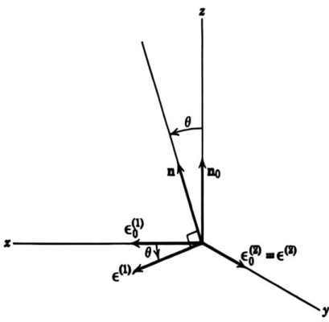{width=33%} Figure 10.1 Polarization and propagation vectors for the incident and scattered radiation.

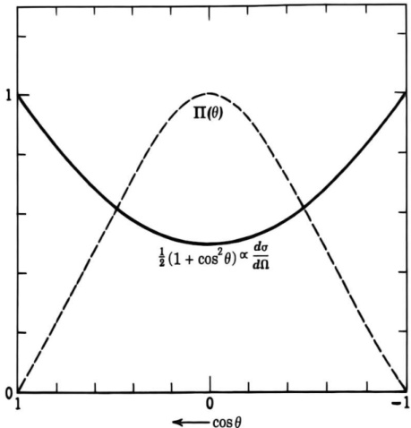{width=37%} Figure 10.2 Differential scattering cross section (10.10) and the polarization of scattered radiation (10.9) for a small dielectric sphere (dipole approximation).

From (10.7) we find for the (electric dipole) scattering by a small dielectric sphere,

$$
\Pi ( \theta ) = \frac { \sin ^{2} \theta } { 1 + \cos ^{2} \theta }
$$

The differential cross section, summed over scattered polarization, is

$$
\frac { d \sigma } { d \Omega } = k ^{4} a ^{6} \left| \frac { \epsilon _ { r } - 1 } { \epsilon _ { r } + 2 } \right| ^{2} \frac { 1 } { 2 } ( 1 + \cos ^{2} \theta )
$$

and the total scattering cross section is

$$
\sigma = \int \frac { d \sigma } { d \Omega } \, d \Omega = \frac { 8 \pi } { 3 } \, k ^{4} a ^{6} \, \left| \frac { \epsilon _ { r } - 1 } { \epsilon _ { r } + 2 } \right| ^{2}
$$

The differential cross section (10.10) and the polarization of the scattered radiation (10.9) are shown as functions of $\cos\theta$ in Fig. 10.2. The polarization $\Pi(\theta)$ has its maximum at $\theta=\pi/2$. At this angle the scattered radiation is 100% linearly polarized perpendicular to the scattering plane, and for an appreciable range of angles on either side of $\theta=\pi/2$ is quite significantly polarized. The polarization characteristics of the blue sky are an illustration of this phenomenon, and are, in fact, the motivation that led Rayleigh first to consider the problem. The reader can verify the general behavior on a sunny day with a sheet of linear polarizer or suitable sunglasses.

# C. Scattering by a Small Perfectly Conducting Sphere

An example with interesting aspects involving coherence between different multipoles is the scattering by a small perfectly conducting sphere of radius $a$. The electric dipole moment of such a sphere was shown in Section 2.5 to be

$$
\mathbf { p } = 4 \pi \epsilon _ { 0 } a ^{3} \mathbf { E } _ { \mathrm { i n c } }
$$

The sphere also possesses a magnetic dipole moment. For a perfectly conducting sphere the boundary condition on the magnetic field is that the normal component of $\mathbf{B}$ vanishes at $r=a$. Either by analogy with the dielectric sphere in a uniform electric field (Section 4.4) with $\epsilon=0$, or from the magnetically permeable sphere (Section 5.11) with $\mu=0$, or by a simple direct calculation, it is found that the magnetic moment of the small sphere is

$$
\mathbf { m } = - 2 \pi a ^{3} \mathbf { H } _ { \mathrm { i n c } }
$$

For a linearly polarized incident wave the two dipoles are at right angles to each other and to the incident direction.

The differential cross section (10.4) is

$$
\frac { d \sigma } { d \Omega } \left( \mathbf { n } , \, \boldsymbol { \epsilon } ; \, \mathbf { n } _ { 0 } , \, \boldsymbol { \epsilon } _ { 0 } \right) = k ^{4} a ^{6} \left| \boldsymbol { \epsilon } ^{*} \cdot \boldsymbol { \epsilon } _ { 0 } - \frac { 1 } { 2 } ( \mathbf { n } \times \boldsymbol { \epsilon } ^{*} ) \cdot \left( \mathbf { n } _ { 0 } \times \boldsymbol { \epsilon } _ { 0 } \right) \right| ^{2}
$$

The polarization properties and the angular distribution of scattered radiation are more complicated than for the dielectric sphere. The cross sections analogous to (10.7), for polarization of the scattered radiation parallel to and perpendicular to the plane of scattering, with unpolarized radiation incident, are

$$
\begin{array}{r} { \frac { d \sigma _ { \parallel } } { d \Omega } = \frac { k ^{4} a ^{6} } { 2 } | \cos \theta - \frac { 1 } { 2 } | ^{2} } \\{ \frac { d \sigma _ { \perp } } { d \Omega } = \frac { k ^{4} a ^{6} } { 2 } | 1 - \frac { 1 } { 2 } \cos \theta | ^{2} } \end{array}
$$

The differential cross section summed over both states of scattered polarization can be written

$$
\frac { d \sigma } { d \Omega } = k ^{4} a ^{6} [ \frac { 5 } { 8 } ( 1 + \cos ^{2} \theta ) - \cos \theta ]
$$

while the polarization (10.8) is

$$
\Pi ( \theta ) = \frac { 3 \sin ^{2} \theta } { 5 ( 1 + \cos ^{2} \theta ) - 8 \cos \theta }
$$

The cross section and polarization are plotted versus $\cos\theta$ in Fig. 10.3. The cross section has a strong backward peaking caused by electric dipole–magnetic dipole interference. The polarization reaches $\Pi=+1$ at $\theta=60^{\circ}$ and is positive through the whole angular range. The polarization thus tends to be similar to that for a small dielectric sphere, as shown in Fig. 10.2, even though the angular distributions are quite different. The total scattering cross section is $\sigma=10\pi k^{4}a^{6}/3$, of the same order of magnitude as for the dielectric sphere (10.11) if $(\epsilon_{r}-1)$ is not small.

Dipole scattering with its $\omega^{4}$ dependence on frequency can be viewed as the lowest order approximation in an expansion in $kd$, where $d$ is a length typical of the dimensions of the scatterer. In the domain $kd \sim 1$, more than the lowest order multipoles must be considered. Then the discussion is best accomplished by use of a systematic expansion in spherical multipole fields. In Section 10.4 the scattering by a conducting sphere is examined from this point of view. When $kd \gg 1$, approximation methods of a different sort can be employed, as is illustrated later in this chapter (Section 10.10). Whole books are devoted to the scattering.

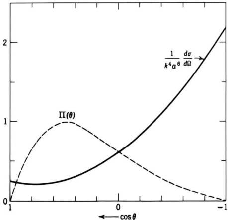{width=37%} Figure 10.3 Differential scattering cross section (10.16) and polarization of scattered radiation (10.17) for a small perfectly conducting sphere (electric and magnetic dipole approximation).

tering of light by spherical particles possessing arbitrary $\mu$, $\epsilon$, $\sigma$. Some references to this literature are given at the end of the chapter.

# D. Collection of Scatterers

As a final remark we note that if the scattering system consists of a number of small scatters with fixed spatial separations, each scatterer generates an amplitude of the form (10.2). The scattering cross section results from a coherent superposition of the individual amplitudes. Because the induced dipoles are proportional to the incident fields, evaluated at the position $\mathbf{x}_j$ of the $j$th scatterer, its moments will possess a phase factor, $e^{ik\mathbf{n}\cdot\mathbf{x}_j}$. Furthermore, if the observation point is far from the whole scattering system, (9.7) shows that the fields (10.2) for the $j$th scatterer will have a phase factor $e^{-ik\mathbf{n}\cdot\mathbf{x}_j}$. The generalization of (10.4) for such a system is

$$
\frac { d \sigma } { d \Omega } = \frac { k ^{4} } { ( 4 \pi \epsilon _ { 0 } E _ { 0 } ) ^{2} } \left| \sum _ { j } \left[ \mathbf { \epsilon } ^{*} \cdot \mathbf { p } _ { j } + ( \mathbf { n } \times \mathbf { \epsilon } ^{*} ) \cdot \mathbf { m } _ { j } / c \right] e ^{i \mathbf { q} \cdot \mathbf { x } _ { j } } \right| ^{2}
$$

where $\mathbf{q} = \mathbf{k}\mathbf{n}_0 - \mathbf{k}\mathbf{n}$ is the vectorial change in wave vector during the scattering.

The presence of the phase factors $e^{iq\cdot\mathbf{x}}$ in (10.18) means that, apart from the forward direction where $\mathbf{q}=0$, the scattering depends sensitively on the exact distribution of the scatterers in space. The general behavior can be illustrated by assuming that all the scatterers are identical. Then the cross section is the product of the cross section for one scatterer times a structure factor,*

$$
\mathcal { F } ( \mathbf { q } ) = \left| \sum _ { I } e ^{i \mathbf { q} \cdot \mathbf { x } _ { I } } \right| ^{2}
$$

*We do not consider here the effects of multiple scattering; that is, we assume that the mean free path for scattering is large compared to the dimensions of the scattering array.

Written out as a factor times its complex conjugate, $\mathcal{F}(\mathbf{q})$ is

$$
\mathcal { F } ( \mathbf { q } ) = \sum _ { J } \sum _ { J ^{\prime} } e ^{i \mathbf { q} \cdot ( \mathbf { x } _ { J } - \mathbf { x } _ { J ^{\prime} } ) }
$$

If the scatterers are randomly distributed, the terms with $j \neq j'$ can be shown to give a negligible contribution. Only the terms with $j = j'$ are significant. Then $\mathcal{F}(\mathbf{q}) = N$, the total number of scatterers, and the scattering is said to be an incoherent superposition of individual contributions. If, on the other hand, the scatterers are very numerous and have a regular distribution in space, the structure factor effectively vanishes everywhere except in the forward direction. There is therefore no scattering by a very large regular array of scatterers, of which single crystals of transparent solids like rock salt or quartz are examples. What small amount of scattering does occur is caused by thermal vibrations away from the perfect lattice, or by impurities, etc. An explicit illustration, also providing evidence for a restriction of the foregoing remarks to the long-wavelength regime, is that of a simple cubic array of scattering centers. The structure factor is well known to be

$$
\mathcal { F } ( \mathbf { q } ) = N ^{2} \left[ \frac { \sin ^{2} \left( \frac { N _ { 1 } q _ { 1 } a } { 2 } \right) } { N _ { 1 } ^{2} \sin ^{2} \left( \frac { q _ { 1 } a } { 2 } \right) } \cdot \frac { \sin ^{2} \left( \frac { N _ { 2 } q _ { 2 } a } { 2 } \right) } { N _ { 2 } ^{2} \sin ^{2} \left( \frac { q _ { 2 } a } { 2 } \right) } \cdot \frac { \sin ^{2} \left( \frac { N _ { 3 } q _ { 3 } a } { 2 } \right) } { N _ { 3 } ^{2} \sin ^{2} \left( \frac { q _ { 3 } a } { 2 } \right) } \right]
$$

where $a$ is the lattice spacing, $N_{1}$, $N_{2}$, $N_{3}$ are the numbers of lattice sites along the three axes of the array, $N = N_{1}N_{2}N_{3}$ is the total number of scatterers and $q_{1}$, $q_{2}$, $q_{3}$ are the components of $\mathbf{q}$ along the axes. At short wavelengths ($ka > \pi$), (10.20) has peaks when the Bragg scattering condition, $q_{i}a = 0$, $2\pi$, $4\pi$, $\ldots$, is obeyed. This is the situation familiar in x-ray diffraction. But at long wavelengths only the peak at $q_{i}a = 0$ is relevant because $(q_{i}a)_{\mathrm{max}} = 2ka \ll 1$. In this limit $\mathcal{F}(\mathbf{q})$ is the product of three factors of the form $[(\sin x_{i})/x_{i}]^{2}$ with $x_{i} = N_{i}q_{i}a/2$. The scattering is thus confined to the region $q_{i} \lesssim 2\pi/N_{i}a$, corresponding to angles smaller than $\lambda/L$, where $\lambda$ is the wavelength and $L$ a typical overall dimension of the scattering array.

# 10.2 Perturbation Theory of Scattering, Rayleigh's Explanation of the Blue Sky,* Scattering by Gases and Liquids, Attenuation in Optical Fibers

A. General Theory

If the medium through which an electromagnetic wave is passing is uniform in its properties, the wave propagates undisturbed and undeflected. If, however,

*Although Rayleigh's name should undoubtedly be associated with the quantitative explanation of the blue sky, it is of some historical interest that Leonardo da Vinci understood the basic phenomenon around 1500. In particular, his experiments with the scattering of sunlight by wood smoke observed against a dark background (quoted as items 300–302, pp. 237 ff, in Vol. I of Jean Paul Richter, The Literary Works of Leonardo da Vinci, 3rd edition, Phaidon, London 1970) (also a Dover reprint entitled The Notebooks of Leonardo da Vinci, Vol. 1, pp. 161 ff.) anticipate by 350 years Tyndall's remarkably similar observations [J. Tyndall, Philos. Trans. R. Soc. London 160, 333 (1870)].

there are spatial (or temporal) variations in the electromagnetic properties, the wave is scattered. Some of the energy is deviated from its original course. If the variations in the properties are small in magnitude, the scattering is slight and perturbative methods can be employed. We imagine a comparison situation corresponding to a uniform isotropic medium with electric permittivity $\epsilon_0$ and magnetic permeability $\mu_0$. For the present $\epsilon_0$ and $\mu_0$ are assumed independent of frequency, although when harmonic time dependence is assumed this restriction can be removed in the obvious way. Note that in this section $\epsilon_0$ and $\mu_0$ are not the free-space values! Through the action of some perturbing agent, the medium is supposed to have small changes in its response to applied fields, so that $\mathbf{D} \neq \epsilon_0\mathbf{E}$, $\mathbf{B} \neq \mu_0\mathbf{H}$, over certain regions of space. These departures may be functions of time and space variables. Beginning with the Maxwell equations in the absence of sources,

$$
\begin{array}{rl} { \nabla \cdot \mathbf { B } = 0 , } & { { }  \nabla \times \mathbf { E } = - { \frac { \partial \mathbf { B } } { \partial t } } } \\{ \nabla \cdot \mathbf { D } = 0 , } & { { }  \nabla \times \mathbf { H } = { \frac { \partial \mathbf { D } } { \partial t } } } \end{array}
$$

it is a straightforward matter to arrive at a wave equation for $\mathbf{D}$,

$$
\nabla ^{2} \mathbf { D } \ - \ \mu _ { 0 } \epsilon _ { 0 } \ { \frac { \partial ^{2} \mathbf { D } } { \partial t ^{2} } } = - \nabla \times \nabla \times \left( \mathbf { D } \ - \ \epsilon _ { 0 } \mathbf { E } \right) \ + \ \epsilon _ { 0 } { \frac { \partial } { \partial t } } \nabla \times \left( \mathbf { B } \ - \ \mu _ { 0 } \mathbf { H } \right)
$$

This equation is without approximation as yet, although later the right-hand side will be treated as small in some sense.*

If the right-hand side of (10.22) is taken as known, the equation is of the form of (6.32) with the retarded solution (6.47). In general, of course, the right-hand side is unknown and (6.47) must be regarded as an integral relation, rather than a solution. Nevertheless, such an integral formulation of the problem forms a fruitful starting point for approximations. It is convenient to specialize to harmonic time variation with frequency $\omega$ for the unperturbed fields and to assume that the departures ($\mathbf{D} - \epsilon_0\mathbf{E}$) and ($\mathbf{B} - \mu_0\mathbf{H}$) also have this time variation. This puts certain limitations on the kind of perturbed problem that can be described by the formalism, but prevents the discussion from becoming too involved. With a time dependence $e^{-i\omega t}$ understood, (10.22) becomes

$$
( \nabla ^{2} + k ^{2} ) \mathbf { D } = - \nabla \times \nabla \times ( \mathbf { D } - \boldsymbol { \epsilon } _ { 0 } \mathbf { E } ) - i \boldsymbol { \epsilon } _ { 0 } \boldsymbol { \omega } \, \nabla \times ( \mathbf { B } - \boldsymbol { \mu } _ { 0 } \mathbf { H } )
$$

where $k^{2}=\mu_{0}\epsilon_{0}\omega^{2}$, and $\mu_{0}$ and $\epsilon_{0}$ can be values specific to the frequency $\omega$. The solution of the unperturbed problem, with the right-hand side of (10.23) set equal to zero, will be denoted by $\mathbf{D}^{(0)}(\mathbf{x})$. A formal solution of (10.23) can be obtained from (6.45), if the right-hand side is taken as known. Thus

$$
\mathbf { D } = \mathbf { D } ^{( 0 )} + \frac { 1 } { 4 \pi } \int d ^{3} x ^{\prime} \frac { e ^{i k | \mathbf { x} - \mathbf { x } ^{\prime} | } } { | \mathbf { x } - \mathbf { x } ^{\prime} | } \left\{ \begin{array}{l} { \nabla ^{\prime} \times \nabla ^{\prime} \times ( \mathbf { D } - \epsilon _ { 0 } \mathbf { E } ) } \\{ + i \epsilon _ { 0 } \omega \, \nabla ^{\prime} \times ( \mathbf { B } - \mu _ { 0 } \mathbf { H } ) } \end{array} \right\}
$$

*If prescribed sources $\rho(\mathbf{x},t)$, $\mathbf{J}(\mathbf{x},t)$ are present, (10.22) is modified by the addition to the left-hand side of

$$
- \left[ \nabla \rho + \mu _ { 0 } \epsilon _ { 0 } \frac { \partial \mathbf { J } } { \partial t } \right]
$$

If the physical situation is one of scattering, with the integrand in (10.24) confined to some finite region of space and $\mathbf{D}^{(0)}$ describing a wave incident in some direction, the field far away from the scattering region can be written as

$$
\mathbf { D } \rightarrow \mathbf { D } ^{( 0 )} + \mathbf { A } _ { \mathrm { s c } } \frac { e ^{i k r} } { r }
$$

where the scattering amplitude $\mathbf{A}_{\mathrm{sc}}$ is

$$
\mathbf { A } _ { \mathrm { s c } } = \frac { 1 } { 4 \pi } \int d ^{3} x ^{\prime} \ e ^{- i \mathbf { k} \mathbf { n } \cdot \mathbf { x } ^{\prime} } \Bigg \{ \nabla ^{\prime} \times \nabla ^{\prime} \times ( \mathbf { D } - \boldsymbol { \epsilon } _ { 0 } \mathbf { E } ) \Bigg \} + i \boldsymbol { \epsilon } _ { 0 } \boldsymbol { \omega } \nabla ^{\prime} \times ( \mathbf { B } - \mu _ { 0 } \mathbf { H } ) \Bigg \}
$$

The steps from (10.24) to (10.26) are the same as from (9.3) to (9.8) for the radiation fields. Some integrations by parts in (10.26) allow the scattering amplitude to be expressed as

$$
\mathbf { A } _ { \mathrm { s c } } = \frac { k ^{2} } { 4 \pi } \int d ^{3} x \ e ^{- i k \mathbf { n} \cdot \mathbf { x } } \left\{ \frac { [ \mathbf { n } \times ( \mathbf { D } - \mathbf { \epsilon } _ { 0 } \mathbf { E } ) ] \times \mathbf { n } } { - \frac { \epsilon _ { 0 } \omega } { k } \mathbf { n } \times ( \mathbf { B } - \mathbf { \mu } _ { 0 } \mathbf { H } ) } \right\}
$$

The vectorial structure of the integrand can be compared with the scattered dipole field (10.2). The polarization dependence of the contribution from ($\mathbf{D} - \epsilon_0\mathbf{E}$) is that of an electric dipole, from ($\mathbf{B} - \mu_0\mathbf{H}$) a magnetic dipole. In correspondence with (10.4) the differential scattering cross section is

$$
\frac { d \sigma } { d \Omega } = \frac { | \pmb { \epsilon } ^{*} \cdot \mathbf { A } _ { \mathrm { s c } } | ^{2} } { | \mathbf { D } ^{( 0 )} | ^{2} }
$$

where $\epsilon$ is the polarization vector of the scattered radiation.

Equations (10.24), (10.27), and (10.28) provide a formal solution to the scattering problem posed at the beginning of the section. The scattering amplitude $\mathbf{A}_{\mathrm{sc}}$ is not known, of course, until the fields are known at least approximately. But from (10.24) a systematic scheme of successive approximations can be developed in the same way as the Born approximation series of quantum-mechanical scattering. If the integrand in (10.24) can be approximated to first order, then (10.24) provides a first approximation for $\mathbf{D}$, beyond $\mathbf{D}^{(0)}$. This approximation to $\mathbf{D}$ can be used to give a second approximation for the integrand, and an improved $\mathbf{D}$ can be determined, and so on. Questions of convergence of the series, etc. have been much studied in the quantum-mechanical context. The series is not very useful unless the first few iterations converge rapidly.

# B. Born Approximation

We will be content with the lowest order approximation for the scattering amplitude. This is called the first Born approximation or just the Born approximation in quantum theory and was actually developed in the present context by Lord Rayleigh in 1881. Furthermore, we shall restrict our discussion to the simple example of spatial variations in the linear response of the medium. Thus we assume that the connections between $\mathbf{D}$ and $\mathbf{E}$ and $\mathbf{B}$ and $\mathbf{H}$ are

$$
\begin{array}{r} { \mathbf { D } ( \mathbf { x } ) = [ \epsilon _ { 0 } + \delta \epsilon ( \mathbf { x } ) ] \mathbf { E } ( \mathbf { x } ) } \\{ \mathbf { B } ( \mathbf { x } ) = [ \mu _ { 0 } + \delta \mu ( \mathbf { x } ) ] \mathbf { H } ( \mathbf { x } ) } \end{array}
$$

where $\delta\epsilon(\mathbf{x})$ and $\delta\mu(\mathbf{x})$ are small in magnitude compared with $\epsilon_0$ and $\mu_0$. The differences appearing in (10.24) and (10.27) are proportional to $\delta\epsilon$ and $\delta\mu$. To

lowest order then, the fields in these differences can be approximated by the unperturbed fields:

$$
\begin{array}{rl} { \mathbf { D } } & { { } - \boldsymbol { \epsilon } _ { 0 } \mathbf { E } \simeq \frac { \delta \boldsymbol { \epsilon } ( \mathbf { x } ) } { \epsilon _ { 0 } } \mathbf { D } ^{( 0 )} ( \mathbf { x } ) } \\{ \mathbf { B } } & { { } - \boldsymbol { \mu } _ { 0 } \mathbf { H } \simeq \frac { \delta \boldsymbol { \mu } ( \mathbf { x } ) } { \mu _ { 0 } } \mathbf { B } ^{( 0 )} ( \mathbf { x } ) } \end{array}
$$

If the unperturbed fields are those of a plane wave propagating in a direction $\mathbf{n}_{0}$, so that $\mathbf{D}^{(0)}$ and $\mathbf{B}^{(0)}$ are

$$
\begin{array}{rl} { \mathbf { D } ^{( 0 )} ( \mathbf { x } ) = \epsilon _ { 0 } D _ { 0 } e ^{i k \mathbf { n} _ { 0 } \cdot \mathbf { x } } } \\{ \mathbf { B } ^{( 0 )} ( \mathbf { x } ) = \sqrt { \frac { \mu _ { 0 } } { \epsilon _ { 0 } } } \, \mathbf { n } _ { 0 } \times \mathbf { D } ^{( 0 )} ( \mathbf { x } ) } \end{array}
$$

the scalar product of the scattering amplitude (10.27) and $\epsilon^{*}$, divided by $D_{0}$, is

$$
\frac { \boldsymbol { \epsilon } ^{*} \cdot \mathbf { A } _ { \mathrm { s c } } ^{( 1 )} } { D _ { 0 } } = \frac { k ^{2} } { 4 \pi } \int d ^{3} x \ e ^{i \mathbf { q} \cdot \mathbf { x } } \left\{ \begin{array}{l} { { \boldsymbol { \epsilon } ^{*} \cdot \boldsymbol { \epsilon } _ { 0 } \ \frac { \delta \boldsymbol { \epsilon } ( \mathbf { x } ) } { \epsilon _ { 0 } } } } \\{ { + \left( \mathbf { n } \times \boldsymbol { \epsilon } ^{*} \right) \cdot \left( \mathbf { n } _ { 0 } \times \boldsymbol { \epsilon } _ { 0 } \right) \ \frac { \delta \boldsymbol { \mu } ( \mathbf { x } ) } { \mu _ { 0 } } } } \end{array} \right\}
$$

where $\mathbf{q} = k(\mathbf{n}_0 - \mathbf{n})$ is the difference of the incident and scattered wave vectors. The absolute square of (10.31) gives the differential scattering cross section (10.28).

If the wavelength is large compared with the spatial extent of $\delta\epsilon$ and $\delta\mu$, the exponential in (10.31) can be set equal to unity. The amplitude is then a dipole approximation analogous to the preceding section, with the dipole frequency dependence and angular distribution. To establish contact with the results already obtained, suppose that the scattering region is a uniform dielectric sphere of radius $a$ in vacuum. Then $\delta\epsilon$ is constant inside a spherical volume of radius $a$ and vanishes outside. The integral in (10.31) can be performed for arbitrary $|\mathbf{q}|$, with the result,

$$
\frac { \boldsymbol { \epsilon } ^{*} \cdot \mathbf { A } _ { \mathrm { s c } } } { D _ { 0 } } = k ^{2} \frac { \delta \boldsymbol { \epsilon } } { \epsilon _ { 0 } } \left( \boldsymbol { \epsilon } ^{*} \cdot \boldsymbol { \epsilon } _ { 0 } \right) \bigg [ \frac { \sin q a - q a \cos q a } { q ^{3} } \bigg ]
$$

In the limit $q \rightarrow 0$ the square bracket approaches $a^{3}/3$. Thus, at very low frequencies or in the forward direction at all frequencies, the Born approximation to the differential cross section for scattering by a dielectric sphere of radius $a$ is

$$
\operatorname* { l i m } _ { q \to 0 } \left( \frac { d \sigma } { d \Omega } \right) _ { \mathrm { B o r n } } = k ^{4} a ^{6} \left| \frac { \delta \epsilon } { 3 \epsilon _ { 0 } } \right| ^{2} | \epsilon ^{*} \cdot \epsilon _ { 0 } | ^{2}
$$

Comparison with (10.6) shows that the Born approximation and the exact low frequency result have the expected relationship.

# C. Blue Sky: Elementary Argument

The scattering of light by gases, first treated quantitatively by Lord Rayleigh in his celebrated work on the sunset and blue sky,* can be discussed in the present

framework. Since the magnetic moments of most gas molecules are negligible compared to the electric dipole moments, the scattering is purely electric dipole in character. In the preceding section we discussed the angular distribution and polarization of the individual scatterings (see Fig. 10.2). We therefore confine our attention to the total scattering cross section and the attenuation of the incident beam. The treatment is in two parts. The first, elementary argument is adequate for a dilute ideal gas, where the molecules are truly randomly distributed in space relative to each other. The second, based on density fluctuations in the gas, is of more general validity. We now identify $\epsilon_0$ with the electric permittivity of free space.

If the individual molecules, located at $\mathbf{x}_j$, are assumed to possess dipole moments $\mathbf{p}_j = \epsilon_0 \gamma_{\text{mol}} \mathbf{E}(\mathbf{x}_j)$, the effective variation in dielectric constant $\delta \epsilon(\mathbf{x})$ in (10.31) can be written as

$$
\delta \epsilon ( \mathbf { x } ) = \epsilon _ { 0 } \sum _ { j } \gamma _ { \mathrm { m o l } } \ \delta ( \mathbf { x } - \mathbf { x } _ { j } )
$$

The differential scattering cross section obtained from (10.31) and (10.28) is

$$
\frac { d \sigma } { d \Omega } = \frac { k ^{4} } { 16 \pi ^{2} } \left| \gamma _ { \mathrm { m o l } } \right| ^{2} \left| \boldsymbol { \epsilon } ^{*} \cdot \boldsymbol { \epsilon } _ { 0 } \right| ^{2} \mathcal { F } ( \mathbf { q } )
$$

where $\mathcal{F}(\mathbf{q})$ is given by (10.19). For a random distribution of scattering centers the structure factor reduces to an incoherent sum, and the cross section is just that for one molecule, times the number of molecules. For a dilute gas the molecular polarizability is related to the dielectric constant by $\epsilon_{r} \simeq 1 + N\gamma_{\mathrm{mol}}$, where $N$ is the number of molecules per unit volume. The total scattering cross section per molecule of the gas is thus

$$
\sigma \simeq \frac { k ^{4} } { 6 \pi N ^{2} } \left| \epsilon _ { r } - 1 \right| ^{2} \simeq \frac { 2 k ^{4} } { 3 \pi N ^{2} } \left| n - 1 \right| ^{2}
$$

where the last form is written in terms of the index of refraction $n$, assuming $|n-1| \ll 1$. The cross section (10.34) represents the power scattered per molecule for a unit incident energy flux. In traversing a thickness $dx$ of the gas, the fractional loss of flux is $N\sigma\,dx$. The incident beam thus has an intensity $I(x) = I_0e^{-\alpha x}$, where $\alpha$ is the absorption or attenuation coefficient (also called the extinction coefficient) of (7.53) and is given by

$$
\alpha = N \sigma \simeq \frac { 2 k ^{4} } { 3 \pi N } | n - 1 | ^{2}
$$

These results, (10.34) and (10.35), describe what is known as Rayleigh scattering, the incoherent scattering by gas molecules or other randomly distributed dipole scatterers, each scattering according to Rayleigh's $\omega^{4}$ law.

Rayleigh's derivation of (10.35) was in the context of scattering of light by the atmosphere. Evidently the $k^{4}$ dependence means that in the visible spectrum the red is scattered least and the violet most. Light received away from the direction of the incident beam is more heavily weighted in high-frequency (blue) components than the spectral distribution of the incident beam, while the transmitted beam becomes increasingly red in its spectral composition, as well as diminishing in overall intensity. The blueness of the sky, the redness of the sunset, the waningness of the winter sun, and the ease of sunburning at midday in summer

are all consequences of Rayleigh scattering in the atmosphere. The index of refraction of air in the visible region (4100–6500 Å) and at NTP is ($n-1$) ≃ 2.78 × $10^{-4}$. With $N=2.69 \times 10^{19}$ molecules/cm$^{3}$, typical values of the attenuation length $\Lambda=\alpha^{-1}$ are $\Lambda=30, 77, 188$ km for violet (4100 Å), green (5200 Å), and red (6500 Å) light, respectively. With an isothermal model of the atmosphere in which the density varies exponentially with height, the following intensities at the earth's surface relative to those incident on the top of the atmosphere at each wavelength can be estimated for the sun at zenith and sunrise-sunset:

| Color | Zenith | Sunrise-Sunset |
| --- | --- | --- |
| Red (6500 Å) | 0.96 | 0.21 |
| Green (5200 Å) | 0.90 | 0.024 |
| Violet (4100 Å) | 0.76 | 0.000065 |

These numbers show strikingly the shift to the red of the surviving sunlight at sunrise and sunset.

The actual situation is illustrated in Fig. 10.4. The curve $A$ shows the power spectrum of solar radiation incident on the earth from outside as a function of photon energy. Curve $B$ is a typical spectrum at sea level with the sun directly

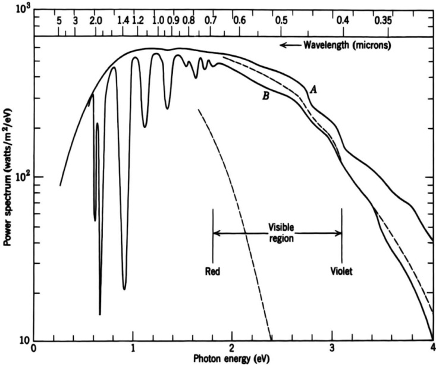{width=59%} Figure 10.4 Power spectrum of solar radiation (in watts per square meter per electron volt) as a function of photon energy (in electron volts). Curve $A$ is the incident spectrum above the atmosphere. Curve $B$ is a typical sea-level spectrum with the sun at the zenith. The absorption bands below 2 eV are chiefly from water vapor and vary from site to site and day to day. The dashed curves give the expected sea-level spectrum at zenith-and at sunrise-sunset if the only attenuation is from Rayleigh scattering by a dry, clean atmosphere.

overhead.* The upper dashed curve is the result expected from curve $A$ if the only attenuation is Rayleigh scattering by a dry, clean, isothermal, exponential atmosphere. In reality the attenuation is greater, mainly because of the presence of water vapor, which has strong absorption bands in the infrared, and ozone, which causes absorption of the ultraviolet, as well as other molecular species and dust. The lower dashed curve indicates roughly the sunrise-sunset spectrum at sea level. Astronauts orbiting the earth see even redder sunsets because the atmospheric path length is doubled.

Detailed observations on the polarization of the scattered light from the sky have been reported.¹ Just as with the attenuation, the reality departs somewhat from the ideal of a dry, clean atmosphere of low density. At 90° the polarization is a function of wavelength and reaches a maximum of approximately 75% at 5500 Å. It is estimated to be less than 100% because of multiple scattering (6%), molecular anisotropy (6%), ground reflection (5%, and especially important in the green when green vegetation is present), and aerosols (8%).

The formula (10.35) for the extinction coefficient is remarkable in its possession of the factor $N^{-1}$ as well as macroscopic quantities such as the index of refraction. If there were no atomicity ($N \rightarrow \infty$), there would be no attenuation. Conversely, the observed attenuation can be used to determine $N$. This point was urged particularly on Rayleigh by Maxwell in private correspondence. If the properties of the atmosphere are assumed to be well enough known, the relative intensity of the light from a definite star as a function of altitude can be used to determine $N$. Early estimates were made in this way and agree with the results of more conventional methods.

# D. Density Fluctuations; Critical Opalescence

An alternative and more general approach to the scattering and attenuation of light in gases and liquids is to consider fluctuations in the density and so the index of refraction. The volume $V$ of fluid is imagined to be divided into cells small compared to a wavelength, but each containing very many molecules. Each cell has volume $v$ with an average number $N_v = vN$ of molecules inside. The actual number of molecules fluctuates around $N_v$ in a manner that depends on the properties of the gas or liquid. Let the departure from the mean of the number of molecules in the $j$th cell be $\Delta N_j$. The variation in index of refraction $\delta\epsilon$ for the $j$th cell is

$$
\delta \epsilon _ { j } = \frac { \partial \epsilon } { \partial N } \cdot \frac { \Delta N _ { j } } { v }
$$

From the Clausius-Mossotti relation (4.70), this can be written

$$
\delta \epsilon _ { j } = \frac { ( \epsilon _ { r } - 1 ) ( \epsilon _ { r } + 2 ) } { 3 N v } \Delta N _ { j }
$$

With this expression for $\delta e$ for the $j$th cell, the integral (10.31), now a sum over cells, becomes

$$
\frac { \epsilon ^{*} \cdot \mathbf { A } _ { s c } ^{( 1 )} } { D _ { 0 } } = \epsilon ^{*} \cdot \epsilon _ { 0 } \frac { k ^{2} ( \epsilon _ { r } - 1 ) ( \epsilon _ { r } + 2 ) } { 12 \pi N \epsilon _ { r } } \sum _ { j } \Delta N _ { j } e ^{i \mathbf { q} \cdot \mathbf { x } _ { j } }
$$

In forming the absolute square of (10.37) a structure factor similar to (10.19) will occur. If it is assumed that the correlation of fluctuations in different cells (caused indirectly by the intermolecular forces) only extends over a distance small compared to a wavelength, the exponential in (10.37) can be put equal to unity. Then the extinction coefficient $\alpha$, given by

$$
\alpha = \frac { 1 } { V } \int \left| \frac { \epsilon ^{*} \cdot \mathbf { A } _ { \mathbf { k } } ^{( 1 )} } { D _ { 0 } } \right| ^{2} d \Omega
$$

is

$$
\alpha = \frac { ( \omega / c ) ^{4} } { 6 \pi N } \left| \frac { ( \epsilon _ { r } - 1 ) ( \epsilon _ { r } + 2 ) } { 3 } \right| ^{2} \cdot \frac { \Delta N _ { V } ^{2} } { N V }
$$

where $\Delta N_{V}^{2}$ is the mean square number fluctuation in the volume $V$, defined by

$$
\Delta N _ { V } ^{2} = \sum _ { f f } \Delta N _ { J } \Delta N _ { r }
$$

the sum being over all the cells in the volume $V$. With the use of statistical mechanics* the quantity $\Delta N_{V}^{2}$ can be expressed in terms of the isothermal compressibility $\beta_{T}$ of the medium:

$$
\frac { \Delta N _ { V } ^{2} } { N V } = N k T \beta _ { T } ,  \beta _ { T } = - \frac { 1 } { V } \left( \frac { \partial V } { \partial P } \right) _ { T }
$$

The attenuation coefficient (10.38) then becomes

$$
\alpha = \frac { 1 } { 6 \pi N } \left( \frac { \omega } { c } \right) ^{4} \left| \frac { ( \epsilon _ { r } - 1 ) ( \epsilon _ { r } + 2 ) } { 3 } \right| ^{2} \cdot N k T \beta _ { T }
$$

This particular expression, first obtained by Einstein in 1910, is called the Einstein-Smoluchowski formula. For a dilute ideal gas, with $|\epsilon - 1| \ll 1$ and $NkT\beta_T = 1$, it reduces to the Rayleigh result (10.35). As the critical point is approached, $\beta_T$ becomes very large (infinite exactly at the critical point). The scattering and attenuation thus become large there. This is the phenomenon known as critical opalescence. The large scattering is directly related to the large fluctuations in density near the critical point, as stressed originally by Smoluchowski (1904). Very near the critical point our treatment so far fails because the correlation length for the density fluctuations becomes greater than a wavelength, as first pointed out by Ornstein and Zernicke (1914).

For large correlation length $\Lambda$ we must retain the exponential phase factors in (10.37). The absolute square of the scattering amplitude then involves a double sum of $\Delta N_{i}N_{j}e^{i\mathbf{q}^{i\cdot(\mathbf{x}_{i}-\mathbf{x})}}$, which can be expressed as a Fourier transform of the density correlation function. Because there is now additional angular dependence from $\mathbf{q}$, the angular distribution is no longer the simple dipole form. If a corre

lation function of Yukawa form $e^{-r/\lambda}/r$ is assumed, it can be shown that the differential attenuation coefficient for unpolarized incident radiation takes the form

$$
\frac { d \alpha ( \theta ) } { d \Omega } = \frac { 3 } { 16 \pi } \left( 1 + \cos ^{2} \theta \right) \alpha \Bigg [ \frac { 1 + \Lambda ^{2} q ^{2} / N k T \beta _ { T } } { 1 + \Lambda ^{2} q ^{2} } \Bigg ]
$$

where $q^{2}=2(\omega/c)^{2}(1-\cos\theta)$ and $\alpha$ is given by (10.40). For $\Lambda q\ll1$, integration over the normalized angular distribution gives back (10.40), but for $\Lambda\to\infty$, the angular integration yields attenuation proportional to $(c/\Lambda\omega)^{2}\ln(\Lambda\omega/c)$ times (10.40). The frequency dependence as $\omega^{4}$ away from the critical point is altered to roughly $\omega^{2}$; the scattered light appears "whiter" close to the critical point.

We note that, while our expressions diverge exactly at the critical point and therefore are unphysical, a better treatment yields large but finite attenuation. One consideration is that the correlation length $\Lambda$ cannot become larger than the dimensions of the fluid container.

References to the early literature can be found in Fabelinskii, who discusses the application of light scattering to critical point phenomena and second-order phase transitions. For treatments of the radial density correlation function, see Rosenfeld (Chapter V, Section 6), or Landau and Lifshitz (op. cit.).

# E. Attenuation in Optical Fibers

It is of interest that the ultimate limiting factor setting the maximum distance between repeater units in optical fiber transmission is the unavoidable attenua

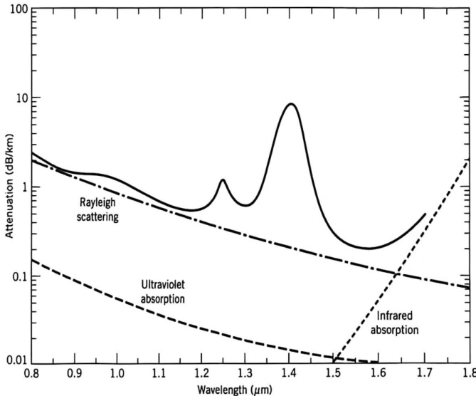{width=54%} Figure 10.5 Attenuation versus wavelength for a typical low-loss, single-mode silica optical fiber (schematic). Rayleigh scattering sets the lower limit until infrared absorption rises above $1.6\ \mu$m. The peaks in the observed attenuation are caused by water (OH ions) dissolved in the glass.

tion caused by Rayleigh scattering, and by infrared absorption at longer wavelengths. The isothermal compressibility of silica glass is $\beta_{T} \approx 7 \times 10^{-11} \, \text{m}^{2} / \text{N}$, while the relevant temperature $T = 1400 \, \text{K}$ (called the fictive temperature) is where the fluctuations are frozen in (approximately the annealing temperature). The effective value of $(\epsilon_{r} - 1)(\epsilon_{r} + 2)/3 \approx 1.30$ in (10.40) is somewhat smaller than the 1.51 inferred from an index of refraction of $n = 1.45$ at $\lambda = 1.0 \, \mu\text{m}$. The net result is that $\alpha \, (\text{km}^{-1}) \approx 0.2/[\lambda \, (\mu\text{m})]^{4}$. The conversion to decibels per kilometer (a factor of 4.343) gives $\alpha \, (\text{dB/km}) \approx 0.85/[\lambda \, (\mu\text{m})]^{4}$, shown as the dash-dotted curve in Fig. 10.5, which displays a schematic representation of typical data for a low-loss, single-mode optical fiber. For wavelengths less than 1.5 $\mu\text{m}$, the attenuation is dominated by Rayleigh scattering, plus the absorption by impurities such as the hydroxyl ions from very small amounts of water dissolved in the glass. At wavelengths longer than 1.6 $\mu\text{m}$, infrared absorption sets in strongly. The minimum attenuation of about 0.2 dB/km occurs at $\lambda \approx 1.55 \, \mu\text{m}$. The absorption mean free path at the minimum is 22 km.

# 10.3 Spherical Wave Expansion of a Vector Plane Wave

In discussing the scattering or absorption of electromagnetic radiation by spherical objects, or localized systems in general, it is useful to have an expansion of a plane electromagnetic wave in spherical waves.

For a scalar field $\psi(\mathbf{x})$ satisfying the wave equation, the necessary expansion can be obtained by using the orthogonality properties of the basic spherical solutions $j_{l}(kr)Y_{lm}(\theta,\phi)$. An alternative derivation makes use of the spherical wave expansion (9.98) of the Green function ($e^{ikr}/4\pi R$). We let $|\mathbf{x}'|\to\infty$ on both sides of (9.98). Then we can put $|\mathbf{x}-\mathbf{x}'|=r'=-\mathbf{n}\cdot\mathbf{x}$ on the left-hand side, where $\mathbf{n}$ is a unit vector in the direction of $\mathbf{x}'$. On the right side $r_{>}=r'$ and $r_{<}=r$. Furthermore we can use the asymptotic form (9.89) for $h_{l}^{(1)}(kr')$. Then we find

$$
\frac { e ^{i k r ^ { \prime} } } { 4 \pi r ^{\prime} } \; e ^{- i \mathbf { k} \cdot \mathbf { n } \cdot \mathbf { x } } = i k \frac { e ^{i k r ^ { \prime} } } { k r ^{\prime} } \sum _ { l , m } ( - i ) ^{l + 1} j _ { l } ( k r ) Y _ { l m } ^{*} ( \theta ^{\prime} , \; \phi ^{\prime} ) Y _ { l m } ( \theta , \; \phi )
$$

Canceling the factor $e^{ikr}/r'$ on either side and taking the complex conjugate, we have the expansion of a plane wave

$$
e ^{i k \cdot \mathbf { x} } = 4 \pi \sum _ { l = 0 } ^{\infty} i _ { l } ^{j} ( k r ) \sum _ { m = - l } ^{l} Y _ { l m } ^{*} ( \theta , \phi ) Y _ { l m } ( \theta ^{\prime} , \phi ^{\prime} )
$$

where $\mathbf{k}$ is the wave vector with spherical coordinates $k$, $\theta'$, $\phi'$. The addition theorem (3.62) can be used to put this in a more compact form

$$
e ^{i { \bf k} \cdot { \bf x } } = \sum _ { l = 0 } ^{\infty} i ^{l} ( 2 l + 1 ) j _ { l } ( k r ) P _ { l } ( \cos \gamma )
$$

where $\gamma$ is the angle between $\mathbf{k}$ and $\mathbf{x}$. With (3.57) for $P_{l} \cos(\gamma)$, this can also be written as

$$
e ^{i \mathbf { k} \cdot \mathbf { x } } = \sum _ { l = 0 } ^{\infty} i ^{l} \sqrt { 4 \pi ( 2 l + 1 ) } \; j _ { l } ( k r ) Y _ { l , 0 } ( \gamma )
$$

We now wish to make an equivalent expansion for a circularly polarized plane wave with helicity ± incident along the z axis,

$$
\begin{array}{r} { \mathbf { E } ( \mathbf { x } ) = ( \epsilon _ { 1 } \pm i \epsilon _ { 2 } ) e ^{i k z} } \\{ c \mathbf { B } ( \mathbf { x } ) = \epsilon _ { 3 } \times \mathbf { E } = \mp i \mathbf { E } } \end{array}
$$

Since the plane wave is finite everywhere, we can write its multipole expansion (9.122) involving only the regular radial functions $j_{l}(kr)$:

$$
\begin{array}{r} { \mathbf { E } ( \mathbf { x } ) = \sum _ { l , m } \left[ a _ { \pm } ( l , m ) j _ { l } ( k r ) \mathbf { X } _ { l m } + \frac { i } { k } \, b _ { \pm } ( l , m ) \nabla \times j _ { l } ( k r ) \mathbf { X } _ { l m } \right] } \\{ c \mathbf { B } ( \mathbf { x } ) = \sum _ { l , m } \left[ \frac { - i } { k } \, a _ { \pm } ( l , m ) \nabla \times j _ { l } ( k r ) \mathbf { X } _ { l m } + b _ { \pm } ( l , m ) j _ { l } ( k r ) \mathbf { X } _ { l m } \right] } \end{array}
$$

To determine the coefficients $a_{\pm}(l,m)$ and $b_{\pm}(l,m)$ we utilize the orthogonality properties of the vector spherical harmonics $\mathbf{X}_{lm}$. For reference purposes we summarize the basic relation (9.120), as well as some other useful relations:

$$
\begin{aligned}&\int\:[f_{l}(r)\mathbf{X}_{l^{\prime}m^{\prime}}]^{*}\cdot[g_{l}(r)\mathbf{X}_{lm}]\:d\Omega=f_{l}^{*}g_{l}\:\delta_{lr}\delta_{mm^{\prime}}\\&\int\:[f_{l}(r)\mathbf{X}_{l^{\prime}m^{\prime}}]^{*}\cdot[\nabla\times g_{l}(r)\mathbf{X}_{lm}]\:d\Omega\:=\:0\\&\frac{1}{k^{2}}\int\:[\nabla\times f_{l}(r)\mathbf{X}_{l^{\prime}m^{\prime}}]^{*}\cdot[\nabla\times g_{l}(r)\mathbf{X}_{lm}]\:d\Omega\\&=\delta_{ll^{\prime}}\delta_{mm^{\prime}}\biggl\{f_{l}^{*}g_{l}+\frac{1}{k^{2}r^{2}}\frac{\partial}{\partial r}\biggl[rf_{l}^{*}\frac{\partial}{\partial r}(rg_{l})\biggr]\biggr\}\end{aligned}
$$

In these relations $f_{l}(r)$ and $g_{l}(r)$ are linear combinations of spherical Bessel functions, satisfying (9.81). The second and third relations can be proved using the operator identity (9.125), the representation

$$
\nabla = { \frac { \mathbf { r } } { r } } { \frac { \partial } { \partial r } } - { \frac { i } { r ^{2} } } \mathbf { r } \times \mathbf { L }
$$

for the gradient operator, and the radial differential equation (9.81).

To determine the coefficients $a_{\pm}(l,m)$ and $b_{\pm}(l,m)$ we take the scalar product of both sides of (10.47) with $\mathbf{X}_{lm}^{*}$ and integrate over angles. Then with the first and second orthogonality relations in (10.48) we obtain

$$
a _ { \pm } ( l , m ) j _ { l } ( k r ) = \int \mathbf { X } _ { l m } ^{*} \cdot \mathbf { E } ( \mathbf { x } ) \ d \Omega
$$

and

$$
b _ { \pm } ( l , m ) j _ { l } ( k r ) = c \int \mathbf { X } _ { l m } ^{*} \cdot \mathbf { B } ( \mathbf { x } ) \ d \Omega
$$

With (10.46) for the electric field, (10.49) becomes

$$
a _ { \pm } ( l , m ) j _ { l } ( k r ) = \int \frac { ( L _ { z } Y _ { l m } ) ^{*} } { \sqrt { l ( l + 1 ) } } \, e ^{i k z} \, d \Omega
$$

where the operators $L_{\pm}$ are defined by (9.102), and the results of their operating by (9.104). Thus we obtain

$$
a _ { \pm } ( l , m ) j _ { l } ( k r ) = \frac { \sqrt { ( l \pm m ) ( l \mp m + 1 ) } } { \sqrt { l ( l + 1 ) } } \int Y _ { l , m = 1 } ^{*} e ^{i k z} \ d \Omega
$$

If expansion (10.45) for $e^{ikz}$ is inserted, the orthogonality of the $Y_{lm}$'s evidently leads to the result,

$$
a _ { \pm } ( l , m ) = i ^{\prime} \sqrt { 4 \pi ( 2 l + 1 ) } \ \delta _ { m , \pm 1 }
$$

From (10.50) and (10.46) it is clear that

$$
b _ { \pm } ( l , m ) = \mp i a _ { \pm } ( l , m )
$$

Then the multipole expansion of the plane wave (10.46) is

$$
\begin{array}{r} { \mathbf { E } ( \mathbf { x } ) = \sum _ { l = 1 } ^{\infty} i ^{l} \sqrt { 4 \pi ( 2 l + 1 ) } \left[ j _ { l } ( k r ) \mathbf { X } _ { l , \pm 1 } \pm \frac { 1 } { k } \nabla \times j _ { l } ( k r ) \mathbf { X } _ { l , \pm 1 } \right] } \\{ c \mathbf { B } ( \mathbf { x } ) = \sum _ { l = 1 } ^{\infty} i ^{l} \sqrt { 4 \pi ( 2 l + 1 ) } \left[ \frac { - i } { k } \nabla \times j _ { l } ( k r ) \mathbf { X } _ { l , \pm 1 } \mp i j _ { l } ( k r ) \mathbf { X } _ { l , \pm 1 } \right] } \end{array}
$$

For such a circularly polarized wave the $m$ values of $m = \pm 1$ have the obvious interpretation of $\pm 1$ unit of angular momentum per photon parallel to the propagation direction. This was established in Problems 7.28 and 7.29.

# 10.4 Scattering of Electromagnetic Waves by a Sphere

If a plane wave of electromagnetic radiation is incident on a spherical obstacle, as indicated schematically in Fig. 10.6, it is scattered, so that far away from the scatterer the fields are represented by a plane wave plus outgoing spherical waves. There may be absorption by the obstacle as well as scattering. Then the total energy flow away from the obstacle will be less than the total energy flow towards it, the difference being absorbed. We will ultimately consider the simple example of scattering by a sphere of radius $a$ and infinite conductivity, but will for a time keep the problem more general.

The fields outside the sphere can be written as a sum of incident and scattered waves:

$$
\left. \begin{array}{l} { { \mathbf { E } ( \mathbf { x } ) = \mathbf { E } _ { \mathrm { i n c } } + \mathbf { E } _ { \mathrm { s c } } } } \\{ { \mathbf { B } ( \mathbf { x } ) = \mathbf { B } _ { \mathrm { i n c } } + \mathbf { B } _ { \mathrm { s c } } } } \end{array} \right\}
$$

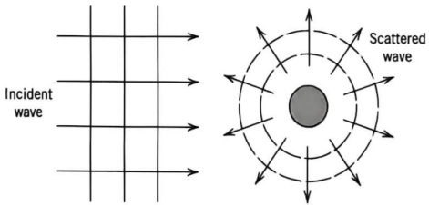{width=38%} Figure 10.6 Scattering of radiation by a localized object.

where $\mathbf{E}_{\mathrm{inc}}$ and $\mathbf{B}_{\mathrm{inc}}$ are given by (10.55). Since the scattered fields are outgoing waves at infinity, their expansions must be of the form.

$$
\begin{array}{r} { \mathbf { E } _ { \mathrm { s c } } = \frac { 1 } { 2 } \sum _ { l = 1 } ^{\infty} i ^{l} \sqrt { 4 \pi ( 2 l + 1 ) } \left[ \alpha _ { z } ( l ) h _ { l } ^{( 1 )} ( k r ) \mathbf { X } _ { l , \pm 1 } \pm \frac { \beta _ { z } ( l ) } { k } \nabla \times h _ { l } ^{( 1 )} ( k r ) \mathbf { X } _ { l , \pm 1 } \right] } \\{ c \mathbf { B } _ { \mathrm { s c } } = \frac { 1 } { 2 } \sum _ { l = 1 } ^{\infty} i ^{l} \sqrt { 4 \pi ( 2 l + 1 ) } \left[ \frac { - i \alpha _ { z } ( l ) } { k } \nabla \times h _ { l } ^{( 1 )} ( k r ) \mathbf { X } _ { l , \pm 1 } \mp i \beta _ { z } ( l ) h _ { l } ^{( 1 )} ( k r ) \mathbf { X } _ { l , \pm 1 } \right] } \end{array}
$$

The coefficients $\alpha_{\pm}(l)$ and $\beta_{\pm}(l)$ will be determined by the boundary conditions on the surface of the scatterer. A priori, it is necessary to keep a full sum over $m$ as well as $l$ in (10.57), but for the restricted class of spherically symmetric problems considered here, only $m=\pm1$ occurs.

Formal expressions for the total scattered and absorbed power in terms of the coefficients of $\alpha(l)$ and $\beta(l)$ can be derived from the scattered and total fields on the surface of a sphere of radius $a$ surrounding the scatterer, with the scattered power being the outward component of the Poynting vector formed from the scattered fields, integrated over the spherical surface, and the absorbed power being the corresponding inward component formed from the total fields. With slight rearrangement of the triple scalar products, these can be written

$$
P _ { \mathrm { s c } } = - \frac { a ^{2} } { 2 \mu _ { 0 } } \, \mathrm { R e } \int { \bf E } _ { \mathrm { s c } } \cdot ( { \bf n } \times { \bf B } _ { \mathrm { s c } } ^{*} ) \, d \Omega
$$

$$
P _ { \mathrm { a b s } } = { \frac { a ^{2} } { 2 \mu _ { 0 } } } \, \mathrm { R e } \int \mathbf { E } \cdot ( \mathbf { n } \times \mathbf { B } ^{*} ) \ d \Omega
$$

Here $\mathbf{n}$ is a radially directed outward normal, $\mathbf{E}_{\mathrm{sc}}$ and $\mathbf{B}_{\mathrm{sc}}$ are given by (10.57), while $\mathbf{E}$ and $\mathbf{B}$ are the sum of the plane wave fields (10.55) and the scattered fields (10.57). Only the transverse parts of the fields enter these equations. We already know that $\mathbf{X}_{lm}$ is transverse. The other type of term in (10.55) and (10.57) is

$$
\nabla \times f _ { l } ( r ) \mathbf { X } _ { l m } = \frac { i \mathbf { n } \sqrt { l ( l + 1 ) } } { r } f _ { l } ( r ) Y _ { l m } + \frac { 1 } { r } \frac { \partial } { \partial r } [ r f _ { l } ( r ) ] \mathbf { n } \times \mathbf { X } _ { l m }
$$

where $f_{l}$ is any spherical Bessel function of order $l$ satisfying (9.81). When the multipole expansions of the fields are inserted in (10.58) and (10.59), there results a double sum over $l$ and $l'$ of various scalar products of the form $\mathbf{X}_{lm}^{*} \cdot \mathbf{X}_{lm'}$, $\mathbf{X}_{lm}^{*} \cdot (\mathbf{n} \times \mathbf{X}_{lm'})$ and $(\mathbf{n} \times \mathbf{X}_{lm'}^{*}) \cdot (\mathbf{n} \times \mathbf{X}_{lm'})$. On integration over angles, the orthogonality relations (10.48) reduce the double sum to a single sum. Each term in the sum involves products of spherical Bessel functions and derivatives of spherical Bessel functions. Use of the Wronskians (9.91) permits the elimination of all the Bessel functions and yields the following expressions for the total scattering and absorption cross sections (the power scattered or absorbed divided by the incident flux, $1/\mu_{0}c$):

$$
\begin{array}{r} { \sigma _ { \mathrm { s c } } = \frac { \pi } { 2 k ^{2} } \sum _ { l } ( 2 l + 1 ) [ | \alpha ( l ) | ^{2} + | \beta ( l ) | ^{2} ] } \\{ \sigma _ { \mathrm { a b s } } = \frac { \pi } { 2 k ^{2} } \sum _ { l } ( 2 l + 1 ) [ 2 - | \alpha ( l ) + 1 | ^{2} - | \beta ( l ) + 1 | ^{2} ] } \end{array}
$$

The total or extinction cross section is the sum of $\sigma_{\mathrm{sc}}$ and $\sigma_{\mathrm{abs}}$:

$$
\sigma _ { t } = - \frac { \pi } { k ^{2} } \sum _ { l } \left( 2 l + 1 \right) \operatorname { R e } [ \alpha ( l ) + \beta ( l ) ]
$$

Not surprisingly, these expressions for the cross sections resemble closely the partial wave expansions of quantum-mechanical scattering.*

The differential scattering cross section is obtained by calculating the scattered power radiated into a given solid angle element $d\Omega$ and dividing by the incident flux. Using the result of Problem 10.6a, we find the scattering cross section for incident polarization ($\epsilon_1 \pm i\epsilon_2$) to be

$$
\frac { d \sigma _ { \mathrm { s c } } } { d \Omega } = \frac { \pi } { 2 k ^{2} } \left| \sum _ { l } \sqrt { 2 l + 1 } \left[ \alpha _ { z } ( l ) \mathbf { X } _ { l , z 1 } \pm i \beta _ { z } ( l ) \textbf { n } \times \mathbf { X } _ { l , z 1 } \right] \right| ^{2}
$$

The scattered radiation is in general elliptically polarized. Only if $\alpha_{\pm}(l) = \beta_{\pm}(l)$ for all $l$ would it be circularly polarized. This means that if the incident radiation is linearly polarized, the scattered radiation will be elliptically polarized; if the incident radiation is unpolarized, the scattered radiation will exhibit partial polarization depending on the angle of observation. Examples of this in the long-wavelength limit were described in Section 10.1 (see Figs. 10.2 and 10.3).

The coefficients $\alpha_{\pm}(l)$ and $\beta_{\pm}(l)$ in (10.57) are determined by the boundary conditions on the fields at $r=a$. Normally this would involve the solution of the Maxwell equations inside the sphere and appropriate matching of solutions across $r=a$. If, however, the scatterer is a sphere of radius $a$ whose electromagnetic properties can be described by a surface impedance $Z$, independent of position (for this the radial variation of the fields just inside the sphere must be rapid compared to the radius), then the boundary conditions take the relatively simple form

$$
\mathbf { E } _ { \mathrm { t a n } } = Z _ { s } \mathbf { n } \times \mathbf { B } / \mu _ { 0 }
$$

where $\mathbf{E}$ and $\mathbf{B}$ are evaluated just outside the sphere. From (10.55), (10.57), and (10.60) we have

$$
\begin{array}{r} { \mathbf { E } _ { \mathrm { t a n } } = \sum _ { l } i ^{l} \sqrt { 4 \pi ( 2 l + 1 ) } \Bigg \{ \left[ j _ { l } + \frac { \alpha _ { z } ( l ) } { 2 } \, h _ { l } ^{( 1 )} \right] \mathbf { X } _ { l , z 1 } } \\{ \pm \, \frac { 1 } { x } \, \frac { \partial } { \partial x } \left[ x \Big ( j _ { l } + \frac { \beta _ { z } ( l ) } { 2 } \, h _ { l } ^{( 1 )} \Big ) \right] \mathbf { n } \times \mathbf { X } _ { l , z 1 } \Bigg \} } \end{array}
$$

and

$$
\begin{array}{r} { \mathbf { c n } \times \mathbf { B } = \sum _ { l } i ^{l} \sqrt { 4 \pi ( 2 l + 1 ) } \Bigg \{ \frac { i } { x } \frac { \partial } { \partial x } \left[ x \bigg ( j _ { l } + \frac { \alpha _ { z } ( l ) } { 2 } \; h _ { l } ^{( 1 )} \bigg ) \right] \mathbf { X } _ { i , z 1 } } \\{ \mp \; i \left[ j _ { l } + \frac { \beta _ { z } ( l ) } { 2 } \; h _ { l } ^{( 1 )} \right] \mathbf { n } \times \mathbf { X } _ { i , z 1 } \Bigg \} } \end{array}
$$

*Our results are not completely general. If the sum over $m$ had been included in (10.57), the scattering cross section would have a sum over $l$ and $m$ with the absolute squares of $\alpha(l, m)$ and $\beta(l, m)$. The total cross section would stay as it is, with $\alpha(l) \to \alpha(l, m = \pm 1)$ and $\beta(l) \to \beta(l, m = \pm 1)$, depending on the state of polarization of the incident wave (10.46). The absorption cross section can be deduced from taking the difference of $\sigma_l$ and $\sigma_{se}$.

where $x = ka$ and all the spherical Bessel functions have argument $x$. The boundary condition (10.64) requires that, for each $l$ value and for each term $\mathbf{X}_{lm}$, and $\mathbf{n} \times \mathbf{X}_{lm}$ separately, the coefficients of $\mathbf{E}_{\tan}$ and $\mathbf{n} \times \mathbf{B}$ be proportional, according to

$$
\begin{array}{r} { j _ { t } + \frac { \alpha _ { * } ( l ) } { 2 } \, h _ { t } ^{( 1 )} = i \left( \frac { Z _ { s } } { Z _ { 0 } } \right) \frac { 1 } { x } \frac { d } { d x } \left[ x \left( j _ { t } + \frac { \alpha _ { * } ( l ) } { 2 } \, h _ { t } ^{( 1 )} \right) \right] } \\{ j _ { t } + \frac { \beta _ { * } ( l ) } { 2 } \, h _ { t } ^{( 1 )} = i \left( \frac { Z _ { 0 } } { Z _ { s } } \right) \frac { 1 } { x } \frac { d } { d x } \left[ x \left( j _ { t } + \frac { \beta _ { * } ( l ) } { 2 } \, h _ { t } ^{( 1 )} \right) \right] } \end{array}
$$

By means of the relation $2j_{l}=h_{l}^{(1)}+h_{l}^{(2)}$, the coefficients $\alpha_{\pm}(l)$ and $\beta_{\pm}(l)$ can be written

$$
\alpha _ { z } ( l ) + 1 = - \left[ \frac { h _ { l } ^{( 2 )} - i \left( \frac { Z _ { s } } { Z _ { 0 } } \right) \frac { 1 } { x } \frac { d } { d x } \left( x h _ { l } ^{( 2 )} \right) } { h _ { l } ^{( 1 )} - i \left( \frac { Z _ { s } } { Z _ { 0 } } \right) \frac { 1 } { x } \frac { d } { d x } \left( x h _ { l } ^{( 1 )} \right) } \right]
$$

with $\beta_{\pm}(l)$ having the same form, but with $Z_{s}/Z_{0}$ replaced by its reciprocal. We note that with the surface impedance boundary condition the coefficients are the same for both states of circular polarization.

For a given $Z_{s}$, all the multipole coefficients are determined and the scattering is known in principle. All that remains is to put in numbers. Before proceeding to a specific limit, we make some observations. First, if $Z_{s}$ is purely imaginary (no dissipation) or if $Z_{s} = 0$ or $Z_{s} \to \infty$, $[\alpha_{\pm}(l) + 1]$ and $[\beta_{\pm}(l) + 1]$ are numbers of modulus unity. This means that $\alpha_{\pm}(l)$ and $\beta_{\pm}(l)$ can be written as

$$
\alpha _ { z } ( l ) = ( e ^{2 i \delta _ { l} } - 1 ) ,  \beta _ { z } ( l ) = ( e ^{2 i \delta _ { l} ^{\prime} } - 1 )
$$

where the phase angles $\delta_{l}$ and $\delta_{l}^{\prime}$ are called scattering phase shifts. Specifically

$$
\begin{aligned}&\tan\:\delta_{l}=j_{l}(ka)/n_{l}(ka)\\&\tan\:\delta_{l}^{\prime}=\left[\frac{d}{\frac{dx}{dx}\:(xj_{l}(x))}\right]_{x=ka}\end{aligned}
$$

if $Z_{s}=0$ (perfectly conducting sphere) and $\delta_{l}\leftrightarrow\delta_{l}^{\prime}$ for $Z_{s}\rightarrow\infty$.

The second observation is that (10.66) can be simplified in the low- and high-frequency limits. For $ka \ll l$, the spherical Bessel functions can be approximated according to (9.88). Then we obtain the long-wavelength approximation,

$$
\alpha _ { z } ( l ) \simeq \frac { - 2 i ( k a ) ^{2 l + 1} } { ( 2 l + 1 ) [ ( 2 l - 1 ) ! ! ] ^{2} } \left[ \frac { x - i ( l + 1 ) Z _ { s } / Z _ { 0 } } { x + i l Z _ { s } / Z _ { 0 } } \right]
$$

and the same form for $\beta_{\pm}(l)$, with $(Z_{s}/Z_{0})$ replaced by its inverse. For $ka \gg l$, we use (9.89) and obtain

$$
\alpha _ { z } ( l ) \simeq \left( \frac { Z _ { s } / Z _ { 0 } - 1 } { Z _ { s } / Z _ { 0 } + 1 } \right) ( - 1 ) ^{l + 1} e ^{- 2 i k a} - 1
$$

with $\beta_{\pm}(l) = -\alpha_{\pm}(l)$ via the usual substitution. In the long-wavelength limit, independent of the actual value of $Z_{s}$, the scattering coefficients $\alpha_{\pm}(l)$, $\beta_{\pm}(l)$ become small very rapidly as $l$ increases. Usually, only the lowest term ($l = 1$) need be retained for each multipole series. In the opposite limit of $ka \gg 1$, (10.70) shows that for $l \ll ka$, the successive coefficients have comparable magnitudes, but phases that fluctuate widely. For $l \sim l_{\text{max}} = ka$, there is a transition region and for $l \gg l_{\text{max}}$, (10.69) holds. The use of a partial wave or multipole expansion for such a large number of terms is a delicate matter, necessitating the careful use of digital computers or approximation schemes of the type discussed in Section 10.10.

We specialize now to the long-wavelength limit ($ka \ll 1$) for a perfectly conducting sphere ($Z_s = 0$), and leave examples of slightly more complexity to the problems. Only the $l = 1$ terms in (10.63) are important. From (10.69) we find

$$
\alpha _ { z } ( 1 ) = \frac { - 1 } { 2 } \, \beta _ { z } ( 1 ) = - \frac { 2 i } { 3 } \, ( k a ) ^{3}
$$

In this limit the scattering cross section is

$$
\frac { d \sigma _ { \mathrm { s c } } } { d \Omega } = \frac { 2 \pi } { 3 } \, a ^{2} ( k a ) ^{4} \, | { \bf X } _ { 1 , z 1 } \mp 2 { \bf i } { \bf n } \times { \bf X } _ { 1 , z 1 } | ^{2}
$$

From Table 9.1 we obtain the absolute squared terms,

$$
| \mathbf { n } \times \mathbf { X } _ { 1 , \pm 1 } | ^{2} = | \mathbf { X } _ { 1 , \pm 1 } | ^{2} = { \frac { 3 } { 16 \pi } } \left( 1 + \cos ^{2} \theta \right)
$$

The cross terms can be easily worked out:

$$
[ \pm i ( \mathbf { n } \times \mathbf { X } _ { 1 : z _ { 1 } } ) ^{*} \cdot \mathbf { X } _ { 1 : \cdot 1 } ] = \frac { - 3 } { 8 \pi } \cos \theta
$$

Thus the long-wavelength limit of the differential scattering cross section is

$$
\frac { d \sigma } { d \Omega } \simeq a ^{2} ( k a ) ^{4} [ \frac { 5 } { 8 } ( 1 + \cos ^{2} \theta ) - \cos \theta ]
$$

Equation (10.72) is the same as (10.16), found by other means and is valid for either state of circular polarization incident, or for an unpolarized incident beam. The generalizations to arbitrary incident polarization and to different surface boundary conditions are left to the problems at the end of the chapter.

The general problem of the scattering of electromagnetic waves by spheres of arbitrary electric and magnetic properties when $ka$ is not small is complicated. It was first systematically attacked by Mie and Debye in 1908–1909. By now, hundreds of papers have been published on the subject. Details of the many aspects of this important problem can be found in the books by Kerker, King and Wu, Bowman, Senior, and Uslenghi and other sources cited at the end of the chapter. The book by Bowman, Senior, and Uslenghi discusses scattering by other regular shapes besides the sphere.

For scatterers other than spheres, cylinders, etc., there is very little in the way of formal theory. The perturbation theory of Section 10.2 may be used in appropriate circumstances.

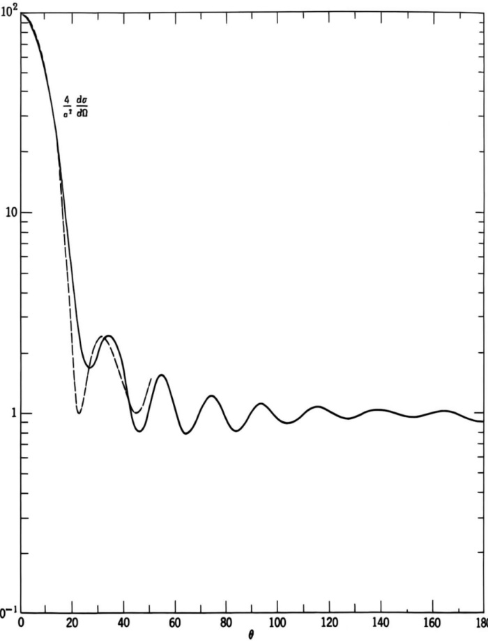{width=56%} Figure 10.16 Semilogarithmic plot of the scattering cross section for a perfectly conducting sphere as a function of scattering angle, with an unpolarized plane wave incident and $ka = 10$. The solid curve is the exact result (King and Wu). The dashed curve is the approximation based on the sum of the amplitudes (10.127) and (10.132).

the properties of the illuminated surface, we cannot say how it is divided between scattering and absorption.

# 10.11 Optical Theorem and Related Matters

A fundamental relation, called the optical theorem, connects the total cross section of a scatterer to the imaginary part of the forward scattering amplitude. The theorem follows from very general considerations of the conservation of energy and power flow, and has its counterpart in the quantum-mechanical scattering of particles through the conservation of probability.

To establish the theorem, we consider the scattering geometry shown in Fig. 10.9. A plane wave with wave vector $\mathbf{k}_0$ and fields ($\mathbf{E}_i$, $\mathbf{B}_i$) is incident in vacuum

on a finite scatterer that lies inside the surface $S_1$. The scattered fields ($\mathbf{E}_s$, $\mathbf{B}_s$) propagate out from the scatterer and are observed far away in the direction of $\mathbf{k}$. The total fields at all points in space are, by definition,

$$
\mathbf { E } = \mathbf { E } _ { l } + \mathbf { E } _ { s } ,  \mathbf { B } = \mathbf { B } _ { l } + \mathbf { B } _ { s }
$$

The scatterer is, in general, dissipative and absorbs energy from the incident wave. The absorbed power can be calculated by integrating the inward-going component of the Poynting vector of the total fields over the surface $S_1$:

$$
P _ { \mathrm { a b s } } = - \frac { 1 } { 2 \mu _ { 0 } } \oint _ { S _ { 1 } } \mathrm { R e } ( \mathbf { E } \times \mathbf { B } ^{*} ) \cdot \mathbf { n } ^{\prime} \; d a ^{\prime}
$$

The scattered power is normally calculated by considering the asymptotic form of the Poynting vector for the scattered fields in the region where these are simple transverse fields falling off as $1/r$. But since there are no sources between $S_1$ and infinity, the scattered power can equally well be evaluated as an integral over $S_1$ of the outwardly directed component of the scattered Poynting vector:

$$
P _ { \mathrm { s c a t t } } = \frac { 1 } { 2 \mu _ { 0 } } \oint _ { S _ { 1 } } \mathrm { R e } ( \mathbf { E } _ { s } \times \mathbf { B } _ { s } ^{*} ) \cdot \mathbf { n } ^{\prime} \; d a ^{\prime}
$$

The total power $P$ taken from the incident wave, either by scattering or absorption, is the sum of (10.134) and (10.135). With some obvious substitutions and rearrangements, the total power can be written

$$
P = - \frac { 1 } { 2 \mu _ { 0 } } \oint _ { S _ { 1 } } \mathrm { R e } [ \mathbf { E } _ { s } \times \mathbf { B } _ { i } ^{*} + \mathbf { E } _ { i } ^{*} \times \mathbf { B } _ { s } ] \cdot \mathbf { n } ^{\prime} \ d a ^{\prime}
$$

With the incident wave written explicitly as

$$
\begin{array}{rl} { \mathbf { E } _ { i } } & { { } = E _ { 0 } \mathbf { \epsilon } _ { 0 } e ^{i \mathbf { k} _ { 0 } \cdot \mathbf { x } } } \\{ \mathbf { c } \mathbf { B } _ { i } } & { { } = \frac { 1 } { k } \mathbf { k } _ { 0 } \times \mathbf { E } _ { i } } \end{array}
$$

the total power takes the form,

$$
P = \frac { 1 } { 2 \mu _ { 0 } } \operatorname { R e } \Bigg \{ E _ { 0 } ^{*} \oint _ { S _ { 1 } } e ^{- i k _ { 0} \cdot \mathbf { x } ^{\prime} } \Bigg [ \mathbf { \epsilon } _ { 0 } ^{*} \cdot \left( \mathbf { n } ^{\prime} \times \mathbf { B } _ { s } \right) + \mathbf { \epsilon } _ { 0 } ^{*} \cdot \frac { \mathbf { k } _ { 0 } \times \left( \mathbf { n } ^{\prime} \times \mathbf { E } _ { s } \right) } { k c } \Bigg ] d a ^{\prime} \Bigg \}
$$

Comparison with (10.93) for the scattering amplitude shows that the total power is related to the forward ($\mathbf{k} = \mathbf{k}_0$, $\mathbf{\epsilon} = \mathbf{\epsilon}_0$) scattering amplitude according to

$$
P = \frac { 2 \pi } { k Z _ { 0 } } \operatorname { I m } [ E _ { 0 } ^{*} \, \epsilon _ { 0 } ^{*} \cdot \mathbf { F } ( \mathbf { k } = \mathbf { k } _ { 0 } ) ]
$$

This is the basic result of the optical theorem, although it is customary to express it in a form that is independent of the magnitude of the incident flux. The total cross section $\sigma_{t}$ (sometimes called the extinction cross section in optics) is defined as the ratio of the total power $P$ to the incident power per unit area, $|E_{0}|^{2}/2Z_{0}$. Similarly, the normalized scattering amplitude $\mathbf{f}$ is defined relative to the amplitude of the incident wave at the origin as

$$
\mathbf { f } ( \mathbf { k } , \mathbf { k } _ { 0 } ) = { \frac { \mathbf { F } ( \mathbf { k } , \mathbf { k } _ { 0 } ) } { E _ { 0 } } }
$$

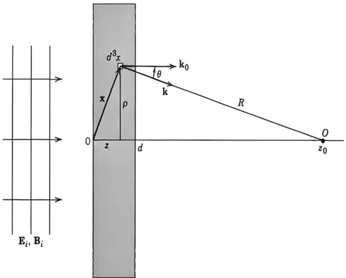{width=47%} Figure 10.17 A plane wave incident normally on a slab of dielectric of thickness $d$. The scatterers in the slab give rise to a scattered wave that adds coherently to the incident wave to give a modified wave at the observation point $O$ behind the slab.

In terms of $\sigma_t$ and $\mathbf{f}$ the optical theorem reads

$$
\sigma _ { t } = \frac { 4 \pi } { k } \mathrm { I m } [ \mathbf { \epsilon } _ { 0 } ^{*} \cdot \mathbf { f } ( \mathbf { k } = \mathbf { k } _ { 0 } ) ]
$$

The notation in (10.139) corresponds to the standard quantum-mechanical conventions. For particles with spin the relevant forward scattering amplitude is the one in which none of the particles change their spin state. For electromagnetic radiation (photons) this is indicated by the presence of the amplitude $\epsilon_{0}^{*} \cdot \mathbf{f}$ for scattered radiation with the same polarization finally as it was initially.

The optical theorem relates different aspects of the scattering and absorption of electromagnetic waves for a single scatterer. It is also possible to connect the forward scattering amplitude for a single scatterer to the macroscopic electromagnetic properties, namely the dielectric constant, of a medium composed of a large number of scatterers. We will content ourselves with a brief elementary discussion and refer the reader to the literature for more detailed and rigorous treatments.* Consider a plane wave (10.136) incident normally from the left on a thin slab of uniform material composed of $N$ identical scattering centers per unit volume, as shown in Fig. 10.17). The incident wave impinges on the scattering centers, causing each to generate a scattered wave. The coherent sum of the incident wave and of all the scattered waves gives a modified wave to the right of the slab. Comparison of this modified wave at the observation point $O$ with that expected for a wave transmitted through a slab described by a macroscopic, electric susceptibility $\epsilon(\omega)$ then leads to a relation between $\epsilon$ and the scattering amplitude $\mathbf{f}$.

The thickness and the density of the slab are assumed to be so small that only single scatterings in the slab need be considered and, as a consequence, the effective exciting field at each scatterer is just the incident field itself. The scattered field produced at the observation point $O$ with cylindrical coordinates $(0, 0, z_0)$ by the $N\,d^3x$ scatterers in the infinitesimal volume element $d^3x$ at the point $\mathbf{x}(\rho, \phi, z)$ in the slab is, in this approximation,

$$
d \mathbf { E } _ { s } = \frac { e ^{i k R} } { R } \mathbf { f } ( k , \, \theta , \, \phi ) E _ { 0 } e ^{i k _ { 0} \cdot \mathbf { x } } N \, d ^{3} x
$$

where we have written the scattering amplitude in terms of the scattering angles $\theta$ and $\phi$, with $\sin \theta = \rho/R$, and have assumed that the observation point is many wavelengths from the slab. The distance from the volume element to $O$ is $R = [\rho^2 + (z_0 - z)^2]^{1/2}$. The presence of the phase factor of the incident wave is necessary to account for the location of the scatterers at $\mathbf{x}$, rather than at the origin of coordinates. The total scattered field is obtained by integration over the volume of the slab:

$$
\mathbf { E } _ { s } = N E _ { 0 } \int _ { 0 } ^{2 \pi} d \phi \int _ { 0 } ^{d} d z \ e ^{i k z} \int _ { 0 } ^{\infty} \rho \ d \rho \, \frac { e ^{i k R} } { R } \, \mathbf { f } ( k , \, \theta , \, \phi )
$$

Since $\rho\,dp=R\,dR$, this expression can be written

$$
\mathbf { E } _ { s } = N E _ { 0 } \int _ { 0 } ^{2 \pi} d \phi \int _ { 0 } ^{d} d z \ e ^{i k z} \int _ { | z _ { 0 } - z | } ^{\infty} d R \ e ^{i k R} \, \mathbf { f } ( k , \, \theta , \, \phi )
$$

where $\cos \theta = (z_0 - z)/R$. We now treat $e^{i k R} \, d R$ as a differential and integrate by parts to obtain for the $R$ integration,

$$
\begin{array}{r} { \int _ { | z _ { 0 } - z | } ^{\infty} d R \ e ^{i k R} \, \mathbf { f } ( k , \ \theta , \ \phi ) = \frac { 1 } { i k } \ e ^{i k R} \, \mathbf { f } ( k , \ \theta , \ \phi ) \bigg | _ { R = | z _ { 0 } - z | } ^{\infty} } \\{ + \ \frac { 1 } { i k } \int _ { | z _ { 0 } - z | } ^{\infty} d R \Big ( \frac { z _ { 0 } - z } { R ^{2} } \Big ) e ^{i k R} \, \frac { d } { d ( \cos \theta ) } \, \mathbf { f } ( k , \ \theta , \ \phi ) } \end{array}
$$

Provided the indicated derivative of $\mathbf{f}$ is well behaved, the remaining integral is of the order of $1/(k\left|z_{0}-z\right|)$ times the original. Since we have assumed that the observation point is many wavelengths from the slab, this integral can be neglected. Neglecting the oscillating contribution at the upper limit $R\rightarrow\infty$ (this can be made to vanish somewhat more plausibly by assuming that the number $N$ of scattering centers per unit volume falls to zero at very large $\rho$), we have the result

$$
\int _ { | z _ { 0 } - z | } ^{\infty} d R \ e ^{i k R} \, \mathbf { f } ( k , \ \theta , \ \phi ) = \frac { i } { k } \ e ^{i k | z _ { 0} - z | } \, \mathbf { f } ( k , \ 0 )
$$

The scattered field at $O$ is therefore

$$
\mathbf { E } _ { s } = \frac { 2 \pi i } { k } \, N E _ { 0 } \mathbf { f } ( k , \, 0 ) \int _ { 0 } ^{d} d z \ e ^{i k [ z + | z _ { 0} - z | ] }
$$

Since $z_{0} > z$ by assumption, we have finally

$$
\mathbf { E } _ { s } = \frac { 2 \pi i } { k } \, N E _ { 0 } \mathbf { f } ( k , \, 0 ) e ^{i k z _ { 0} } \, d
$$

The total electric field at the observation point $O$ is

$$
\mathbf { E } = E _ { 0 } e ^{i k z _ { 0} } \biggl [ \epsilon _ { 0 } + \frac { 2 \pi i N d } { k } \mathbf { f } ( k , 0 ) \biggr ]
$$

correct to first order in the slab thickness $d$. The amplitude at $O$ for a wave with the same polarization state as the incident wave is

$$
\boldsymbol { \epsilon } _ { 0 } ^{*} \cdot \mathbf { E } = E _ { 0 } e ^{i k z _ { 0} } \bigg [ 1 + \frac { 2 \pi i N d } { k } \, \boldsymbol { \epsilon } _ { 0 } ^{*} \cdot \mathbf { f } ( k , 0 ) \bigg ]
$$

Suppose that we now consider the slab macroscopically, with its electromagnetic properties specified by a dielectric constant $\epsilon(\omega)/\epsilon_0$ appropriate to describe the propagation of the wave of frequency $\omega = ck$ and polarization $\epsilon_0$. A simple calculation using the formulas of Chapter 7 shows that the transmitted wave at $z = z_0$ is given by

$$
\epsilon _ { 0 } ^{*} \cdot \mathbf { E } ( \mathrm { m a c r o s c o p i c } ) = E _ { 0 } e ^{i k z _ { 0} } \Big [ 1 + i k ( \epsilon / \epsilon _ { 0 } - 1 ) \frac { d } { 2 } \Big ]
$$

correct to first order in $d$, but with no approximation concerning the smallness of $|\epsilon/\epsilon_0 - 1|$. Comparison of (10.144) and (10.145) shows that the dielectric constant can be written in terms of the forward scattering amplitude as

$$
\epsilon ( \omega ) / \epsilon _ { 0 } = 1 + \frac { 4 \pi N } { k ^{2} } \, \epsilon _ { 0 } ^{*} \cdot \mathbf { f } ( k , \, 0 )
$$

A number of observations are in order. It is obvious that our derivation has been merely indicative, with a number of simplifying assumptions and the notion of a macroscopic description assumed rather than derived. More careful considerations show that the scattering amplitude in (10.146) should be evaluated at the wave number $k'$ in the medium, not at the free-space wave number $k$, and that there is a multiplier to the second term that gives a measure of the effective exciting field at a scatterer relative to the total coherent field in the medium. The reader can consult the literature cited above for these and other details. Suffice it to say that (10.146) is a reasonable approximation for not too dense substances and provided correlations among neighboring scatterers are not important. It is worthwhile to illustrate (10.146) with the simple electronic oscillator model used in Chapter 7 to describe the dielectric constant. The dipole moment of the atom is given by (7.50), summed over the various oscillators:

$$
\mathbf { p } = \frac { e ^{2} } { m } \sum _ { j } f _ { j } ( \omega _ { j } ^{2} - \omega ^{2} - i \omega \gamma _ { j } ) ^{- 1} E _ { 0 } \epsilon _ { 0 }
$$

From (10.2) we infer that the atomic scattering amplitude is

$$
\mathbf { f } ( \mathbf { k } ) = \frac { 1 } { 4 \pi \epsilon _ { 0 } } \frac { e ^{2} } { m } \sum _ { j } f _ { j } ( \omega _ { j } ^{2} - \omega ^{2} - i \omega \gamma _ { j } ) ^{- 1} ( \mathbf { k } \times \mathbf { \epsilon } _ { 0 } ) \times \mathbf { k }
$$

The scalar product of $\epsilon_{0}^{*}$ with the forward scattering amplitude is then

$$
\mathbf { \epsilon } _ { 0 } ^{*} \cdot \mathbf { f } ( \mathbf { k } = \mathbf { k } _ { 0 } ) = \frac { e ^{2} k ^{2} } { 4 \pi \epsilon _ { 0 } m } \sum _ { j } f _ { j } ( \omega _ { j } ^{2} - \omega ^{2} - i \omega \gamma _ { j } ) ^{- 1}
$$

Substitution into (10.146) yields the dielectric constant

$$
\epsilon ( \omega ) / \epsilon _ { 0 } = 1 + \frac { N e ^{2} } { \epsilon _ { 0 } m } \sum _ { j } f _ { j } ( \omega _ { j } ^{2} - \omega ^{2} - i \omega \gamma _ { j } ) ^{- 1}
$$

in agreement with (7.51).

Contact can be established between (10.146) and the optical theorem (10.139) by recalling that the attenuation coefficient $\alpha$ is related to the total cross section of a single scatterer through $\alpha = N\sigma$, and to the imaginary part of the wave number in the medium through $\alpha = 2$ Im$(k')$. From (10.146) and the relations (7.54) for the real and imaginary parts of $k'$ in terms of $\epsilon(\omega)$ we find

$$
\alpha = N \sigma _ { t } = \frac { 4 \pi N } { \mathrm { R e } ( k ^{\prime} ) } \, \mathrm { I m } [ \epsilon _ { 0 } ^{*} \cdot \mathbf { f } ( \mathrm { R e } \; k ^{\prime} . \; 0 ) ]
$$

where I have improved (10.146) by evaluating $\mathbf{f}$ at the wave number in the medium, as described above. Equation (10.148) indicates that, if we consider scattering by a single scatterer embedded in a medium, the optical theorem and other relations will appear as before, provided we describe the "kinematics" correctly by using the local wave number $k'$ in the medium. The same situation holds in the scattering of electrons in a solid, for example, where the effective mass or other approximation is used to take into account propagation through the lattice.

As a final comment on the optical theorem we note the problem of approximations for $\mathbf{f}$. The optical theorem is an exact relation. If an approximate expression for $\mathbf{f}$ is employed, a manifestly wrong result for the total cross section may be obtained. For example, in the long-wavelength limit we find from (10.2) and (10.5) that the scattering amplitude for a dielectric sphere of radius $a$ is

$$
\mathbf { f } = \left( { \frac { \epsilon _ { r } - 1 } { \epsilon _ { r } + 2 } } \right) a ^{3} ( \mathbf { k } \times \mathbf { \epsilon } _ { 0 } ) \times \mathbf { k }
$$

The forward amplitude is

$$
\epsilon _ { 0 } ^{*} \cdot \mathbf { f } ( \mathbf { k } = \mathbf { k } _ { 0 } ) = k ^{2} a ^{3} \frac { \left( \epsilon _ { r } - 1 \right) } { \left( \epsilon _ { r } + 2 \right) }
$$

For a lossless dielectric, this amplitude is real; the optical theorem (10.139) then yields $\sigma_{t} = 0$. On the other hand, we know that the total cross section is in this case equal to the scattering cross section (10.11):

$$
\sigma _ { \mathrm { s c } } = \frac { 8 \pi } { 3 } \, k ^{4} a ^{6} \left| \frac { \epsilon _ { r } - 1 } { \epsilon _ { r } + 2 } \right| ^{2}
$$

Even with a lossy dielectric (Im $\epsilon \neq 0$), the optical theorem yields a total cross section,

$$
\sigma _ { t } = \frac { 12 \pi k a ^{3} \, \mathrm { I m } \, \, \epsilon _ { r } } { | \epsilon _ { r } + 2 | ^{2} }
$$

while the scattering cross section remains (10.150). These seeming contradictions are reflections of the necessity of different orders of approximation required to obtain consistency between the two sides of the optical theorem. In the long-wavelength limit it is necessary to evaluate the forward scattering amplitude to

higher order in powers of $\omega$ to find the scattering cross section contribution in the total cross section by means of the optical theorem. For lossless or nearly lossless scatterers it is therefore simplest to determine the total cross section directly by integration of the differential scattering cross section over angles. For dissipative scatterers, on the other hand, the optical theorem yields a nonzero answer that has a different (usually a lower power) dependence on $\omega$ and other parameters from that of the scattering cross section. This contribution is, of course, the absorption cross section to lowest explicit order in $\omega$. It can be calculated from first principles with (10.134), but the optical theorem provides an elegant and convenient method. Examples of these considerations are given in the problems. An analogous situation occurs in quantum-mechanical scattering by a real potential where the first Born approximation yields a real scattering amplitude. The second Born approximation has an imaginary part in the forward direction that gives, via the optical theorem, a total cross section in agreement with the integrated scattering cross section of the first Born approximation.

# References and Suggested Reading

Scattering and diffraction are treated in many optics texts. References concerning critical opalescence are cited in Section 10.2. The subject of losses in optical fibers and Rayleigh scattering there can be pursued in

J. M. Senior, Optical Fiber Communications, Prentice Hall, New York (1992), Chapter 3.

H. Murata, Handbook of Optical Fibers and Cables, Marcel Dekker, New York (1988).

The scattering of radiation by a perfectly conducting sphere is treated briefly in Morse and Feshbach (pp. 1882-1886)Panofsky and Phillips, Section 13.9

Much more elaborate discussions, with arbitrary dielectric and conductive properties for the sphere (Mie's problem) are given by

Born and Wolf, Section 13.5

Stratton, Section 9.25

Specialized monographs on the scattering of electromagnetic waves by spheres and other obstacles areBowman, Senior, and UslenghiH. C. van de Hulst, Light Scattering by Small Particles, Wiley, New York (1957)KerkerKing and Wu

Kerker has a nice historical introduction, including quotations from Leonardo da Vinci and Maxwell in a letter to Rayleigh. See also

Van Bladel

The subject of diffraction has a very extensive literature. A comprehensive treatment of both scalar Kirchhoff and vector theory, with many examples and excellent figures, is given by

Born and Wolf, Chapters VIII, IX, and XIThe review

C. J. Bouwkamp, Diffraction theory, in Reports on Progress in Physics, ed. A. C. Stickland, Vol. XVII, pp. 35–100, The Physical Society, London (1954)
