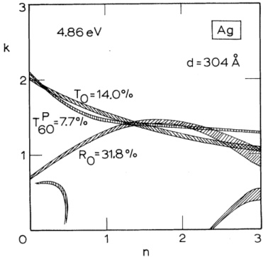
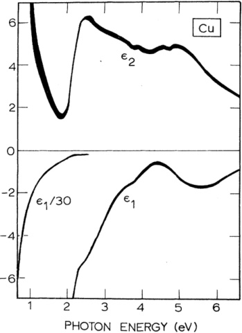
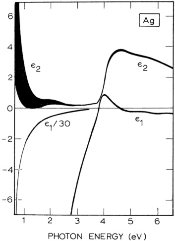
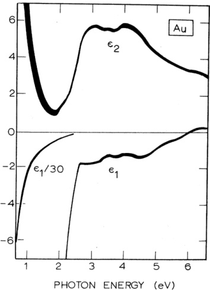
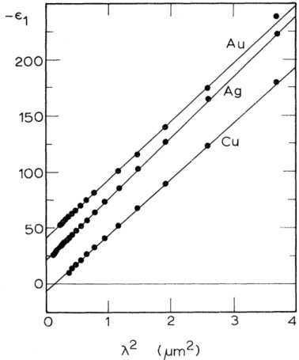
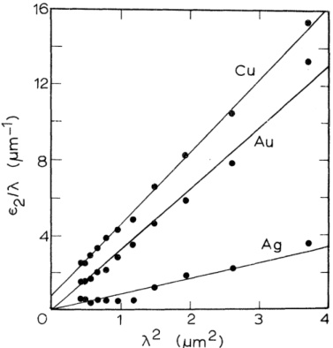
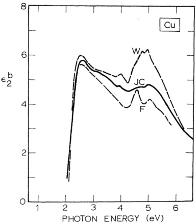
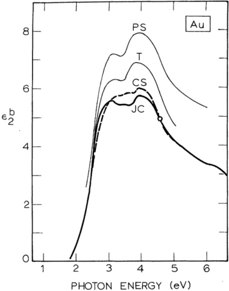
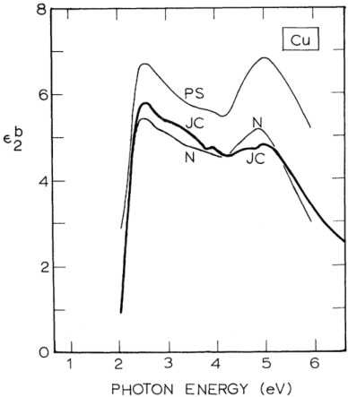

# Optical Constants of the Noble Metals

P. B. Johnson and R. W. Christy Department of Physics and Astronomy, Dartmouth College, Hanover, New Hampshire 03755 (Received 7 July 1972)

The optical constants $n$ and $k$ were obtained for the noble metals (copper, silver, and gold) from reflection and transmission measurements on vacuum-evaporated thin films at room temperature, in the spectral range 0.5-6.5 eV. The film-thickness range was 185-500 Å. Three optical measurements were inverted to obtain the film thickness $d$ as well as $n$ and $k$. The estimated error in $d$ was ±2 Å, and that in $n$, $k$ was less than 0.02 over most of the spectral range. The results in the film-thickness range 250-500 Å were independent of thickness, and were unchanged after vacuum annealing or aging in air. The free-electron optical effective masses and relaxation times derived from the results in the near infrared agree satisfactorily with previous values. The interband contribution to the imaginary part of the dielectric constant was obtained by subtracting the free-electron contribution. Some recent theoretical calculations are compared with the results for copper and gold. In addition, some other recent experiments are critically compared with our results.

# I. INTRODUCTION

The optical constants of the noble metals have been measured since the time of Drude, with continuing attempts to increase the experimental accuracy, for the purpose of comparison with theory (and also for their practical application as mirrors). It was seen from the earliest results that Drude's free-electron theory failed in the visible and near-ultraviolet regions. After quantum theory, it was recognized$^{1}$ that the absorption in the visible and ultraviolet probably was due to transitions from the filled $d$ bands into the $sp$ conduction bands. With more accurate measurements of the optical constants and detailed band-structure calculations, one could$^{2-4}$ separate the free-electron contribution from the effect of interband transitions, and try to identify the photon energies at which structure occurs in the measured interband absorption with energy gaps in the theoretical band structure. This work confirms the importance of transitions from the $d$ band, and is supported by observations on the effects of stress$^{5,6}$ and alloying.$^{6-9}$ Most recently, for copper and gold new measurements$^{10-12}$ have been compared$^{13-15}$ with quantitative calculations of the interband optical constants based on refined band-structure calculations, taking into account the joint density of states and the transition-probability matrix elements throughout the Brillouin zone.

In the experimental measurements there has been reasonably good agreement on the wavelengths at which structure occurs. The actual magnitudes

of the optical constants, however, differ significantly as reported by different investigators, even in the most recent and careful experiments. Since the actual value of the optical constants is now yielding to theoretical calculation, it is important to pin down the experimental values with accurate measurements including estimates of error. Our purpose is to do so for the three noble metals, copper, silver, and gold, under similar conditions for each metal, and to compare the results with recent calculations and also with other experimental results.

The earliest measurements used Drude's polarimetric method. This has the advantage that explicit expressions for the optical constants $n$, $k$ can be derived in terms of measured quantities, but the disadvantage that the results obtained depend very sensitively on the surface preparation of the sample.16 The advent of more powerful computing techniques saw increased use of other experimental methods which depend less sensitively on surface conditions, but which require numerical inversion of the equations for the optical constants. These include Kramers-Kronig analysis of normal-incidence reflection measurements, reflection measurements at different incident angles, and transmission measurements through thin films. Each of these has its own advantages and weaknesses.

Several investigations of copper, silver, and gold have used the Kramers-Kronig technique$^{17}$ applied to normal-incidence reflection measurements. A problem with this method arises from the necessity of extrapolating the reflectance to

frequencies outside of the measured range. The choice of the extrapolation has a large effect on the magnitude of the optical constants, although the photon energies at which various structural features occur are insensitive to it. $^{7,18,19}$ Some other investigations have used two reflection or transmission measurements. Two reflection measurements from opaque samples, at different angles of incidence or with different polarizations, yield values only over a relatively small range of the spectrum. The reflection contours in the $n$-$k$ plane may be nearly parallel and thus give indefinite values of $n$ and $k$. $^{20}$ Methods using normal-incidence transmission and reflection measurements on thin films can also encounter this problem, and may have additional trouble with accurate measurement of the thickness of the film. $^{20}$

The method we adopted, of utilizing three measurements on thin films, can circumvent the above problems.$^{20}$ Measurements of reflection and transmission at normal incidence, together with $p$-polarized transmission at an angle of $60^{\circ}$, yielded accurate values for the two optical constants as well as accurately determining the film thickness. This technique is particularly convenient when a spectrophotometer is available and one is dealing with such easily evaporated materials as the noble metals.

In addition to the accuracy of the chosen method of measurement, the preparation of the sample is very important. Bulk samples are usually polished mechanically, chemically, or electrolytically, and then they may be annealed. Mechanical polishing may leave the surface structure distorted, and annealing may reduce surface smoothness.$^{21}$ Thin films prepared by vacuum evaporation require no polishing. Rapidly evaporated films will reproduce the surface smoothness of the substrate and form a smooth homogeneous surface.$^{22}$ Films formed at slower evaporation rates can have a discontinuous agglomerated structure.$^{22}$ The optical properties of evaporated thin films have been found to be the same as for bulk materials, provided the thickness of the films is greater than about 200-300 Å.$^{23}$

We report values of the optical constants for copper, silver, and gold in the spectral range 0.5-6.5 eV, measured with an oblique-incidence thin-film technique. We make estimates of the experimental error inherent in our measurements, and also investigate the effect of variations in our sample preparation. Our results will be compared with the classical Drude theory in the free-electron region, and more especially with some recent calculations of interband absorption for copper and gold. Our results in the free-electron region agree satisfactorily with earlier experimental work, but our interband results differ significantly

from some other recent measurements. We will compare our experimental data with these other recent experiments and suggest why we believe our results are more accurate.

# II. EVALUATION OF OPTICAL CONSTANTS

The optical constants $n$ and $k$, as well as the thickness $d$ of thin metal films, were determined by inverting the normal-incidence reflection and transmission functions, $R_0$ and $T_0$, simultaneously with the transmission function for $p$-polarized light incident at $60^\circ$, $T_{60}^P$. This method has recently been described in detail and evaluated by Nestell and Christy. 20, 24 One of the chief advantages of this method, a three-parameter fit, compared with other thin-film techniques which also invert reflection or transmission functions, 11, 21 is the good accuracy with which the film thickness can be determined. The accuracy of interferometric thickness measurements is normally about $\pm 30$ Å, but if our three optical measurements are inverted in an appropriate spectral range, then the thickness can usually be obtained to within $\pm 2$ Å. The appropriate range is one in which the measured reflection and transmission values lie on contours which intersect steeply enough in the $n$-$k$ plane. Figure 1 shows how the three contours intersect for a suitable wavelength. The width of the contours represents the error in the measurements. At wavelengths where $n$ or $k$ takes on values larger than 2, however, the two transmission contours often are nearly parallel, and the accuracy of the method is destroyed. Once the true film thickness has been determined from the average

{width=28%} FIG. 1. Example of the intersection in the $n-k$ plane of normal-incidence $R$ and $T$ contours with the $p$-polarized $T$ contour for $60^\circ$ incident angle. The width of the contours, which represents the estimated experimental $\epsilon$ error, is exaggerated by a factor of 5 for the normal-incidence contours.

of the values in the appropriate spectral range, it can be used along with any two of our three optical measurements in order to determine $n$ and $k$ over our entire spectral range. The normal-incidence reflection and transmission functions were usually used for this calculation; however, the $60^{\circ}$ $p$-polarized transmission function was sometimes combined with one of the other two measurements in order to improve or check on the $n$ and $k$ values.

Computer methods for inverting the complex reflection or transmission functions have been suggested previously, with application to the inversion of two measurements to determine $n$ and $k$. $^{21,25-27}$ The three-parameter method we used is based on an approximate Newton-Raphson technique of finding the intersections of the contours. It converges rapidly and accurately. Other methods of inverting three measurements have been suggested, but they do not seem to have been widely used. $^{28-31}$ Our inversion programs are actually quite general and can be used to determine $n$, $k$, and $d$ from any three transmission or reflection functions. We used $T_0$, $R_0$, and $T_0^{\mathrm{R}}$ since they are easiest for us to measure, and their intersections in the $n$-$k$ plane are relatively steep.

Another important advantage of using three measurements is that they automatically determine the physical solution. It is known that the reflection and transmission contours intersect at several points in the $n-k$ plane, and an example of multiple intersections can be seen in Fig. 1. The problem of determining which is the physical solution may be difficult, and at times the wrong intersections have been reported. A rule of thumb that the solution$^{21}$ with the lowest value of $n$ should be chosen seems to give the correct solution for the noble metals. Vrb$^{25}$ points out that by changing the film thickness the position of the physical-solution intersection will not change, while the other intersections will move to new locations, but this approach requires different samples and several computations. Our three-parameter fit immediately picks out the correct solution since the three measurements $T_{0}$, $R_{0}$, and $T_{60}^{P}$ always seem to intersect at a unique point in $n-k$-$d$ space which is the physical solution.

Inversion techniques have also been applied to two reflection measurements taken from bulk samples or opaque evaporated films.$^{32-36}$ Although there is no thickness problem, the reflection contours often do not intersect very steeply except in certain restricted areas of the $n-k$ plane. Miller, Taylor, and Julien$^{33}$ have determined the optimum angle for reflection to be $R^{b}$ and $R^{s}$ at $74^{\circ}$. This method is accurate only when $n<3.0$ and $k<3.2$. Such a restriction rules out most of the infrared region of the spectrum. This region is of interest

since it is here that free-electron effects play a dominant role.

Our three-parameter method gives us an accurate measurement of the film thickness, and immediately picks out the physical solution. Then, using the known thickness along with the known physical solution at certain wavelengths, we can determine $n$ and $k$ throughout the entire spectrum using only two of our three measurements. Because our theoretical reflection and transmission functions²⁰ refer to a semi-infinite substrate medium, the data must be corrected for reflection at the back surface of the actual substrate. The portion of this reflection which entered the detector in the $R_0$ measurement was small enough to be neglected. The correction in the $T$ measurements is approximately $T_{\infty} \simeq (T_F \cos\theta_1/T_B \cos\theta_3) \times (1 - R_B - R_F R_F T_B^2)$, where subscript $F$ refers to the film-coated substrate and $B$ to the blank substrate. For $T_{\infty}^p$, $R_B \simeq 0$; for $T_0$ the correction is still only a few percent. The refractive index of the substrate was taken from the literature.³⁷ All of the data reduction was done on the Dartmouth time-sharing computer system.

# III. EXPERIMENTAL CONSIDERATIONS

All of our samples were deposited onto fused-quartz substrates at room temperature by vacuum evaporation. The evaporations were performed at pressures below $4 \times 10^{-6}$ Torr in an oil-pumped bell-jar system. Before evaporation the substrates were cleaned ultrasonically in Lakeseal Laboratory Glass Cleaner and then ultrasonically rinsed in distilled water. The substrates were dried with a hot-air gun and placed immediately in the vacuum system. The source materials deposited by evaporation were 99.99% pure metals. The gold was evaporated from a conical tungsten basket, while the silver and copper were evaporated from boats made of tantalum foil. In all cases the substrate was masked until the source was at evaporation temperature, and the evaporation rate was about 60 Å/sec. This high rate of evaporation was necessary to ensure the surface smoothness of the films. $^{22}$ The effects of evaporation rates will be discussed in more detail later. Several of the gold films were annealed under a vacuum or a nitrogen atmosphere at 150 °C for 9–12 h. The effects of this annealing will also be discussed in Sec. IV.

Reflection and transmission measurements on the films were made at room temperature with a Unicam SP700 double-beam recording spectrophotometer in the spectral range 0.5-6.5 eV. The polarization for the transmission measurement at 60° was provided by a pair of Glan-prism polarizers. In order to ensure identical beam geometry and polarization, one polarizer was placed in the

{width=27%} FIG. 2. Dielectric constants for copper as a function of photon energy. The width of the curves is representative of the instrumental error.

sample compartment and the other in the reference compartment. Normal-incidence reflectance was obtained from two reflections off two identical (simultaneously evaporated) samples. The light beam in the sample compartment was reflected at near-normal incidence (about $12^{\circ}$) off the first sample, and then again reflected at near-normal incidence off the second sample, displaced a few millimeters laterally, into the detector. Since this arrangement lengthened the beam path by about a centimeter and the beam is divergent, the loss of light into the detector was calibrated by measuring freshly evaporated aluminum mirrors whose reflectance is well known. $^{38}$ The correction was about 6% in the reflectance, only slightly dependent on wavelength. For small angles, near-normal-incidence unpolarized reflection measurements are effectively the same as true-normal-incidence measurements. $^{39}$ The accuracy of the spectrophotometer is about ± 0.005 for measurements above 0.2 and about ± 0.0005 for measurements from 0 to 0.1. The width of the contours in Fig. 1 displays this error.

The optical measurements were begun within 5 min after exposure to air. Any significant oxidation of the films would have to occur in the first few minutes, since measurements on the films were reproducible for several days thereafter.

# IV. RESULTS

All of our data analysis was done in terms of the complex index of refraction $\bar{n}=n+ik$. Our average

values are shown in Table I. We will present what follows in terms of $\xi=\epsilon_{1}+i\,\epsilon_{2}$, however, where $\xi=\tilde{n}^{2}$. The advantage of first considering $n$ and $k$ is that the intersections of reflection and transmission contours in the $n$-$k$ plane are magnified in the interesting region near the origin. On the other hand, the dielectric constants $\epsilon_{1}$ and $\epsilon_{2}$ are closely related to the electronic structure of the solids and are more directly comparable with theory.

# A. Copper

Our dielectric constants for copper are presented in Fig. 2. The curves represent the average of values from two films of thicknesses 297 and 305 Å, respectively. The agreement of the two experiments is well within the estimated error, shown by the width of the curves, which was calculated by assuming that the accuracy of our transmission and reflection measurements was ± 0.5% of full scale. The scales used were 0–10%, 0–20%, and 0–100%.

It has been shown that below a certain critical film thickness, which varies somewhat with the material, the inferred dielectric constants depend on thickness. $^{23}$ In order to verify that our values for $\epsilon_{1}$ and $\epsilon_{2}$ are independent of thickness, we ran another experiment on a 486-$\AA$-thick copper film. These results agree within the error with the values obtained from the thinner films. The thinner-film values are more accurate, since the transmission of the thick film was less than 1% at long wavelengths.

# B. Silver

In Fig. 3 are shown plots of our complex dielectric constants for silver, determined from films of 304- and 375-Å thickness. The results agreed within the experimental error, determined as above, again showing that $\epsilon_{1}$ and $\epsilon_{2}$ are not thickness dependent in this range.

# C. Gold

Our values for gold are presented in Fig. 4. The curves represent the average of two experiments on films of thickness 343 and 456 Å. Again the agreement between the two experiments was within the experimental-error estimates, demonstrating that in this range there is no thickness dependence of the inferred values of $epsilon_{1}$ and $epsilon_{2}$.

We also investigated the effects of annealing gold films. We picked gold since of the three noble metals it is the least affected by oxidation. A complete set of reflection and transmission measurements was made on the 343-Å gold film before annealing. The sample was then annealed in a nitrogen atmosphere at 150 °C for 9 h. When the optical measurements were repeated after the

anneal, the preannealing results were almost exactly reproduced. (The only measurable difference occurred in the photon energy range 4.5-5.5 eV, where the normal-incidence transmission measurement had decreased by about twice the estimated error.)

As mentioned, the inferred dielectric constants are independent of film thickness only above a

certain critical thickness, which for gold is about 250 Å. In order to check this limit, we made a thinner gold film of 186-Å thickness. The initial optical measurements on this film as evaporated failed to converge to any values of $n$ and $k$ in the visible or ultraviolet. The observed reflection and transmission contours did not intersect in the $n$-$k$ plane, presumably because the film was not

TABLE I. Optical constants for copper, silver, and gold as well as the approximate errors in $n$ and $k$.

|  | Gold | Error |
| --- | --- | --- |
| eV | n | k | n | k | n | k | $\Delta n$ | $\Delta k$ |
| 0.64 | 1.09 | 13.43 | 0.24 | 14.08 | 0.92 | 13.78 | $\pm 0.18$ | $\pm 0.65$ |
| 0.77 | 0.76 | 11.12 | 0.15 | 11.85 | 0.56 | 11.21 | $\pm 0.08$ | $\pm 0.30$ |
| 0.89 | 0.60 | 9.439 | 0.13 | 10.10 | 0.43 | 9.519 | $\pm 0.06$ | $\pm 0.17$ |
| 1.02 | 0.48 | 8.245 | 0.09 | 8.828 | 0.35 | 8.145 | $\pm 0.04$ | $\pm 0.10$ |
| 1.14 | 0.36 | 7.217 | 0.04 | 7.795 | 0.27 | 7.150 | $\pm 0.03$ | $\pm 0.07$ |
| 1.26 | 0.32 | 6.421 | 0.04 | 6.992 | 0.22 | 6.350 | $\pm 0.02$ | $\pm 0.05$ |
| 1.39 | 0.30 | 5.768 | 0.04 | 6.312 | 0.17 | 5.663 | $\pm 0.02$ | $\pm 0.03$ |
| 1.51 | 0.26 | 5.180 | 0.04 | 5.727 | 0.16 | 5.083 | $\pm 0.02$ | $\pm 0.025$ |
| 1.64 | 0.24 | 4.665 | 0.03 | 5.242 | 0.14 | 4.542 | $\pm 0.02$ | $\pm 0.010$ |
| 1.88 | 0.22 | 3.747 | 0.05 | 4.838 | 0.14 | 3.697 | $\pm 0.02$ | $\pm 0.007$ |
| 2.01 | 0.30 | 3.205 | 0.06 | 4.152 | 0.21 | 3.272 | $\pm 0.02$ | $\pm 0.007$ |
| 2.13 | 0.70 | 2.704 | 0.05 | 3.858 | 0.29 | 2.863 | $\pm 0.02$ | $\pm 0.007$ |
| 2.26 | 1.02 | 2.577 | 0.06 | 3.856 | 0.43 | 2.455 | $\pm 0.02$ | $\pm 0.007$ |
| 2.38 | 1.18 | 2.608 | 0.05 | 3.324 | 0.62 | 2.081 | $\pm 0.02$ | $\pm 0.007$ |
| 2.50 | 1.22 | 2.564 | 0.05 | 3.093 | 1.04 | 1.833 | $\pm 0.02$ | $\pm 0.007$ |
| 2.63 | 1.25 | 2.483 | 0.05 | 2.869 | 1.31 | 1.849 | $\pm 0.02$ | $\pm 0.007$ |
| 2.75 | 1.24 | 2.397 | 0.04 | 2.657 | 1.38 | 1.914 | $\pm 0.02$ | $\pm 0.007$ |
| 2.88 | 1.25 | 2.805 | 0.04 | 2.462 | 1.45 | 1.948 | $\pm 0.02$ | $\pm 0.007$ |
| 3.00 | 1.28 | 2.207 | 0.05 | 2.275 | 1.46 | 1.958 | $\pm 0.02$ | $\pm 0.007$ |
| 3.12 | 1.32 | 2.116 | 0.05 | 2.070 | 1.47 | 1.952 | $\pm 0.02$ | $\pm 0.007$ |

{width=28%} FIG. 3. Dielectric constants for silver as a function of photon energy. The width of the curves is representative of the instrumental error.

homogeneous and continuous. After annealing this film for 12 h at 150 °C, the structure changed enough to give convergent solutions for $n$ and $k$. The values for $\epsilon_{2}$ (and $n$) were well outside of the error estimates for thicker films. Although the annealing apparently improved the uniformity of the 186-Å film, inferred values of the dielectric constants are not representative of bulk gold. Thus bulk values for $\epsilon_{1}$ and $\epsilon_{2}$ can only be obtained from films whose thickness is about 300 Å or more.

# V. DISCUSSION

A. Comparison with Theory

# 1. Free-Electron Region

The electronic transitions in a solid are more directly related to the complex dielectric constant $\tilde{\epsilon}=\epsilon_{1}+i\epsilon_{2}$, instead of the complex index of refraction $\tilde{n}=n+ik$. These are connected by $\tilde{\epsilon}=\tilde{n}^{2}$, so that $\epsilon_{1}=n^{2}-k^{2}$ and $\epsilon_{2}=2nk$. The dielectric constant is determined by the relaxation time (or dc conductivity) and the optical mass of the electrons according to the Drude free-electron theory,

$$
\xi ^{f} \left( \omega \right) = 1 - \frac { \omega _ { p } ^{2} } { \omega \left( \omega + t / \tau \right) } \, ,
$$

where

$$
\omega _ { p } ^{2} = \frac { 4 \pi \lambda e ^{2} } { m _ { 0 } } \; \; .
$$

Here $N$ is the density of the conduction electrons, $m_{0}$ is their effective optical mass, and $\tau$ is the relaxation time. Separating $\xi^{f}$ into its real and imaginary parts, we get

$$
\epsilon _ { 1 } ^{\prime}  =  1 - \frac { \omega _ { b } ^{2} \tau ^{2} } { 1 + \omega ^{2} \tau ^{2} }
$$

and

$$
\epsilon _ { 2 } ^{t}  =  \frac { \omega _ { p } ^{2} \tau } { \omega ( 1 + \omega ^{2} \tau ^{2} ) } \; \; .
$$

For metals at near-infrared frequencies one finds $\omega \gg 1/\tau$. Therefore

$$
\epsilon _ { 1 } ^{f} \equiv 1 - \frac { \epsilon _ { p } ^{2} } { \epsilon _ { p } ^{2} } = 1 - \frac { \lambda ^{2} } { \lambda _ { p } ^{2} }
$$

and

$$
\begin{array}{r} { \frac { \omega _ { p } ^{\prime} } { \omega _ { p } ^{3} } = \frac { \omega _ { p } ^{3} } { \lambda _ { p } ^{3} } \frac { \omega _ { p } ^{\prime} } { T } \ , } \end{array}
$$

where $\lambda_{p}^{2}=Ne^{2}/\pi m_{\varphi}c^{2}$ and $\tau'=2\pi c\tau$. We observe that the optical mass can be determined from the experimental results for $\epsilon_{1}^{f}$, and $\tau$ can then be found from the results for $\epsilon_{2}^{f}$. The free-electron expression of $\tilde{\epsilon}$ is useful only for photon energies below the threshold energy for the onset of inter-band transitions. Above this threshold energy the form of the $\epsilon_{2}$ curve, in particular, depends on the specific band structure of the material.

Using $\epsilon_{1}^{\prime}=1-\lambda^{2}/\lambda_{p}^{2}$, we can determine $m_{0}$ for each of the noble metals from the slope of a plot

{width=28%} FIG. 4. Dielectric constants for gold as a function of photon energy. The width of the curves is representative of the instrumental error.

{width=30%} FIG. 5. Negative of the real part of the dielectric constants for copper, silver, and gold vs the square of the wavelength. The zeros in $-\epsilon_{1}$ for silver and gold are offset by 25 and 50, respectively.

of $-\epsilon_{1}$ vs $\lambda^{2}$ in the infrared. Such plots for copper, silver, and gold are seen in Fig. 5. It is assumed that all the noble metals have one conduction electron per atom, corresponding to a full $d$ band with one free $s$ electron. The results for copper, silver, and gold are shown in Table II. These results are relatively accurate since in the infrared $k\gg n$ and so $-\epsilon_{1}\approx k^{2}$. The percentage error in $k$ is small compared with that in $n$.

Next, using the expression $\epsilon_{2}^{f}=\lambda^{3}/\lambda_{p}^{2}\tau^{\prime}$ and plotting $\epsilon_{2}/\lambda$ vs $\lambda^{2}$, we can determine $\tau$ from the slope of the graph in the infrared. We have plotted the results for copper, silver, and gold in Fig. 6. The results for $\tau$ are also shown in Table II. The error in these measurements is larger since the percentage error in our value of $n$ is large in the infrared. Results for silver are the least accurate, with an uncertainty in $n$ of about ± 40% of its value.

# 2. Interband Absorption

The quantity $\epsilon_{2}$ is most directly comparable with calculations based on band theory. Band

TABLE II. Optical masses and the relaxation times for copper, silver, and gold.

| · | $m_0$ (electron masses) | $τ (sec)$ |
| --- | --- | --- |
| Copper | 1.49 ± 0.06 | (6.9 ± 0.7)×10 -15 |
| Silver | 0.96 ± 0.04 | (31 ± 12)×10 -15 |
| Gold | 0.99 ± 0.04 | (9.3 ± 0.9)×10 -15 |

{width=30%} FIG. 6. Imaginary part of the dielectric constants for copper, silver, and gold, divided by wavelength vs the square of the wavelength.

structure calculations have recently been made for copper$^{13,14}$ and gold. $^{15}$ Copper is of special interest since band-structure calculations are easier for it and since the transition matrix elements have been calculated also. To compare our experimental value of $\epsilon_{2}$ for copper with these recently calculated values, we must subtract the free-electron value $\epsilon_{2}^{f}$ from the experimental result to get the interband contribution $\epsilon_{2}^{b}$. To calculate $\epsilon_{2}^{f}$ we use the optical mass, $m_{0}=1.49m$, and the relaxation time, $\tau=6.87\times10^{-15}$ sec, for copper. Figure 7 is a plot of our values for $\epsilon_{2}^{b}$. Also included are

{width=30%} FIG. 7. Our experimental values of $\epsilon_{2}^{b}$ for copper vs photon energy (JC). Also included are plots of the theoretical curves of Williams et al. (W) and Fong et al. (F).

{width=30%} FIG. 8. Our experimental curve of $\epsilon_{2}^{b}$ for gold vs photon energy (JC). Also included are plots of Christensen and Seraphin's theoretical curve (CS) and the experimental curves of Thèye (T) and of Pells and Shiga (PS).

the theoretical curves of Fong et al. $^{13}$ and of Williams, Janak, and Moruzzi. $^{14}$ Our experimental values lie between the two theoretical curves, somewhat closer to the results of Fong et al. near about 5 eV. Both theoretical curves exhibit the same general structure as our experimental curve. There are two dominant peaks in the $\epsilon_{2}^{b}$ curve, one near 2.5 eV and the other at about 5 eV. The magnitudes of the lower-energy peak agree well; however, the sizes of the peak at the higher energy differ greatly. Our results suggest that the calculation of Fong et al. may underestimate the size of the matrix elements for the higher-energy transitions. In addition to these general features, our data also exhibit some finer structure. Although this structure is comparable with the estimated experimental error, it appeared in the results from all three copper films, and therefore we believe that it is real. Near 4.5 eV there is a slight shoulder in our $\epsilon_{2}^{b}$ curve. This shoulder is seen in the theory of Williams et al. ; Fong et al. seem to overestimate its size. Our data also exhibit a small peak near 4 eV, which can be seen in the theory of Williams et al. but not in the Fong et al. results. This peak was previously identified by Gerhardt. $^{5}$ The size of this peak as well as the peak at 5 eV in the theory of Williams et al. may be temperature dependent. The theoretical calculations do not contain thermal effects. On the other hand, our experimental results are obtained at room temperature and some of this

finer structure may be washed out.

A relativistic band-structure calculation for gold has recently been made by Christensen and Seraphin. $^{15}$ Figure 8 is a plot of our experimental values of $\epsilon_{2}^{b}$ and their theoretical curve. Their theoretical curve is adjusted to agree at about 4.5 eV, since they did not calculate the transition matrix elements, but assumed them to be constant. The theoretical curve agrees well with our experimental curve above 4.5 eV and below 3 eV. The 4-eV peak in our data is also seen in the theory, while the 3-eV peak in our data is seen as a shoulder in the theoretical curve. As was the case in copper, our data exhibited some fine structure which, although smaller than our estimated error, was seen in our experiments on both of the thicker gold films. This fine structure consists of a slight rise in $\epsilon_{2}$ near 3.5 eV. This rise is also seen in Christensen and Seraphin's theoretical calculation. The theoretical curve shown includes transitions only from the two highest $d$ bands. Including contributions from the lower $d$ bands with equal matrix elements would spoil the agreement with experiment above 4.5 eV, as was already pointed out by Christensen and Seraphin.

# B. Comparison with Other Experiments

Our values for the free-electron optical masses shown in Table II agree with earlier values within our experimental error. Values recently summarized for copper$^{3}$ have ranged from $(1.42\pm0.05)$ to $(1.45\pm0.06)m$, for silver$^{3}$ from $0.96$ to $(1.03\pm0.06)m$, and for gold$^{11}$ from $(0.94\pm0.01)$ to $1.04m$. The values of the relaxation times reported by others$^{3,10,11}$ show much more scatter. The discrepancies with our values are in some cases beyond our estimated limits of error, but we do not wish to stress the reliability of our values for the relaxation times.

A plasma resonance, which occurs if $\epsilon_{1}=0$ and $\epsilon_{2}\ll1$ (or $n=k$ and $k<1$), is found in silver but not in copper or gold. $^{3,40,41}$ In silver, however, it is not at the frequency predicted by the free-electron theory ($\omega_{p}$), but is shifted to lower frequency because of the positive contribution to $\epsilon_{1}$ of $\epsilon_{1}^{b}$. McAlister and Stern$^{40}$ pointed out that the plasma resonance frequency is accurately observed as a minimum in the transmission curve for $p$ polarization. Our minimum, at $3.78\pm0.02$ eV, is in satisfactory agreement with McAlister and Stern's.

Turning now to the interband region, our results for copper are compared in Fig. 9 with the experimental results for $\epsilon_{2}^{\mathrm{b}}$ obtained by Nilsson$^{12}$ and by Pells and Shiga.$^{10}$ We agree more closely with the results obtained by Nilsson, who used a Kramers-Kronig analysis on transmission measurements taken from thin films of thickness 400–600 Å. The differences may be attributable

{width=30%} FIG. 9. Our experimental curve of $\mathbf{e}_{\mathbf{J}}^{\dagger}$ for copper vs photon energy (JC). Also included are the experimental curves of Nilsson (N) and of Pells and Shiga (PS).

either to the form of his Kramers-Kronig extrapolation or to the greater inaccuracy, ± 20 Å, in Nilsson's determination of his sample thickness. The differences with Pells and Shiga are greater. Their values of $\epsilon_{2}^{b}$ are significantly larger, especially in the spectral range from 4.5 to 6 eV. This large discrepancy may be due to the surface preparation of their samples, which were mechanically polished and then annealed under vacuum. Their polarimetric method of determining $\epsilon_{1}$ and $\epsilon_{2}$ is highly dependent on good surface preparation.

Comparison of our $\epsilon_{1}$ and $\epsilon_{2}$ values for silver is made with the results obtained by Decker and Stanford, $^{19}$ Taft and Philipp, $^{2}$ and Huebner, Ara-kawa, MacRae, and Hamm, $^{35}$ The values of Decker and Stanford agree well with ours. Their work is the most recent extensive investigation of silver using a Kramers-Kronig analysis applied to normal-incidence reflection measurements. Their measurements were made on opaque evaporated films about 1500 Å thick, prepared in an ultrahigh vacuum $10^{-9}$ Torr, and all their measurements were made under a nitrogen atmosphere to reduce oxidation. Their fast evaporation rate, 50 Å/sec, like ours, ensured uniformity of the film surface. $^{22}$ The close agreement of our optical constants and theirs indicates, if the extrapolation of our results to thicker samples is accepted, the validity of the reflectance-extrapolation procedure used by Decker and Stanford beyond the measured reflectance range.

The most striking difference in the data of Taft and Philipp is the sharper and higher peak of $\epsilon_{z}$

at about 4 eV. The discrepancy is well outside our experimental error. Taft and Philipp used a Kramers-Kronig analysis, as did Decker and Stanford. The differences in the results could be due either to differences in the extrapolation of the Kramers-Kronig integrals to higher and lower frequencies, or to a difference in measured reflectance values. Sample preparation could affect the reflectance measurements since Taft and Philipp used electrolytically polished samples, while Decker and Stanford used evaporated films. The data of Huebner et al. show the same sharper peak of $\epsilon_{z}$. They made two reflection measurements on opaque evaporated films, but their inversion technique was not as accurate as ours since the results were interpolated graphically. In addition, the contours for the two measured reflections (at 20° and 70°) do not intersect very steeply in this range.

Finally, our results for gold are compared with those of Thèye$^{11}$ and Pells and Shiga.$^{10}$ In addition to our experimental $\epsilon_{2}^{b}$ plotted in Fig. 8, we have also plotted Thèye's and Pells and Shiga's values for $\epsilon_{2}^{b}$. Thèye's values of $\epsilon_{2}^{b}$ were measured by inverting normal-incidence transmission and reflection measurements from a 150-Å-thick film. Her thin film agrees closely with our anomalous 186-Å film. Although her thin film is well crystallized since it has been annealed, like ours, we do not think, for reasons stated in Sec. IV, that her value for $\epsilon_{2}^{b}$ is representative of bulk gold. As was the case in copper, Pells and Shiga's values of $\epsilon_{2}^{b}$ for gold are significantly greater than ours. This difference might again be attributed to their method of sample preparation. We may also note that we are unable to fit their results in the near infrared to the free-electron theory.

# VI. SUMMARY AND CONCLUSIONS

Our thin-film method utilizing three optical measurements was able to determine the average film thickness to within a few angstroms, judged by the scatter in the results. Then from an appropriate pair of optical measurements $n$ and $k$ could be determined to within less than about ±0.02 over most of the spectral range, with the error estimate based on the instrumental accuracy of the reflection and transmission measurements. The results for the optical constants were independent of film thickness in the range 250-500 Å. (The small transmission of still thicker films introduced excessive error with our apparatus; films thinner than about 200 Å were thought to be inhomogeneous.) Annealing of the reasonably thick homogeneous films at 150 °C had no observable effect on the optical measurements, nor did aging these films in air for days. Thus we

conclude that our $\epsilon_{1}$ and $\epsilon_{2}$ values are accurately representative of the bulk properties of the noble metals.

The free-electron behavior dominates in the infrared where $n$ is small and $k$ is large. Thus our value of $\epsilon_{2}^{f}=2nk$ contains a large percentage error, but $\epsilon_{1}^{f}\simeq-k^{2}$ is relatively accurate. The effective free-electron mass determines $\epsilon_{1}^{f}$, and so our values of the effective mass are accurate to within a few percent and they agree with the best previous values. The relaxation time obtained from $\epsilon_{2}^{f}$, although not very accurate, also agrees reasonably well with previous values.

The interband absorption dominates in the visible and ultraviolet where $n$ and $k$ are both of the order of 1. Thus we conclude that our values of $\epsilon_{2}^{b}$ are accurate to a few percent, and are to be preferred over previous values which disagree with them in certain regions. The calculations of Fong et al. and Williams et al. agree reason

ably well with our experimental results for copper. Fong's theory appears to be somewhat closer in magnitude around 5 eV, as is perhaps to be expected since their theory had more empirical input than that of Williams et al. On the other hand, the $\epsilon_{\mathrm{\~s\~}}^{b}$ curve of Williams et al. displays the apparent experimental fine structure more closely. Christensen and Seraphin did not calculate the transition matrix elements but assumed them to be constant. The fit of their calculation to our results for gold is poor at higher energies; but if only the transitions from the two highest $d$ bands are included, the fit is good. Thus it appears that the probability of higher-energy transitions may be smaller than expected. It may be noted that the experimental results are obtained at room temperature, whereas the theoretical calculations do not contain any thermal effects; but it seems doubtful that thermal effects could entirely account for the discrepancies.
