# Towards Self-Assembled Metamaterials

Dissertationzur Erlangung des akademischen Gradesdoctor rerum naturalium (Dr. rer. nat.)

# vorgelegt dem Rat der Physikalisch-Astronomischen Fakultät der Friedrich-Schiller-Universität Jena

# Gutachter

Prof. Dr. Falk Lederer, Friedrich-Schiller-Universität Jena, Germany

Prof. Dr. Bert Hecht, Universität Würzburg, Germany

Prof. Dr. Femius Koenderink, FOM Institute AMOLF, The Netherlands

Tag der Disputation: 28.01.2014

Für Anna, Clara, Martha und Paul. Ohne auch wäre diese Arbeit nie entstanden.

# Mathematical Symbols

【此段建议校对(This paragraph is recommended for proofreading)】只修正LaTeX语法错误，不改动文字、语义、标点，不补全答案，不随意加其他内容，直接

user只修正下面文本中\......里的LaTeX语法错误，不改动文字、语义、标点，不补全答案，不随意加其他内容，直接

答复：\(\iota^{a^{j}}}\\)

\(\iota_{d}\}\\)

\(\iota_{n m}\}\\)

\(\chi_{e}, \_{m}\}\\)

\(\chi_{e}, B_{m}}}}^{^{\nu\mu}}}\\)

\(\chi_{n}^{^{\nu\mu}}}, B_{n m}}^{^{\nu\mu}}}\\)

\(\chi_{d}}^{\nu\mu}}}, B_{n m}}}^{\nu\mu}}}\\)

\(\chi_{n}}^{\nu\mu}}}}\ B_{n m}}^{\nu\mu}}}\\)

\(\boldbf{M Q}\\)

\(\bold^{\M}\\

p electric dipole moment

P electric dipole density

$p_{nm}$ expansion coefficient (electric) of incident field

$P_{n}^{m}$ associated Legendre function of first kind

$\Psi_{n}^{(J)}$ one of the four spherical Bessel functions (depending on $J$)

$q_{nm}$ expansion coefficient (magnetic) of incident field

Q electric quadrupole moment

$R$ reflection

$\sigma$ conductivity

$T$ transmission

$\tau$ transmittance

$W_{\mathrm{el}}$ electric interaction energy

$x$ size parameter of a sphere

$y_{n}$ spherical Neumann function

$Z$ impedance

# Abbreviations

EF enhancement factorIR infraredFDTD finite-difference time-domain methodFEM finite element methodFWHM full width half maximumLSPR localized surface plasmon polariton resonanceMM metamaterialNP nanoparticlePE polyelectrolyteSEM scanning electron micrographSERS surface enhanced Raman spectroscopySRR split-ring resonatorTEM transition electron micrographUV ultravioletVSH vector spherical harmonic

# Contents

# Introduction 3

1.1 Self-assembly fabrication of metamaterials 51.2 Advantages and issues of self-assembled metamaterials 81.3 Aim and structure of the thesis 11

# Theoretical background 13

2.1 The electrodynamic scattering problem 142.2 Scattering by a single sphere 182.3 Multipole analysis of meta-atoms 212.3.1 Formal introduction 212.3.2 Multipole moments of representative meta-atoms 252.4 Light propagation in amorphous metamaterials 302.4.1 Effective material parameters and spatial dispersion 312.4.2 Clausius-Mossotti relation 342.4.3 Anisotropic response of meta-atoms 392.4.4 Limitations of the Clausius-Mossotti relation 412.4.5 Concluding remarks 412.5 Scattering by a cluster of spheres 422.5.1 Cross sections and T-matrix of a sphere cluster 452.6 Concluding remarks 48

# 3 Planar self-assembled metamaterials 50

# 3.1 Single array metamaterials 52

3.1 Single array metamaterials 52

3.2 Double array metamaterials 54

3.2.1 Symmetric nanoparticle arrays 54

3.2.2 Asymmetric nanoparticle arrays 58

3.3 Application: Surface enhanced Raman spectroscopy 65

3.4 Concluding remarks 70

# 4 Three-dimensional self-assembled metamaterials 72

4.1 Magnetic dipolar meta-atoms in the visible .

# ; Conclusion 97

5.1 Open questions and perspectives .

CONTENTS 2

Acknowledgements

Publications

Short Curriculum Vitae

Ehrenwörtliche Erklärung

X

Zusammenfassung

XII

Bibliography

XV

# 1 Introduction

Nichts ist getan, wenn noch etwas zu tun übig ist.

CARL FRIEDRICH GAUSS

How far can we push chemical self-assembly? This is one of the 25 biggest questions science is facing over the next quarter century, as reported by the Science journal in 2005 [1]. There, self-assembly is mentioned with the same priority as other big questions in physics such as "What is the universe made of?" or "Can the laws of physics be unified?". In essence it can be said that the idea of self-assembly is to fabricate synthetic structures or materials from the bottom-up. This principle is adopted from the way how structures are built by nature. In nature, all plants and creatures consist of molecules which are self-assembled by weak interactions into complex structures, such as, e.g., proteins. The idea is to understand these chemical and biological self-assembly processes, make them controllable and finally to exploit them to fabricate synthetic materials from the bottom-up. In principle, up to date a huge class of distinct structures were successfully demonstrated to be fabricated by self-assembly [2, 3].

One important scientific area that exerts the ideas of self-assembly arose from the fusion of the fields of colloidal nanochemistry and nanooptics. There, the focus is on the fabrication of bottom-up nanophotonic structures with a tailored optical response [4–8]. During the last decade much progress has been made and self-assembled optical materials became accessible for a wide variety of uses. Very interesting are self-assembled metamaterials (MMs) [9]. They promise to widen the possibilities on how to control the propagation of light to an extraordinary degree [10, 11]. Manifold applications for MMs have been predicted and already partially realized. Most notably, cloaking devices that hide objects from an external observer [12–15] or optical imaging below the diffraction limit [16–18] found their way from theoretical predictions to experimental realizations [19–27]. Apart from that, manifold MM devices have been proposed such as perfect absorbers [28–34], MMs offering asymmetric transmission [35–39], chiral MMs [40–43], a trapped rainbow [44] and zero-index MMs [45–49], to mention just a few of the almost unlimited list. The study of MMs has therefore become an important field within optical science and has grown tremendously during the last decade.

Commonly, natural materials such as usual dielectrics and metals are characterized by

structure sizes that are much smaller than the wavelength in the surrounding. According to that, the spatial extension of the unit cells (the atoms or molecules) is only a fraction of the wavelength. This enables a description of isotropic, homogenous natural materials by a frequency-dependent permittivity $\varepsilon(\omega)$ and permeability $\mu(\omega)$. Apart from natural materials a huge class of artificial structured materials exists today, like e.g. photonic crystals [50]. They consist of unit cells made of structured natural materials. In contrast to natural materials the spatial extension of the unit cells is in the range of the wavelength or even larger. Thus, the description of light propagation in most artificial materials requires the solution of the full set of Maxwell's equations. The idea of MMs is the construction of artificial structured materials with optical properties inaccessible by natural materials and, in addition, a suitable description of the light propagation by so-called effective material parameters. Therefore, in the simplest case, the MM should be described similarly to a natural homogeneous isotropic material by a frequency-dependent effective permittivity $\varepsilon_{\mathrm{eff}}(\omega)$ and effective permeability $\mu_{\mathrm{eff}}(\omega)$. The precise geometry of the structured unit cell is replaced by an effective material and the exact solution of Maxwell's equations (taking the geometry of the unit cell into account) is no longer needed. The possibility to describe MMs by effective material parameters usually requires their structure sizes to be considerably smaller than the wavelength of interest.

Although, various MMs exists for almost every frequency range, starting from radio frequencies up the ultraviolet (UV) [11, 51], the focus of this thesis is on MMs in the optical domain. To be precise, the optical domain is considered here to cover the spectral range from the UV to the near infrared (IR), i.e. from 200 to 1500 nm. The unit cells of MMs, also called meta-atoms, are commonly made of natural materials. Particularly, nanoparticles (NPs) such as nanospheres or nanorods are the basic building blocks for meta-atoms made by self-assembly.

A key feature to obtain a MM with extraordinary optical properties is a strong dispersion in the effective permittivity and permeability for the requested wavelength domain. This is only possible if resonances are sustained by the meta-atoms. Off-resonant meta-atoms will only cause an optical response that is identical to a dilution of the natural material they are made of. Depending on the utilized material to construct the meta-atom different types of resonances are possible. The most common types are plasmonic resonances in metals or dielectric resonances. Localized surface plasmon polariton resonances (LSPRs) can be excited in metallic NPs [52]. There, the free electrons of the metallic NP are driven into resonance by an external electromagnetic field. These LSPRs are very beneficial since their resonance frequency depends only slightly on the size of the NPs. Hence, also tiny metallic NPs down to approximately 5 nm offer pronounced resonances [53]. By relying on dielectric materials to construct the meta-atoms the situation gets more complicated. The reason is the strong dependency of dielectric resonances on the NP size. For a dielectric sphere,

resonances are induced if the wavelength inside the sphere compares approximately to its diameter [54]. Therefore, since the meta-atoms should be of sub-wavelength dimension high index dielectric NPs are required. Of course there exist also other types of resonances in the optical domain, such as excitonic resonances in semiconductors but they are rarely used for MMs [55].

If the meta-atom only consists of a single resonant NP the optical response of the entire MM remains limited. Therefore, the coupling of two or more of resonant NPs in one meta-atom is desired. Strongly coupled NPs allow for the emergence of new types of resonances, such as, e.g., asymmetric or Fano resonances [56]. Furthermore, the geometrical parameters of the NP assembly allow to control the resonance properties such as strength, position, and lifetime.

The focus of this thesis is on self-assembled MMs and the question on how far they can be pushed to obtain artificial materials with an extraordinary optical response. The following section briefly summarizes the possibilities to fabricate MMs by self-assembly techniques. Most importantly, the common meta-atom geometries that can be achieved are summarized as well as the ways on how they are spatially aligned. In the subsequent section the advantages and issues of self-assembled MMs are outlined. Finally, in the last section of the introduction the major goals of this thesis are laid out.

# 1.1 Self-assembly fabrication of metamaterials

The pioneering work on self-assembled MMs was done by the fabrication of two strongly coupled nanospheres (termed a dimer) by chemical self-assembly techniques. The groups of Alivisatos et al. [57] and Broussseau et al. [58] used DNA and molecular linkers, respectively, to bind the nanospheres to each other. After these first demonstrations of a fabrication of meta-atoms by self-assembly more than one decade ago, the race was on to design more sophisticated meta-atoms from the bottom-up [4–9].

With respect to the spatial alignment of the meta-atoms the quickly growing field of self-assembled bottom-up MMs can be divided into two distinct groups. If the self-assembly technique allows a deterministic alignment of a huge number of meta-atoms, the resulting MM belongs to the first group, the long-range order group. It has to be said that not exclusively periodic or quasi-periodic alignments of the meta-atoms are considered in this group. As long as there exists any type of alignment between the meta-atoms, e.g. they are arranged along chains, but these chains do not exhibit any specific symmetry, the self-assembled MM belongs to the long-range order group. The second group, the short-range order group, includes all MMs with an amorphous arrangement of the meta-atoms. Consequently, the respective self-assembly process is only responsible to build up the single meta-atoms, i.e. it works at the short-range scale. Hence, the spatial alignment of the meta-atoms is not

controllable and therefore amorphous. The highly growing field of self-assembled MMs is too large to give a comprehensive review of all self-assembly techniques. However, in the following, an attempt will be made to introduce some of the primary techniques commonly used and to classify them regarding both groups of spatial alignment.

Block-copolymer self-assembly is one prominent example of the long-range order group. Different block-copolymers are covalently bound to each other [59–64]. The self-assembly into different geometries is controlled (in the simplest case) by one geometrical parameter such as the length of one polymer chain [60]. The doping of the resulting structure with resonant NPs yields the MM. Using liquid crystals as the host medium for the NPs is another example for the long-range order group [65–70]. The tunable anisotropy of the liquid crystal can be exploited to control the resonances of the NPs. Apart from this, the precisely chosen geometry of the NPs can be used to achieve a long-range order. Polyhedral silver NPs were demonstrated to assemble into their densest packing or exotic lattices by a sedimentation process [71, 72]. Surprisingly, even quasiperiodic structures were fabricated by binary mixtures of NPs using an entropy-driven crystallization [73]. Another possibility to achieve long-range alignment is the adaption of techniques that commonly work on the short-range scale. The use of DNA to assemble the NPs is one important example thereof, since it normally works on the short-range scale to connect two or more single NPs to each other. However, by using hybridization interactions of DNA strands the assembly of spherical NPs into periodic three-dimensional lattices was demonstrated [74]. A further combination of DNA self-assembly with evaporation [75] or substrate patterning techniques [76] yields long-range order MMs. Similar effects have been demonstrated for polymer ligands (to assemble the single meta-atom) in combination with an entropy-driven drying mediated process [77, 78]. Ultra-large scale arrays of NPs were fabricated by evaporating a solution including the NPs [79]. In combination with additional substrate patterning more complex geometries can be achieved [80] such as, e.g., stripes [81], cylinders [82] or rings [83] made of densely packed NPs. This pre-structuring of the substrate is known as template assisted self-assembly [84]. Plenty of the chemical self-assembly processes working at the short-range can produce long-range order MMs by using well structured substrates. This procedure is not restricted to an evaporation of a solution including the NPs (where the self-assembly on the substrate is driven by capillary forces) even though it is the most common one [85, 86]. The substrates are commonly structured by top-down fabrication techniques. Thus, template self-assembly is, in principle, a combination of top-down and bottom-up techniques. Another example for such a combination is the self-assembly of single-crystalline gold flakes [87, 88]. These gold flakes can be subsequently structured to the desired meta-atom geometry by fast ion-beam milling [89]. In Fig. 1.1 some MMs that are fabricated by self-assembly techniques that offer long-range alignment are shown.

A very promising, simple, and robust way to fabricate short-range aligned MMs is the

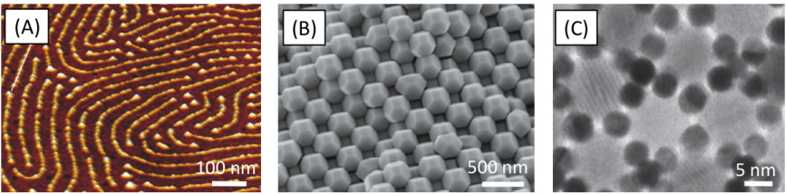{width=70%} Figure 1.1: Long-range aligned self-assembled MMs. (A) Scanning force micrograph of TiO$_2$ NPs that are self-assembled by block-copolymers [63]. (B) Scanning electron micrograph (SEM) of self-assembled Ag truncated octahedra NPs into their densest packing by sedimentation [72]. (C) Transition electron micrograph (TEM) of a self-assembled dodecagonal quasicrystal made of a binary mixture of Au and Fe$_2$O$_3$ NPs [73].

evaporation of a solution including the NPs. Commonly, in a preceding process step the NPs are coated by a polymer to define their interparticle distance and therewith the optical coupling strength [90]. The evaporation is usually performed on a substrate and yields two-dimensional meta-atoms. Various geometries have been realized such as, e.g., trimer [91], heptamer [86, 90] and quadrumer clusters [92]. Another widely used self-assembly technique (working on the short-range) to fabricate the meta-atoms is to use DNA [93]. After pioneering work [57, 94] more complex geometries have been achieved [95], such as, e.g., trimer [96] and tetramer clusters [97], binary mixtures of NPs [98], dimers made of asymmetric NPs [99], heteropentamer NP clusters [100], and chains of NPs [101]. All these meta-atoms are in principle planar ones, i.e. two-dimensionally arranged on a substrate. However, even three-dimensional meta-atoms can be fabricated by DNA as demonstrated in the case of Janus particles [102]. More sophisticated techniques such as, e.g., DNA-guided crystallization [103], DNA-scaffolds [104] or DNA-origami [105–108] yields three-dimensional meta-atoms as well. Apart from DNA self-assembly, organic molecular linkers are a prominent technique of the short-range alignment group. Various meta-atom geometries such as again dimers and trimers [58], pyramidal structures [109] or larger aggregates of NPs were realized [110–112]. Electrostatic forces to assemble charged NPs into a desired meta-atom serve as another example of short-range alignment [113]. Manifold two- [114–117] or three-dimensional [118–121] meta-atoms have been fabricated. The advantage of this technique is its applicability to almost all chargeable NPs independently on most of the chemical and physical properties of the NPs. The modification of the NPs surface by so-called surfactants is another way to achieve short-range self-assembly [122, 123]. In combination with capillary forces [124] controllable separations of NPs in the sub-nanometer regime have been reported [125]. A more specialized short-range order technique is the directional solidification of eutectics. The successful fabrication of split-ring resonator (SRR) like structures [126] and polaritonic MMs for THz applications [127] have been demonstrated. Furthermore, short-range self-assembly of meta-atoms has been realized by introducing defect states in liquid crystals [128]. In

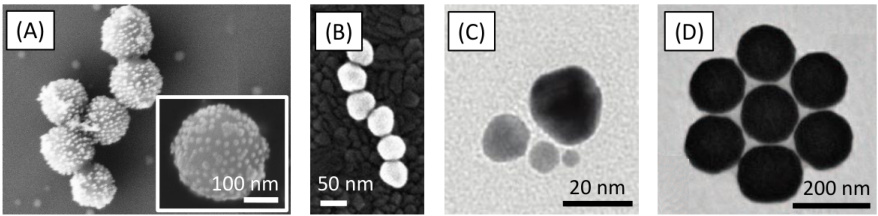{width=71%} Fig. 1.2 some meta-atoms made by self-assembly techniques working on the short-range can be s Figure 1.2: Short-range aligned self-assembled MMs. (A) SEM image of plasmonic core-shell clusters made of Au NPs attached to a dielectric core by electrostatic forces [118]. (B) SEM image of a self-assembled Au NP chain by DNA [101]. (C) TEM image of self-assembled Au NPs into a pyramidal structure by DNA [104]. (D) TEM image of an Au heptamer cluster self-assembled by evaporation [90].

Regarding both groups of self-assembled MMs the following remarks are in order. A majority of MMs of the long-range group appear planar fashioned on a substrate. Only a minor part of the self-assembly techniques that allow a control over the spatial alignment of meta-atoms can fabricate three-dimensional MMs. Furthermore, most of the meta-atoms of the long-range group consist solely of one single resonant NP. More sophisticated meta-atoms are still hard to achieve with respect to a long-range alignment. Consequently, this allows only for a very limited optical response of the entire MM. Just a few examples exists for long-range MMs where the optical response differs from that of spatially diluted NPs. For example artificial magnetism has been demonstrated for stripes made of NPs [81]. In contrast, the short-range order group allows to fabricate sophisticated meta-atoms consisting of a precise alignment of many NPs. This is possible either for two- as well as for three-dimensional meta-atoms. Therewith, a complex optical responses of the meta-atoms can be achieved, e.g., Fano [90, 92, 100] or magnetic dipole resonances [91, 100, 118]. However, short-range self-assembly does not allow to control the meta-atom positions and hence their alignment is amorphous. An overview about different self-assembly techniques categorized with respect to the achieved alignment and dimension of the meta-atoms is given in Fig. 1.3.

# 1.2 Advantages and issues of self-assembled metamaterials

From Figs. 1.1 to 1.3 it can already be seen that self-assembled bottom-up MMs differ tremendously from the commonly investigated MMs made by top-down nanofabrication techniques. A short comparison of both MM types is now given for the purpose of identifying advantages and challenges of self-assembled MMs.

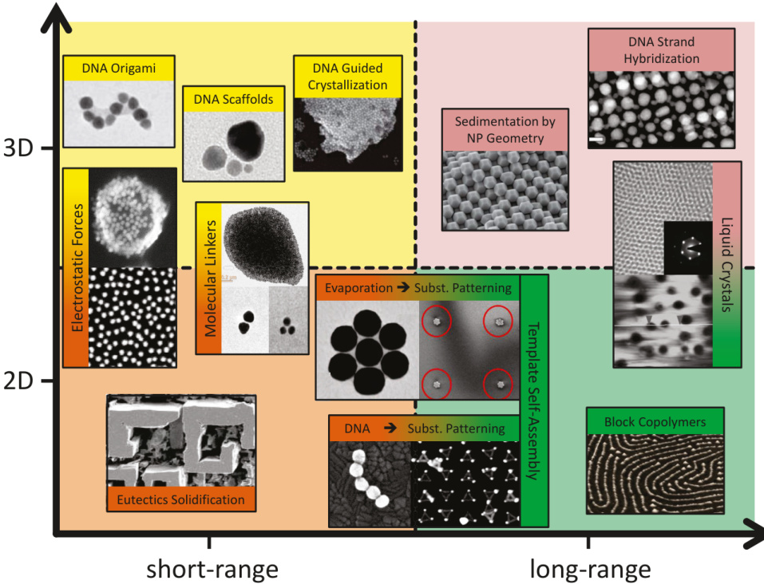{width=77%} Figure 1.3: Schematic diagram showing a representative set of self-assembly techniques. The images of the fabricated structures are arranged with respect to the spatial alignment of the meta-atoms on the $x$-axis and their dimension on the $y$-axis. On the bottom left (orange area) self-assembly techniques are listed that yield short-range, two-dimensional meta-atoms: directional solidification of eutectics [126], electrostatic forces [114], molecular linkers [109], evaporation of solutions including the NPs [90], and DNA self-assembly [101]. The top left (yellow area) includes self-assembly techniques that result in short-range but three-dimensional meta-atoms: electrostatic forces [118] and molecular linkers [110] (they offer two- as well as three dimensional meta-atoms and appear in both quadrants), DNA origami [108], DNA scaffolds [104], and DNA guided crystallization [103]. On bottom right (green area) techniques that allow for two-dimensional long-range alignment are shown: evaporation [86] and DNA [76] can be adapted to offer long range alignment by substrate patterning (template self-assembly), block-copolymers [63], and liquid crystals [68]. The last one also allows for fully three-dimensional long-range meta-atoms and therefore it appears on the top left (pink area) as well [67] in one line with DNA strand hybridization [74] and sedimentation of NPs by geometry [72].

Top-down MMs are usually fabricated by lithographic processes or direct writing resulting in a sequential fabrication of meta-atoms. Commonly planar MMs are achieved by such techniques [129]. The possibility to fabricate bulk MMs with an essential extension into the third-dimension remains limited. Only a few approaches exist to fabricate three-dimensional MMs, e.g., a stacking of different layers of the meta-atoms [130] or by direct laser writing [40].

Furthermore, the sequential fabrication renders top-down approaches slow and expensive compared to their bottom-up counterparts. A big advantage of self-assembly is that a huge class of these techniques takes place already in solution and therefore it is straightforward to fabricate three-dimensional MMs. Furthermore, self-assembly happens everywhere in solution and no sequential fabrication of meta-atoms occurs. This allows the fabrication of large volumes of bottom-up MMs to be incredibly fast and even cheaper compared to top-down MMs. Another difference between top-down and bottom-up MMs is linked to the feature sizes that can be controlled. The resolution limit of top-down techniques is obviously limited, e.g. by the spot size of the writing process. Today, highly sophisticated techniques, such as electron beam lithography using hydrogen silsesquioxane as a resist can reach resolutions slightly less than 10 nm [131, 132]. However, up to date the international technology roadmap for semiconductors predicts a possible fabrication of CMOS chips with 14 nm resolution in the next two years [133]. So it remains challenging to fabricate MMs with small feature sizes by relying on top-down techniques. In contrast, for self-assembly processes no such limit exists, i.e. the minimal distance that can be controlled is given by, e.g., the length of a linker molecule. Typical separations down to one nm are reported [114, 117] and even sub-nm separations have been achieved [125].

Apart from these obvious advantages of bottom-up fabrication a few more differences exist compared to top-down techniques. In most cases, the meta-atoms of top-down MMs consist of elongated metal wires like for a SRR. On the contrary, self-assembled meta-atoms are almost all made of an alignment of resonant NPs. This difference in nature of the meta-atoms has a pivotal impact. Most importantly, usual design strategies for top-down MMs cannot be adapted for self-assembled MMs. Consequently, completely new designs have to be developed for self-assembled MMs to achieve a desired optical response. A further important difference between top-down and bottom-up MMs is the alignment of the meta-atoms. Since in top-down fabrication techniques every meta-atom is sequentially fabricated, highly periodic MMs can be achieved, i.e. the long-range order can be controlled at will. This allows an exact description of these MMs by rigorously solving Maxwell's equations on the base of Bloch eigenmodes. In contrast, as has been previously discussed, almost all self-assembled MMs with a non-trivial optical response exhibit an amorphous arrangement of meta-atoms. Most importantly, the amorphous arrangement results in an isotropic response of the MM, as it is well-known for natural amorphous materials, such as glass. However, amorphous MMs require completely novel physical approaches to describe the light propagation in these structures. Common concepts from periodic top-down MMs such as Bloch eigenmodes are no longer applicable to describe amorphous MMs.

The possibility to fabricate bulk materials at large scale and of low cost renders the investigation of self-assembled MMs as a very promising direction of research. Thus bottom-up self-assembled MMs carry appealing promises but, in addition, important issues remain

to be solved. The next section lays out the aim of the thesis which is to mitigate and solve some of the challenges of self-assembled MMs in order to further improve this promising field of MMs.

# 1.3 Aim and structure of the thesis

At the time when the work on this thesis started, only little was known concerning self-assembled MMs and only a few basic ideas had been formulated that gave, however, rise to many speculations. The field seemed to be very promising to solve some of the pertinent problems associated with traditional top-down MMs [8]. However, the language to discuss the optical properties of self-assembled MMs was not yet developed. Furthermore, the theoretical and numerical means to quantify their response (that is a prerequisite for a numerical optimization) were not available and suggestions for the actual design of meta-atoms were not yet given. To find answers to all these issues the focus of this thesis is on the investigation and description of the optical response of amorphous self-assembled MMs.

As discussed previously, these are very promising structures that should allow to overcome most of the limitations of conventional top-down MMs. The thesis is aimed of significantly contributing and improving this rather new and quickly evolving scientific field.

The first goal is the introduction and development of a feasible theoretical description of amorphous MMs. Most notably, with respect to experimental realizations, this should result in new design rules to achieve a desired optical response allowing extraordinary applications. To date, it is possible to fabricate highly sophisticated structures by chemical self-assembly. However, in most of the cases the optical properties are not considered or the interpretation of the observed effects is done on rather simplifying physical pictures. Therefore, the development of a theoretical description of amorphous MMs is an important step to bridge the gap between what is possible from the fabrication side and what is required from theory.

Once the theory is established the second goal in this thesis is on experimental realizations of self-assembled MMs. The advantage and also the challenge of self-assembled MMs is the involvement of two scientific disciplines, chemistry and physics. Therefore, apart from a theoretical description of self-assembled MMs it is important to understand the requirements and restrictions from the chemical side to develop new materials. This can be only achieved in strong collaborations with partners from chemistry. The second goal of the thesis is to propose, in strong collaborations with chemists, new designs for MMs that can be fabricated later on by devoted self-assembly techniques. It should be stressed that for some presented structures of this thesis the innovation was vice versa. In other words, chemists were already able to fabricate very promising structures and it was on the theoretical side to describe the optical properties of the resulting MM.

The content of this thesis has found its way into two book chapters, more than 15 publi

cations in peer-reviewed international journals, including one review article, and numerous invited and contributed conference contributions. The following chapters of this thesis reproduce the most important findings of this work and put them in a general and comprehensive context.

The thesis is structured as follows. The next chapter outlines the fundamentals of the theoretical description of self-assembled MMs. Subsequently, in Chap. 3, design proposals and applications of planar self-assembled MMs, so-called meta-surfaces, are given and Chap. 4 summarizes possible three-dimensional MMs. Finally, a conclusion summarizes the major goals of the thesis and an outlook is given about open questions. Furthermore, this last chapter shortly outlines further research directions, e.g. the interaction of self-assembled meta-atoms with quantum-mechanical systems.

# 2 Theoretical background

Wenn man die Probleme nur mathematisch bewältigen will, so darf man die paradoxesten Annahmen machen.

GUSTAV MIE

This chapter of the thesis sets the stage for the theoretical and numerical description of the interaction of light with amorphous MMs on the base of Maxwell's equations. At the beginning, in Sec. 2.1, the general electromagnetic scattering problem is introduced. Maxwell's equations are reduced to the Helmholtz equation and common methods are discussed how to solve it. The subsequent Sec. 2.2 describes the solution of the Helmholtz equation for the electromagnetic scattering of a single sphere. The formalism is well-known as Mie theory. In Sec. 2.3 a very powerful tool to understand the interaction of light with single meta-atoms is introduced. The so-called multipole analysis of meta-atoms is based on the eigenfunctions known from Mie theory. After a formal introduction representative examples of meta-atoms are discussed. It is shown that for a given incident field all excited Cartesian multipole moments of a meta-atom can be revealed. This allows an association of resonances in the far-field with excited multipole moments of the meta-atom. This multipole analysis is one important step to describe the light propagation through amorphous MMs, as it is analyzed in detail in Sec. 2.4. This section starts with a short discussion on effective material parameters and spatial dispersion. Afterwards, the multipole analysis of meta-atoms of Sec. 2.3 is exploited to obtain effective material parameters of an amorphous MM. This is achieved by using effective medium theories. The benefit of this approach is revealed and a proof-of-principle is given by an representative example. Finally, the special case of anisotropic meta-atoms as well as the limitations of the presented formalism are discussed. The last section of this chapter is on more technical grounds. In Sec. 2.5 the analytical solution of Maxwell's equations for a cluster of spheres is introduced. This is a very powerful tool since most self-assembled MMs are made of spherical NPs, as discussed in Chap. 1. Therefore, the meta-atoms of these MMs can be safely assumed as clusters of perfect spheres. This chapter ends with a short section giving some concluding remarks.

# 2.1 The electrodynamic scattering problem

Consider a situation as shown in Fig. 2.1. There, an incident electromagnetic field impinges on an arbitrary particle, called the scatterer. The given incident field will be disturbed by the particle resulting in a yet unknown scattered field and a field inside the particle, the internal field. To obtain the entire electromagnetic field of such a scattering problem the solution of Maxwell's equations is required. In time domain they read as [52]

$$
\nabla \cdot \mathbf { D } ( \mathbf { r } , t ) = 0 \ ,
$$

$$
\nabla \cdot \mathbf { B } ( \mathbf { r } , t ) = 0 \ ,
$$

$$
\nabla \times \mathbf { E } ( \mathbf { r } , t ) + \frac { \partial } { \partial t } \mathbf { B } ( \mathbf { r } , t ) = 0 \ ,  \nabla \times \mathbf { H } ( \mathbf { r } , t ) - \frac { \partial } { \partial t } \mathbf { D } ( \mathbf { r } , t ) = \mathbf { j } _ { \mathrm { m a c r } } ( \mathbf { r } , t ) \ ,
$$

with the dielectric displacement $\mathbf{D}$, the electric field $\mathbf{E}$, the magnetic field $\mathbf{H}$, the magnetic induction $\mathbf{B}$, and the macroscopic current density $\mathbf{j}_{\mathrm{macr}}$. No external charges appear as it is usually considered in optics. Therefore, the macroscopic current density contains only the conducting current density $\mathbf{j}_{\mathrm{cond}}$ and the convection part is zero.

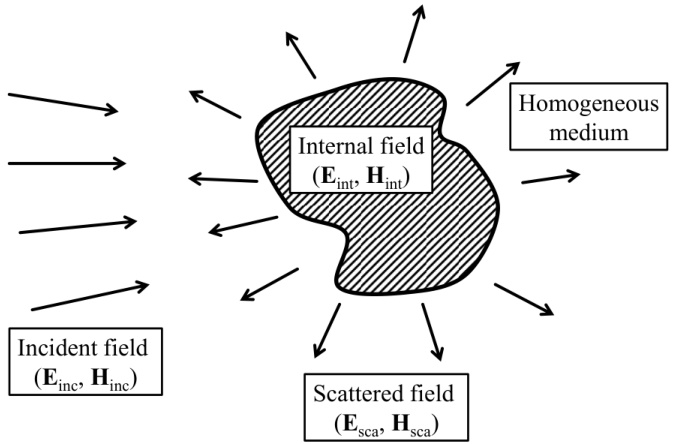{width=54%} Figure 2.1: Schematic of the general electromagnetic scattering problem. An incident field ($\mathbf{E}_{\mathrm{inc}}$, $\mathbf{H}_{\mathrm{inc}}$) impinging on a scatterer (shaded region) generates a scattered ($\mathbf{E}_{\mathrm{sca}}$, $\mathbf{H}_{\mathrm{sca}}$) as well as an internal field ($\mathbf{E}_{\mathrm{int}}$, $\mathbf{H}_{\mathrm{int}}$).

The scatterer is considered to be made of a local, isotropic, homogeneous and linear material. The same holds for the surrounding. Although this sounds restrictive, it actually is an adequate choice for all materials from which common optical MMs are fabricated, such as metals (e.g. silver and gold) or dielectrics (glass, silicon, etc.). The general idea on the solution of the scattering problem is the following. The scatterer and the surrounding are subspaces that are homogeneous. In these subspaces Maxwell's equations are solved by an expansion of the fields into the eigenmodes of the homogeneous space. Afterwards, the

boundary conditions at the boundary of the subspaces (in the present configuration this is the surface of the scatterer) are taken into account to connect the expansions in both subspaces.

In the following part the possibility to solve Maxwell's equations on the base of eigenmodes is discussed. We consider the constitutive relations of homogeneous, local, linear and isotropic materials. They can be written as algebraic equations in frequency domain (quantities labeled by a bar denote the frequency space) and read as

$$
\begin{array}{r} { \overline { { \mathbf { D } } } ( \mathbf { r } , \omega ) = \varepsilon _ { 0 } \varepsilon ( \omega ) \overline { { \mathbf { E } } } ( \mathbf { r } , \omega ) \ , } \\{ \overline { { \mathbf { B } } } ( \mathbf { r } , \omega ) = \mu _ { 0 } \mu ( \omega ) \overline { { \mathbf { H } } } ( \mathbf { r } , \omega ) \ , } \\{ \overline { { \mathbf { J } } } _ { \mathrm { c o n d } } ( \mathbf { r } , \omega ) = \sigma ( \omega ) \overline { { \mathbf { E } } } ( \mathbf { r } , \omega ) \ , } \end{array}
$$

where $\varepsilon$, $\mu$, and $\sigma$ are the permittivity, permeability, and the conductivity of the material, respectively. The free space permittivity and permeability are given in SI units as $\varepsilon_0 \approx 8.854 \cdot 10^{-12} \, \mathrm{Fm}^{-1}$ and $\mu_0 = 4\pi \cdot 10^{-7} \, \mathrm{Hm}^{-1}$. The Fourier transformation transforms a vector field from temporal domain $\mathbf{A}(\mathbf{r}, t)$ to frequency space $\overline{\mathbf{A}}(\mathbf{r}, \omega)$ in the following way

$$
\begin{array}{r} { \mathbf { A } ( \mathbf { r } , t ) = \int _ { - \infty } ^{\infty} \overline { { \mathbf { A } } } ( \mathbf { r } , \omega ) \, e ^{- i \omega t} d \omega \ , } \\{ \overline { { \mathbf { A } } } ( \mathbf { r } , \omega ) = \frac { 1 } { 2 \pi } \int _ { - \infty } ^{\infty} \mathbf { A } ( \mathbf { r } , t ) \, e ^{i \omega t} d t \ . } \end{array}
$$

Therewith, in frequency domain (with the above defined constitutive relations) Maxwell's equations read as

$$
\begin{array}{rlr} & { } & { \nabla \cdot \overline { { \mathbf { E } } } ( \mathbf { r } , \omega ) = 0 \; , } \\& { } & { \nabla \times \overline { { \mathbf { H } } } ( \mathbf { r } , \omega ) = 0 \; , } \\& { } & { \nabla \times \overline { { \mathbf { E } } } ( \mathbf { r } , \omega ) = i \omega \mu _ { 0 } \mu ( \omega ) \overline { { \mathbf { H } } } ( \mathbf { r } , \omega ) \; , \; \; \nabla \times \overline { { \mathbf { H } } } ( \mathbf { r } , \omega ) + i \omega \varepsilon _ { 0 } \varepsilon ( \omega ) \overline { { \mathbf { E } } } ( \mathbf { r } , \omega ) = \sigma ( \omega ) \overline { { \mathbf { E } } } ( \mathbf { r } , \omega ) \; . } \end{array}
$$

By taking the curl of Eqs. 2.6 and considering the divergence equations (Eqs. 2.5) the Helmholtz equation for the electric and magnetic field can be derived

$$
\Delta \overline { { \mathbf { E } } } ( \mathbf { r } , \omega ) + \frac { \omega ^{2} } { c ^{2} } \hat { \varepsilon } ( \omega ) \mu ( \omega ) \overline { { \mathbf { E } } } ( \mathbf { r } , \omega ) = 0 \; ,  \Delta \overline { { \mathbf { H } } } ( \mathbf { r } , \omega ) + \frac { \omega ^{2} } { c ^{2} } \hat { \varepsilon } ( \omega ) \mu ( \omega ) \overline { { \mathbf { H } } } ( \mathbf { r } , \omega ) = 0 \; ,
$$

where $c$ is the speed of light in vacuum and the following generalized permittivity $\hat{\varepsilon}$ has been introduced

$$
\hat { \varepsilon } ( \omega ) = \varepsilon ( \omega ) + \frac { i \sigma ( \omega ) } { \varepsilon _ { 0 } \omega } \ .
$$

Of course the Helmholtz equation can be solved by devoted numerical methods. However, here a commonly used technique should be introduced that is convenient to provide a physical insight into the scattering process. It is based on an expansion of the electromagnetic field

into the eigenmodes of the Helmholtz equation. An analytical solution of this equation is possible in eleven coordinate systems [134], such as, e.g., spherical or Cartesian coordinates. These coordinate systems are known to allow a separation of coordinates for the Laplace operator. The appropriate choice of the coordinate system (and therewith the resulting eigenmodes) depends on the the geometrical shape of the scatterer. The expansion of the electric and magnetic fields into a chosen set of eigenmodes $\mathbf{A}_j$ of the Helmholtz equation reads as [135]

$$
\overline { { \mathbf { E } } } ( \mathbf { r } , \omega ) = \sum _ { j } c _ { j } ( \omega ) \overline { { \mathbf { A } } } _ { j } ( \mathbf { r } , \omega ) \; ,  \overline { { \mathbf { H } } } ( \mathbf { r } , \omega ) = \sum _ { j } d _ { j } ( \omega ) \overline { { \mathbf { A } } } _ { j } ( \mathbf { r } , \omega ) \; ,
$$

with the complex expansion coefficients $c_{j}$ and $d_{j}$ of the electric and magnetic field, respectively. In Cartesian coordinates the eigenmodes are simply plane waves [52]

$$
\overline { { \mathbf { A } } } _ { j } ^{\mathrm { p w} } ( \mathbf { r } , \omega ) = \exp \left[ i \mathbf { k } _ { j } ( \omega ) \mathbf { r } \right] \, .
$$

Inserting the field decomposition of Eq. 2.9 for plane waves as eigenmodes into the Helmholtz equation (Eq. 2.7) yields the dispersion relation of these modes in a local, isotropic, homogeneous, linear medium

$$
k _ { j } ^{2} ( \omega ) = \frac { \omega ^{2} } { c ^{2} } \hat { \varepsilon } ( \omega ) \mu ( \omega ) \ .
$$

The dispersion relation links the material properties $\hat{\varepsilon}, \mu$ to the characteristics that describe the spatial evolution of the plane waves, i.e. the wavevector $\mathbf{k}$. From now on, for the rest of the thesis every quantity is given in frequency space, if nothing else is explicitly stated. Therefore, we omit the frequency $\omega$ as explicit argument and quantities in frequency space are no longer denoted by a bar. Furthermore, the generalized permittivity $\hat{\varepsilon}$ is simply written as $\varepsilon$.

It has been shown that Maxwell's equations can be reduced to the Helmholtz equation for linear, local, isotropic and homogeneous materials. The Helmholtz equation can be solved in homogeneous space by an expansion of the fields into eigenmodes. Now, the scattering problem as introduced in Fig. 2.1 should be solved. Therefore, the boundary conditions between the homogeneous scatterer and the surrounding needs to be specified. In a preliminary step the electric and magnetic fields are decomposed into three parts

$$
\begin{array}{r} { \mathbf { E } ( \mathbf { r } ) = \mathbf { E } _ { \mathrm { i n c } } ( \mathbf { r } ) + \mathbf { E } _ { \mathrm { s c a } } ( \mathbf { r } ) + \mathbf { E } _ { \mathrm { i n t } } ( \mathbf { r } ) \ , } \\{ \mathbf { H } ( \mathbf { r } ) = \mathbf { H } _ { \mathrm { i n c } } ( \mathbf { r } ) + \mathbf { H } _ { \mathrm { s c a } } ( \mathbf { r } ) + \mathbf { H } _ { \mathrm { i n t } } ( \mathbf { r } ) \ , } \end{array}
$$

which are the incident fields $\mathbf{E}_{\mathrm{inc}}$, $\mathbf{H}_{\mathrm{inc}}$ illuminating the scatterer and the scattered fields $\mathbf{E}_{\mathrm{sca}}$, $\mathbf{H}_{\mathrm{sca}}$ defined in the surroundings as well as the internal fields $\mathbf{E}_{\mathrm{int}}$, $\mathbf{H}_{\mathrm{int}}$ defined inside the scatterer. They are connected to each other by the boundary conditions at the surface

$S$ of the scatterer [54]

$$
\begin{array}{r} { [ \mathbf { E } _ { \mathrm { i n c } } ( \mathbf { r } _ { S } ) + \mathbf { E } _ { \mathrm { s c a } } ( \mathbf { r } _ { S } ) ] \times \mathbf { n } = \mathbf { E } _ { \mathrm { i n t } } ( \mathbf { r } _ { S } ) \times \mathbf { n } \ , } \\{ [ \mathbf { H } _ { \mathrm { i n c } } ( \mathbf { r } _ { S } ) + \mathbf { H } _ { \mathrm { s c a } } ( \mathbf { r } _ { S } ) ] \times \mathbf { n } = \mathbf { H } _ { \mathrm { i n t } } ( \mathbf { r } _ { S } ) \times \mathbf { n } \ , } \end{array}
$$

with $\mathbf{n}$ being the vector normal to the surface $S$ of the scatterer that is described by $\mathbf{r}_{S}$. It is important to note that in three dimensions each boundary condition splits into two independent equations of distinct field components [136]. For a sphere as a scatterer this would be the $\theta$ and $\varphi$ component in spherical coordinates. Furthermore, if the scattered and the incident fields are known the internal field can be extracted from the boundary conditions. Physically this means, as expected, that the internal field carries no additional information and the solution of the scattering problem can be reduced to computing the scattered field for a given illumination.

The solution of the scattering problem, as sketched in Fig. 2.1 is the following. The incident and the scattered field are decomposed into a chosen set of eigenfunctions

$$
\mathbf { E } _ { \mathrm { i n c } } ( \mathbf { r } , \omega ) = \sum _ { j = 1 } ^{n} p _ { j } ( \omega ) \mathbf { A } _ { j } ( \mathbf { r } , \omega ) \; ,  \mathbf { E } _ { \mathrm { s c a } } ( \mathbf { r } , \omega ) = \sum _ { j = 1 } ^{n} a _ { j } ( \omega ) \mathbf { A } _ { j } ( \mathbf { r } , \omega ) \; ,
$$

with the expansion coefficients $p_{i}$ of the incident and $a_{i}$ of the scattered field, the latter ones are termed scattering coefficients. Since the incident field is assumed to be known, its expansion coefficients can be obtained by using orthogonality relations of the eigenmodes. The scattering coefficients are computed by applying the boundary conditions at the surface of the scatterer, as given by Eq. 2.13. The transformation between the coefficients of the incident field to the scattering coefficients is described by the so-called T-matrix [137, 138]. It is a general concept in the context of the scattering problem. The T-matrix is defined as follows

$$
\left( \begin{array}{l} { a _ { 1 } } \\{ a _ { 2 } } \\{ \vdots } \\{ a _ { n } } \end{array} \right) = \left( \begin{array}{llll} { T _ { 11 } } & { T _ { 12 } } & { \cdots } & { T _ { 1 n } } \\{ T _ { 21 } } & { T _ { 22 } } & { \cdots } & { T _ { 2 n } } \\{ \vdots } & { \vdots } & { \ddots } & { \vdots } \\{ T _ { n 1 } } & { T _ { n 2 } } & { \cdots } & { T _ { n n } } \end{array} \right) \left( \begin{array}{l} { p _ { 1 } } \\{ p _ { 2 } } \\{ \vdots } \\{ p _ { n } } \end{array} \right)
$$

The T-matrix is a square matrix the order of which depends on the number $n$ of modes that haven been taken into account to describe the fields by eigenfunctions (cf. Eq. 2.14). In general, $n$ has to be sufficiently large to appropriately describe the electromagnetic field everywhere in space. However, in practice only a finite number of eigenmodes is considered reflecting the fact that the scatterer itself is finite as well.

To sum up, the scattering problem of Fig. 2.1 has been solved by the well-known concept of eigenmodes. Therewith, the solution of Maxwell's equations has been reduced to the calculation of the elements of the T-matrix. Once they are known, the scattered field can be

calculated everywhere in space for a given illumination. It is obvious that for an arbitrary scatterer the calculation of the T-matrix is a highly complex task. The entries depend on the material parameters, the shape of the scatterer, and also reflect the boundary conditions. Analytical solutions are only known for highly symmetric scatterers such as e.g., spheres [139], ellipsoids [140] or clusters of spheres [141, 142]. For any other geometry the T-matrix entries have to be computed numerically [143–145]. In the next section the T-matrix is introduced for the most important symmetric scatterer in the context of this thesis; a single sphere.

# 2.2 Scattering by a single sphere

Consider the scatterer shown in Fig. 2.1 to be a perfect sphere with radius $a$ made of a homogeneous, local, linear, and isotropic material described by $\varepsilon_{\mathrm{sph}}(\omega), \mu_{\mathrm{sph}}(\omega)$ embedded in a surrounding with $\varepsilon(\omega), \mu(\omega)$. This scattering problem is known as Mie scattering of a single sphere [146, 147], or simply Mie theory. The Helmholtz equation (Eq. 2.7) is solved by a separation of the Laplace operator in spherical coordinates $(r, \theta, \varphi)$. The resulting eigenfunctions are the so-called vector spherical harmonics (VSHs) $\mathbf{M}$ and $\mathbf{N}$. They are defined as [54, 148]

$$
\begin{array}{rl} & { \mathbf { M } _ { n m } ^{( J )} ( r , \theta , \varphi ) = [ i \pi _ { n m } ( \cos \theta ) \hat { \mathbf { e } } _ { \theta } - \tau _ { n m } ( \cos \theta ) \hat { \mathbf { e } } _ { \varphi } ] \, \Psi _ { n } ^{( J )} ( k r ) e ^{i m \varphi} \ , } \\& { \mathbf { N } _ { n m } ^{( J )} ( r , \theta , \varphi ) = n ( n + 1 ) P _ { n } ^{m} ( \cos \theta ) \frac { \Psi _ { n } ^{( J )} ( k r ) } { k r } e ^{i m \varphi} \, \hat { \mathbf { e } } _ { r } } \\& {   + \left[ \tau _ { n m } ( \cos \theta ) \hat { \mathbf { e } } _ { \theta } + i \pi _ { n m } ( \cos \theta ) \hat { \mathbf { e } } _ { \varphi } \right] \frac { 1 } { k r } \frac { d } { d r } \left[ r \Psi _ { n } ^{( J )} ( k r ) \right] e ^{i m \varphi} \ , } \end{array}
$$

where $\hat{\mathbf{e}}_{r}$, $\hat{\mathbf{e}}_{\theta}$, $\hat{\mathbf{e}}_{\varphi}$ are the unit vectors in spherical coordinates. The function $\Psi_{n}^{(J)}$ describing the radial dependency of the VSHs refers to one kind of the four spherical Bessel functions: $J=1$ to the spherical Bessel function $j_{n}$, $J=2$ to the spherical Neumann function $y_{n}$ and $J=3,4$ to the spherical Hankel functions of the first and second kind $h_{n}^{(1)}, h_{n}^{(2)}$, respectively. The dependency on $\theta$ of the VSHs is described by the associated Legendre function of the first kind $P_{n}^{m}$ of degree $n$ and order $m$ and by the two functions $\tau_{nm}$ and $\pi_{nm}$ that are defined as follows

$$
\begin{array}{r} { \tau _ { n m } ( \cos \theta ) = \frac { d } { d \theta } P _ { n } ^{m} ( \cos \theta ) \ , } \\{ \pi _ { n m } ( \cos \theta ) = \frac { m } { \sin \theta } P _ { n } ^{m} ( \cos \theta ) \ . } \end{array}
$$

The VSHs $\mathbf{N}$, $\mathbf{M}$ of Eq. 2.16 allow an expansion of the incident and scattered electromagnetic fields according to Eq. 2.14 [148, 149]

with $Z=\sqrt{\mu_{0}\mu/\varepsilon_{0}\varepsilon}$ being the impedance of the surrounding, $p_{nm},q_{nm}$ the expansion coefficients of the incident field and $a_{nm},b_{nm}$ the scattering coefficients. The prefactor $E_{nm}$ is chosen variably in literature. Here, the historical motivated definition from Ref. [54] is applied

where $|\mathbf{E}_{0}|$ is the magnitude of the incident electric field. It is worth to mention that only two of the four spherical Bessel functions of the VSHs are used to expand the fields; namely the spherical Bessel function and the spherical Hankel function of the first kind. The spherical Bessel function has no singularity at $\mathbf{r}=0$ and is used to expand the incident field. The spherical Hankel function of first kind takes the form of an outgoing spherical wave for $kr\to\infty$ and the chosen time dependency of Eq. 2.4 [150]. Therefore, this function is used to expand the scattered field in Eq. 2.18. Applying the boundary conditions (cf. Eq. 2.13) at the surface of the sphere yields the connection between the expansion coefficients of the incident field $(p_{nm},q_{nm})$ and the scattering coefficients $(a_{nm},b_{nm})$

$$
E _ { n m } = | \mathbf { E } _ { 0 } | \, i ^{n} ( 2 n + 1 ) \frac { ( n - m ) ! } { ( n + m ) ! } \, ,
$$

$$
a _ { n m } = a _ { n } p _ { n m } \ ,  b _ { n m } = b _ { n } q _ { n m } \ ,
$$

where $a_{n}, b_{n}$ are the well-known Mie coefficients that are defined as [54, 146]

$$
\begin{array}{r} { a _ { n } = \frac { \mu \eta ^{2} j _ { n } ( \eta x ) [ x j _ { n } ( x ) ] ^{\prime} - \mu _ { \mathrm { s p h } } j _ { n } ( x ) [ \eta x j _ { n } ( \eta x ) ] ^{\prime} } { \mu \eta ^{2} j _ { n } ( \eta x ) [ x h _ { n } ^{( 1 )} ( x ) ] ^{\prime} - \mu _ { \mathrm { s p h } } h _ { n } ^{( 1 )} ( x ) [ \eta x j _ { n } ( \eta x ) ] ^{\prime} } \, , } \\{ b _ { n } = \frac { \mu _ { \mathrm { s p h } } j _ { n } ( \eta x ) [ x j _ { n } ( x ) ] ^{\prime} - \mu _ { \mathrm { s p h } } j _ { n } ( x ) [ \eta x j _ { n } ( \eta x ) ] ^{\prime} } { \mu _ { \mathrm { s p h } } j _ { n } ( \eta x ) [ x h _ { n } ^{( 1 )} ( x ) ] ^{\prime} - \mu h _ { n } ^{( 1 )} ( x ) [ \eta x j _ { n } ( \eta x ) ] ^{\prime} } \, . } \end{array}
$$

$$
\begin{array}{rl} & { \mathbf { E } _ { \mathrm { i n c } } ( \mathbf { r } , \omega ) = - \sum _ { n = 1 } ^{\infty} \sum _ { m = - n } ^{n} i E _ { n m } \left[ p _ { n m } ( \omega ) \mathbf { N } _ { n m } ^{( 1 )} ( \mathbf { r } , \omega ) + q _ { n m } ( \omega ) \mathbf { M } _ { n m } ^{( 1 )} ( \mathbf { r } , \omega ) \right] \ , } \\& { \mathbf { H } _ { \mathrm { i n c } } ( \mathbf { r } , \omega ) = - \frac { 1 } { Z } \sum _ { n = 1 } ^{\infty} \sum _ { m = - n } ^{n} E _ { n m } \left[ q _ { n m } ( \omega ) \mathbf { N } _ { n m } ^{( 1 )} ( \mathbf { r } , \omega ) + p _ { n m } ( \omega ) \mathbf { M } _ { n m } ^{( 1 )} ( \mathbf { r } , \omega ) \right] \ , } \\& { \mathbf { E } _ { \mathrm { s c a } } ( \mathbf { r } , \omega ) = \sum _ { n = 1 } ^{\infty} \sum _ { m = - n } ^{n} i E _ { n m } \left[ a _ { n m } ( \omega ) \mathbf { N } _ { n m } ^{( 3 )} ( \mathbf { r } , \omega ) + b _ { n m } ( \omega ) \mathbf { M } _ { n m } ^{( 3 )} ( \mathbf { r } , \omega ) \right] \ , } \\& { \mathbf { H } _ { \mathrm { s c a } } ( \mathbf { r } , \omega ) = \frac { 1 } { Z } \sum _ { n = 1 } ^{\infty} \sum _ { m = - n } ^{n} E _ { n m } \left[ b _ { n m } ( \omega ) \mathbf { N } _ { n m } ^{( 3 )} ( \mathbf { r } , \omega ) + a _ { n m } ( \omega ) \mathbf { M } _ { n m } ^{( 3 )} ( \mathbf { r } , \omega ) \right] \ , } \end{array}
$$

The prime in Eq. 2.21 indicates a differentiation with respect to the argument in parenthesis. The Mie coefficients depend on two dimensionless parameters

$$
x = \frac { \omega } { c } \sqrt { \varepsilon ( \omega ) \mu ( \omega ) } a \; \; , \; \; \; \eta = \sqrt { \frac { \varepsilon _ { \mathrm { s p h } } ( \omega ) \mu _ { \mathrm { s p h } } ( \omega ) } { \varepsilon ( \omega ) \mu ( \omega ) } } \; \; ,
$$

that account for the radius of the sphere with respect to the wavelength in the surrounding (termed the size parameter) and to the refractive index contrast between the sphere and the surrounding. From Eq. 2.20 it is clear that the T-matrix takes a simple diagonal form containing the Mie coefficients of a single sphere

$$
\left( \begin{array}{l} { a _ { 1 m } } \\{ a _ { 2 m } } \\{ \vdots } \\{ a _ { n m } } \\{ b _ { 1 m } } \\{ b _ { 2 m } } \\{ \vdots } \\{ b _ { n m } } \end{array} \right) = \left( \begin{array}{lllll} { a _ { 1 } } & { a _ { 2 } } & { \cdots } & { a _ { n } } & { b _ { 1 } } \\{  } & {  } & {  } & {  } & { 0 } \\{ 0 } & {  } & {  } & {  } & { \left( \begin{array}{l} { p _ { 1 m } } \\{ p _ { 2 m } } \\{ \vdots } \\{ p _ { n m } } \\{ q _ { 1 m } } \\{ q _ { 2 m } } \\{ \vdots } \\{ q _ { n m } } \end{array} \right) } \end{array} \right) \left( \begin{array}{l} { p _ { 1 m } } \\{ p _ { 2 m } } \\{ \vdots } \\{ p _ { n m } } \\{ q _ { 1 m } } \\{ q _ { 2 m } } \\{ \vdots } \\{ q _ { n m } } \end{array} \right)
$$

The T-matrix has to be diagonal since the used eigenfunctions $\mathbf{N}, \mathbf{M}$ were obtained by solving the Helmholtz equation in spherical coordinates. Nevertheless, the VSHs and the application of the T-matrix concept are not restricted to spherical objects. Instead they can be equally applied to scatterers of an arbitrary shape [143, 144]. However, in the general case the T-matrix is no longer diagonal. The off-diagonal entries explain how a given VSH of the illumination is scattered into different VSHs describing the scattered field.

The knowledge of the T-matrix and therefore of the scattering coefficients $a_{nm}, b_{nm}$ for any given incident field (decomposed into its expansion coefficients $p_{nm}, q_{nm}$) allows for the calculations of measurable quantities in the far-field. Namely these are the scattering cross section $C_{\mathrm{sca}}$, the extinction cross section $C_{\mathrm{ext}}$, and the absorption cross section $C_{\mathrm{abs}}$ [149]

$$
\begin{array}{rl} & { C _ { \mathrm { s c a } } = \frac { 4 \pi } { k ^{2} } \sum _ { n = 1 } ^{\infty} \sum _ { m = - n } ^{n} n ( n + 1 ) ( 2 n + 1 ) \frac { ( n - m ) ! } { ( n + m ) ! } \left( | a _ { n m } | ^{2} + | b _ { n m } | ^{2} \right) \ , } \\& { C _ { \mathrm { e x t } } = \frac { 4 \pi } { k ^{2} } \sum _ { n = 1 } ^{\infty} \sum _ { m = - n } ^{n} n ( n + 1 ) ( 2 n + 1 ) \frac { ( n - m ) ! } { ( n + m ) ! } \Re  \left( p _ { n m } ^{*} a _ { n m } + q _ { n m } ^{*} b _ { n m } \right) \ , } \\& { C _ { \mathrm { a b s } } = C _ { \mathrm { e x t } } - C _ { \mathrm { s c a } } \ , } \end{array}
$$

where the superscript * refers to a complex conjugation.

The following remarks are in order. The field expansions of Eq. 2.18 have to be truncated

in numerical simulations at $n=N$ depending on the size parameter $x$ (cf. Eq. 2.22) of the sphere. For a sphere the following truncation is usually considered to be valid [54]

$$
N = x + 4 x ^{1 / 3} + 2 \ .
$$

Furthermore, also the internal field of the sphere can be expanded into the VSHs analogous to Eq. 2.18 [148, 149]. The unknown coefficients of this expansion can be related by two further Mie coefficients to the expansion coefficients of the incident field. Anyhow, as discussed in the previous section, the internal field carries no further information and it is of minor interest for the field of MMs. Therefore, it is not explicitly discussed here.

The scattering of a single sphere appears to be a very special case. However, in the next section it is shown, that on the base of the single sphere results the scattering problem of a huge class of MMs can be accessed. Moreover, a formalism is developed that allows to describe complex MMs by a few physical quantities that are beneficial to understand the fundamental excitations in these MMs.

# 2.3 Multipole analysis of meta-atoms

In this section a formalism is introduced that allows the reliable description of the electromagnetic scattering by an arbitrarily shaped scatterer, or meta-atom, on the base of a few dominating multipole moments. This allows for a deep physical insight into the excited resonances of the meta-atom, as shown later. Thus, the meta-atom can be designed for a desired response. Furthermore, it serves as a first step for a treatment of amorphous MMs by effective medium theories. After the analytical description of the formalism a few examples of meta-atoms are discussed and the advantage of the formalism is outlined.

# 2.3.1 Formal introduction

The formalism is based on the previously described scattering by a single sphere. The expansion of the electrodynamic fields into the VSHs $\mathbf{N}, \mathbf{M}$ of Eq. 2.18 is, except some prefactors, identical to a multipole expansion in spherical coordinates [151]. The scattering coefficients serve as the multipole moments. Please note, in this section a slightly different formulation of the field expansion is used when compared to the historically established one from Bohren and Huffman [54] of the last section. The only purpose is to derive more symmetrical transformation rules when the Cartesian multipole moments are expressed in terms of the spherical multipole moments, as will be shown later. The scattered electric field

is expanded into the VSHs as follows

$$
\mathbf { E } _ { \mathrm { s c a } } ( \mathbf { r } , \omega ) = \sum _ { n = 1 } ^{\infty} \sum _ { m = - n } ^{n} k ^{2} E _ { n m } \left[ a _ { n m } ( \omega ) \mathbf { N } _ { n m } ^{( 3 )} ( \mathbf { r } , \omega ) + i b _ { n m } ( \omega ) \mathbf { M } _ { n m } ^{( 3 )} ( \mathbf { r } , \omega ) \right] \; \; ,
$$

and the prefactor $E_{nm}$ is now defined as

$$
E _ { n m } = ( - 1 ) ^{m} \frac { | \mathbf { E } _ { 0 } | } { 2 \sqrt { \pi } } \sqrt { \left( 2 n + 1 \right) \frac { ( n - m ) ! } { ( n + m ) ! } } \, .
$$

Consider the scattered electric field $\mathbf{E}_{\mathrm{sca}}$ of an arbitrary meta-atom to be known for a given incident field. In general, the scattered field can be calculated by numerical techniques such as, e.g., the finite-difference time-domain (FDTD) or the finite element method (FEM). The field expansion of the scattered field into VSHs [cf. Eq. 2.26] can be applied for an arbitrary scattered field too. Of course, in such case the previously introduced Mie coefficients (Eq. 2.21) do no longer connect the scattering coefficients to the expansion coefficients of the incident field. Moreover, all entries of the T-matrix are potentially non-zero and the T-matrix is no longer diagonal (as in Eq. 2.23) for an arbitrary scatterer. Nonetheless, orthogonality relations of the VSHs [54] can be exploited to calculate the scattering coefficients from the known scattered field

$$
\begin{array}{r} { a _ { n m } = \frac { \displaystyle \int _ { 0 } ^{2 \pi} \displaystyle \int _ { 0 } ^{\pi} \mathbf { E } _ { \mathrm { s c a } } ( r = a ) \mathbf { N } _ { n m } ^{( 3 ) *} ( r = a ) \sin \theta d \theta d \varphi } { k ^{2} E _ { n m } \displaystyle \int _ { 0 } ^{2 \pi} \displaystyle \int _ { 0 } ^{\pi} \left| \mathbf { N } _ { n m } ^{( 3 )} ( r = a ) \right| ^{2} \sin \theta d \theta d \varphi } \, , } \\{ b _ { n m } = \frac { \displaystyle \int _ { 0 } ^{2 \pi} \displaystyle \int _ { 0 } ^{\pi} \mathbf { E } _ { \mathrm { s c a } } ( r = a ) \mathbf { M } _ { n m } ^{( 3 ) *} ( r = a ) \sin \theta d \theta d \varphi } { i k ^{2} E _ { n m } \displaystyle \int _ { 0 } ^{2 \pi} \displaystyle \int _ { 0 } ^{\pi} \left| \mathbf { M } _ { n m } ^{( 3 )} ( r = a ) \right| ^{2} \sin \theta d \theta d \varphi } . } \end{array}
$$

The overlap integrals of Eq. 2.28 are performed on a virtual sphere of radius $a$. For non spherical meta-atoms the points of highest symmetry are chosen as the center of the virtual sphere. The obtained scattering coefficients are independent on the radius $a$ as long as the virtual sphere fully encloses the scatterer. Since the scattered field was assumed to be known, Eq. 2.28 yields the scattering coefficients for an arbitrary meta-atom, which are the multipole moments in spherical coordinates. However, spherical multipole moments are sometimes hard to interpret. Therefore, transformation rules into Cartesian multipole moments are required that appear to be the natural choice to discuss the properties of most of the meta-atoms. Transformation rules between the scattering coefficients of Eq. 2.28 and Cartesian multipole moments can be obtained by comparing the field expressions in Cartesian coordinates (as given by Ref. [52]) and in spherical coordinates (Eq. 2.26) for the

far-field ($kr \to \infty$). For the Cartesian electric and magnetic dipole moments, $\mathbf{p}$ and $\mathbf{m}$, respectively, one obtains [151]

$$
\mathbf { p } = \left( \begin{array}{l} { p _ { x } } \\{ p _ { y } } \\{ p _ { z } } \end{array} \right) = C _ { 0 } \left( \begin{array}{l} { \left( a _ { 11 } - a _ { 1 - 1 } \right) } \\{ i \left( a _ { 11 } + a _ { 1 - 1 } \right) } \\{ - \sqrt { 2 } a _ { 10 } } \end{array} \right) \; ,  \mathbf { m } = c C _ { 0 } \left( \begin{array}{l} { \left( b _ { 11 } - b _ { 1 - 1 } \right) } \\{ i \left( b _ { 11 } + b _ { 1 - 1 } \right) } \\{ - \sqrt { 2 } b _ { 10 } } \end{array} \right) \; ,
$$

with $C_{0}=\frac{\sqrt{6\pi i}}{cZk}$. The chosen prefactor of Eq. 2.27 avoids any $m$-dependent prefactors in the above transformation rules. Furthermore, as might be expected, only the first order scattering coefficients ($n=1$ in Eq. 2.26) contribute to the Cartesian dipole moments. The transformation rule for the electric quadrupole moment reads as [151]

$$
\begin{array}{rl} & { \mathbf { Q } = \left( \begin{array}{lll} { Q _ { x x } } & { Q _ { x y } } & { Q _ { x z } } \\{ Q _ { y x } } & { Q _ { y y } } & { Q _ { y z } } \\{ Q _ { z x } } & { Q _ { z y } } & { Q _ { z z } } \end{array} \right) \, , } \\& { = D _ { 0 } \left( \begin{array}{lll} { i \left( a _ { 22 } + a _ { 2 - 2 } \right) - \frac { i \sqrt { 6 } } { 2 } a _ { 20 } } & { \left( a _ { 2 - 2 } - a _ { 22 } \right) } & { i \left( a _ { 2 - 1 } - a _ { 21 } \right) } \\{ \left( a _ { 2 - 2 } - a _ { 22 } \right) } & { - i \left( a _ { 22 } + a _ { 2 - 2 } \right) - \frac { i \sqrt { 6 } } { 2 } a _ { 20 } } & { \left( a _ { 2 - 1 } + a _ { 21 } \right) } \\{ i \left( a _ { 2 - 1 } - a _ { 21 } \right) } & { \left( a _ { 2 - 1 } + a _ { 21 } \right) } & { i \sqrt { 6 } a _ { 20 } } \end{array} \right) \, , } \end{array}
$$

with $D_{0}=\frac{6\sqrt{30\pi}}{iZck^{2}}$. The transformation rules for the magnetic quadrupole moment MQ can be obtained from Eq. 2.30 by replacing the scattering coefficients $a_{2m}$ by $b_{2m}$ and modifying the prefactor $D_{0}$. Of course, it is possible to provide these transformation rules for all higher order Cartesian multipole moments (such as octupole moments). Anyhow, in the case of meta-atoms considerations up to the quadrupole moments are sufficient in most cases [152], as will be demonstrated later on. The overall procedure to obtain the Cartesian multipole moments for an arbitrary meta-atom is summarized in Fig. 2.2.

Apart from the field distributions of the Cartesian multipole moments in Fig. 2.2 further quantities are required to develop a physical understanding of the optical response of meta-atoms. In experiments field distributions are hard to measure, but far-field quantities such as the cross sections of Eq. 2.24 can be obtained by standard experimentally techniques. The scattering cross section with the introduced prefactor of Eq. 2.27 reads as

$$
C _ { \mathrm { s c a } } = k ^{2} \sum _ { n = 1 } ^{\infty} \sum _ { m = - n } ^{n} n ( n + 1 ) \left( | a _ { n m } | ^{2} + | b _ { n m } | ^{2} \right) \ .
$$

The contributions of the Cartesian multipole moments to the scattering cross section are obtained by inserting the transformation rules of Eqs. 2.29 and 2.30 in an inverted sense into Eq. 2.31. The contributions of the electric dipole moment $C_{\mathrm{sca}}^{\mathrm{p}}$, the magnetic dipole moment

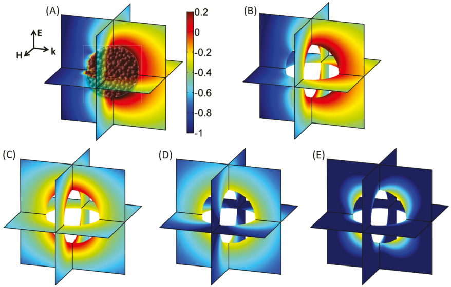{width=71%} Figure 2.2: Conceptional sketch of the multipole analysis of meta-atoms. (A) The scattered electric field of a selected meta-atom is simulated by a devoted numerical method. Here, a supramolecular cluster of silver spheres (6 nm radii) embedded in a dielectric $\varepsilon(\omega)=2.6$ is chosen as the meta-atom [112]; this meta-atom is discussed in detail in Sec. 4.1.1. It is illuminated by a plane wave as sketched at 575 nm. The magnitude of $\mathbf{E}_{\mathrm{sc}}$ is plotted on a logarithmic scale. The illumination scenario and the colorbar are maintained for (B)-(E). (B) Solely the scattered field outside a virtual sphere of radius $a$ enclosing the meta-atom is considered to obtain the scattering coefficients by Eq. 2.28. The transformation rules of Eqs. 2.29 and 2.30 yield the Cartesian multipole moments. The contribution of the electric dipole moment (C), the magnetic dipole moment (D), and the electric quadrupole moment (E) to the total scattered field (B) is revealed.

$C_{\mathrm{sea}}^{\mathrm{m}}$, and the electric quadrupole moment $C_{\mathrm{sea}}^{\mathrm{Q}}$ to the scattering cross section $C_{\mathrm{sea}}$ read as

$$
\begin{array}{rl} & { C _ { \mathrm { { s c a } } } ^{\mathrm { { p} } } = \frac { k ^{2} } { C _ { 0 } ^{2} } \left( \frac { 1 } { 2 } \left| p _ { x } + i p _ { y } \right| ^{2} + \left| p _ { z } \right| ^{2} + \frac { 1 } { 2 } \left| p _ { x } - i p _ { y } \right| ^{2} \right) , } \\& { C _ { \mathrm { { s c a } } } ^{\mathrm { { m} } } = \frac { k ^{2} } { c ^{2} C _ { 0 } ^{2} } \left( \frac { 1 } { 2 } \left| m _ { x } + i m _ { y } \right| ^{2} + \left| m _ { z } \right| ^{2} + \frac { 1 } { 2 } \left| m _ { x } - i m _ { y } \right| ^{2} \right) , } \\& { C _ { \mathrm { { s c a } } } ^{\mathrm { { Q} } } = \frac { k ^{2} } { D _ { 0 } ^{2} } \left( \frac { 3 } { 8 } \left| 2 Q _ { x x } + 2 i Q _ { x y } + Q _ { z z } \right| ^{2} + \frac { 3 } { 2 } \left| Q _ { x z } + i Q _ { y z } \right| ^{2} \right. } \\& { \left. + \frac { 3 } { 2 } \left| i Q _ { y z } - Q _ { x z } \right| ^{2} + \frac { 3 } { 8 } \left| 2 Q _ { x x } - 2 i Q _ { x y } + Q _ { z z } \right| ^{2} + \left| Q _ { z z } \right| ^{2} \right) \, . } \end{array}
$$

The entire scattering cross section is given by the sum of the different multipole contributions

$$
C _ { \mathrm { s c a } } = C _ { \mathrm { s c a } } ^{\mathrm { p} } + C _ { \mathrm { s c a } } ^{\mathrm { m} } + C _ { \mathrm { s c a } } ^{\mathrm { Q} } + \ldots \ .
$$

# 2.3.2 Multipole moments of representative meta-atoms

The advantages of the multipole analysis as introduced is outlined in more detail in the following. This is done by discussing the scattering properties and excited multipole moments of some selected meta-atoms. It is shown that the formalism is useful to understand the excited resonances in meta-atoms as well as to develop new design rules to improve them further.

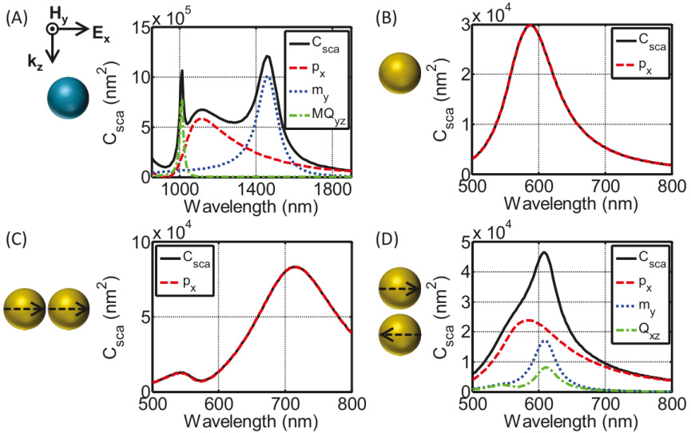{width=70%} Figure 2.3: Cartesian multipole moments of meta-atoms as they contribute to the scattering cross section $C_{\mathrm{sc}}$ (cf. Eq. 2.32); $\mathbf{p}$ - electric dipole moment, $\mathbf{m}$ - magnetic dipole moment, $\mathbf{Q}$ - electric quadrupole moment, $\mathbf{M}\mathbf{Q}$ - magnetic quadrupole moment. (A) A silicon sphere (200 nm radius) embedded in vacuum is illuminated by a plane wave as sketched. The illumination scenario is maintained for (B)-(C). (B) Multipole moments of a single gold sphere (40 nm radius) embedded in glass ($\varepsilon=2.25$). In (C) and (D) two different illumination scenarios are shown for a dimer made of two gold spheres (40 nm radius) separated by 5 nm that is embedded in glass.

Figure 2.3 presents the Cartesian multipole moments of meta-atoms made of spheres. All moments are shown as they contribute to $C_{\mathrm{sca}}$ (cf. Eq. 2.32), i.e. their sum yields the entire scattering cross section. The multipole moments of a silicon sphere of Fig. 2.3 (A) offer the typical resonances of a dielectric sphere with a large dielectric constant [in simulations the permittivity of silicon is assumed as a real valued constant ($\varepsilon_{\mathrm{sph}}=12$) for the shown wavelength domain] [153]. The first order resonance (excited at longest wavelengths) is dominated by a magnetic dipole resonance [154, 155] that appears at around 1500 nm for a 200 nm radius silicon sphere. The next higher order resonance at 1100 nm is electric dipolar and the third order resonance at around 1000 nm is magnetic quadrupolar. The analysis of the Cartesian multipole moments allows the explanation of the complex scattering cross

section. At a particular wavelength the precise contribution of each multipole moment to the scattered field can be extracted. Of course, the observed features in Fig. 2.3 (A) are the resonances of the Mie coefficients (cf. Eq. 2.21). Therefore, they are commonly termed Mie resonances of high permittivity spheres. In a lowest order approximation the magnetic dipole resonance (at 1500 nm) appears if the wavelength inside the sphere is identical to its diameter [156]. So the resonance position can be tuned by the permittivity and the radius of the sphere. Currently, these magnetic dipole resonances of high index spheres are attracting a lot of interest to build up all-dielectric MMs that sustain artificial magnetism [154–171].

The second example in Fig. 2.3 (B) presents a single gold sphere (40 nm radius) embedded in glass. These plasmonic spheres of sub-wavelength dimension are commonly used building blocks of self-assembled meta-atoms. As can be seen in Fig. 2.3 (B) they possess resonance features in the visible that can be fully described by an electric dipole resonance over the entire spectra. This resonance is linked to a resonance of the Mie coefficient $a_{1}$, as introduced in Sec. 2.2. In the electrostatic approximation the size parameter $x$ and the refractive index contrast $\eta$ can be assumed as $x \ll 1$, $|\eta|x \ll 1$. In this regime the Mie coefficient $a_{1}$ of Eq. 2.21 is much larger than all remaining ones and it can be approximated as [54]

$$
a _ { 1 } = - \frac { 2 i x ^{3} } { 3 } \frac { \eta ^{2} - 1 } { \eta ^{2} + 2 } \ .
$$

Inserting this result into the cross sections (cf. Eq. 2.24) yields

$$
C _ { \mathrm { s c a } } = \frac { 8 } { 3 } \pi k ^{4} a ^{6} \left| \frac { \varepsilon _ { \mathrm { s p h } } - \varepsilon } { \varepsilon _ { \mathrm { s p h } } + 2 \varepsilon } \right| ^{2} \, ,  C _ { \mathrm { a b s } } = 4 \pi k a ^{3} \Im \left\{ \frac { \varepsilon _ { \mathrm { s p h } } - \varepsilon } { \varepsilon _ { \mathrm { s p h } } + 2 \varepsilon } \right\} \, .
$$

The following remarks are in order. First, the absorption cross section scales with the volume of the sphere ($a^{3}$) whereas the scattering cross section scales with the volume squared ($a^{6}$). Therefore, as long as the spheres are not too small, scattering dominates over absorption. Second, both cross sections exhibit a term in the dominator that is resonant if $\varepsilon_{\mathrm{sph}}+2\varepsilon=0$. This resonance condition can be fulfilled for real valued permittivities of the sphere and the surrounding with opposite signs. For complex permittivities of the sphere or the surroundings the resonance condition cannot be met perfectly. That causes a finite full width half maximum (FWHM) of the cross sections that is connected to the imaginary part of the permittivity. For a gold sphere in vacuum the resonance wavelength is around 500 nm and it can shifted to longer wavelengths by changing the dielectric environment. In Fig. 2.3 (B) the resonance wavelength is 590 nm for a gold sphere in glass. The observed resonance is the LSPR as introduced in Chap. 1. The free electrons of the gold sphere are driven into resonance by the incident field [172]. The important conclusion of Fig. 2.3 (B) is that the electric dipole moment is fully sufficient to describe the scattering of a small metal sphere in the visible domain.

Therefore, the coupling between two of these spheres can be discussed on dipole-dipole interaction models. A famous example is the hybridization model that is adapted from molecular physics [173, 174] and will be discussed in detail in Chap. 3. It allows predicting the resonance positions of two coupled spheres or other symmetric objects. In Fig. 2.3 (C) and (D) two examples of coupled spheres are shown. The so-called dimer structure is illuminated perpendicularly to the connection line of the spheres [Fig. 2.3 (C)] and parallel to it [Fig. 2.3 (D)]. The perpendicular illumination shows a shift of the maximal scattering cross section to longer wavelengths compared to the single sphere LSPR of Fig. 2.3 (B). As for the single sphere the scattering can be fully described by that of an electric dipole. The shift of the resonance wavelength in Fig. 2.3 (C) is in line with the predictions of the hybridization model. The only possible oscillation of the electric dipoles of the two spheres for the highly symmetric illumination is shown by the black dashed arrows in Fig. 2.3 (C). Both dipoles are oscillating in phase along the connection line of the spheres [175]. Considering dipole-dipole interaction the resonance frequency for such a configuration of dipoles is shifted to longer wavelengths compared to the single dipole resonance [173, 174]. Exactly this can be observed in Fig. 2.3 (C). However, an additional resonance appears in Fig. 2.3 (C) at around 550 nm. This so-called higher order resonance is not covered by simple dipole-dipole interaction models. These resonances occur for small sphere separations. The higher order resonances stem from the coupling of higher order multipole moments of the single spheres [174, 176]. Although the origin of the resonance at 550 nm might be more complex the scattering response of the entire dimer can be fully described by that of an electric dipole. This conclusion shows one further advantage of the multipole analysis.

The last example shown in Fig. 2.3 (D) offers a more complex scenario. The illumination of the two spheres parallel to the connection line allows the excitation of an out of phase oscillation of both dipoles [as again sketched by the black dashed arrows in Fig. 2.3 (D)]. Regarding to the dipole-dipole interaction a $\pi$ out of phase oscillation of both electric dipoles should occur at slightly longer wavelengths compared to the LSPR wavelength [173, 174]. Obviously, such an out of phase oscillation should cause a magnetic dipole moment of the entire dimer. The resonance of the magnetic dipole can be seen in Fig. 2.3 (D) at 610 nm. The broadband contribution of the electric dipole moment stems from the different strength of the electric dipoles in both spheres. Therefore, even a $\pi$ out of phase oscillation yields a net electric dipole moment. The influence of this electric dipole moment can be decreased by using spheres of different size, as shown in [177]. Furthermore, a significant contribution of an electric quadrupole moment can be observed close to the magnetic dipole resonance wavelength. This quadrupole contribution is usually neglected in dipole-dipole interaction models. However, it is of major importance if effective material parameters should be assigned to a MM made by these meta-atoms [178, 179], as will be discussed in Sec. 2.4.1.

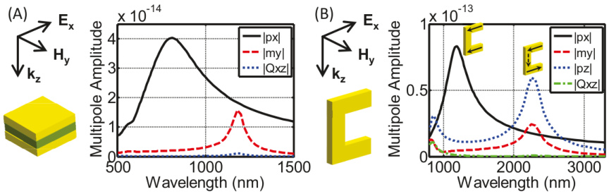{width=70%} Figure 2.4: (A) Cartesian multipole moments of a cut-plate pair as a function of the wavelength for plane wave incidence as sketched. The cut-plate pair consists of two strongly coupled gold plates (180 nm lateral dimension; 30 nm thickness) with an MgO layer in-between (identical lateral dimensions; 45 nm thickness). (B) Multipole moments of a SSR under plane wave incidence. The SRR is made of gold (300 nm arm and base length and $40 \times 40$ nm geometrical cross section). The small insets of the SRR that contain black arrows indicate the current oscillation of the shown resonances.

Aside from the meta-atoms made of spheres as shown in Fig. 2.3 two prominent examples of meta-atoms commonly fabricated by top-down techniques are discussed in the following. The multipole moments of a cut-plate pair [180] and a split-ring resonator (SRR) [151, 180] are shown in Fig. 2.4. The cut-plate pair consists of two strongly coupled gold plates with a dielectric spacer in-between. The excited multipole moments for plane wave illumination perpendicular to the plates are shown in Fig. 2.4 (A). A broad electric dipole moment with a resonance at 800 nm is observed. A further magnetic dipole resonance at 1180 nm can be seen accompanied by a small contribution of a electric quadrupole moment. The overall multipole analysis looks quite similar to that of the previously discussed dimer of Fig. 2.3 (D) though the precise resonance positions and strengths are different. The reason for this similar behavior of different meta-atoms is linked to the physical origin of the excited resonances. For a single gold plate a LSPR is excited which scattered field can be fully described by that of an electric dipole oscillation [181]. Therefore, the coupling of two gold plates, as for the presented cut-plate pair, allows the same resonances as the dimer of gold spheres. The observed magnetic resonance in Fig. 2.4 (A) can be explained by a $\pi$ out of phase oscillation of the electric dipoles in both gold plates [182]. Interestingly, the contribution of the electric quadrupole moment at the magnetic dipole resonance is much less compared to the gold sphere dimer. This is of enormous advantage if effective material parameters should be assigned, as discussed in the next section.

The second example presented in Fig. 2.4 (B) shows the multipole moments of a gold SRR [151, 180]. The SRR is illuminated by a plane wave propagating parallel to its base and a polarization along the arms. The first order resonance at 2300 nm offers the expected magnetic dipole contribution. There, currents in the SRR arms are excited that oscillate $\pi$ out of phase. This current distribution is shown by the black solid arrows in the SRR in

Fig. 2.4 (B). However, due to conductive coupling an additional current is excited in the SRR base (shown by the black dashed arrow in the SRR base). The base current causes a resonant electric dipole moment $p_{z}$ at the magnetic dipole resonance. For a regular lattice of SRR for the investigated illumination in Fig. 2.4 this dipole moment cannot be observed since it radiates neither in forward nor in backward direction. However, the $p_{z}$ moment has dramatic impact if the SRRs are rotated to each other in a lattice or if they are amorphously arranged [126]. The additional multipole moment $p_{z}$ causes more complicated constitutive relations, as will be discussed in Sec. 2.4. Furthermore, the $p_{z}$ moment had a great historical influence to indirectly probe the magnetic resonance of SRRs under normal incidence (along the $y$-direction) [183–186]. Under normal incidence the $p_{z}$ dipole moment can be excited that causes a magnetic dipole moment $m_{y}$ [151, 187]. In this situation the $m_{y}$ dipole moment cannot be probed in a regular lattice of SRRs. However, it has crucial impact on the coupling of neighboring SRR in the lattice [187, 188].

The second resonance of the SRR of Fig. 2.4 (B) at 1200 nm offers a resonant electric dipole moment $p_{x}$. There, the currents in both SRR arms are oscillating in phase. Therefore, no additional current is excited in the SRR base and the $p_{z}$ dipole moment is small at these wavelengths. The third order resonance at 900 nm has contributions of several multipole moments. Especially, an electric quadrupole moment is observed that hampers the description by simple effective material parameters at these wavelengths.

The multipole analysis can be used now to suggest novel designs for meta-atoms where the unwanted electric dipole contribution $p_{z}$ at the magnetic dipole resonance is suppressed. Consider another SRR that has its base on the opposite site of the arms. This SRR should obtain the same electric multipole moment $p_{z}$ but $\pi$ out of phase compared to the SRR of Fig. 2.4 (B). The combination of two SRRs with opposite base position should, therefore, totally suppress the contribution of the electric dipole moment $p_{z}$ [189, 190]. This can be clearly seen by the two possible SRR orientations that fulfill this requirement as shown in Fig. 2.5. In both cases the electric dipole moment $p_{z}$ could be totally suppressed at the first order magnetic dipole resonance [180]. Furthermore, as expected, one observes a slight shift of all resonance positions due to the coupling of both SRRs and a more complicated multipole contribution at the second and third order resonance.

To sum up, in this section the multipole analysis of meta-atoms has been introduced. If the scattered field of an arbitrarily shaped meta-atom is known, this field can be decomposed into its Cartesian multipole moments. This is done by applying the VSHs from Mie theory and by using transformation rules between spherical and Cartesian multipole moments. Several examples of single meta-atoms have been discussed and the enormous advantage of the introduced formalism was outlined. At every frequency all contributing multipole moments can be identified. That allows an easy understanding of the complex response of meta-atoms by a few physical quantities, i.e. by the multipole moments. Furthermore, the knowledge of

the multipole moments can be exploited to design meta-atoms for a desired optical response, as shortly outlined by the example of two coupled SRRs. In the next section the issue on how to describe light propagation through amorphous MMs is discussed based on the multipole analysis.

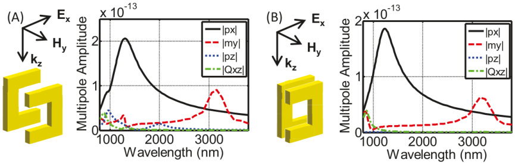{width=70%} Figure 2.5: Cartesian multipole moments of two SRRs with opposite base orientation under plane wave incidence as sketched. The SRRs are separated by 40 nm to each other along the propagation direction and the polarization of the incident magnetic field in (A) and (B), respectively.

# 2.4 Light propagation in amorphous metamaterials

The general introduction of self-assembled MMs in Chap. 1 implies the following conclusion. To date, all self-assembly techniques work on two different length scales. Therefore, they are divided into two distinct groups. The first one, the so-called short-range group, allows only a control of the self-assembly to build the individual meta-atom. The spatial alignment of the meta-atoms cannot be controlled and is therefore amorphous. The second group, called long-range group, allows for a control of the spatial alignment of the meta-atoms. Unfortunately, until now most meta-atoms of this group consists solely of individual metallic NPs. This is in contrast to the short-range order group where quite complex meta-atoms are achieved consisting of many precisely arranged NPs.

Of course a single plasmonic NP as the meta-atom constitutes quite a restriction to the achievable optical response since the scattered field of these NPs is dominated by electric dipole radiation [cf. Fig. 2.3 (B)]. Therefore, a complex response of MMs build up by self-assembly techniques only seems to be possible for the short-range group which yields amorphously arranged meta-atoms. This section describes a formalism on how light propagation through these amorphous MMs can be properly described.

The problem concerning the description of light propagation in amorphous MMs is conceptually sketched in Fig. 2.6 (A). There, a few amorphously arranged meta-atoms (that shall form a slab) are illuminated by an incident field. The incident field causes a scattered field from every meta-atom. The problem gets highly complex since every scattered field illuminates all other meta-atoms, too. Therefore, the illumination field of a chosen meta

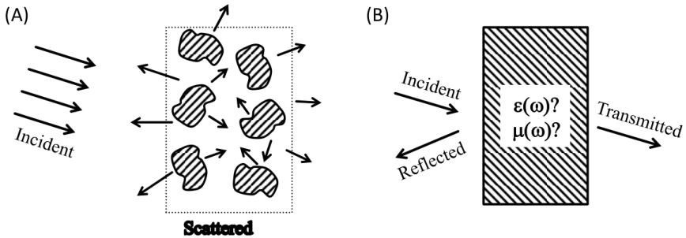{width=70%} Figure 2.6: Different concepts on how light propagation in amorphous MMs can be described. In (A) the incident field causes scattered fields of all amorphously arranged meta-atoms. All scattered fields and the multiple scattering events between different meta-atoms are taken into account. The idea is to simplify the description by replacing all meta-atoms by a slab made of an homogeneous material (doted line). Then the remaining task is the assignment of effective material parameters to this material, as shown in (B). These effective material parameters describe the reflection and transmission of the incident field on the MM slab.

atom consists of the external incident field and, in addition, of the scattered fields from all remaining meta-atoms. The self-consistent solution of this problem requires a consideration of the precise position and orientation of every meta-atom that is illuminated by the incident field. Since the meta-atoms are assumed to have sub-wavelength dimensions, a huge number of them is usually illuminated. Furthermore, as mentioned previously, the meta-atoms are supposed to have a complicated geometry not just consisting of a single NPs to assure the desired optical response. Consequently, the correct description of light propagation through amorphous MMs is a highly complex and challenging task with the computational resources that are available today. Indeed, for reasonable sized material volumes this is not possible at all. Therefore, the effective description of the light propagation in amorphous MMs is not just scientific but rather a practical requirement to study optical effects in these materials.

# 2.4.1 Effective material parameters and spatial dispersion

The idea how to describe light propagation in amorphous MMs more effectively is shown in Fig. 2.6 (B). Instead of a self-consistent solution of the scattering problem, as in Fig. 2.6 (A), the entire MM is assumed to act as a homogeneous material to which effective material parameters can be assigned. This concept is identical to periodically arranged meta-atoms that are commonly achieved by top-down fabrication techniques. The advantage of such a periodicity, however, is the possibility to introduce periodic boundary conditions between the meta-atoms. This reduces the complexity of the simulation, in principle, to a single meta-atom. Furthermore, the Bloch theorem and the corresponding Bloch eigenmodes can be used to describe and understand the light propagation in these periodic MMs [191–194].

This allows a precise discussion if (and under which circumstances) the assumption of a MM as a homogeneous material with effective material parameters is possible.

Here, in the case of amorphous MMs a different concept is established. One common form of effective material parameters that can be introduced for a local MM is based on the so-called bi-isotropic constitutive relations. The idea of locality is important. It suggests that the electromagnetic field at a specific position induces a polarisation of the material solely at this position. The local response is important to assure the applicability of the standard boundary conditions (cf. Eq. 2.13). The bi-isotropic constitutive relations read as [195]

$$
\begin{array}{r} { \mathbf { D } ( \mathbf { k } , \omega ) = \varepsilon _ { 0 } \varepsilon ( \omega ) \mathbf { E } ( \mathbf { k } , \omega ) + \frac { i } { c } \kappa ( \omega ) \mathbf { H } ( \mathbf { k } , \omega ) \ , } \\{ \mathbf { B } ( \mathbf { k } , \omega ) = \mu _ { 0 } \mu ( \omega ) \mathbf { H } ( \mathbf { k } , \omega ) - \frac { i } { c } \kappa ( \omega ) \mathbf { E } ( \mathbf { k } , \omega ) \ , } \end{array}
$$

where $\kappa(\omega)$ accounts for the magneto-electric coupling. In contrast to the previously introduced constitutive relations (cf. Eq. 2.3), they are given in frequency and spatial frequency domain. This highlights the fact that none of the material parameters depends on $\mathbf{k}$ which means they are not spatially dispersive. Spatial dispersion is an unwanted property. If the material parameters would depend on $\mathbf{k}$ this would cause a non-local response in the real space. Obviously, additional boundary conditions are required for a non-local response [178]. These additional boundary conditions are controversially discussed [196] and therefore, spatial dispersion should be suppressed. It has to be mentioned that the most general case of constitutive relations that assure standard boundary conditions are bi-anisotropic constitutive relations. Then, all material parameters in Eq. 2.36 become tensors. The case of an anisotropic response is of minor interest when investigating amorphous MMs. An amorphous spatial alignment of meta-atoms yields an isotropic response, as will be outlined later on in Sec. 2.4.3. Therefore, solely the isotropic case is considered here. Now, the different mechanisms that cause spatial dispersion are briefly discussed. They are important to appreciate the advantage of bottom-up MMs when compared to top-down structures. General rules on how the scattering response of a single meta-atom should look like are derived. Afterwards, the assignment of effective material parameters to amorphous MMs is introduced.

Two basic mechanisms can cause spatial dispersion in a MM. The first one is related to a perfect periodic alignment of the meta-atoms. This is typically achieved by top-down fabrication techniques where meta-atoms are periodically arranged into single layers. Thus, the entire MM forms a grating and its optical response is described by a few propagating diffraction orders. Obviously this causes a strong dependency of the optical response on the propagation direction of the light, which is spatial dispersion. Even for sub-wavelength gratings that only sustain a zeroth diffraction order to be propagative, the periodic alignment is problematic [197]. Here the near-fields between adjacent meta-atoms can resonantly couple to each other which may cause in most of the cases a dependency of the material parameters

on $\mathbf{k}$. Since a huge number of self-assembled MMs result in amorphous structures, this amorphous arrangement constitutes enormous advantage concerning spatial dispersion. Spatial dispersion due to periodically arranged meta-atoms is not observed for self-assembled MMs.

The second mechanism yielding spatial dispersion is related to higher order multipole moments of the single meta-atom. It has been shown in literature that higher order spatial derivatives of the electric field can be linked to spatial dispersion. While first order spatial derivatives can be transformed into a magneto-electric coupling $\kappa(\omega)$, this is not possible for second order spatial derivatives of the electric field [178, 198–200]. It is beyond the scope of this thesis to prove this statement, but we want to discuss the consequences by some illustrative considerations. If the electric interaction energy $W_{\mathrm{el}}$ between an external electric field and a given charge density is expanded into a Taylor series, the following result is obtained (ignoring electric monopole moments) [52]

$$
W _ { \mathrm { e l } } ( \omega ) = - \mathbf { p } ( \omega ) \mathbf { E } ( \mathbf { r } , \omega ) - \frac { 1 } { 6 } \sum _ { i , j } Q _ { i j } ( \omega ) \frac { \partial E _ { j } ( \mathbf { r } , \omega ) } { \partial x _ { i } } + \cdots \; .
$$

The dipole moment interacts with the electric field and the electric quadrupole moment with the first derivative of the electric field. The same is obtained if the multipole expansion of the external charge density $\rho_{\mathrm{ext}}$ is performed as it appears in Maxwell's equations [200–202]. There, the quadrupole moment enters the equation with the first derivative of the electric field. The remaining question is about the excitation of the quadrupole moment in the meta-atom. If it is excited by gradients of the incident field then the quadrupole moment itself is a function of the derivative of the electric field, i.e. $\mathbf{Q}=\mathbf{Q}(\partial \mathbf{E} / \partial \mathbf{r})$. Since, as motivated above, the quadrupole moment itself enters the equation in combination with a first derivative of the electric field, this MM will definitely require spatially dispersive material parameters to describe the light propagation through it. However, it should be mentioned for completeness, that quadrupole moments in meta-atoms can be induced without a gradient of the incident field. Consider, e.g., a meta-atom consisting of two small spheres with permittivities of different sign (e.g. a dielectric and a metal sphere). An incident field propagating perpendicular to the connection line of the spheres will induce electric dipoles in the spheres that are out of phase, independently on the frequency and therewith on the variation of the field over the spheres. Therefore, even without a gradient of the field along the spatial extension of the meta-atom a quadrupole moment can be excited. Thus, the resulting MM can be described by local material parameters; especially by a non-vanishing magneto-electric coupling term $\kappa(\omega)$ [178, 200, 203]. However, in the case of amorphous MMs, an isotropic response of the meta-atom is desired to assure for a pronounced response of the MM, as will be motivated in Sec. 2.4.3. Therefore, in this thesis the focus is on isotropic meta-atoms which have at least three orthogonal mirror planes. It can be shown that such meta-atoms do not yield electro-magnetic coupling, i.e. $\kappa(\omega)=0$ [204]. Consequently, for all meta-atoms discussed

in this thesis the quadrupole moment can only be excited by a gradient of the electric field. Finally, the existence of a quadrupole moment of the single meta-atom directly yields spatial dispersion of the entire MM.

To sum up this somehow sketchy discussion of electric quadrupole moments and spatial dispersion, the following points are important. An electric quadrupole moment of a meta-atom is an undesired property if the resulting MM should be described by simple material parameters as in Eq. 2.36 that are not spatially dispersive. Concerning amorphous MMs, higher order multipole moments (except electric and magnetic dipole moments) are the only physical origin of spatial dispersion. The multipole analysis, as introduced in Sec. 2.3, is a very beneficial and powerful tool. It reveals how the meta-atoms can be fully described by dipole moments and if the entire amorphous MM can be treated as a homogeneous material with simple constitutive relations as in Eq. 2.36.

# 2.4.2 Clausius-Mossotti relation

In the following discussion it is assumed that the MM of interest is build up by meta-atoms that can be fully described by electric and magnetic dipole moments. Based on the Clausius-Mossotti relation a formalism is introduced that allows the description of the resulting MM by an effective permittivity $\varepsilon_{\mathrm{eff}}$ and effective permeability $\mu_{\mathrm{eff}}$. In other words, it is described how the material parameters of an effective slab, as shown in Fig. 2.6 (B), can be derived from the known dipole moments of the meta-atom.

The basic idea of the Clausius-Mossotti relation is the following. It is assumed that the amorphous MM can be described by effective material parameters. A single meta-atom of this MM is selected. Around this meta-atom a sphere of macroscopic dimensions is removed from the MM. Here, macroscopic dimensions refers to a sphere with a radius that is a multiple of the incident wavelength. So the precise positions of the meta-atoms of the remaining MM close to the sphere surface have no effect. The local electric field $\mathbf{E}_{\mathrm{loc}}$ at the origin of the meta-atom is decomposed into three independent parts according to [52]

$$
\mathbf { E } _ { \mathrm { l o c } } ( \mathbf { r } ) = \mathbf { E } _ { \mathrm { i n c } } ( \mathbf { r } ) + \mathbf { E } _ { \mathrm { P } } ( \mathbf { r } ) + \mathbf { E } _ { \mathrm { i } } ( \mathbf { r } ) \; .
$$

The field $\mathbf{E}_{\mathrm{inc}}$ is the external incident electric field. The second term $\mathbf{E}_{\mathrm{P}}$ accounts for the field that is generated by charges on the boundary between the sphere (around the chosen meta-atom) and the remaining MM. Consider a MM that offers only a response to an electric field, i.e. $\varepsilon_{\mathrm{eff}} \neq 1$ and $\mu_{\mathrm{eff}} = 1$. Such a material is described by an electric dipole density $\mathbf{P}$. Removing a sphere from such a material induces a homogeneous electric dipole density inside the sphere. For a perfect sphere a simple relation between $\mathbf{P}$ and $\mathbf{E}_{\mathrm{P}}$ can be derived, namely $\mathbf{E}_{\mathrm{P}} = \mathbf{P} / (3 \varepsilon_{0})$. The last term in the above equation, $\mathbf{E}_{\mathrm{i}}$ describes the field that is generated by the electric dipole moments of all the remaining meta-atoms inside the sphere.

This term is zero if the meta-atoms are arranged on a cubic lattice [205]. For each meta-atom inside the sphere another meta-atom on the cubic lattice can be found that cancels the electric dipole field at the center of the sphere (where the chosen meta-atom is located). Obviously, the same can be done for an amorphous arrangement of the meta-atoms. As long as the sphere has macroscopic dimensions one will find two meta-atoms inside the sphere that chancel their dipole fields at the center of the sphere. The same decomposition as in Eq. 2.38 can be done for the local magnetic field $\mathbf{H}_{\mathrm{loc}}$. For the interpretation of the three terms the electric dipole moment has to be replaced by the magnetic dipole moment.

From now on only meta-atoms with an isotropic response are considered. The more general anisotropic case is discussed later on in Sec. 2.4.3. If the scattered field of the meta-atom is fully described by electric and magnetic dipole moments (as claimed previously), the following relations between the local electric field and the dipole moments can be drawn

$$
\mathbf { p } ( \omega ) = \varepsilon _ { 0 } \alpha _ { \mathrm { e } } ( \omega ) \mathbf { E } _ { \mathrm { l o c } } ( \mathbf { r } = 0 , \omega ) \ ,  \mathbf { m } ( \omega ) = \frac { 1 } { Z _ { 0 } } \alpha _ { \mathrm { m } } ( \omega ) \mathbf { E } _ { \mathrm { l o c } } ( \mathbf { r } = 0 , \omega ) \ .
$$

The two scalar quantities $\alpha_{\mathrm{e}}$ and $\alpha_{\mathrm{m}}$ are the electric and magnetic polarizability, respectively. It is important to note that the response of the meta-atom is assumed to offer no magneto-electric coupling, i.e. the electric dipole moment is solely excited by the incident electric field and vice versa for the magnetic terms. This restriction is perfectly suitable for all discussed meta-atoms of this thesis, but of course it can be lifted, as shown in [205–208]. The Clausius-Mossotti relation links these polarizabilities of the chosen meta-atom to effective material parameters ($\varepsilon_{\mathrm{eff}}, \mu_{\mathrm{eff}}$) of the entire MM in the following way [52]

$$
\begin{array}{r} { \varepsilon _ { \mathrm { e f f } } ( \omega ) = \varepsilon _ { \mathrm { e x t } } ( \omega ) \cdot \frac { 3 \varepsilon _ { \mathrm { e x t } } ( \omega ) + 2 n \alpha _ { \mathrm { e } } ( \omega ) } { 3 \varepsilon _ { \mathrm { e x t } } ( \omega ) - n \alpha _ { \mathrm { e } } ( \omega ) } \ , } \\{ \mu _ { \mathrm { e f f } } ( \omega ) = \mu _ { \mathrm { e x t } } ( \omega ) \cdot \frac { 3 \mu _ { \mathrm { e x t } } ( \omega ) + 2 n \alpha _ { \mathrm { m } } ( \omega ) } { 3 \mu _ { \mathrm { e x t } } ( \omega ) - n \alpha _ { \mathrm { m } } ( \omega ) } \ , } \end{array}
$$

where $\varepsilon_{\mathrm{ext}}$ and $\mu_{\mathrm{ext}}$ are the permittivity and permeability of the surrounding, respectively and $n$ is the number density of the meta-atoms.

In conclusion, the Clausius-Mossotti relation seems to be suitable to describe the light propagation through amorphous MMs on the base of effective material parameters. The multipole analysis of meta-atoms, as presented in Sec. 2.3 yields the dipole moments of the scattered field of a single meta-atom. Furthermore, the influence of higher order moments on the scattered field can be investigated. If solely dipole moments contribute to the scattered field, the polarizabilities of the meta-atom can be obtained by Eq. 2.39. Finally, the Clausius-Mossotti relation (Eq. 2.40) links these polarizabilities to effective material parameters of the entire MM.

The possibility to assign effective material parameters in such a way is discussed now by an representative example, namely the cut-plate pair as discussed in Sec. 2.3. The multipole

analysis has revealed that the scattering response of a meta-atom consisting of two gold plates (180 nm lateral dimension and 30 nm thickness) with an MgO spacer in-between (45 nm thickness) can be fully described by dipole moments in the spectral domain from 500 to 1500 nm, cf. Fig. 2.4 (A). Here, this meta-atom is chosen to verify the assignment of effective material parameters to a MM as described by Eq. 2.40. The results of the Clausius-Mossotti relation are compared to results obtained by a commonly used technique for periodic MMs.

This common technique is based on the inversion of the transmission $T$ and reflection $R$ coefficients from a MM slab [209, 210]. Therefore, the MM slab as shown in Fig. 2.6 (B), is assumed as a homogeneous slab with infinite lateral dimensions. The well-known Fresnel formulas relate the wavevector and the impedance of the plane wave in the slab to complex transmission and reflection coefficients. On the contrary, if $R$ and $T$ are known in amplitude and phase, the Fresnel formulas can be inverted to obtain the wavevector and the impedance.

For a periodic arrangement of meta-atoms the light propagation in this MM slab can be described by Bloch eigenmodes [192–194]. Commonly, it is assumed that only a single Bloch eigenmode can propagate in the MM and that all remaining ones are strongly damped [191]. It has to be said, that it is of course possible to consider more Bloch eigenmodes which makes the description more complicated, see e.g. Ref. [194]. If only a single Bloch eigenmode is excited in the MM slab and propagates through it, the wavevector and impedance of this eigenmode can be obtained by the inversion of $R$ and $T$. To assign effective material parameters to the MM slab the functional dependency of the Bloch wavevector on the angle of incidence is important. Here, only the assignment of isotropic effective material parameters is discussed. If the frequency is fixed the Bloch wavevector should resemble a spherical dispersion relation as given by Eq. 2.11. Only if this requirement is fulfilled isotropic effective material parameters can be assigned to the MM slab [152, 193].

In the case of amorphous MMs, Bloch eigenmodes provide no longer a feasible description. However, it is still possible to simulate $R$ and $T$ by large-scale simulations taking an extended section of the amorphous MM into account [180]. Consider an amorphous arrangement of cut-plate pairs as shown in Fig. 2.7 (A). A so-called supercell as considered in the simulations is shown. The supercell consists of four layers of amorphously arranged cut-plate pairs. All cut-plate pairs are oriented identical with respect to the incident field. This assures a strong excitation of the magnetic dipole moment in all meta-atoms. Furthermore, the cut-plate pairs are only amorphously arranged within one layer, i.e. each layer has a fixed distance to each other. This allows an experimental realization of the structure by conventional top-down approaches that fabricate the structure layer by layer [211]. The lateral dimensions of the supercell are large compared to the incident wavelength. In other words, the actual lateral dimension of the supercell does not influence its optical response. The chosen supercell is periodically repeated along the lateral dimensions of the slab. In this way, an infinite slab of amorphously arranged meta-atoms is obtained. The scattering response of such a slab can

be simulated by large-scale FDTD simulations.

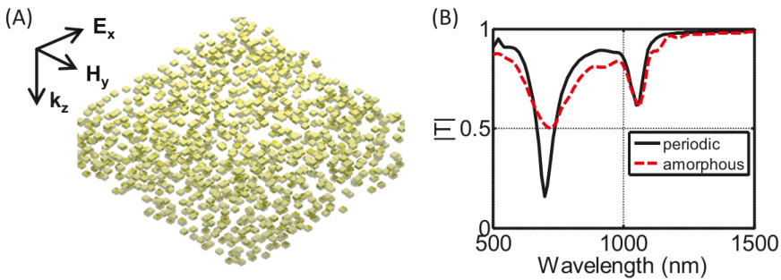{width=70%} Figure 2.7: (A) Supercell geometry of amorphously arranged cut-plate pairs [identical geometry to Fig. 2.4 (A)]. (B) Amplitude of simulated transmission $T$ for the supercell geometry (red dashed curve) from (A) and a periodic arrangement (black solid curve) of the cut-plate pairs with identical filling fractions.

The simulated amplitude of the transmission through a slab of amorphously arranged cut-plate pairs is shown in Fig. 2.7 (B). Clearly, two resonances are observed. The first order resonance (at about 1100 nm) stems from the magnetic dipole moment of the single cut-plate pair and the second order resonance (at about 750 nm) from the electric dipole moment. This can be easily seen by the multipole analysis of the cut-plate pair in Fig. 2.4 (A). The transmission through a slab of periodically arranged cut-plate pairs (with the same filling fraction in the four layers) is also shown in Fig. 2.7 (B). The comparison with the amorphous arrangements yields the following observations. For the magnetic dipole resonance, the transmission spectra of the periodic and the amorphous arrangement are almost identical. In contrast, at the electric dipole resonance, the resonance in transmission for the amorphous arrangement is weaker and broader compared to the periodic arrangement. This observation can be explained by two effects. The first one is linked to the different resonance positions of the electric and magnetic dipole resonance. At the electric dipole resonance the ratio of the average distance between neighboring cut-plate pairs to the wavelength is close to unity. This causes radiation losses at the electric resonance for an amorphous arrangement [188, 195]. The periodic arrangement has only one distance between neighboring cut-plate pairs, i.e. each layer forms a grating and the radiation losses can only happen through discrete propagating diffraction orders of the grating. For the magnetic dipole resonance the ratio of the average distance between the cut-plate pairs to the incident wavelength is much less than unity. Therefore, enhanced radiation losses due to an amorphous arrangement have only minor influence on the resonance strength and width. The second effect is linked to the larger absorption cross section of the magnetic resonance. In contrast to the electric one, the scattered field of the magnetic resonance is weaker and therefore the radiative coupling is reduced at the magnetic resonance. Generally, these two effects can only be distinguished

by applying some analytical formulas describing dipole-dipole interactions. For the present example of cut-plate pairs it has been shown that the dominating effect is linked to the enhanced absorption at the magnetic resonance [212].

The obtained transmission and reflection coefficients from the large-scale simulations of the entire amorphous MM slab can be inverted to obtain the effective material parameters, as discussed above [180]. The results are shown in Fig. 2.8. Resonances of Lorentzian shape are observed for the effective permittivity at around 800 nm and for the effective permeability at around 1100 nm, as expected from Fig. 2.7 (B). The effective material parameters that are obtained by the Clausius-Mossotti relation are given in Fig. 2.8 as well. Here, the electric and magnetic dipole moments for a single cut-plate pair, as obtained by the multipole analysis, were translated into polarizabilities, as described in Eq. 2.39. An identical filling fraction as for the simulated supercell was chosen to obtain the effective material parameters from the polarizabilities (cf. Eq. 2.40).

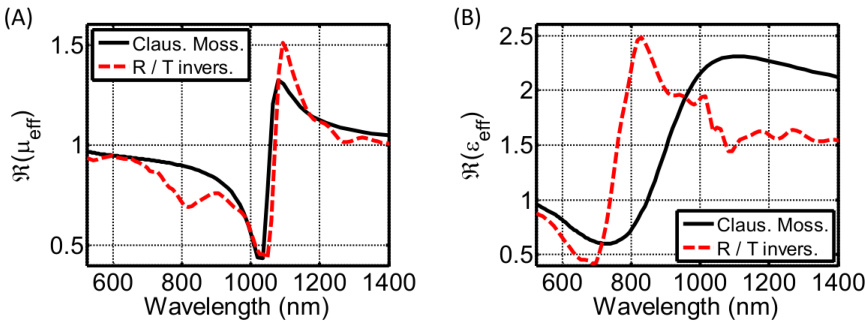{width=70%} Figure 2.8: Effective material parameters for a MM slab made of amorphously arranged cut-plate pairs [cf. Fig. 2.7 (A)]. The real parts of the effective permeability and permittivity are shown in (A) and (B), respectively. Black solid curves correspond to results obtained by the Clausius-Mossotti relation and red dashed curves to the results from the inversion of $R$ and $T$.

The comparison of the effective material parameters obtained by inversion of $R$ and $T$ and by the Clausius-Mossotti relation offers a remarkable agreement for the effective permeability. The resonance position, strength and width are almost identical for both methods. Of course there exist some minor wiggling of the effective permeability for the inversion of $R$ and $T$ at off-resonance positions that is not reproduced by Clausius-Mossotti. This is expected since to obtain $R$ and $T$ the entire amorphous arrangement of the cut-plate pairs in the supercell was taken into account; so the wiggling comes from the coupling of adjacent cut-plate pairs. However, for Clausius-Mossotti no fine details of the arrangement are taken into account and only the density of the cut-plate pairs enters the equations. Regarding the effective permittivity, both methods offer the same trend. Although there is a slight difference in the precise resonance position, the strength and width are the same for $R/T$ inversion and Clausius-Mossotti. Again, the minor wiggling of the effective permittivity from $R$ and $T$ is

not reproduced by the Clausius-Mossotti results.

It is important to mention that the given example of amorphously arranged cut-plate pairs demonstrates the possibility to describe the light propagation through amorphus MMs by using effective medium approaches such as the Clausius-Mossotti relation. Instead of time consuming large-scale simulations of an amorphous supercell (as done in Fig. 2.7) the dipole moments of a single meta-atom can be used to obtain effective material parameters. It is an enormous advantage since, in principle, the simulation of the entire amorphous MM has been reduced to a single unit cell. This is identical to the case of periodic MMs where the description of light propagation can be understood in terms of Bloch eigenmodes. There, the simulations are reduced, in principle, to a single meta-atom. The formalism introduced in this subsection is very beneficial to describe light propagation through an amorphous MM by a few physical quantities. Furthermore, it confirms the big advantages to understand self-assembled MMs on the base of the previously introduced multipole analysis of meta-atoms.

# 2.4.3 Anisotropic response of meta-atoms

The assumption of the last subsection was an isotropic response of the meta-atom under consideration. In this subsection, the consequences of an anisotropic response of meta-atoms of amorphous MMs are discussed. Obviously, the previously chosen example of a cut-plate pair offers by no means an isotropic response. Quite the contrary, its response is uniaxial anisotropic, i.e. the discussed excitation of the magnetic dipole moment appears solely for the chosen illumination direction perpendicular to the plates [201]. Therefore, the cut-plate pairs were not allowed to be arbitrary oriented to the incident field in Fig. 2.7. This enabled to probe for the optical properties along a principle axis of the cut-plate pair.

A perfect periodic arrangement of cut-plate pairs to a MM would obviously cause an anisotropic response of the entire MM [213, 214]. The transformation into the major axis of the permittivity and permeability tensor should allow a description of the MM by three effective permittivity and three effective permeability components. In the special case of the uniaxial response of the cut-plate pair two components are identical. The same situation appears for an amorphous spatial arrangement of meta-atoms but a fixed orientation to the incident field, identical to the previous subsection. The MM response is anisotropic and effective material parameters can be obtained by applying the Clausius-Mossotti relation for the three independent polarizations of the incident field [205].

The situation changes for a totally amorphous arrangement of the meta-atoms, i.e. in addition to an amorphous position of the meta-atoms the orientation to the incident field is allowed to be arbitrary. This situation is the common one in the experiments. For such a case of totally amorphous MMs the response has to be isotropic. This is well-known from ordinary amorphous materials. For example quartz glass is one amorphous form of SiO$_2$ that offers an isotropic response whereas most of the crystalline forms of SiO$_2$ are anisotropic.

The derivation of the Clausius-Mossotti relation for anisotropic meta-atoms that are amorphously arranged can be found in detail in [215]. Here, only the final results are given together with a brief discussion on the consequences. In the case of a meta-atom with an anisotropic response the polarizabilities are becoming tensors ($\overline{\alpha}_{\mathrm{e}}$, $\overline{\alpha}_{\mathrm{m}}$). The connection between the incident fields and the dipole moments of the meta-atoms reads as

$$
\mathbf { p } ( \omega ) = \varepsilon _ { 0 } \overline { { \overline { { \alpha } } } } _ { \mathrm { e } } ( \omega ) \mathbf { E } _ { \mathrm { l o c } } ( \mathbf { r } = 0 , \omega ) \; ,  \mathbf { m } ( \omega ) = \frac { 1 } { Z _ { 0 } } \overline { { \overline { { \alpha } } } } _ { \mathrm { m } } ( \omega ) \mathbf { E } _ { \mathrm { l o c } } ( \mathbf { r } = 0 , \omega ) \; .
$$

The meta-atoms as discussed in this thesis are all made of of dielectrics or metals. Hence, these meta-atoms yield a reciprocal response, i.e. the invariance of a system when transmitter and receiver are interchanged. A reciprocal meta-atom causes symmetric polarizabilities [195, 216], i.e. $\overline{\alpha}_{\mathrm{e}}=\overline{\alpha}_{\mathrm{e}}^{T}$ and $\overline{\alpha}_{\mathrm{m}}=\overline{\alpha}_{\mathrm{m}}^{T}$. If the entries of the polarizability tensors are real valued they can be transformed to diagonal form. The situation is more complex if lossy materials are involved. Then the entries of the polarizability tensors are complex. However, the polarizability tensors can be transformed into a diagonal matrix if at least two orthogonal symmetry planes exists for the meta-atom [202], which is the case for all discussed meta-atom here. For a diagonal form of the polarizability tensors and a totally amorphous arrangement of the meta-atoms the Clausius-Mossotti relation reads as [215]

$$
\begin{array}{r} { \varepsilon _ { \mathrm { e f f } } ( \omega ) = \varepsilon _ { \mathrm { e x t } } ( \omega ) \cdot \frac { 3 \varepsilon _ { \mathrm { e x t } } ( \omega ) + \frac { 2 n } { 3 } \mathrm { T r } \left[ \overline { { \overline { { \alpha } } } } _ { \mathrm { e } } ( \omega ) \right] } { 3 \varepsilon _ { \mathrm { e x t } } ( \omega ) - \frac { n } { 3 } \mathrm { T r } \left[ \overline { { \overline { { \alpha } } } } _ { \mathrm { e } } ( \omega ) \right] } \, , } \\{ \mu _ { \mathrm { e f f } } ( \omega ) = \mu _ { \mathrm { e x t } } ( \omega ) \cdot \frac { 3 \mu _ { \mathrm { e x t } } ( \omega ) + \frac { 2 n } { 3 } \mathrm { T r } \left[ \overline { { \overline { { \alpha } } } } _ { \mathrm { m } } ( \omega ) \right] } { 3 \mu _ { \mathrm { e x t } } ( \omega ) - \frac { n } { 3 } \mathrm { T r } \left[ \overline { { \overline { { \alpha } } } } _ { \mathrm { m } } ( \omega ) \right] } \, , } \end{array}
$$

where Tr $[\overline{\alpha}]$ denotes the trace of the diagonal polarizability tensors. The consequences of amorphously arranged meta-atoms with an anisotropic response can be clearly seen by Eq. 2.42. First, the response of the entire MM is isotropic, as discussed previously. Second, each independent polarization component enters the effective material parameters with a factor of 1/3. Consequently, if the cut-plate pairs of Fig. 2.7 are allowed to be arbitrary oriented to the incident field, the magnetic response shown in Fig. 2.8 would be lowered by a factor of 1/3, as it was demonstrated in [180].

In conclusion, in order to obtain amorphous MMs that offer a strong artificial magnetism, it is of great importance to construct meta-atoms with an isotopic response. The possibility to achieve isotropic meta-atoms by self-assembly techniques is one major part of this thesis and is discussed in detail in Chap. 4.

# 2.4.4 Limitations of the Clausius-Mossotti relation

This subsection briefly outlines the limitations to describe the light propagation through amorphous MMs by applying the Clausius-Mossotti relation.

The first limitation of the presented formalism is the obvious one. The Clausius-Mossotti relation only relates electric and magnetic dipole moments to effective material parameters. Higher order multipole moments are disregarded. Though it is in principle possible to consider also higher order multipole moments [217, 218], these moments are undesired in the case of MMs as discussed in Sec. 2.4.1. The second limitation of the Clausius-Mossotti relation is the number density of the meta-atoms. It can be motivated by simple analysis [52, 205] and has been demonstrated by numerous experiments [219–221] that the Clausius-Mossotti relation is correct only for small number densities. In other words, sufficiently diluted MMs are required where the number density remains to be much smaller than unity. However, is has been shown that the Clausius-Mossotti relation yields correct results even for large number densities as long as the meta-atoms exhibit no spatial correlation to each other [222]. In such a case even multiple scattering between adjacent meta-atoms does not disturb the results. Concerning amorphous MMs, the radial distribution function has usually one peak [223, 224]. This peak is caused by a certain minimal distance that is an essential part in the fabrication procedure. Such systems are almost uncorrelated though not fully random (a random structure offers no peak in the correlation function [225]). Therefore, amorphous MMs should be sufficiently described by the Clausius-Mossotti relation even if the number density of meta-atoms is large.

Of course there exists other, more general effective medium approaches in literature [226]. Prominent examples thereof are the Bruggeman formula [227, 228] or the Coherent Potential formula [229–231]. However, here we restrict ourselves to describe amorphous MMs by using the Clausius-Mossotti relation since it is the obvious starting point for any effective medium approach.

# 2.4.5 Concluding remarks

In conclusion, this rather long Sec. 2.4 has discussed the description of light propagation through amorphous MMs. Starting from the multipole analysis of meta-atoms the Clausius-Mossotti relation was applied to assign effective material parameters in Sec. 2.4.2. The accuracy of this approach was demonstrated by a MM consisting of amorphously arranged cut-plate pairs. The Clausius-Mossotti relation was further extended to anisotropic metam-atoms in Sec. 2.4.3. The important conclusion was drawn that an isotropic response is one of the major features that a meta-atom should offer in order to sustain a strong dispersion in the effective material parameters. Finally, limitations of the presented approach were shortly discussed in this section 2.4.4.

Up to here, everything has been introduced that is required to understand the physics of the following chapters. The subsequent sections of the current chapter are on more technical grounds. They focus on the solution of Maxwell's equations for the scattering of light on clusters of spheres. Such meta-atoms based on spherical NPs are very common in self-assembly techniques as shown in Chap. 1. The solution of Maxwell's equations for such meta-atoms allows the calculation of their scattering coefficients by analytical formulas. However, this is only a technical aspect that is presented here for completeness. All readers that can accept that the scattered fields of the meta-atoms are simulated by some devoted numerical method may proceed directly with the next chapter.

# 2.5 Scattering by a cluster of spheres

This section describes the electromagnetic scattering problem for a cluster of spheres. Based on the analytical solution of the single sphere scattering in Sec. 2.2, a formalism is introduced to solve the Helmholtz equation for a cluster of spheres. This is done by an expansion of the fields into the eigenfunctions, the VSHs. The resulting analytical solution of the electromagnetic scattering by a cluster of spheres allows a simple and fast computation of the scattering coefficients and the T-matrix for such a system, cf. Eq. 2.15. This is very beneficial since most of the self-assembled MMs are made of spherical NPs up to now [4–7, 9]. Therefore, their meta-atoms can be safely approximated as clusters of perfect spheres. This assumption is valid since silver or gold spheres with radii in-between 10 and approximately 100 nm can be fabricated with an almost perfect spherical shape, as will be shown in Chap. 3.

Assume a cluster of $J$ nonintersecting spheres. The spheres can be made of distinct homogeneous, linear, local, isotropic materials. The same holds for the surrounding. The problem of a single sphere $J$=1 has been solved in Sec. 2.2. The idea to handle a cluster of such spheres is the following. For each sphere a separate coordinate system is introduced that is centered at the origin of the sphere. Such a situation is sketched for three spheres ($J$=3) in Fig. 2.9. Each coordinate system is assumed to be oriented along the same direction; in other words only a translation between different coordinate systems is allowed and no rotation.

In every of the $J$ coordinate systems the Mie theory for a single sphere is valid, as long as the spheres do not intersect. Therefore, it is possible to expand all fields, namely the scattered $\mathbf{E}_{\mathrm{sca}}$, $\mathbf{H}_{\mathrm{sca}}$ and the incident field $\mathbf{E}_{\mathrm{inc}}$, $\mathbf{H}_{\mathrm{inc}}$, in a chosen $j$th coordinate system ($j=1\ldots J$) into the VSHs, in analogy to the single sphere problem. The expansions of the electric fields in

the coordinate system of the $j$th sphere read as [148, 149, 232]

$$
\begin{array}{rl} & { \mathbf { E } _ { \mathrm { i n c } } ( j , \mathbf { r } , \omega ) = - \sum _ { n = 1 } ^{\infty} \sum _ { m = - n } ^{n} i E _ { n m } \left[ p _ { n m } ^{j} ( \omega ) \mathbf { N } _ { n m } ^{( 1 )} ( \mathbf { r } , \omega ) + q _ { n m } ^{j} ( \omega ) \mathbf { M } _ { n m } ^{( 1 )} ( \mathbf { r } , \omega ) \right] \ , } \\& { \mathbf { E } _ { \mathrm { s c a } } ( j , \mathbf { r } , \omega ) = \sum _ { n = 1 } ^{\infty} \sum _ { m = - n } ^{n} i E _ { n m } \left[ a _ { n m } ^{j} ( \omega ) \mathbf { N } _ { n m } ^{( 3 )} ( \mathbf { r } , \omega ) + b _ { n m } ^{j} ( \omega ) \mathbf { M } _ { n m } ^{( 3 )} ( \mathbf { r } , \omega ) \right] \ , } \end{array}
$$

with the prefactor $E_{nm}$ as defined in Eq. 2.19 and the VSHs as given by Eq. 2.16. The only difference between this expansion and that for a single sphere (cf. Eq. 2.18) is the index $j$. That index denotes the chosen $j$th coordinate system. Of course the expansion coefficients of the incident field and the scattered field should depend on $j$. In principle, the situation for a chosen $j$th sphere is identical to the single sphere problem. The Mie coefficients of the $j$th sphere (as given by Eq. 2.21) still connect the expansion coefficients of the incident field with the scattering coefficients in the following way [146, 147]

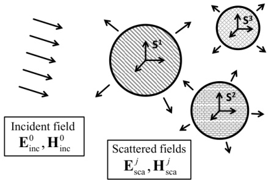{width=35%} Figure 2.9: Scattering configuration for a cluster of three spheres (named S$^{1}$, S$^{2}$ and S$^{3}$). All spheres can have different radii and consist of distinct materials. The external incident field on the cluster generates scattered fields for every sphere. A coordinate system is associated with each sphere and centered at its origin.

$$
a _ { n m } ^{j} = a _ { n } ^{j} p _ { n m } ^{j} \ ,  b _ { n m } ^{j} = b _ { n } ^{j} q _ { n m } ^{j} \ .
$$

Now, the Mie coefficients $a_{n}^{j}, b_{n}^{j}$ depend on $j$ since different materials and radii for every sphere are allowed. The only difference between the scattering of a single sphere and of a cluster of spheres is that the incident field on the $j$th sphere is not known. The incident field on the $j$th sphere is a superposition of the external incident field (illuminating the cluster of spheres) and the scattered fields from all remaining $J-1$ spheres, cf. Fig. 2.9. The incident electric field is generally expressed as follows [149]

$$
\mathbf { E } _ { \mathrm { i n c } } ( j ) = \mathbf { E } _ { \mathrm { i n c } } ^{0} ( j ) + \sum _ { l \neq j } ^{( 1 , J )} \mathbf { E } _ { \mathrm { s c a } } ( l , j ) \ .
$$

The field $\mathbf{E}_{\mathrm{inc}}^{0}(j)$ denotes the external incident field and the field $\mathbf{E}_{\mathrm{sca}}(l,j)$ is the scattered field of the $l$th sphere transformed into the coordinate system of the $j$th sphere. The external incident field can be expanded into VSHs analog to Eq. 2.43 with expansion coefficients $p_{nm}^{j0}$ and $q_{nm}^{j0}$. For a plane wave illumination simple formulas of these expansion coefficients can be found, namely [54, 149]

$$
p _ { n m } ^{j 0} = \frac { 1 } { n ( n + 1 ) } \tau _ { n m } ( \cos \alpha ) e ^{- i m \beta} \; ,  q _ { n m } ^{j 0} = \frac { 1 } { n ( n + 1 ) } \pi _ { n m } ( \cos \alpha ) e ^{- i m \beta} \; .
$$

The functions $\tau_{nm}$ and $\pi_{nm}$ are given by Eq. 2.17; $\alpha$ is the angle between the wavevector of the plane wave $\mathbf{k}$ and the $z$ axis of the $j$th coordinate system, whereas $\beta$ is the angle between the $x$ axis and the projection of $\mathbf{k}$ on the $xy$-plane. Thus the wavevector of the incident plane wave can be written as

$$
\mathbf { k } = k \left( \sin \alpha \cos \beta \hat { \mathbf { e } } _ { x } + \sin \alpha \sin \beta \hat { \mathbf { e } } _ { y } + \cos \alpha \hat { \mathbf { e } } _ { z } \right) \, .
$$

The transformation of the expansion coefficients of the external incident field from the $j$th to the $l$th sphere can be easily performed for a plane wave

$$
p _ { n m } ^{l 0} = \exp ( i \mathbf { k } \cdot \mathbf { d } _ { j , l } ) p _ { n m } ^{j 0} \ ,  q _ { n m } ^{l 0} = \exp ( i \mathbf { k } \cdot \mathbf { d } _ { j , l } ) q _ { n m } ^{j 0} \ ,
$$

where $\mathbf{d}_{j,l}$ is the translation vector between the $j$th and the $l$th coordinate system. The more complicated terms in Eq. 2.45 are the scattered fields from all remaining spheres that have to be transformed into the coordinate system of the $j$th sphere. One way to perform this transformation is to apply the translation addition theorem of the VSHs. This theorem transforms the VSHs from the $l$th coordinate system (that is identified by primed coordinates in the following) to the $j$th coordinate system in the following way [233–235]

$$
\begin{array}{rl} & { \mathbf { M } _ { n m } ( r , \theta , \varphi ) = \displaystyle \sum _ { \nu = 0 } ^{\infty} \sum _ { \mu = - \nu } ^{\nu} \left[ A 0 _ { n m } ^{\nu \mu} ( l , j ) \mathbf { M } _ { \nu \mu } ( r ^{\prime} , \theta ^{\prime} , \varphi ^{\prime} ) + B 0 _ { n m } ^{\nu \mu} ( l , j ) \mathbf { N } _ { \nu \mu } ( r ^{\prime} , \theta ^{\prime} , \varphi ^{\prime} ) \right] \ , } \\& { \mathbf { N } _ { n m } ( r , \theta , \varphi ) = \displaystyle \sum _ { \nu = 0 } ^{\infty} \sum _ { \mu = - \nu } ^{\nu} \left[ A 0 _ { n m } ^{\nu \mu} ( l , j ) \mathbf { N } _ { \nu \mu } ( r ^{\prime} , \theta ^{\prime} , \varphi ^{\prime} ) + B 0 _ { n m } ^{\nu \mu} ( l , j ) \mathbf { M } _ { \nu \mu } ( r ^{\prime} , \theta ^{\prime} , \varphi ^{\prime} ) \right] \ . } \end{array}
$$

The $A0_{\nu\mu}^{nm}$ and $B0_{\nu\mu}^{nm}$ are the so-called translation coefficients for which analytical formulas have been obtained by Stein and Cruzan [234, 235]. They depend on the separation $\mathbf{d}_{j,l}$ of both involved coordinate systems. However, regarding their numerical implementation in this thesis the so-called Cruzan's $3jm$ formulation of the translation coefficients has been used which requires the calculation of the Wigner $3jm$ symbols. Details about the calculation of the translation coefficients can be found in Refs. [236, 237]. If the scattered field is expanded into VSHs as in Eq. 2.43 it is possible to apply the translation addition theorem of Eq. 2.49

to transform it to another coordinate system. Therewith, Eq. 2.45 can be rewritten into a system of linear equations for the scattering coefficients. This is done by inserting the field expansions of Eq. 2.43 and applying the translation addition theorem (Eq. 2.49) as well as Eq. 2.44. The linear system of equations for the scattering coefficients reads as [149, 232]

The translation coefficients have been replaced by normalized coefficients that account for the prefactor of the field expansions (cf. Eq. 2.19). The normalized coefficients read as

The linear system of equations for the scattering coefficients in Eq. 2.50 can be solved. In simulations the system of equations is of finite size since the field expansion of Eq. 2.43 is truncated at a finite order $n = N$. A rough approximation for $N$ is achieved by using the value for a single sphere as given by Eq. 2.25. However, if the spheres of the cluster are strongly coupled to each other such that multiple scattering events play an important role, the truncation number $N$ has to be chosen much larger to assure converged fields.

$$
\begin{array}{r} { A _ { n m } ^{\nu \mu} = \frac { E _ { \nu \mu } } { E _ { n m } } A 0 _ { n m } ^{\nu \mu} = i ^{\nu - n} \frac { ( 2 \nu + 1 ) ( n + m ) ! ( \nu - \mu ) ! } { ( 2 n + 1 ) ( n - m ) ! ( \nu + \mu ) ! } A 0 _ { n m } ^{\nu \mu} \; , } \\{ B _ { n m } ^{\nu \mu} = \frac { E _ { \nu \mu } } { E _ { n m } } B 0 _ { n m } ^{\nu \mu} = i ^{\nu - n} \frac { ( 2 \nu + 1 ) ( n + m ) ! ( \nu - \mu ) ! } { ( 2 n + 1 ) ( n - m ) ! ( \nu + \mu ) ! } B 0 _ { n m } ^{\nu \mu} \; . } \end{array}
$$

In principle, the scattering problem of a cluster of spheres is solved now. The solution of Eq. 2.50 yields the scattering coefficients of every sphere. The total scattered field is obtained by a superposition of all scattered fields $\mathbf{E}_{\mathrm{sca}}(j)$ from all $J$ spheres. However, it would be beneficial to obtain simple relations for the cross sections of the sphere cluster, as they were obtained for the single sphere scattering.

# 2.5.1 Cross sections and T-matrix of a sphere cluster

To introduce formulas for the cross sections and the T-matrix the field expansions must exist in one common coordinate system. Therefore, the scattering coefficients $a_{nm}^{j}$ of all spheres in their corresponding coordinate systems have to be transformed into this common coordinate system; denoted by $g_{0}$ from now on. This transformation can be performed by applying the

$$
\begin{array}{r} { a _ { n m } ^{j} = a _ { n } ^{j} \left\{ p _ { n m } ^{j 0} - \sum _ { l \neq j } ^{( 1 , J )} \sum _ { \nu = 1 } ^{\infty} \sum _ { \mu = - \nu } ^{\nu} \left[ a _ { \nu \mu } ^{l} A _ { n m } ^{\nu \mu} ( l , j ) + b _ { \nu \mu } ^{l} B _ { n m } ^{\nu \mu} ( l , j ) \right] \right\} \, , } \\{ b _ { n m } ^{j} = b _ { n } ^{j} \left\{ q _ { n m } ^{j 0} - \sum _ { l \neq j } ^{( 1 , J )} \sum _ { \nu = 1 } ^{\infty} \sum _ { \mu = - \nu } ^{\nu} \left[ a _ { \nu \mu } ^{l} B _ { n m } ^{\nu \mu} ( l , j ) + b _ { \nu \mu } ^{l} A _ { n m } ^{\nu \mu} ( l , j ) \right] \right\} \, . } \end{array}
$$

translation addition theorem again in the following way [148, 238]

$$
\begin{array}{rl} & { a _ { n m } = \displaystyle \sum _ { l = 1 } ^{J} \displaystyle \sum _ { \nu = 1 } ^{\infty} \displaystyle \sum _ { \mu = - \nu } ^{\nu} \left[ a _ { \nu \mu } ^{l} A _ { n m } ^{\nu \mu} ( l , g _ { 0 } ) + b _ { \nu \mu } ^{l} B _ { n m } ^{\nu \mu} ( l , g _ { 0 } ) \right] \ , } \\& { b _ { n m } = \displaystyle \sum _ { l = 1 } ^{J} \displaystyle \sum _ { \nu = 1 } ^{\infty} \displaystyle \sum _ { \mu = - \nu } ^{\nu} \left[ a _ { \nu \mu } ^{l} B _ { n m } ^{\nu \mu} ( l , g _ { 0 } ) + b _ { \nu \mu } ^{l} A _ { n m } ^{\nu \mu} ( l , g _ { 0 } ) \right] \ , } \end{array}
$$

where the following properties of the translation coefficients have been used [149]

$$
A _ { n m } ^{\nu \mu} ( g _ { 0 } , g _ { 0 } ) = \delta _ { \mu m } \delta _ { \nu n } \ ,  B _ { n m } ^{\nu \mu} ( g _ { 0 } , g _ { 0 } ) = 0 \ .
$$

It is important to mention that the translation coefficients as used in Eq. 2.52 differ from those in Eq. 2.50. The mathematical reason is that the former translation coefficients are governed by the spherical Hankel function of the first kind and the latter ones by the spherical Bessel function. The transformation of the VSHs (as given by Eq. 2.49) is valid in distinct spatial domains, depending on the governing function of the translation coefficients. If the spherical Hankel function of first kind is used the transformation is only valid if $r'$ in Eq. 2.49 is smaller or equal than the separation of both coordinate systems. The transformation is valid for $r'$ larger than this separation, if the spherical Bessel functions are applied. Therefore, it is clear that the solution of the scattering coefficients of all spheres $a_{nm}^{j}, b_{nm}^{j}$ (as obtained from Eq. 2.50) yields the correct scattered field in the entire space. The total scattered field is obtained if the scattered fields of every sphere are superimposed. In contrast, the transformation of all scattering coefficients into a global coordinate system, as done in Eq. 2.52, yields one scattered field in the global coordinate system. This scattered field is only correct outside a sphere that encloses the entire cluster of spheres.

However, the scattering coefficients $a_{nm}$, $b_{nm}$ of the global coordinate system are extremely beneficial. They can be used to calculate the cross sections of the entire cluster of spheres by applying the formulas of the single sphere scattering, as given by Eq. 2.24. Furthermore, these scattering coefficients are required to perform the multipole analysis for such a cluster of spheres. The overlap integral, as given by Eq. 2.28 is redundant. It should be mentioned that the prefactor $E_{nm}$ was chosen differently for the multipole analysis. The transformation between the scattering coefficients of this section (termed $a_{nm}^{\mathrm{Cl}}$ and $b_{nm}^{\mathrm{Cl}}$ in the following) and these as used for the multipole analysis in Sec. 2.3 (named $a_{nm}^{\mathrm{MA}}$ and $b_{nm}^{\mathrm{MA}}$) is as follows

$$
\begin{array}{r} { a _ { n m } ^{\mathrm { M A} } = ( - 1 ) ^{m} \frac { 2 i ^{n + 1} \sqrt { \pi } } { k ^{2} } \sqrt { \frac { ( 2 n + 1 ) \frac { ( n - m ) ! } { ( n + m ) ! } } { } } a _ { n m } ^{\mathrm { C l} } \, , } \\{ b _ { n m } ^{\mathrm { M A} } = ( - 1 ) ^{m} \frac { 2 i ^{n} \sqrt { \pi } } { k ^{2} } \sqrt { \frac { ( 2 n + 1 ) \frac { ( n - m ) ! } { ( n + m ) ! } } { } } \, b _ { n m } ^{\mathrm { C l} } \, . } \end{array}
$$

Up to this point, the presented formalism suffices to describe the electromagnetic scattering of clusters of spherical particles. Therefore, the formalism can be applied to meta-atoms made of spheres. The scattering coefficients can be simply obtained by the presented analytical formulas. Time consuming simulations of the scattered fields by another numerical method are not required. Only for the sake of completeness, we briefly want to describe how to extract the T-matrix for a cluster of spheres from the introduced formalism [141, 142].

The above given linear system of equations for the scattering coefficients (Eq. 2.50) can be rearranged into a matrix form

$$
\overline { { \overline { { M } } } } \cdot \left( \begin{array}{c} { { a _ { n m } ^{j} } } \\{ { b _ { n m } ^{j} } } \end{array} \right) = \left( \begin{array}{c} { { p _ { n m } ^{j 0} } } \\{ { q _ { n m } ^{j 0} } } \end{array} \right) \, ,
$$

【此段建议校对(This paragraph is recommended for proofreading)】where in this compact notation the vector vector $\left(\begin{array}{c}a_{j}^{j} \\ a_{n}^{n} \end{array}\right)\includes scattering coefficients of on spheres. The notation for the vector on the right side side the right right-hand side of the equation on on the expansion coefficients of the on right the right-hand side on Therefore on the matrix $\overline{M}$ includes products of on coefficients and on coefficients (according to Eq. Eq). Obviously on it is a square square on on with on on on on on on on on on on on on on on on on on on on on on on on on on on on on on on on on on on on on on on on on on on on on on on on on on on on on on on on on on on on on on on on on on on on on on on on on on on on on on on on on on on on on on on on on on on on on on on on on on on on on on on on on on on on on on on on on on on on on on on on on on on on on on on on on on on on on on on on on on on on on on on on

The transformation of the scattering coefficients $a_{nm}^{j}, b_{nm}^{j}$ to one global coordinate system of Eq. 2.52 can be written in matrix form as well

$$
\overline { { \overline { { U } } } } \cdot \left( \begin{array}{c} { { a _ { n m } ^{j} } } \\{ { b _ { n m } ^{j} } } \end{array} \right) = \left( \begin{array}{c} { { a _ { n m } } } \\{ { b _ { n m } } } \end{array} \right) ,
$$

where the vector on the right hand side includes the scattering coefficients in the global coordinate system. The matrix $\overline{U}$ is given by Eq. 2.52 and has a dimension of $2N(N+2)$ times $2JN(N+2)$. Similar to $\overline{U}$ a matrix $\overline{V}$ can be introduced that transforms the expansion coefficients of the incident field from the global coordinate system $g_0$ to the coordinate systems of all spheres

$$
\overline { { \overline { { V } } } } \cdot \left( \begin{array}{c} { { p _ { n m } } } \\{ { q _ { n m } } } \end{array} \right) = \left( \begin{array}{c} { { p _ { n m } ^{j} } } \\{ { q _ { n m } ^{j} } } \end{array} \right) .
$$

In principle, $\overline{V}$ is the transpose of $\overline{U}$ with the slight difference that the order of the coordinate systems for the translation coefficients have been changed. For $\overline{U}$ the translation coefficients transform from the $j$th coordinate system to the global one $g_0$ whereas the inverse happens for $\overline{V}$. With these two matrices it is possible to rewrite Eq. 2.55 in the following way

$$
\left( \begin{array}{c} { { a _ { n m } } } \\{ { b _ { n m } } } \end{array} \right) = \overline { { \overline { { U } } } } \cdot \overline { { \overline { { M } } } } ^{- 1} \cdot \overline { { \overline { { V } } } } \cdot \left( \begin{array}{c} { { p _ { n m } } } \\{ { q _ { n m } } } \end{array} \right)
$$

The product of the three matrices in the above equation is nothing else than the T-matrix

of the cluster of spheres. It connects the expansion coefficients of the incident field to the scattering coefficients in one global coordinate system. Obviously, the T-matrix has no simple diagonal form as for the single sphere scattering. Although the T-matrix of metam-atoms is not discussed in detail in this thesis, it is a very powerful tool for future research for several reasons. First, the physical excitation mechanism can be extracted from the T-matrix. As it has been shown in Sec. 2.3 the scattering coefficients are identical (except some prefactors) to the multipole moments of the scattered field. The same holds for the expansion coefficients of the incident field. Having this in mind, the T-matrix reveals directly which multipole moment of the incident field excites which multipole moment of the meta-atom. This identification can be useful, e.g., to answer various physical questions. One example has been shortly discussed in Sec. 2.4.1 where an important aspect of spatial dispersion was related to the question if the electric quadrupole moment of a meta-atom is excited by a gradient of the incident field or not. The second advantage of the T-matrix is that it allows an upgrade of the presented scattering formalism in this section. If the T-matrix of a cluster of spheres is known the presented formalism can be used to investigate an alignment of these clusters. In principle, the only thing that needs to be modified is Eq. 2.44. Instead of the Mie coefficients the T-matrix has to be used to connect the expansion coefficients of the incident field to the scattering coefficients for the $j$th cluster of spheres. More general, if the T-matrix of an arbitrary scatterer is known the presented formalism of this section can be applied to describe the interaction of an alignment of these clusters on analytical grounds.

To sum up, in this section a formalism was introduced that describes the scattering of electromagnetic fields on clusters of spheres. The formalism is based on an analytical solution of Maxwell's equations and, in principle, constitutes an extension of the single sphere problem. It has been demonstrated that the formalism allows a computation of the scattering coefficients for an arbitrary cluster of spheres. These scattering coefficients are the key ingredients of the multipole analysis, as introduced in Sec. 2.3. Since most of the meta-atoms that are discussed in the following chapters consist of spherical NPs, the formalism of this section is usually applied to describe their scattering response. At the end a short discussion was given in this section on how to obtain the T-matrix for a cluster of spheres. This part has to be seen as a brief outlook on how the actual implemented formalism can be exploited for further research directions.

# 2.6 Concluding remarks

This chapter has set the stage to describe the interaction of electromagnetic fields with amorphous MMs which was defined in Chap. 1 as the first goal of the thesis. By starting from a general formulation of the scattering problem in Sec. 2.1, more special cases were discussed. The scattering at a single sphere was introduced in Sec. 2.2. Based on the

results of the single sphere a very powerful technique called multipole analysis of meta-atoms was discussed in Sec. 2.3. Therewith, three important points were revealed. First, it was possible to understand excited eigenmodes in meta-atoms and to identify them in the far-field spectrum. Second, the tunability of the meta-atoms to a desired response by using the multipole analysis was demonstrated. And last but not least, the possibility to describe the optical response of highly complex meta-atoms by a few physical quantities was illustrated. It is important to mention that the multipole analysis can be done also done by an expansion of the current densities as recently discussed [187, 239].

The description of light propagation through amorphous MMs was subsequently discussed in detail in Sec. 2.4. The Clausius-Mossotti relation was applied to assign effective material parameters. The validity of this approach has been demonstrated by a MM consisting of amorphously arranged cut-plate pairs. One key message of this section was the required isotropic response of the single meta-atom for amorphous MMs to assure pronounced resonances. Section 2.5 was on more technical grounds. The scattering problem of a cluster of spheres has been introduced. Therewith, it was possible to compute the scattering coefficients of such a cluster by analytical formulas.

The following chapters will use the methods and formulas introduced in this chapter. Particularly, Sec. 2.3 and 2.4 include the important background for the following discussions. Whenever meta-atoms made of spheres are considered in the next chapters the formalism of Sec. 2.5 is applied to simulate their optical response.

Moreover, in this chapter a few aspects have been discussed that might be important for future research. The T-matrix method seems to be a very powerful tool to understand the excitation mechanisms of meta-atoms even in more detail. Especially, it can be investigated which multipole moment of the incident field generates a respective multipole moment of the scattered field. Furthermore, the formalism of Sec. 2.5 can be extended by using the T-matrix to describe the coupling of arbitrary meta-atoms. A rather long-term objective was motivated in Sec. 2.4.4. It would be interesting to describe amorphous MMs by more complex effective medium approaches instead of the Clausius-Mossotti relation. Especially, one could consider the interaction fields between neighboring meta-atoms and their influence on the effective material parameters. Another point is the investigation of the alignment of the meta-atoms, especially the transition from periodic via quasiperiodic to amorphous and random arrangements. First investigations of such effects were already done based on alignments of polarizable entities [207, 212, 222] but up to date only a few effects of the alignment can be explained.

The next chapter examines the second goal of the thesis which is to propose new designs of MMs that can be fabricated by self-assembly techniques.

# 3 Planar self-assembled metamaterials

Alles sollte so einfach wie möglich gemacht werden, aber nicht einfacher.

ALBERT EINSTEIN

Prior to discussing fully three-dimensional structures in Chap. 4 this chapter presents an in-depth investigation of planar MMs. From the point of geometrical complexity, it appears to be the natural choice to increase the complexity of the self-assembled MMs step by step. Thus, here we start with quasi two-dimensional structures with an extension into the third dimension much smaller than the wavelength. Thus, these structures can be considered as planar. Recently these planar MMs, sometimes termed meta-surfaces, attracted a lot of interest [240]. Anomalous reflection and refraction have been demonstrated for meta-surfaces [241, 242] as well as so-called thin meta-lenses [243, 244], metamaterial holograms [245–247], and devices that connect propagating and surface waves [248, 249], to mention just some prominent examples. All these meta-surfaces have been fabricated so far by top-down techniques. In this chapter a first attempt is made to provide applications of self-assembled planar MMs.

In the following it is revealed that a fundamental understanding of the optical properties of self-assembled MMs can be already achieved for two-dimensional structures. Furthermore, the basic impulse and the motivation of the resulting stream of research of this chapter were provided by chemists. In other words, the fabrication of very promising structures on the base of resonant NPs was already available for quite some time. It was on the theoretical side to develop suitable models to understand and describe the optical response of these MMs and to improve the available structures to a desired application. This should be documented in the current chapter.

In this chapter all MMs are self-assembled on top of a substrate and hence, appear planar. This planar geometry shares some properties of structures that can be achieved by top-down fabrication techniques. The difference between the MMs presented here and conventional top-down MMs is the spatial alignment of the meta-atoms. As discussed in Chap. 1, a huge class of self-assembly techniques solely works on the short-range scale and results in

amorphous MMs. The advantage of self-assembly is the non-sequential fabrication of the structures. This renders the fabrication procedure fast and cost efficient and allows large-scale planar MMs. Furthermore, manifold samples with distinct geometrical parameters can be fabricated. By changing the geometrical parameters a tuning of the optical response is achieved, as will be shown in this chapter.

The goal of the present chapter is the design of a self-assembled planar MM that can be tailored for a desired application. This is achieved by investigating possible structures that can be fabricated by an exemplarily chosen self-assembly technique. The development of a theoretical model that allows a suitable description of these highly complex structures is demonstrated. After the examination of the most simple geometries that are possible, i.e. an amorphous layer of resonant NPs, the complexity of the planer MM is gradually improved and its optical properties are revealed. Finally, the achieved understanding is exploited to propose an application.

Although there exist manifold self-assembly techniques that allow the fabrication of planar MMs, a technique relying on electrostatic forces is applied here exclusively [250]. This exemplarily chosen technique results in a very huge class of possible structures that could have also been fabricated by other self-assembly techniques. Therefore, the decision on electrostatic forces is not a constraint. The fabricated samples are complex enough to allow an investigation of the fundamental optical properties of self-assembled planar MMs. More precisely, the self-assembly applied here is based on charged layers of polymers, so-called polyelectrolytes (PEs) [251]. The three main steps for the MM fabrication are presented in Fig. 3.1 at the example of a MM consisting of one gold and one silver NP array.

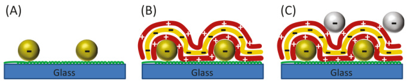{width=55%} Figure 3.1: Schematic of the three main fabrication steps (A)-(C) to self-assemble a planar MM by electrostatic forces. Here, the resulting MM [shown in (C)] consists of one gold NP array and one silver NP array. Details about the different steps are given in the text.

In the first fabrication step in Fig. 3.1 (A), the surface chemistry of the glass substrate is altered through the functionalization with an organosilane [252]. This allows the attachment of gold NPs to the substrate resulting in a gold NP array. The gold NPs are fabricated in a preliminary step in solution by the well-known Turkevich method [253]. This method yields almost perfectly spherical NPs with a net negative charge [254]. The charge prevents agglomeration of the NPs and ensures a well distributed surface coverage of NPs on the substrate, as will be shown later on. In the next process step, shown in Fig. 3.1 (B), the array of gold NPs is covered by a discrete number of oppositely charged PE layers (three

of them are exemplarily shown). Finally, on top a second array of silver NPs (that can be fabricated with a spherical shape by the Lee-Meisel method [255] which leaves the NPs equally slightly negatively charged) is attached by electrostatic forces, as shown in Fig. 3.1 (C). It has to be stressed that only an odd number of PE layers can be used to separate the NP layers since all NPs are negatively charged.

The introduced fabrication of MMs consisting of two coupled arrays of charged NPs by electrostatic forces exhibits versatile advantages. First, all kinds of chargeable NPs can be used [113]. Second, the approach is not limited regarding the number of NP arrays and separating PE layers. The deposition of one NP array or one PE layer can be done in a automated dip-coating process within minutes [256]. Therefore, a huge class of different MM geometries is possible. Third, and this is the most important point, the thickness of one PE layer is about one nm [114, 257, 258]. Consequently, the separation of adjacent NP arrays can be controlled at the nanometer scale in discrete steps of one nm. This allows an unprecedented control of the coupling of different NP arrays.

In the following sections an exclusive set of MM geometries is investigated in detail that can be fabricated by the introduced self-assembly technique. The subsequent section starts with a brief discussion of a single gold NP array. Most importantly a suitable model to describe the optical response is introduced. In Sec. 3.2.1 the resonances of a MM consisting of two strongly coupled gold NP arrays are studied. Section 3.2.2 presents results of so-called asymmetric NP arrays where different NP materials are chosen for distinct NP arrays. Finally, all obtained results are put together to design a planar MM for an application as tunable substrate for surface enhanced Raman spectroscopy (SERS). A last section includes final comments and remarks about two-dimensional self-assembled MMs.

# 3.1 Single array metamaterials

A brief discussion of the optical properties of a single array of gold NPs is given here. This serves as the first elementary step for an investigation before more sophisticated MMs made of coupled NP arrays are considered. All structures of this chapter have been fabricated and measured by Dr. Cunningham from the group of Prof. Bürgi, University Geneva. The self-assembly technique as introduced in Fig. 3.1 has been applied. Obviously, only process step (A) is required to obtain a single NP array. An SEM image of a fabricated structure is shown in Fig. 3.2 (A). There, gold NPs with approximately 10 nm radius were assembled on a glass substrate. As expected, the alignment of the NPs is amorphous. Furthermore, it can be seen that the negative charge of the gold NPs prevents them from aggregation and all NPs are adequately separated. A surface filling fraction of about 25 – 30 % is obtained. The measured extinction spectra of the structure under illumination normal to the substrate is shown in Fig. 3.2 (B). It offers a single resonance peak at around 510 nm. The origin of

this peak is explained in the following by devoted simulations.

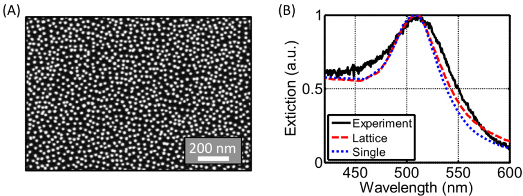{width=70%} Figure 3.2: (A) SEM image of a fabricated gold NP array (10 nm radius) [114]. (B) Measured (black solid) as well as simulated extinction spectra. A square lattice of gold NPs (red dashed) and a single gold NP (blue dotted) are considered in simulations.

In simulations the gold NPs are assumed as perfect spheres with a radius of 10 nm taken from the experiments. This assumption is verified by the almost perfect spherical NPs that appear on the fabricated samples [cf. Fig. 3.2 (A)]. Two different kinds of simulations are performed. First, the optical response of gold NPs arranged onto a square lattice is investigated. This is done by the so-called Korringa-Kohn-Rostoker method [259]. This method permits considering two-dimensional lattices of spheres and layers of homogeneous materials. Thus, the glass substrate can be taken into account in simulations. The filling fraction of the NPs on the square lattice is set to 27 %. Additional simulations were performed for 25 and 30 % but they yield identical resonance positions and only slightly different resonance widths and are therefore, not shown here. From such independence it can be concluded that interparticle coupling is sufficiently weak such that it can be neglected. Material parameters of gold are taken from literature [260] with a size dependent correction of the imaginary part that accounts for the finite size of the NPs [261]. The permittivity of the substrate is assumed as a real valued constant of 2.25 and the cladding is air. The results of the lattice simulations are shown in Fig. 3.2 (B) by the red dashed curve. The extinction is defined as $C_{\mathrm{ext}}=1-\tau$ where $\tau$ is the simulated transmittance of the square lattice. The resonance position in simulations perfectly coincides with the experimental one. Only a slight difference appears for the resonance width. Consequently, it can be concluded that the precise spatial positions of the gold NPs on the substrate have no influence on the optical response if the filling fraction is about $25-30\%$. Otherwise, the simulated results considering the perfect lattice of NPs should tremendously differ from the experimental ones where the NPs are amorphously arranged.

For the second kind of simulations only a single gold sphere of again 10 nm radius is considered. The theoretical solution of this problem was given in Sec. 2.2. Since in Mie

theory the surrounding of the sphere has to be homogeneous the glass substrate is neglected, i.e. the surrounding is assumed to be air. The results, shown by the blue dotted curve in Fig. 3.2 (B), almost perfectly coincide with that of the square lattice. Thus, two important conclusions can be drawn. First, the influence of the glass substrate on the optical response is negligible since it was not taken into account for the single sphere simulations. Second, the extinction of a gold NP array with a filling fraction of about $25-30\,\%$ can be sufficiently well described by just considering a single sphere. Consequently, the alignment of the gold NPs on the substrate has no influence and the extinction resonance is dominated by the LSPR of the single gold sphere. The possibility to describe the amorphous gold NP array, as shown in Fig. 3.2 (A), by the LSPR of a single sphere will be frequently applied for the rest of this chapter.

# 3.2 Double array metamaterials

In the last section it has been shown that the optical response of a single gold NP array is very limited since it is identical to that of a single gold sphere. The aim of this section is to introduce planar self-assembled MMs with more sophisticated spectral properties. This is achieved by considering the coupling of two NP arrays. As it has been already discussed at the beginning of this chapter, the introduced self-assembly technique allows a control of the NP array separation on the nanometer scale (cf. Fig. 3.1). Assume that the optical response of a single NP array can be fully described by just considering one NP, as revealed in the last section. Consequently, the coupling of two NP arrays should be dominated by the interaction of NPs from the bottom and from the top array. Since the distance of these two arrays can be reduced to one PE layer in the experiments, meaning a separation about one nm, these NPs of adjacent arrays are strongly coupled. Therewith, a complex optical response of the self-assembled MM can be achieved. The potential of this proposed concept is demonstrated in the following by two different MM geometries. The first one is called symmetric NP array MM. It consists of two strongly coupled NP arrays that are made of the same material and radii. The second one, the asymmetric NP array MM is also made of two NP arrays. However, the NPs of both arrays differ in material as well as radii which breaks the symmetry of the structure.

# 3.2.1 Symmetric nanoparticle arrays

The MM under consideration in this subsection consists of two gold NP arrays (10 nm radius) that are separated by a discrete number of PE layers. It was fabricated and characterized by the group from Prof. Bürgi, University Geneva, using the proposed self-assembly technique of Fig. 3.1. An SEM image of the structure can be seen at Fig. 3.3 (A). The bright spots

show the gold NPs of the top array whereas the grey spots correspond to NPs of the bottom array. The filling fraction of both arrays is identical to that of the single array, as given in Sec. 3.1. As previously claimed, the optical response of such a MM should be dominated by the coupling of NPs from adjacent arrays. Therefore, the MM might be described by a simple dimer model considering the coupling between one NP from the bottom and one from the top array. The NP separation of the dimer is given by the number of PE layers that separate both arrays. Of course, this reduction of the complex amorphous MM, as shown in Fig. 3.3 (A), to a single dimer seems to be an oversimplification. However, the following results of this chapter will reveal that the dimer model is very powerful and fully sufficient to describe the optical response of the presented planar MMs.

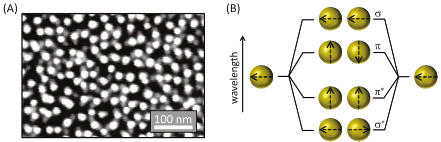{width=71%} Figure 3.3: (A) SEM image of a planar self-assembled MM consisting of two arrays of gold NPs (10 nm radii) that are separated by 31 PE layers [114]. (B) Hybridization diagram of two strongly coupled plasmonic NPs; dashed black arrows depict the oscillation of the electric dipoles in the NPs.

The key to understand the optical properties of such double NP arrays is the appreciation of the resonant eigenmodes supported by the dimer. Figure 3.3 (B) presents the possible eigenmodes of such a NP dimer in the case that the optical response of each NP can be fully described by that of an electric dipole. This assumption has been already verified for much larger gold NPs in Sec. 2.3 [cf. Fig. 2.3 (B)]. The possible eigenmodes are given in the form of a hybridization diagram, as it is well-established in molecular physics [173, 174]. If both NPs are well-separated (approximately for center to center distances larger than four times the NP radius) the dimer offers only one notable resonance at the LSPR wavelength of the single gold NPs. Such a situation is identical to that of the single gold NP array. Only if the NPs are strongly coupled, i.e. their separation distance is small, four different eigenmodes are observed at distinct wavelengths [151]. Two of these eigenmodes are symmetric since the dipoles of both NPs are oscillating in phase; they are named $\sigma$ and $\pi^{*}$ similar to molecule physics. The remaining two eigenmodes $\sigma^{*}$ and $\pi$ are characterized by an 180° out of phase oscillation of both dipoles. The $\sigma$ and $\pi$ eigenmodes have been already discussed in the previous chapter [cf. Fig. 2.3 (C) and (D)].

In a first step the optical response of the double gold NP array is investigated by analyzing

the resonance positions of the extinction cross section for different samples. These samples differ by the numbers of PE layers that separate the gold NP arrays. For each sample extinction measurements are carried out under illumination normal to the substrate. The resulting resonance shifts with respect to the single gold NP LSPR are shown in Fig. 3.4. In addition to the previous use of gold NPs with 10 nm radius to fabricate the arrays also larger NPs of 20 nm radius were considered. Both investigated radii offer a strong dependency of the extinction resonance shift on the number of separating PE layers and therewith on the spatial separation of the gold NP arrays. This effect is more pronounced for the larger NPs, as shown in Fig. 3.4 (B).

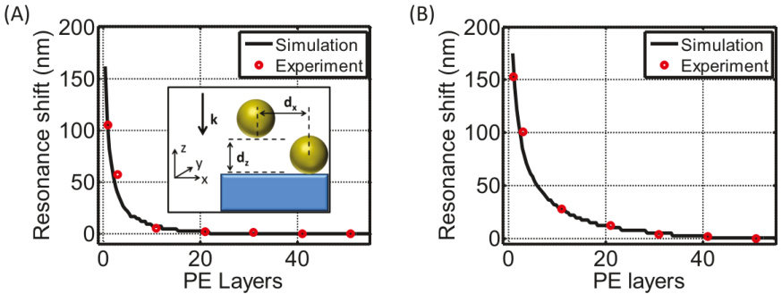{width=70%} Figure 3.4: (A) Resonance shift of extinction maxima for a double gold NP array (10 nm radius) as a function of the separating PE layers. Experimental (red dots) as well as simulated (black solid) results are plotted. The inset shows the geometry as considered in simulations; a dimer consisting of one gold NP from the bottom and one from the top NP array; the separating PE layers are not shown. (B) Same as in (A) but now the gold NP arrays are made of NPs with 20 nm radius.

The simulations of the optical response of the fabricated MMs are realized by a dimer model, as motivated above. The inset of Fig. 3.4 (A) shows a sketch of the considered geometry. From experimental observations it can be safely concluded that the bottom array of NPs is fully covered by the PE layers [114]. Since the filling fraction is only about 25 % the NPs of the top array should assemble into the free space in-between the NPs of the bottom array. Thus, the dimer consists of two gold NPs, one from the top and one from the bottom array, that are assumed as perfect spheres. The radii are taken from the experiment, i.e. 10 nm or 20 nm. Therefore, the separation of both spheres in simulations is chosen with respect to the number of PE layers that separate the gold NP arrays in the experiments. The shown distance $d_x$ and $d_z$ in Fig. 3.4 (A) describe the separation perpendicular and along the illumination direction, respectively. They are defined as follows: $d_x = 2r_{\rm Au} + N_{\rm PE}d_{\rm PE}$ and $d_z = N_{\rm PE}d_{\rm PE}$, where $r_{\rm Au}$ is the gold NP radius, $N_{\rm PE}$ is the number of separating PE layers and $d_{\rm PE}$ their thickness. The PE layers are assumed as homogeneous layers with a real valued constant permittivity of 2.2 and a thickness of $d_{\rm PE} = 0.9$ nm according to literature [114, 117, 257, 258]. Since the difference between the PE layer permittivity and the glass

substrate is negligible, the surrounding of the dimer is assumed as a homogeneous material with a permittivity of 2.2. The illumination is a plane wave propagating along the negative $z$-direction. The linear polarization of the incident field is chosen parallel to a diagonal in the $xy$-plane, such that $\mathbf{E}_{\mathrm{inc}}=E_{0}\hat{\mathbf{e}}_{x}+E_{0}\hat{\mathbf{e}}_{y}$. This accounts for the random alignment of the dimers in the experiments. For a linearly polarized incident field all dimer orientations appear in the fabricated samples. This can be mimicked in simulations by choosing a polarization of the incident field that allows the excitation of all possible eigenmodes of the dimer, as done here.

The results of the dimer model perfectly agree with the measured resonance shifts of the coupled gold NP arrays, as can be seen by Fig. 3.4. If the number of PE layers is decreased, meaning an increased coupling of both NP arrays, the resonance position gets shifted to longer wavelengths (indicated by the positive resonance shift). This strong dependency of the resonance position on the NP separation is well-known for the $\sigma$ eigenmode of the dimer [175, 262, 263]. Consequently, this eigenmode has to dominate the extinction spectra for the investigated planar MMs [114]. Both electric dipoles of the NPs are oscillating along their connection line [cf. Fig. 3.3 (B)]. The accuracy of the dimer model to predict the resonance positions of MMs made of strongly coupled NP arrays provides a huge advantage. Instead of time consuming simulations taking the full amorphous arrangement of all illuminated NPs into account, the dimer model appears to be really fast and sufficient to describe and understand the optical response.

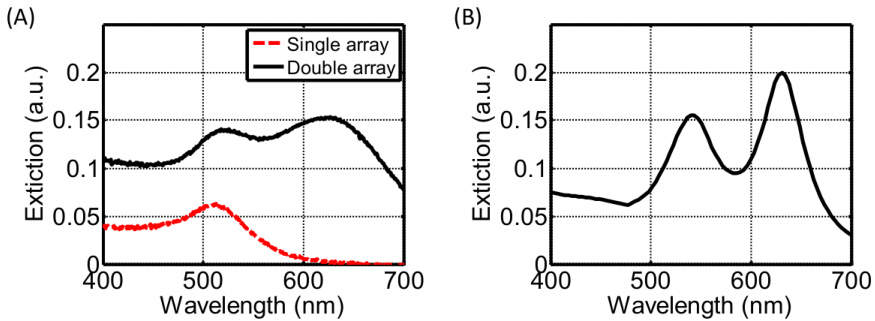{width=71%} Figure 3.5: (A) Measured extinction spectra for a single gold NP (10 nm radius) array (red dashed) and two strongly coupled gold NP arrays with one separating PE layer. (B) Simulated extinction spectra relying on the dimer model with one PE layer.

Of course, not only the resonance positions are important features but also the corresponding spectra. Therefore, in Fig. 3.5 the measured extinction spectra are compared to the results of the dimer model. The case of strongest coupling of the two gold NP arrays is shown, i.e. both arrays are only separated by one PE layer. Even in this extreme coupling regime the predictions of the dimer model are quite intriguing. The double peak structure

of the experiments, as shown in Fig. 3.5 (A), is nicely reproduced by simulations [cf. Fig. 3.5 (B)]. Only the resonance widths slightly differ. This is somehow expected. In simulations only two NPs with a fixed distance to each other are considered, whereas in experiments a huge number of amorphously arranged NPs is illuminated. Obviously, not all NPs of adjacent arrays will form such a tight arrangement as considered in the dimer model. This causes the experimentally observed broadening of the resonances. The double peak structure can be easily explained by the hybridization scheme of Fig. 3.3 (B). The longer wavelength resonance can be identified with the $\sigma$ eigenmode, as mentioned above. The shorter wavelength resonance is the $\pi^{*}$ eigenmode, where both dipoles are oscillating in phase perpendicular to the connection line. The asymmetric eigenmodes, namely the $\sigma^{*}$ and $\pi$ eigenmode of Fig. 3.3 (B), cannot be excited. The reason is the highly symmetric MM consisting of two NP arrays of same material and radius and the plane wave illumination normal to the substrate. In the following subsection the possibility to excite all four possible eigenmodes in such planar MMs is discussed.

In conclusion, up to here, planar self-assembled MMs have been demonstrated consisting of two strongly coupled gold NP arrays. It has been shown that the optical response is dominated by the coupling of the NPs from the bottom and the top array. Furthermore, the symmetric configuration and illumination allows only for the excitation of symmetric eigenmodes. Finally, most importantly, the introduced dimer model is fully sufficient to describe the optical response of the complicated MM even in the regime of very strong coupling, i.e. a separation of both NP arrays of around one nm.

# 3.2.2 Asymmetric nanoparticle arrays

The focus of this subsection is on planar MMs that consist of two different NP arrays, i.e. the NPs of different arrays are made of distinct metals and also have different radii. This asymmetry in the sample should allow to excite, in principle, all four possible eigenmodes of the dimer model [99, 115, 264–266]. Of course, it is also possible to chose an asymmetric illumination to excited asymmetric eigenmodes [267]. Anyhow, we keep the plane wave illumination and only introduce asymmetry in the MM. Especially, the asymmetric eigenmodes promise a more complex response of the MM. The out of phase oscillation of the electric dipoles in both spheres (one from the bottom and one from the top array) can result in a magnetic dipole of the dimer structure [151], as already revealed in Fig. 2.3 (D). This magnetic dipole moment is one important requirement for many envisioned applications of MMs, as will be discussed in detail in Sec. 4.1. Apart from the magnetic dipole moment the asymmetric resonance is important for functional devices, e.g. for the field of plasmon induced transparency [268, 269].

The MM considered here is made of one gold NP array with 14 nm radius that is covered by a discrete number of PE layers and on top a second NP array of silver NPs with 20 nm

radius. An SEM image of the fabricated structure can be seen in Fig. 3.6 (A). The smaller NPs that are slightly out of focus show the gold NP array on the substrate. The silver NP array on top is better resolved. Silver NPs were fabricated by a Lee-Meisel method [255]. This method results in a wider range of particle sizes and shapes as can be seen by the SEM image but the main part of them can be safely assumed as perfect spheres with 20 nm radius [117]. Furthermore, the surface coverage achieved by the silver NPs is not as homogeneous as for the gold NP array. Therefore, both isolated silver NPs and small aggregates being observed. The filling fractions of both NP arrays are around 25 %.

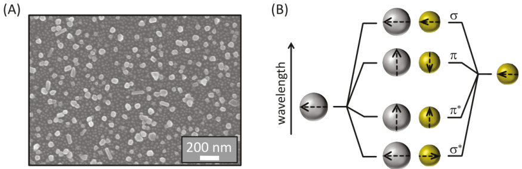{width=71%} Figure 3.6: (A) SEM image of a self-assembled MM made of one gold NP array (14 nm radius) that is covered by seven PE layers and a silver NP array (20 nm radius) on top. Because of the difference in height, the gold NPs, which are underneath, appear slightly out of focus [117]. (B) Hybridization diagram for one strongly coupled gold and silver NP.

Figure 3.6 (B) shows the hybridization diagram for a dimer made of one gold and one silver NP. Identical eigenmodes are possible when compared to the symmetric case presented in Fig. 3.3 (B). However, the resonance positions are modified due to the different LSPR resonance wavelengths of the silver and gold NP [99].

In a first step, again the optical response of the single NP arrays needs to be investigated. Although this has in principle been done in Sec. 3.1, here different NP radii and metals appear. The SEM image of a single array of silver NPs with 20 nm radii can be seen in Fig. 3.7 (A). The single gold NP array (14 nm radius) is not shown, since it looks very similar to that of Fig. 3.2 (A) except that the NPs are slightly larger here.

Figure 3.7 (B) shows the extinction spectra as obtained from measurements and simulations. In simulations only one single gold or silver NP is considered, according to Sec. 3.1, and the surrounding is set to air. The NPs are assumed as perfect spheres with a radius of 14 and 20 nm for the gold and the silver NP, respectively. An almost perfect agreement between experiments and single sphere simulations is achieved for the gold NP array. The resonance position is fully met and only a slight difference appears for the width. The situation gets more complex in the case of the silver NP array. The measured extinction curve provides two peaks, one close to the LSPR of the single silver NP and one really broad peak at longer wavelengths around 700 nm. The latter one is a direct consequence of the more complicated

morphology of the silver NP arrays, as it can be seen by Figs. 3.6 (A) and 3.7 (A). Small aggregates of $3-4$ silver NPs are existing in addition to isolated NPs. These aggregates result in the significantly red shifted peak. Furthermore, the resonance position and width of the single silver NP simulations does not sufficiently match to the experimentally observed peak that is slightly red shifted. This discrepancy stems from the polydispersity in size and shape of the fabricated silver NPs. In experiments not only perfect spheres with 20 nm radius are observed but also larger spherical NPs and even small nanorods. This causes a slight red-shift and a broadening of the measured LSPR.

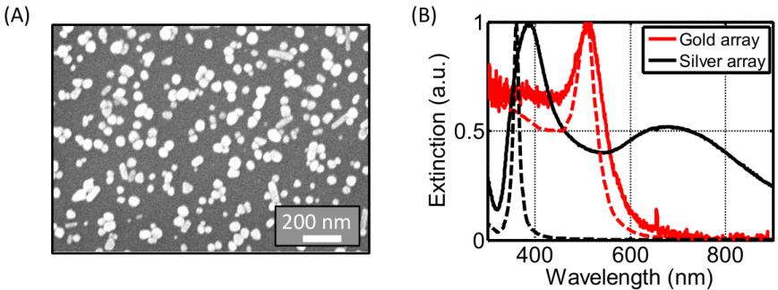{width=70%} Figure 3.7: (A) SEM image of a single silver NP array (20 nm radius) [117]. (B) Measured (solid) and simulated (dashed) extinction spectra for single arrays of gold (red) and silver (black) NPs.

The discrepancy between experiments and simulations for the silver NP array seems to be a disadvantage. However, it will be shown that the dominating resonances of the MM made of coupled arrays can be fully and accurately described by relying on the dimer model. Therewith, the resonances of the MM that correspond uniquely to the interaction between the distinct NP arrays and the identification of asymmetric eigenmodes is possible.

Figure 3.8 (A) shows the measured extinction spectra of the strongly coupled asymmetric NP arrays for different numbers of separating PE layers. Since the gold NPs as well as the silver NPs exhibit a net negative charge only odd numbers of PE layers are possible (cf. Fig. 3.1). The experimental spectra offer two peaks, one at shorter wavelengths (close to the resonance of the single silver NP array) and one at longer wavelengths (around the single gold NP array resonance). Before these two resonances are examined in more detail the results of the dimer model are presented to evaluate its predictive power.

Similar to the symmetric NP array the dimer model describes only the coupling between NPs from adjacent arrays. Here, one gold NP from the bottom array with 14 nm radius is considered together with one silver NP of 20 nm radius from the top array. The geometry can be seen at the inset of Fig. 3.8 (B). The separation of both NPs is, again, chosen with respect to the number of separating PE layers of the experiments, i.e. $d_{x} = r_{\mathrm{Au}} + r_{\mathrm{Ag}} + N_{\mathrm{PED}}d_{\mathrm{PE}}$ and $d_{z} = N_{\mathrm{PED}}d_{\mathrm{PE}}$. The notation as well as the thickness of one PE layer are identical to that of

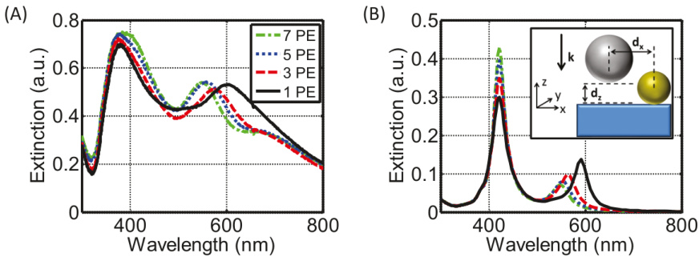{width=70%} Figure 3.8: (A) Measured extinction spectra for a MM consisting of two strongly coupled NP arrays. The first array on top of the glass substrate consists of gold NPs with 14 nm radius and is covered by a discrete number of PE layers (the spectra for 1, 3, 5 and 7 PE layers are shown here). On top of the PE layers a second NP array is deposited consisting of silver NPs with 20 nm radius. (B) Simulated extinction spectra by the dimer model. The inset shows the geometry as considered in simulations. The colorbar is maintained from (A).

the previous subsection. The same holds for the illumination of the dimer structure and all material parameters. The results of the dimer model simulations can be seen in Fig. 3.8 (B). An intriguing agreement to the experimental results is observed. The simple dimer model yields almost the same resonance positions. Furthermore, the qualitative dependency on the number of PE layers is identical for simulations and experiments. Only the widths of the resonances are smaller in simulations. This is for obvious reasons, as already discussed in the last subsection.

Now, the dependency of both observed resonances on the number of PE layers is investigated in more detail. As can be clearly seen at Fig. 3.8 (both, for experiments and simulations) the resonance position of the shorter wavelength resonance is not affected by the number of PE layers. In contrast the peak amplitude strongly depends on the separation of both NP arrays. The complete complimentary behavior is observed for the longer wavelength resonance. Here, the resonance position strongly depends on the number of PE layers whereas the peak amplitude stays nearly constant. The dependency of both resonances on the NP array separation is concluded in Fig. 3.9.

The relative peak amplitude of the short wavelength resonance gets enhanced with increasing numbers of PE layers, i.e. a larger separation of the NP arrays, as shown in Fig. 3.9 (A). The dependency appears more pronounced in simulations. This might be expected since the resonance width of the short wavelength resonance is much smaller in simulations, i.e. the resonance is more pronounced. However, an increasing amplitude in extinction for an increasing number of PE layers indicates the excitation of an asymmetric eigenmode of the structure. If both arrays are strongly coupled the excited asymmetric eigenmode cannot radiate into the far-field and therefore, the scattering of the dimer is suppressed. If the cou

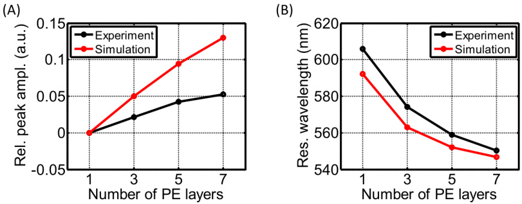{width=70%} Figure 3.9: Comparison of experimental results and simulations for the two observed resonances of the extinction spectra. (A) The peak amplitude for the short wavelength resonance (appearing at around 400 nm in Fig. 3.8) is shown as a function of the separating PE layers. From all peak amplitudes of the extinction the peak amplitude of 1 PE layer is subtracted. (B) Resonance wavelength for the long wavelength extinction resonance of Fig. 3.8 as a function of the separating PE layers.

pling gets reduced, i.e. the number of PE layers is increased, the excitation into the far-field is enhanced and therewith the peak amplitude of the extinction.

The longer wavelength resonance offers a strong dependency of the resonance position on the number of separating PE layers, as can be seen in Fig. 3.9 (B). An almost perfect agreement between experiments and simulations is observed. This dependency of the resonance position on the number of PE layers and the strong red shift for small array separations are a clear signature for the excitation of an symmetric eigenmode similar to the observations for the symmetric NP array (cf. Fig. 3.4).

To facilitate a confirmation of this qualitative discussion on the origin of the excited eigenmodes the field distributions of the dimer structure are presented in the following. This should also allow to reveal properties of the observed resonances in terms of the provided hybridization diagram of Fig. 3.6 (B).

The field distribution of the short wavelength resonance shown in Fig. 3.10 (A) and especially the vectorial character of the internal fields directly reveal the asymmetric character of the excited resonance. The correlation of the internal fields identifies the observed resonance as a combination of the $\sigma^{*}$ and $\pi^{*}$ eigenmode of the hybridization diagram of Fig. 3.6 (B). So the induced dipoles are oscillating out of phase along the $x$-axis and in phase along the $y$-axis. In contrast, the internal fields for the long wavelength resonance, shown in Fig. 3.10 (B), offer the typical correlation that is identified by the $\sigma$ eigenmode of the dimer. This is confirmed in addition by the huge field enhancement of about 80 times the incident field that is observed in-between both spheres that is expected for the $\sigma$ eigenmode [270–272]. An animation of the oscillation of the internal field over an optical cycle is given in Ref. [117].

To conclude up to this point, a planar MM consisting of two different strongly coupled

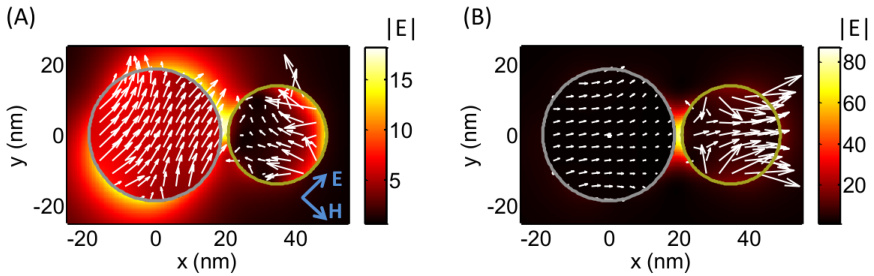{width=70%} Figure 3.10: Field distributions for the dimer structure for one separating PE layer. The magnitude of the electric field (normalized to the incident field) is shown for the short wavelength resonance (at 422 nm) in (A) and for the long wavelength resonance (at 592 nm) in (B). The fields are shown in the $xy$-plane perpendicular to the illumination direction that includes the origin of the gold sphere; the polarization of the incident field is shown by the blue arrows. The white arrows inside both spheres depict the vectorial character of the internal fields at a specific time. In other words, the lengths of the white arrows decode the magnitude of the internal field at this position and the direction shows the contribution of the $x$- and $y$-component of the internal field to its magnitude.

NP arrays has been investigated in detail. Experimental extinction spectra offered two resonances that could be fully reproduced by the dimer model. By investigating the dependency of both resonances on the NP array separation, the excitation of symmetric as well as asymmetric eigenmodes was revealed. This is in contrast to the symmetric NP array MMs where only symmetric eigenmodes were possible. Additional field distributions obtained from simulations of the dimer model confirmed the character of the observed resonances and allowed their characterization based on the hybridization diagram. In principle, up to here everything has been investigated to understand the possible resonances of planar MMs made of two strongly coupled NP arrays.

Before these results are exploited to design a MM for a desired application the accuracy of the dimer model is once again verified. Up to here, the assumption that the optical response of these MMs is mainly dominated by the coupling of NPs from adjacent arrays was only confirmed by comparing the dimer simulations with experimental results. Rigorous simulations taking into account the fully amorphous character of the fabricated samples have never been performed. The slight differences, e.g., of the resonance width in simulations and experiments was accounted to this amorphous arrangement, but this was never shown. To provide this missing link the most complex planar MM considered up to here is once rigorously simulated now. Anyhow, it has to be stressed that these more sophisticated simulations are only one step that reflect the experimental geometry in more detail. Still the simulations only consider a part of the experimental reality and it cannot be expected that a perfect reproduction of the measured results is achieved. However, the important point about simulations is that they should be sufficient to identify the origin the optical response in order to predict potential applications, as it was already achieved for the dimer model.

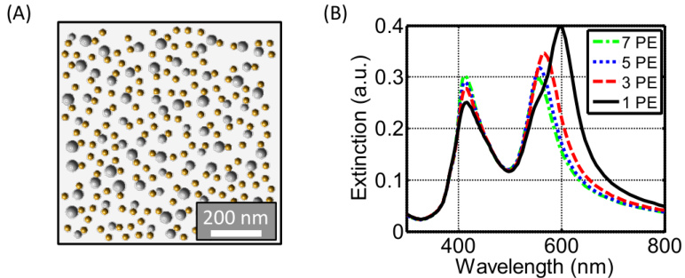{width=62%} Figure 3.11: (A) Sketch of a MM consisting of two strongly coupled NP arrays separated by 1 PE layer as it is considered in simulations. Details about the NP arrangement are given in the text. (B) Simulated extinction spectra of MMs as shown in (A) for different numbers of separating PE layers.

The structure as considered in simulations is shown in Fig. 3.11 (A) which is very close to the fabricated samples [cf. Fig. 3.6 (A)]. An amorphous arrangement of the NPs is achieved by allowing dimers (made of one gold NP and one silver NP) to be randomly oriented in the $xy$-plane. The separation of both NPs is kept from previous simulations, i.e. they depend on the number of separating PE layers. Furthermore, an excess of gold NPs is taken into account and a size variation of the silver NPs (the mean radius of 20 nm is allowed to vary by ±5 nm for every sphere). Both effects also appear in experiments. One thing that is not taken into account is the varying shape of the silver NPs. In simulations they are still considered as perfect spheres to ensure a description by the introduced formalism of Sec. 2.5.

The simulated extinction spectra for different numbers of PE layers can be seen in Fig. 3.11 (B). Most importantly, no additional resonances appear in the spectra compared to the single dimer simulations as shown in Fig. 3.8 (B). Still two resonances are observed, one at shorter wavelengths and the other at longer wavelengths. Furthermore, the important dependency of the resonances on the number of PE layers is fully reproduced. Thus, the amplitude of the short wavelength resonance gets enhanced when increasing the number of PE layers and the long wavelength resonance gets red shifted when decreasing the number of PE layers. The width of both resonances are broadened compared to the single dimer simulations and they are now closer to the experimental ones [cf. Fig. 3.8 (A)]. This confirms the previously given argumentation that the width is influenced by the amorphous arrangement of the NPs and their different sizes.

The only difference is the strong peak amplitude of the long wavelength resonance compared to experiments and the dimer model. The reason might be the larger variation in size and shape of the silver NPs in experiments. There, even elongated silver rods appear and small clusters of silver NPs. Both should essentially improve the short wavelength resonance compared to the long wavelength one. Thus, to perfectly reproduce the experimental spectra

one should also take into account the variations in size and shape of the NPs. However, this would require a full numerical solution of Maxwell's equations, e.g. by the FDTD method, which remains challenging for such amorphous structures with the computational resources available today. One kind of such simulations have been already presented in Sec. 2.4.2, i.e. it is in principle possible. However, here four different structures need to be considered depending on the chosen numbers of PE layers. Since the only possible result is a mere verification of the experimental spectra and no further insight can be obtained from such simulations, they were not performed.

In conclusion, in this subsection it has been shown that self-assembled MMs made of asymmetric NP arrays exhibit symmetric as well as asymmetric resonances under plane wave incidence. Underlying simulations by the dimer model fully reproduced the experimental spectra and allowed an identification of the resonances in terms of a hybridization diagram. Furthermore, the applicability of the dimer model to precisely describe the fabricated MMs has been proven by rigorous simulations taking the amorphous arrangement of the NPs and their size variation into account. The next section is based upon these obtained results. Since the possible resonance properties of self-assembled planar MMs made of two strongly coupled NP arrays are revealed now, these results are exploited to work towards an application of these MMs.

# 3.3 Application: Surface enhanced Raman spectroscopy

Surface enhanced Raman spectroscopy (SERS) has been established as a very powerful analytical tool for the characterization of molecules [273–275]. This further development of conventional Raman scattering is based on inelastic light scattering by molecules that are brought in close proximity to a plasmonic structure. Since each molecule exhibits a unique Raman spectrum its measurement allows for the unambiguous identification of the molecules and potentially also for the concentration. However, the relatively low cross section of SERS remains a challenging task and it would be naturally desirable to enhance it even further. This low cross section prohibits potential applications where only a few or even a single molecule needs to be detected by SERS [276, 277].

Two enhancement mechanisms are known that influence the SERS cross section; the chemical and the electromagnetic enhancement. The first one is linked to the chemical binding of the molecule under investigation to the plasmonic structure. Enhancements due to high local electromagnetic fields are correlated to the electromagnetic enhancement, the second mechanism. Recently, it became possible by numerical investigations and underlying experiments that the influences of both enhancement mechanisms could be distinguished from each other for an exclusively chosen molecule [278, 279]. It has been found that the chemical enhancement, in principle, modifies the Raman spectra, i.e. it shifts the resonance positions,

whereas the electromagnetic mechanism accounts for the pivotal enhancement of the resonances. Thus, the aim of a SERS substrate is to provide huge local fields at respected wavelengths.

In a first order approximation the electromagnetic enhancement scales with the square of the local electric field at the excitation wavelength $\lambda_{0}$ times the square of the electric field at the Stokes wavelength $\lambda_{\mathrm{S}}$. Therewith, an electromagnetic enhancement factor (EF) of the SERS cross section can be defined as

$$
\mathrm { E F } ( \lambda _ { 0 } ) = \frac { 1 } { V } \int _ { V } d V \left| \mathbf { E } _ { \mathrm { l o c } } ( \mathbf { r } , \lambda _ { 0 } ) \right| ^{2} \left| \mathbf { E } _ { \mathrm { l o c } } ( \mathbf { r } , \lambda _ { \mathrm { S } } ) \right| ^{2} \ ,
$$

where the local electric fields $\mathbf{E}_{\mathrm{loc}}$ are integrated over the volume $V$ that is occupied by the molecules.

Of course, manifold approaches exists today to fabricate SERS substrates that offer huge local fields [280-286]. This is either done by top-down or bottom-up techniques [123, 283, 287-292]. The aim of this section is a further development of the already presented planar MMs made of two coupled NP arrays such that they can be applied as SERS substrates. As it has been already shown in Fig. 3.10, these MMs can offer huge local field enhancements. Furthermore, their resonances can be easily tuned over a broad spectral range by changing the numbers of separating PE layers, see e.g. Fig. 3.4. This might be not possible with most of the conventional SERS substrates. And last but not least the structures can be fabricated at large-scale (cm$^2$) in reasonable time and at low costs.

To start with, an estimation of the possible field enhancements is provided. Symmetric as well as asymmetric NP arrays are considered. Two common excitation wavelengths are taken into account that are available in a perspective SERS experiment. Here, exemplarily 514 and 633 nm are chosen, the possible wavelengths by an Helium Neon and Argon ion laser, respectively. Figure 3.12 presents the cumulative distribution function for the forth power of the local electric field. The dimer model is considered for all simulations from now on since it was proven as very powerful and effective tool to sufficiently describe the optical response of coupled NP arrays in the previous section.

The NP dimers that have been considered in simulations are the following. For the symmetric NP array two gold spheres of 20 nm radius are chosen. This radius should offer a stronger dependency of the resonance wavelength on the number of PE layers, as was shown in Fig. 3.4. The dimer for the asymmetric NP array was exactly chosen as in Sec. 3.2.2. The number of separating PE layers for the results in Fig. 3.12 is selected in such a way that the NP dimers offer the maximum local field enhancement at the excitation wavelength. This happens for one separating PE layer for all considered MMs and wavelengths in Fig. 3.12 except for the symmetric NP array at 633 nm excitation wavelength. In the latter case the maximum field enhancement is obtained for three PE layers. The cumulative distribution

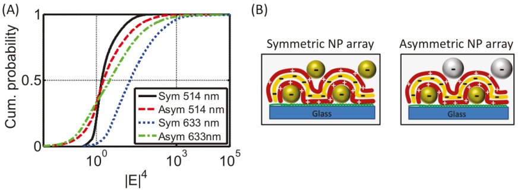{width=70%} Figure 3.12: (A) Simulated cumulative distribution function for the forth power of the local electric field for different types of planar MMs as shown in (B) and the two chosen excitation wavelengths as given by the legend. Details about the considered geometry in simulations are given in the text.

function is calculated at a fixed volume that fully encloses the NP dimer. From the shown results of Fig. 3.12 the following conclusion can be drawn. It is assumed that the position of the molecule to the NP dimer is not known as it might be the case in an experiment. In such a situation the probability to have a molecule at a point in space with a sufficiently high local electric field is maximal for the symmetric NP array consisting of gold NPs of 20 nm radius and an excitation wavelength of 633 nm. Therefore, only this specific planar MM and excitation wavelength are considered in the following to design the SERS substrate. Next, simulations based on the chosen MM are presented to evaluate the SERS performance. Subsequently, the obtained results are used for an experimental implementation.

Figure 3.13 shows the results of the dimer model simulations for the chosen symmetric gold NP array with 20 nm radius. The presented extinction spectra for varying numbers of separating PE layers in Fig. 3.13 (A) emphasize the tuning capability with respect to the resonance wavelength. In principle, the resonance of the MM can be accurately adjusted from 550 to 750 nm depending on the chosen number of PE layers. As already shown in Sec. 3.2.1 the $\sigma$ resonance is excited in such symmetric dimer structure that offers a strong dependency of the resonance position on the NP separation [114]. The grey shaded area in Fig. 3.13 (A) assigns the wavelength range between the excitation wavelength of 633 nm and a possible Stokes wavelength in the experiments of about 660 nm. This domain is the most important one for the SERS efficiency, i.e. the local electric field has to be enhanced inside this domain. Figure 3.13 (C) shows the maximum of the extinction curves at the excitation wavelength of 633 nm. A clear optimum can be identified for three separating PE layers. Since the $\sigma$ resonance of the dimer structure is associated with a sufficient local field enhancement, this resonance for three PE layers of the extinction curves should also define the maximum EF of the SERS signal as defined by Eq. 3.1. The simulated EF as a function of the number of PE layers, as shown in Fig. 3.13 (D), perfectly confirms this deduction.

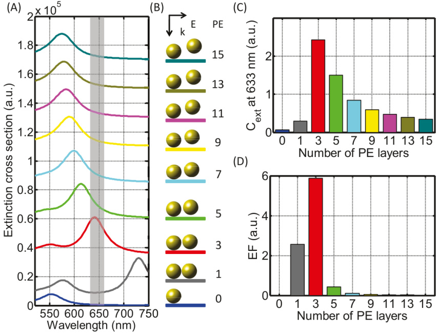{width=69%} Figure 3.13: (A) Simulated extinction spectra by the dimer model taking into account two gold NPs with 20 nm radius, as sketched in (B). The number of separating PE layers varies from bottom to top, where 0 corresponds to a single gold NP array. The grey shaded area defines the wavelength range between the excitation (633 nm) and a possible Stokes wavelength in the experiments. (C) Amplitude of extinction curves from (A) at excitation wavelength of 633 nm. (D) Simulated SERS EF as a function of the separating PE layers.

A maximal EF is obtained for three PE layers. It is important to note that the double NP arrays always performs better than the single NP array that serves here as a reference sample.

The important conclusions for the presented dimer simulations are the following ones. First, it is possible to tune the resonance wavelength of the planar MM over a broad spectral range. In practice, this might be the most important point. With respect to the chosen molecule and excitation wavelength, a planar MM working as a SERS substrate can be designed that offers the field enhancement at the required wavelength. The spectral operation range of the MM can be further improved by choosing silver as the NP material. In this case even resonances down to 400 nm might be addressed [117, 151]. Another important point of Fig. 3.13 is the possibility to identify the sufficient number of PE layers for the field enhancement already by the resonances of the extinction cross section. This is clear since Fig. 3.13 (C) and (D) offer the same number of PE layers for an optimal field enhancement and share the same dependency on the number of PE layers. Therefore, instead of a more

complicated integration of the local fields to obtain an EF [Fig. 3.13 (D)], fast computations of the extinction spectra [Fig. 3.13 (C)] are sufficient to obtain the optimal number of PE layers.

The verification of these theoretical predictions on the performance of a self-assembled planar MM as SERS substrate is given by an experimental realization in the following. Therefore, MMs consisting of two strongly coupled gold NP arrays with 20 nm radius where fabricated by the group of Prof. Bürgi, University Geneva. The fabricated samples were doped by a model analyte (Nile blue). Measurements of the SERS signal were carried out by Dr. Ciala and Dr. Weber, Institute of Photonic Technology Jena, by illuminating the samples at 633 nm. The resulting spectra can be seen in Fig. 3.14 (A).

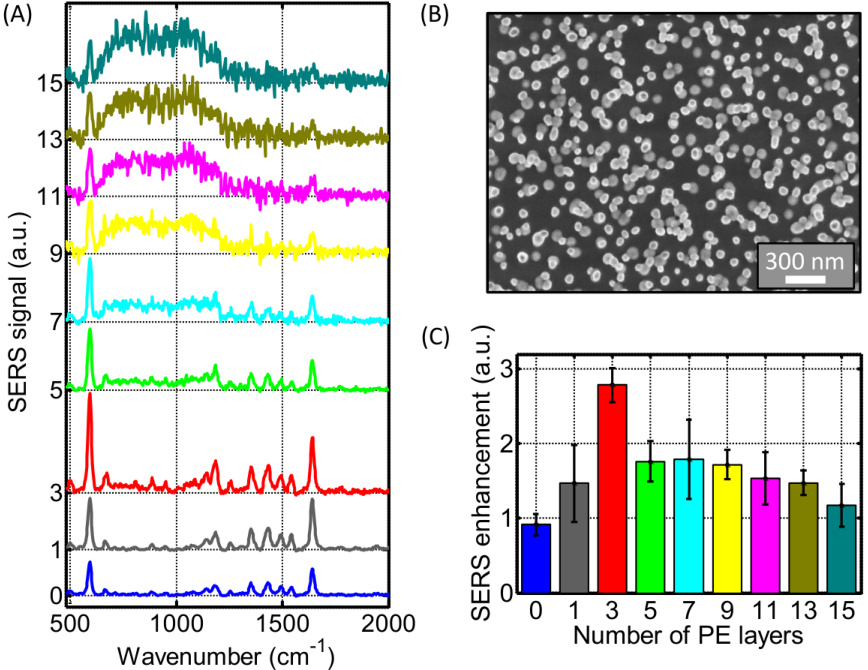{width=70%} Figure 3.14: (A) SERS spectra of Nile blue as a function of the wavenumber of the molecular vibration of Nile blue for the fabricated gold NP arrays for different numbers of PE layers. The notation and the colorbar are chosen identical to Fig. 3.13. (B) SEM image of a fabricated sample where both gold NP arrays are separated by 15 PE layers. (C) Integrated intensity of the pronounced SERS peak at 590 cm$^{-1}$ as a function of the number of separating PE layers.

The SERS spectra offer a pronounced Raman peak at 590 cm$^{-1}$ for the single NP array and for all investigated samples. The peak position coincides with documented values for Nile blue [293, 294]. The peak intensity with respect to the background strongly depends on the number of PE layers. An optimum is observed for three PE layers. In this case a multitude of

additional peaks can be observed at higher wavenumbers that were not visible for the other samples. The quantification of the performance of the fabricated structures is done by an integration of the pronounced Raman peak at 590 cm$^{-1}$ as a function of the number of PE layers. The results shown in Fig. 3.14 (C) clearly indicate an optimum of the performance for three separating PE layers. This result is fully in line with the previously given simulations of the samples by the dimer model. Furthermore, the theoretically predicted dependency of the SERS EF on the number of PE layers, as given by Fig. 3.13 (D), is fully reproduced by the experiments. Of course, in simulations the enhancement appears more pronounced to the measured values. This is expected, as mentioned previously, since the simulations do not account for the amorphous arrangement of the NPs and therefore the resonances appear much sharper compared to the experiments.

In conclusion, in this section it has been demonstrated that the proposed self-assembled MMs of this chapter can be tuned to a desired application. The focus was on the enhancement of the local electric field to design a suitable SERS substrate. It has been shown that planar MMs of two strongly coupled gold NP arrays can be tuned to offer the required field enhancement at a defined spectral range given by the investigated molecule. The predicted performance based on simulations by the dimer model were finally verified by experiments investigating the SERS spectra of the dye Nile blue.

# 3.4 Concluding remarks

This chapter provided an in-depth study of planar MMs that were self-assembled onto a substrate. The line of research was driven by an existing and well-controllable self-assembly technique based on electrostatic forces [250]. Amorphous arrays of resonant NPs served as the main building blocks for the MMs. After preliminary investigations of the optical properties of a single array, two of them were strongly coupled.

The advantage of the self-assembly process is the controllable separation of both arrays in discrete steps of one nm [114, 117]. A theoretical model has been developed to sufficiently describe the optical response of these MMs. The combination of theoretical predictions and measurements provided the possible excitation of symmetric as well as asymmetric resonances in these structures. Finally, an application of these planar MMs has been proposed as a tunable SERS substrate. Again theoretical predictions were verified by underlying experiments.

Obviously much more complex MMs are possible by the presented self-assembly technique of this chapter. Although even the studied structures of two coupled NP arrays offered very promising resonance features, the stacking of more arrays might be of interest for future research [295]. For example the emergence of bulk material properties of MMs could be studied. Furthermore, instead of single NPs more complex plasmonic structures can be

arranged in one array, as it was already demonstrated for honeycomb islands [296]. Apart from the investigation of the mere plasmonic properties of the NP arrays, the interaction of the possible systems with molecular or atomic systems is a very promising direction for further research. First implementations have already demonstrated that the PE layers can be doped by dyes or replaced by fluorescent layers [297].

Most of these mentioned points were partially investigated (and sometimes resulted in a publication) during the work of this thesis. However, the focus of the chapter has been put on an in-depth study of two coupled NP arrays. This provided a fundamental understanding on how such complex MMs might be theoretically described and what possible optical properties can be already achieved by them.

The next chapter removes the geometrical constraint of two-dimensional planar MMs. Fully three-dimensional self-assembled structures are presented and their intriguing optical properties are discussed in detail. The focus is on the development of MMs with an isotropic magnetic response in the visible and a self-assembled cloaking device. This has to be seen as the second contribution (the first one was given in this chapter) to the second goal of this thesis which is on proposing new designs to experimentally realize self-assembled MMs.

# 4 Three-dimensional self-assembled metamaterials

Richtiges Auffassen einer Sache und Mißverstehn der gleichen Sache schließen einander nicht vollständig aus.

FRANZ KAFKA (DER PROZESS)

Whereas the last chapter discussed planar MMs in detail, the focus of this chapter is on self-assembled MMs with a notable extension into the third dimension. One consequence of this bulk character is the vanishing requirement to consider a substrate since the fabrication of these three-dimensional structures usually takes place in solution. This entails the opportunity to restrict the consideration even stronger on the study of the scattering properties of the isolated meta-atom [180]. The possibility to fabricate bulk MMs that tend to be in addition isotropic is the key advantage and one major reason for the fast development of self-assembled MMs during the last years [9]. To date it is difficult to imagine that top-down fabrication techniques can be further improved such that bulk MMs can be equally provided in reasonable time and at low costs [8]. Of course, some ideas to solve this problem exist like, e.g. the stacking of various functional layers [130] or direct laser writing [40], but the sequential fabrication of the meta-atoms is still the vital drawback of top-down techniques. Therefore, these approaches for top-down techniques may mitigate the problem of being only able to fabricate planar structures, but cannot solve it entirely. This, however, can only be done by self-assembly techniques.

Nonetheless, MM fabricated with top-down techniques on substrates of course where decisive for the success of the field and its entire evolution. Most notably, this development has been promoted by the opportunity to experimentally realize already quite a lot suggested applications and to prove with that the unconventional way to affect the propagation of light. While relying on self-assembly bottom-up fabrication the strategy of the implementation of functional MMs, a comparable degree of sophistication, and particularly the demonstration of applications was not yet achieved. Of course, this should by no means imply that no functionalities have been demonstrated. But some of the intriguing self-assembled MMs that have been demonstrated, e.g. structures that offer a Fano resonance [56, 90], were almost all assembled two-dimensionally on a substrate. Furthermore, just a few bulk MMs

with more advanced optical properties have been demonstrated prior to the work of this thesis. A possible explanation why only a few of them have been realized by bottom-up approaches, although a lot of concepts exists on how a MM should be designed, was already given in Chap. 1. Proposed meta-atom geometries for top-down MMs cannot be implemented straightforward by bottom-up techniques. Thus, based on the physical concepts of top-down MMs new designs of self-assembled meta-atoms made of resonant NPs were required to be developed. Most importantly, the resulting MMs should be fully three-dimensional to exploit the advantage of the self-assembly and to obtain real materials rather than a functional surface. This chapter contains important contributions to solve these problems.

Therefore, it is of major interest to demonstrate the implementation of MMs by bottom-up techniques to further advance the field of self-assembled MMs. To date a lot of possible bottom-up techniques exist that allow fabricating structures with a fascinating complexity (cf. Fig. 1.3). However, an investigation of the optical properties of these structures is rarely documented and only very seldom structures are demonstrated that offer tailored optical responses. In this chapter, two major subjects that crucially influenced the initial development of MMs are realized by self-assembly techniques. The first one is the demonstration of self-assembled meta-atoms which offer a magnetic dipole response in the visible domain [118]. This serves potentially as one key ingredient for many applications such as perfect lenses [16] or proposals from the field of transformation optics [12, 13, 298]. Furthermore, a self-assembled cloaking device working at optical frequencies is demonstrated [299]. Both MMs were fabricated in solution, i.e. they are bulky. These two demonstrations of functional self-assembled MMs are, to the best of our knowledge for the first time, one important step to push this field towards real applications. In principle, it will be shown that sophisticated concepts from top-down MMs can be realized by bottom-up techniques.

# 4.1 Magnetic dipolar meta-atoms in the visible

Possibly the first historical considerations of what we would call today MM by Veselago [300], assumed an artificial material with an optical response to the electric as well as to the magnetic field. This was quite an intellectual leap since in the visible domain the response to the magnetic field of natural materials is vanishing, i.e. the permeability corresponds to that of free space [52]. Therefore, the hypothesized material was merely considered an intellectual curiosity and could not be realized in the optical domain for many years.

The situation changed with the further improvement of top-down techniques. They made it possible to fabricate meta-atoms with dimensions smaller than the optical wavelength. Therewith, meta-atoms were achieved with a response to the magnetic field even at optical frequencies [10, 51, 301]. Prominent examples thereof are the SRR [302] or the cut-plate pair [181]. Optical properties of materials made of such unit cells can be understood while

considering the medium to have a dispersion in the permeability. The development has been further promoted by extraordinary applications that have been proposed for such MMs that are characterized by a dispersive permeability, e.g. a perfect lens [16] or a cloaking device [12].

Metamaterials made of periodically arranged meta-atoms such as the SRR or the cut-plate pair possess a suitable optical response under certain conditions, i.e. there response is usually anisotropic [183]. However, an unambiguous assignment of true material properties is not possible. The presented MMs usually suffer from spatial dispersion, i.e. their effective material parameters depend in most of the cases on the propagation direction of the incident field [152].

The aim of this section is the suggestion and description of functional meta-atoms that offer a strong magnetic dipole response in the visible and that can be fabricated by bottom-up techniques to obtain bulk MMs. As already mentioned several times the amorphous arrangement of self-assembled meta-atoms directly results in an isotropic response. This is one of the big advantages of self-assembled MMs. The precise discussion on how to assign effective material parameters to such amorphous MMs in Sec. 2.4 yields the following important conclusion. The response of the single meta-atom is required to be isotropic in order to assure a strong impact of the meta-atom response on the effective material parameters (cf. Sec. 2.4.3). Therefore, in addition to a strong magnetic dipole response of the meta-atom also isotropy is an important factor of the design of the meta-atoms. Last but not least the contribution of higher order multipole moments to the scattering should be small to circumvent spatial dispersion [151].

The simplest way to achieve an isotropic magnetic response has been already presented in the thesis. The idea is to exploit the first order Mie resonance of a high permittivity sphere, as it was discussed for silicon [154, 155] in the near IR [cf. Fig. 2.3 (A)]. The magnetic dipole moment is excited if the wavelength inside the sphere is comparable to its diameter [156]. Recently, it has been experimentally demonstrated that it is possible to shift this magnetic resonance to the visible by fabricating silicon spheres with diameters in-between $50-100$ nm [166, 167]. However, it remains challenging to precisely control the diameter of the spheres in experiments and therewith the exact resonance position. Other materials such as, e.g., silicon carbide only work in the near IR or at longer wavelengths [163, 164]. Using glass as the sphere material also is not a promising solution. The induced dipole moment is too weak because of the relatively low real part of the glass permittivity. Therefore, in order to achieve a controllable and sufficiently strong magnetic dipole resonance in the visible more sophisticated meta-atoms are required. The already investigated dimer structure [cf. Fig. 2.3 (C), (D)] does not provide a solution since the optical response is anisotropic.

In the following two different meta-atom geometries are introduced that offer a strong isotropic magnetic dipole response in the visible. They are based on spherical alignments

of resonant plasmonic NPs. The next section demonstrates the magnetic dipole response for so-called supramolecular clusters [110, 112] whereas the same is done in the subsequent section for core-shell clusters [118].

# 4.1.1 Supramolecular clusters of nanoparticles

This section demonstrates the possibility to achieve an isotropic magnetic dipole resonance in the visible by arranging plasmonic NPs into clusters with a spherical outer shape. These meta-atoms are called supramolecular clusters according to a notation from colloidal nanochemistry [111].

The basic idea on the optical response of these supramolecular clusters is identical to that of magnetic resonances of high permittivity spheres. As discussed above it remains quite challenging to shift the magnetic resonances of these spheres to the visible if ordinary materials are applied. The idea is to chose already an artificial material for the sphere. Since the focus is on structures that should be fabricated by self-assembly techniques later on, the most reasonable choice of the artificial material is an amorphous arrangement of metallic NPs. The concept is sketched in Fig. 4.1 (A).

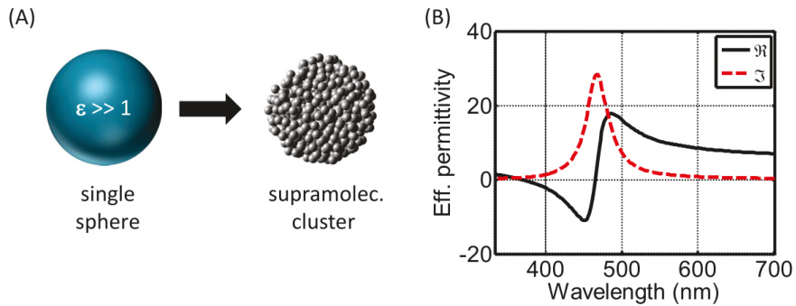{width=71%} Figure 4.1: (A) Concept of meta-atoms with a magnetic resonance in the visible. Instead of a single sphere made of a high permittivity material (as shown at the left) silver NPs are arranged into a meta-atom with a spherical outer shape (as shown at the right), called a supramolecular cluster. (B) Effective permittivity of amorphously arranged silver NPs (6 nm radii) in a dielectric environment ($\varepsilon = 2.6$) with a filling fraction of 0.25.

Figure 4.1 (B) shows the effective permittivity of an alignment of silver NPs with a filling fraction of 0.25. The results where obtained by the Clausius-Mossotti relation [cf. Eq. 2.40] by inserting the silver NP polarizability. This polarizability is obtained from Mie theory, i.e. the silver NPs are assumed as perfect spheres. Material parameters are taken from literature [260] with a size dependent correction of the imaginary part [261] and the silver sphere is illuminated by a plane wave propagating along z-direction with a linear polarization along x-direction. This illumination scenario is fixed for the rest of this chapter if nothing deviating

is explicitly stated. However, it has to be stressed that it is of marginal importance since the considered structures are isotropic due to their spherical shape. The surrounding is set to a real valued constant of 2.6.

As expected, the effective permittivity offers a Lorentzian line shaped resonance at 460 nm close to the LSPR of the single silver NP (around 415 nm, not shown here). Most importantly for a magnetic dipole resonance, the effective permittivity exhibits large real values for wavelengths larger than 460 nm. In other words, an artificial material made of densely arranged silver NPs works at these wavelengths effectively as a high permittivity material. Therefore, forming a sphere out of such a material should allow to excite a magnetic dipole resonance in the visible [303].

In a first order approximation a supramolecular cluster of silver NPs [as shown in the right panel of Fig. 4.1 (A)] can be treated as a single sphere if the material parameters of this sphere are taken from the Clausius-Mossotti results, as shown in Fig. 4.1 (B). In the following, the results of this approximation are shortly discussed to understand the basic properties of the magnetic dipole moment. Subsequently, the introduced extension of Mie theory in Sec. 2.5 is applied to rigorously simulate the supramolecular clusters.

The results of a single sphere that is made of a permittivity from Fig. 4.1 (B) are presented in Fig. 4.2. The surrounding is set to a real valued permittivity of 2.6. The extinction spectra for different sphere radii (that correspond to different radii of the supramolecular cluster later on) are given in Fig. 4.2 (A). Independently on the radius of the sphere a resonance can be observed at around 430 nm. At this wavelength the permittivity of the sphere is negative [cf. Fig. 4.1 (B)] and therefore the observed resonance is the LSPR. More importantly, a second resonance is observed at longer wavelengths if the sphere radius is larger than 35 nm.

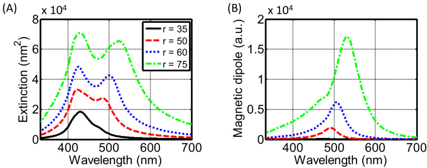{width=71%} Figure 4.2: (A) Extinction cross section of single spheres with different radii (given in nm by the legend) that are made of a permittivity as shown in Fig. 4.1 (B). (B) Magnitude of the magnetic dipole moments of the spheres from (A); the legend is maintained. The dipole moments are given according to their contribution to the scattering cross section (cf. Eq. 2.32).

The origin of this second resonance can be easily identified by investigating the excited

multipole moments of the sphere, as discussed in Sec. 2.3. Figure 4.2 (B) shows the contribution of the magnetic dipole moment to the scattering cross section of the sphere for different radii. Obviously, the observed long wavelength resonance in extinction can be linked to the excitation of a magnetic dipole moment in the sphere. The resonance positions of the magnetic dipole moments and of the extinction curves coincide. Furthermore, a magnetic dipole moment can be only observed for sphere radii larger than 35 nm.

The above given idea on how to excite magnetic dipole moments in the visible is confirmed. This can be seen by a rough estimation of the magnetic dipole resonance position. The effective permittivity given in Fig. 4.1 (B) has a real value of 18 at about 500 nm. Assuming that the magnetic dipole resonance is given if the wavelength inside the sphere is comparable to the diameter, the radius of the sphere should be around 60 nm to excited the magnetic resonance at 500 nm. This is perfectly met, as can be seen at Fig. 4.2 (B) by the blue dotted curve.

A second important effect can be seen in Fig. 4.2 (B). The peak amplitude of the magnetic dipole gets enhanced by increasing the sphere radius. Of course, also the extinction cross section gets enhanced for larger spheres, as can be seen by Fig. 4.2 (A), but this trend is weaker compared that of the magnetic dipole moments. In conclusion, the larger the sphere, or later on the supramolecular cluster, the stronger the magnetic dipole moment. However, one constraint is the sub-wavelength dimension of the meta-atom (the supramolecular cluster) to ensure a description of the MM by effective material parameters. Therefore, no sphere radii larger than 75 nm are considered, since even in this case the diameter of the meta-atom is about half the illumination wavelength.

Now, after these preliminary discussions that approximated the supramolecular cluster as a perfect sphere, rigorous simulations are presented. These simulations take the precise position of every silver NP inside the supramolecular cluster fully into account. However, considering different implementations of nominally identical structures eventually lead to identical results. The silver NPs are arranged into a supramolecular cluster as follows. Starting by a single NP, additional NPs are added step by step. The position of the next NP to be added is amorphously chosen, i.e. in spherical coordinates both angles are randomly chosen but a minimal distance of 1.5 nm between the NPs is fixed. This nearest neighbor distance is enforced by appreciating technological details of the different fabrication methods that can be used to obtain the desired meta-atoms. It results in a filling fraction of about 0.25 of silver NPs in space. The NPs that lay outside a defined radius of the supramolecular cluster are not considered. Following this procedure supramolecular clusters as sketched in Fig. 4.1 (A) are obtained. Depending on the three previously considered single sphere radii of 35,50,60, and 75 nm the supramolecular clusters consist of 49,144,247, and 466 NPs, respectively. The NPs are assumed as perfect spheres in simulations with a radius of 6 nm. The surrounding and illumination are maintained from the single sphere simulations.

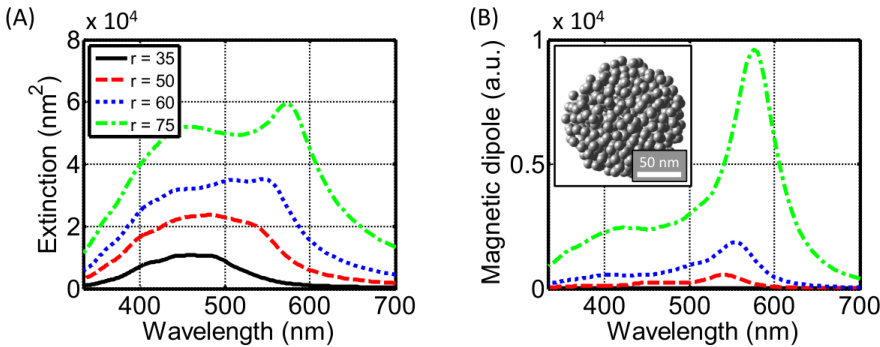{width=71%} Figure 4.3: (A) Extinction cross section of supramolecular clusters made of silver NPs (6 nm radii) for different cluster radii in nm as given by the legend. The inset in (B) shows a sketch of the structure as considered in simulations for a cluster radius of 75 nm. (B) Magnitude of magnetic dipole moments for supramolecular clusters from (A); the legend is maintained. The dipole moments are given as they contribute to the scattering cross section.

Figure 4.3 (A) shows the simulated extinction cross sections of the supramolecular clusters. The comparison with the single sphere considerations of Fig. 4.2 (A) yields the following conclusions. The spectra of the supramolecular clusters are much broader compared to the single sphere. The LSPR resonance that appears at 430 nm for a single sphere can only be observed for a cluster radius of 75 nm in Fig. 4.3 (A). However, most importantly also the supramolecular clusters offer a second extinction resonance at longer wavelengths if the cluster radius is increased. For a radius of 75 nm clearly the double peak structure similar to the single sphere simulations can be seen. This emerging long wavelength extinction peak can be related by a multipole analysis, as it is shown in Fig. 4.3 (B), to the excitation of a magnetic dipole moment in the supramolecular clusters. Therefore, the previously outlined concept of magnetic dipole resonances has been verified by rigorous simulations. In other words, it is possible to excite a magnetic dipole moment in the visible in a supramolecular cluster of silver NPs, as shown in the inset of Fig. 4.3 (B).

The differences in the extinction cross section of the supramolecular cluster [Fig. 4.3 (A)] and the single sphere [Fig. 4.2 (A)] can be linked to the finite size of the supramolecular cluster. A cluster of 35 nm radius includes only 49 NPs which cannot be safely assumed as homogeneous bulk material since the number of NPs is too low. Furthermore, the finite size of the cluster causes a rough surface of the meta-atom [as can be already seen in the inset of Fig. 4.3 (B)] which is far away from being a perfect sphere. This surface roughness evokes additional scattering losses and therefore, smears out the resonances. In addition, as will be explicitly shown later on for the cloaking device in Sec. 4.2, the Clausius-Mossotti relation does not work properly close to the LSPR wavelength of the silver NPs [304].

In Fig. 4.4 (A) all contributing multipole moments to the scattering cross section are shown

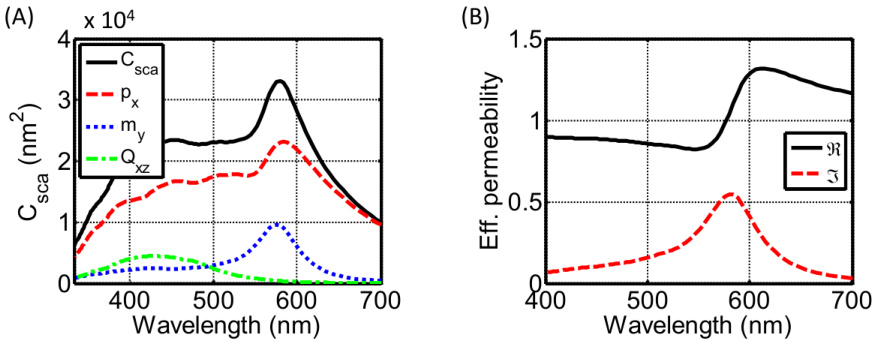{width=70%} Figure 4.4: (A) Multipole moments of a supramolecular cluster with 75 nm radius. All moments are shown as they contribute to the scattering cross section ($C_{\mathrm{sca}}$); $p_{x}$ - electric dipole, $m_{y}$ - magnetic dipole, $Q_{xz}$ - electric quadrupole. (B) Effective permeability of the resulting MM by arranging the supramolecular clusters with a filling fraction of 0.68 in space.

for a supramolecular cluster with 75 nm radius. A dominating electric dipole contribution over the entire spectral domain can be observed and, especially, also at the resonance position of the magnetic dipole moment $m_y$ at 580 nm. Consequently, the excited magnetic dipole moment does not dominate the spectra. The resulting effective permeability, shown in Fig. 4.4 (B), is obtained by the Clausius-Mossotti relation. The magnetic polarizability is taken from the magnetic dipole moment $m_y$ and a filling fraction of 0.68 is chosen. The presented results offer a moderate dispersion of the effective permeability across the spectral range of Fig. 4.4 (B). Although no negative values of the effective permeability are obtained, these results serve as a first principle demonstrations that MMs can be self-assembled offering an isotropic response to the magnetic field in the visible.

It has to be said, that the obtained dispersion in the effective permeability is weaker when compared to previous results published in literature where negative values of the real part were obtained [303]. This weaker optical response of the supramolecular clusters is explained by two effects. First, the amorphous arrangement of the NPs in the supramolecular cluster lowers the dispersion in $\mu_{\mathrm{eff}}$. As already discussed in Sec. 2.4.2 this amorphous arrangement causes additional scattering losses [212] which where not obtained by previous considerations relying on perfectly periodically arranged silver NPs. Second, previously theoretical considerations of the problem always applied experimentally obtained bulk material properties, or even a Drude model, for the silver NP permittivity. This underestimates the imaginary part and therewith the absorption compared to experimental results. If the size of the NPs tends to become comparable to the mean free path of the free electrons, additional scattering of electrons on the physical surface of the NPs has to be taken into account. Here, a heuristic correction of the material parameters was considered resulting in an increased imaginary part of the permittivity [261]. This reflects the finite size of the NPs and allows a more feasible

description of the experiments. However, indeed it broadens the simulated resonances and therewith the oscillation strength of the effective permeability gets decreased.

The proposed idea of an isotropic magnetic dipole response in the visible based on supramolecular clusters has been realized by manifold different self-assembly techniques [81, 110-112, 305]. One example was already given in Chap. 1 in Fig. 1.3. The figure shows the possibility to fabricate supramolecular clusters made of gold NPs by molecular linkers [110]. A TEM image of a fabricated supramolecular cluster can be seen at the top left of Fig. 1.3 that shows three-dimensional meta-atoms with short-range alignment.

Another way to fabricate the supramolecular clusters is based on the concept of oil-in-water emulsion. Briefly, a solution of oil containing silver NPs (6 nm radius) is mixed with water under stirring. This forms oil droplets (defining the spherical shape of the supramolecular cluster) which are stabilized by a specific molecular linker. These stabilized oil droplets encapsulate the supramolecular clusters. The size of the supramolecular clusters is defined by the concentration of the NPs in the oil phase as well as by the size of the oil droplets. The latter depends on, e.g., the oil-water ratio as well as on the surfactant composition and concentration. The fabrication of the supramolecular clusters and respective measurements have been done by Dr. Dintinger and Dr. Scharf from the EPFL in Switzerland. Details thereof can be found in Ref. [112].

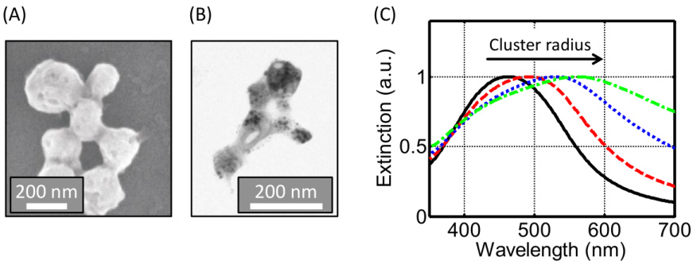{width=70%} Figure 4.5: Experimental realization of supramolecular clusters [112]. (A) SEM image of the stabilized oil droplet encapsulating the silver NPs. (B) TEM image of supramolecular clusters formed inside the oil droplets. (C) Measured extinction cross section for different cluster radii (black solid curve shows smallest and green dashed doted the largest cluster radius). All extinction curves are normalized to their maximum.

Figure 4.5 (A) and (B) show the fabricated supramolecular clusters that consist of silver NPs with 6 nm radius. Of course the SEM image shows only the outer surface and the silver NPs inside are not visible. Therefore, in Fig. 4.5 (B) a TEM image is shown, where the formed supramolecular clusters can be seen. A proper fabrication of clusters with a nearly spherical outer shape is observed.

In Fig. 4.5 (C) measured extinction spectra are shown for a gradually increased cluster

radius from about 40 up to 80 nm. Most notably, the theoretically predicted red shift of the extinction peak for an increasing cluster radius is fully confirmed by the measurements. Even the precise resonance positions nicely fit to the simulations [cf. Fig. 4.3 (A)]. Therefore, the resonance in extinction in the experiments can be linked by underlying simulations to the excitation of a magnetic dipole moment in the meta-atom, i.e. the supramolecular cluster. The only deviation between experiments and simulations is the measured resonance width that appears to be broadened. This effect is linked to the investigation of ensembles of supramolecular clusters in experiments, i.e. the optical response of the self-assembled MM is measured. In contrast, in simulations solely one single supramolecular cluster is considered with a specific alignment of the silver NPs. As can be already seen in Fig. 4.5 (B) the cluster radius of the fabricated samples varies in a given range and only a mean radius is considered in simulations. This results in a spectral broadening of the ensemble measurements compared to the simulations. However, despite these slight deviations between experiments and simulations the excitation of the magnetic dipole moment is unambiguously revealed by the measured resonance positions of the extinction spectra.

To sum up, in this subsection a first approach has been proposed on how to achieve a meta-atom by self-assembly techniques that offers a resonant magnetic dipole moment in the visible. Supramolecular clusters with a spherical outer shape made of resonant NPs were presented as possible meta-atoms. The excitation of the magnetic dipole moment could be explained by the description of the cluster as a high permittivity sphere. Theoretical predictions based on rigorous simulations of the supramolecular clusters were fully confirmed by experiments. The advantage of the presented meta-atoms in this section is the possibility to fabricate them by versatile self-assembly techniques and their isotropic response due to the spherical outer shape. The latter one allows a notable dispersion in the effective permeability. A slight disadvantage is the still dominating electric dipole response of the supramolecular clusters, especially at the magnetic dipole resonance, cf. Fig. 4.4 (A). In other words only a part of the scattering response of the meta-atom contributes to the dispersion in the effective permeability and the remaining part effects the effective permittivity. To mitigate this challenge, the next subsection presents another possible meta-atom geometry that allows magnetic dipole resonances in the visible which dominate the scattering response.

# 4.1.2 Core-shell clusters

The aim of this subsection is the development of a meta-atom that offers a stronger magnetic dipole response in the visible. This requires, in contrast to the previous subsection, that the magnetic dipole moment should dominate the scattering cross section in the visible. But advantages that were already achieved by supramolecular clusters should be preserved. Therefore, the meta-atom shall equally be made of resonant NPs to allow a fabrication by self-assembly techniques. Furthermore, the response shall be isotropic in order to assure a

strong impact of the magnetic dipole moment on the effective permeability of the entire MM, as discussed in Sec. 2.4.3.

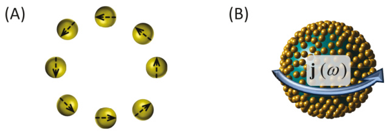{width=51%} Figure 4.6: Origin of the magnetic dipole response in core-shell clusters. (A) A ring of gold NPs. One possible excitation of the electric dipoles in the NPs are shown that will cause a strong magnetic dipole moment. (B) Three-dimensional expansion of the ring towards a core-shell cluster. The blue arrow depicts one possible excitation of the effective current in the shell that equally causes a strong magnetic dipole moment.

The idea is to use core-shell clusters as the meta-atom, as sketched in Fig. 4.6 (B). They consist of a dielectric core sphere that is covered by a huge number of gold NPs forming an effective shell. To understand how magnetic dipole moments can be excited in these clusters a meaningful consideration is a ring of gold NPs, as it can be seen in Fig. 4.6 (A). The gold NPs are assumed to be small enough to allow a description of their scattering response by an electric dipole. It has been shown that one possible eigenmode of the ring structure is an oscillation of all electric dipoles of the NPs around the center of the ring [306], as shown by the black dashed arrows in Fig. 4.6 (A). Obviously, this eigenmode can be to the excitation of a magnetic dipole moment.

Unfortunately, the optical response of a single ring of gold NPs is anisotropic. To assure an isotropic response of the meta-atom the idea that led to the suggestion of the ring structure is extrapolated into the third dimension. This results in the core-shell cluster as shown in Fig. 4.6 (B). Similar to the ring structure, also the core-shell cluster should sustain an eigenmode where all electric dipoles of the gold NPs are oscillating around the core. This yields an effective current in the shell that oscillates around the core which causes the core-shell cluster to have a strong magnetic dipole moment [307]. This structure clearly posses the advantage of an isotropic response due to the spherical symmetry of the meta-atom, i.e. independently on the illumination direction and polarization the magnetic dipole moment can be excited. The remaining question is, how strong the magnetic dipole moment will be. In the following this somehow sketchy explanation of the magnetic dipole response is proven and quantified by a devoted analysis.

To start the investigation of the optical response of the core-shell clusters, the extinction curves of two exclusively chosen geometries are simulated. The numerical method introduced in Sec. 2.5 is applied. The first core-shell cluster consists of 274 gold NPs with 8 nm radii

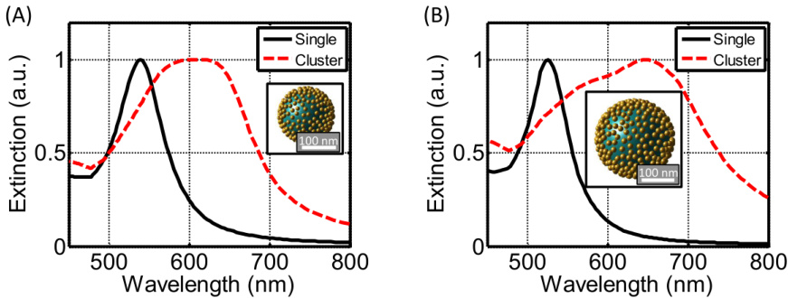{width=70%} Figure 4.7: (A) and (B) contain the simulated extinction spectra of two different core-shell clusters (red dashed curves) together with the single gold NP spectra (black solid curves). All extinction curves are normalized to their peak intensity. The insets depict the geometry as considered in simulations. Details are given in the text.

that are arranged around a silica core sphere of 80 nm radius. The alignment of the NPs in the shell is amorphous, i.e. there exists a fixed distance to the core and no NP separation smaller than one nm is allowed. Apart from this the gold NP positions are chosen arbitrarily. A sketch of the geometry is given by the inset of Fig. 4.7 (A). The surrounding is assumed as a material with a constant permittivity of 2.24. The resulting extinction spectrum under plane wave illumination is given in Fig. 4.7 (A) together with the extinction curve of the single gold NP for the chosen surrounding.

The second core-shell cluster is made of 354 gold NPs with 10 nm radius that are covering a silica core sphere of 120 nm radius. Water is chosen as the surrounding with a constant permittivity of 1.77. The extinction spectrum under plane wave illumination together with the single gold NP response are given in Fig. 4.7 (B). Although the chosen geometrical parameters and the surroundings make the impression as being quite arbitrary, they were selected in such a way that it is possible to realize both of them by distinct self-assembly techniques later on [118].

The extinction curves of Fig. 4.7 offer for both core-shell cluster geometries the same trend. The extinction peaks are strongly shifted to longer wavelengths when compared to the single gold NP resonance. To provide a better understanding of this red shifted peak the multipole analysis is performed for this special type of meta-atoms.

The presented multipole moments at Fig. 4.8 allow the following conclusions. For both simulated core-shell clusters of Fig. 4.7 the red-shifted peak in extinction can be linked to the excitation of a magnetic dipole moment $m_y$. For the smaller core-shell cluster [80 nm core radius, shown in Fig. 4.8 (A)] the amplitude of the magnetic dipole moment is almost comparable to the amplitude of the electric dipole moment. This is actually an advantage with respect to the supramolecular clusters where the electric dipole moment dominates the

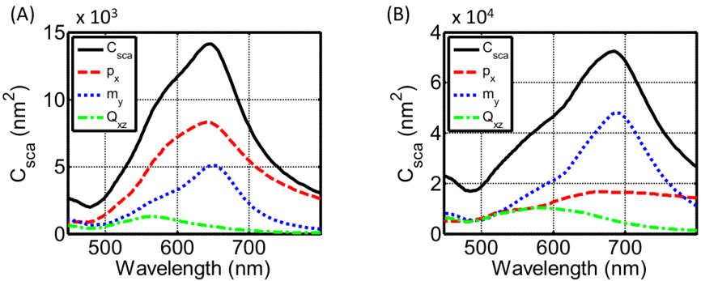{width=70%} Figure 4.8: Multipole moments of two different core-shell cluster geometries as given by Fig. 4.7. In (A) the smaller core-shell cluster with 80 nm core radius is simulated whereas in (B) the larger core-shell cluster with 120 nm core radius is considered. All multipole moments are given as they contribute to the scattering cross section. For definiteness, the illuminating plane wave is propagating along z-direction with a linear polarization of the electric field along x-direction.

entire spectrum. The situation is even better for the larger core-shell cluster shown in Fig. 4.8 (B). There, the magnetic dipole moment dominates the spectrum around the resonance of the scattering cross section. The contributions of the electric dipole moment and the electric quadrupole moment are much smaller in this spectral domain.

To sum up the already obtained results, it has been demonstrated that the investigated core-shell clusters serve as very beneficial meta-atom geometries that allow the excitation of a strong magnetic dipole moment in the visible. For both clusters the contribution of the electric quadrupole moment to the scattering cross section is small. This allows the description of the resulting MM by effective material parameters.

Next, field distributions of the two core-shell cluster geometries are presented. That should allow an identification of the origin of the excited magnetic dipole moment. The presented amplitude of the magnetic field in Fig. 4.9 shows for both core-shell cluster geometries the expected field distribution of a magnetic dipole moment.

More important seems to be the orientation of the electric dipole moments in the gold NPs at the shell, as shown by the blue arrows in Fig. 4.9. It can be clearly seen that the electric dipoles are oscillating around the core sphere, as it was motivated at the beginning of this subsection in Fig. 4.6. However, the distribution of the electric dipoles moments is not as homogeneous as sketched for the ring structure in Fig. 4.6 (A). These deviations are caused by the amorphous arrangement of the gold NPs and the accompanied varying distances between them. However, from Fig. 4.9 it can be safely concluded that the origin of the magnetic dipole moment of the core-shell cluster is based on an oscillation of the electric dipole moments around the core sphere. Consequently, the amorphous alignment does only weakly disturb the possible magnetic resonance of the core-shell clusters.

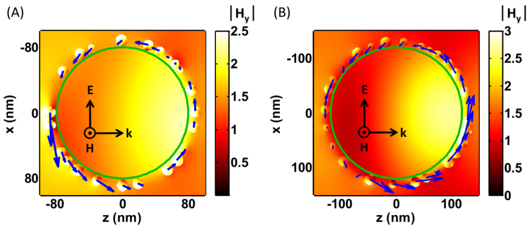{width=70%} Figure 4.9: Simulated field distributions for the two core-shell cluster geometries as given by Fig. 4.7. In (A) the core radius is 80 nm whereas in (B) it is 120 nm. The illumination scenario is identical to Fig. 4.8. The magnitude of the $y$-component of the magnetic field (normalized to the incident field) is shown in a plane through the center of the core sphere (green circle). Field distributions are calculated at the wavelength of the maximum amplitude of the magnetic dipole moment; at 650 nm and 689 nm for (A) and (B), respectively. The blue arrows depict the excited electric dipole moments in the gold NPs covering the shell. The center of each arrow coincides with the center of the respective gold NP.

The idea to self-assemble a MM with a magnetic response in the visible on the base of core-shell clusters has been realized by different bottom-up techniques. Two of them are exemplarily presented here. The first one is based on the attachment of the gold NPs to the silica core sphere by molecular linkers. More specifically, thiol groups have been applied to attach the gold NPs. The fabrication and the extinction measurements were done by the group of Dr. Pacholski from the MPI Stuttgart. Details about the fabrication process are given elsewhere [118]. The fabricated core-shell clusters can be seen in Fig. 4.10 (A). The second bottom-up technique that was used to obtain core-shell clusters is based on electrostatic forces. In principle, it is an extension of the self-assembly technique that was intensively discussed in Chap. 3. Here, instead of planar substrates silica spheres are used. The surface chemistry of the silica spheres, however, is altered (comparable to the planar substrates) to achieve a net positive charge [252] such that negatively charged gold NPs can attach to them. The fabrication and the extinction measurements have been done by Dr. Cunningham from the group of Prof. Bürgi, University of Geneva. The resulting core-shell clusters can be seen in Fig. 4.10 (B).

Since the geometrical parameters of the core-shell clusters in all previous simulations have been chosen exactly as they are achieved now by the experiments, the measured extinction curves of Fig. 4.10 (C) and (D) can be directly compared to the simulated ones of Fig. 4.7 (A) and (B), respectively. The comparison yields an almost perfect agreement between simulations and experiments. Most notably, the extinction maxima perfectly coincide and

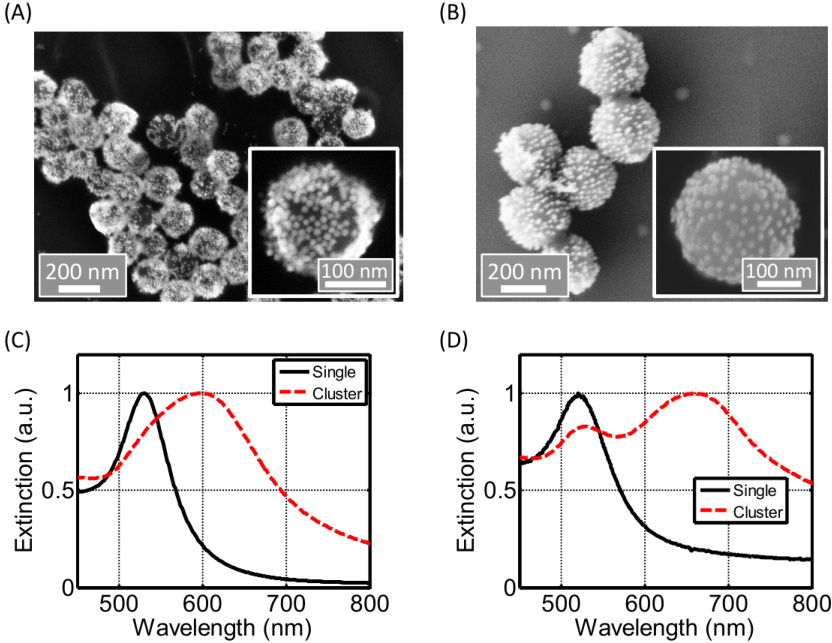{width=67%} Figure 4.10: Experimental realization of core-shell clusters [118]. In (A) a SEM image of core-shell clusters fabricated by molecular linkers is shown. The geometrical parameters are identical to those given in Fig. 4.7 (A), i.e. the core radius is 80 nm and approx. 274 gold NP with 8 nm radius are forming the shell. The SEM image in (B) shows core-shell clusters that were fabricated by electrostatic forces and exhibit the geometrical parameters of Fig. 4.7 (B). Thus the core sphere of 120 nm radius is covered by approx. 354 gold NPs with 10 nm radius. Measured extinction spectra for the structures in (A) and (B) are given in (C) and (D), respectively, along with the extinction of the single gold NPs.

even their resonance width is comparable. Only one slight deviation can be seen in Fig. 4.10 (D) where the extinction curve offers a second resonance close to the single NP peak that is not observed in simulations. However, this additional peak is caused by gold NPs which do not cover the dielectric sphere but are left in solution. The reason for that is an excess of gold NPs as required by the fabrication process by electrostatic forces [118].

The perfect agreement between experiments and simulations underlines the predictive power of the presented theoretical results. Furthermore, the experimental realization of the core-shell clusters serves as the first demonstration on fabricating meta-atoms by self-assembly that offer a strong magnetic dipole moment in the visible. In comparison to the supramolecular clusters of NPs the magnetic dipole resonance was demonstrated to be dominating the scattering spectra. This stronger resonance of the core-shell clusters is linked to the reduced amount of metal in the meta-atom. Since only the shell is covered by plasmonic NPs the absorption of the core-shell clusters is less to the supramolecular clusters which

results in a sharpening of the resonances of the meta-atom.

# 4.1.3 Concluding remarks

The aim of this section was the development of self-assembled meta-atoms that offer a strong magnetic dipole resonance in the visible. This was achieved by two different geometries of meta-atoms that were both based on a proper alignment of resonant NPs. In the case of supramolecular clusters as the meta-atoms as well as for core-shell clusters the possibility to excite magnetic dipole moments was revealed by underlying simulations. Subsequential experimental realizations fully confirmed the theoretical predictions. Whereas in the case of supramolecular clusters the strength of the magnetic dipole moment was less to the electric one, this limitation could be lifted in the case of core-shell clusters. There the magnetic dipole moment dominated almost the entire scattering spectrum.

The presented results of this section serve as one important step for the development of self-assembled MMs. It has been revealed that structures can be fabricated by self-assembly that offer a strong magnetic dipole moment and therefore, promise a remarkable dispersion in the effective permeability. In order to achieve these bottom-up MMs, completely new design rules of the meta-atoms had to be developed. Although, no negative values of the real part of the effective permeability could be observed yet, the presented meta-atoms serve as first principle demonstrators.

Recently, it has been shown for case of core-shell clusters that it is possible to achieve a negative effective permeability by using silver NPs or silver shells instead of gold NPs or dimers of silver NPs to cover the dielectric core sphere [308–310]. However, an experimental realization of these structures still remains. Anyhow, it is anticipated that the presented results will entail more efforts from the fabrication side to obtain these highly promising meta-atoms.

The next step that needs to be performed is a realization of functional MMs by self-assembly that allow an unprecedented control of the light propagation in these materials. The ultimate goal would be a self-assembled three-dimensional MM that offers an isotropic negative real part of the permeability as well as permittivity. This might be achieved by a further improvement of the presented meta-atoms in this section.

A further question remains on what else could be achieved with the structures accessible with the indicated methodology. Of course MMs are a major driving force for their development but they also suffer from some limitations as indicated above. Therefore, a further question concerns the achievement of more primary applications with these meta-atoms. As an example the next section discusses the possibility to fabricate a cloaking device by self-assembly techniques. This is done by the adoption of a meta-atom that was already discussed in this section.

# 4.2 A self-assembled cloak

This section includes the investigation of a cloaking device fabricated by self-assembly techniques. The general concept of cloaking, i.e. hiding an object from an external observer, was scientifically substantiated in 2006 [14, 15]. Two different suggestions were proposed by Leonhardt [13] and Pendry et al. [12] that allow a two- or three dimensional object to be concealed from an external observer, respectively. Both suggestions require the object to be cloaked to be covered with a MM [10, 11]. These MMs shall have material parameters that attain quite unusual values, e.g. for the cloaking of the three-dimensional object a biaxial anisotropic permittivity and permeability is required [311]. These material parameters can only be achieved by suitably designed MMs. Their achievement, however, is beyond what is feasible and experimental realizations of these perfect cloaks where not reported yet. However, a well defined goal was set to realize such a functional cloaking device and many approximate cloaks have been reported thus far [25, 26, 312–316]. They were usually studied at radio or microwave wavelengths [19, 315, 317–319] where absorption is less an issue but also specific cloaks for elevated frequencies were reported.

Specifically, the fabrication of a cloak in the visible was achieved by a major simplification, which is nowadays called a ground plate or carpet cloak [314]. There, the idea is to hide an object that lies above a ground plate. The purpose of the cloak is to render the reflected light from the ground plate with the object to be cloaked to be identical to that in the absence of the object [25, 26, 315]. This concept has been implemented both for two- and three-dimensional objects [20–24, 318]. Anyhow, for obvious reasons the carpet cloak is not the ultimate solution to hide free-standing three-dimensional objects.

Another simplification that allows to construct a cloaking device is the restriction to sub-wavelength objects that should be hidden from an observer [27]. In the quasi-static limit, these objects scatter as a pure electric dipole and a suppression of this scattered field by a suitable designed cloak renders the object to be invisible. The cloak can be roughly considered as an anti-reflection layer for an isolated object. Ideas about this concept to hide three-dimensional sub-wavelength objects exist for quite some time [320] and were reinforced by Alü et al. [312, 321]. At a first glance it might be less impressive to hide solely sub-wavelength objects. Anyhow, this effect has important implications on controlling light-matter interactions and entails the realization of sophisticated functional devices [322, 323], i.e. in the field of aperture-less scanning near-field optical microscopes [324]. There, the unwanted background scattering from the tip can be suppressed by the cloak [325, 326]. Furthermore, forces and torques exerting on nanoscale objects can be controlled which entails novel schemes to manipulate nano-mechanical objects in free space [327].

The experimental realization of a cloak that suppresses the scattered light from a sub-wavelength object, a so-called scattering cancellation cloak, has been demonstrated in the

microwave regime [317, 319, 328]. Recently, also an implementation was given for visible wavelengths but solely for a two-dimensional object, i.e. a cylinder [329, 330]. The aim of this section is the development of a scattering cancellation cloak that works in the visible domain and which is appropriate to hide free-standing three-dimensional objects [299]. The possibility to fabricate the cloak with self-assembly techniques serves as another requirement. In other words, the cloak should be made of a suitable alignment of plasmonic NPs.

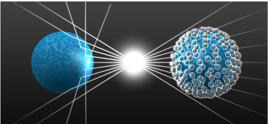{width=43%} Figure 4.11: Artistic view of a scattering cancellation cloak. On the left it is seen that a dielectric object reveals its presence to an external observer by scattering the light. This is different on the right where a suitably designed shell of plasmonic NPs suppresses the scattered light and renders the dielectric object undetectable.

In Fig. 4.11 the working principle of the scattering cancellation cloak, as it will be investigated here, can be seen. A suppression of the scattered field by a suitable shell of plasmonic NPs hides the sub-wavelength object from an external observer [304, 331]. The chosen geometry of a core-shell cluster, where the core serves as the object to be cloaked, allows a fabrication of the structure by various self-assembly techniques, as discussed in Sec. 4.1.2. Before the highly complex cloaking structure of Fig. 4.11 is considered, a preliminary discussion on a more simple geometry is given which allows a principle understanding of the cloaking mechanism.

In this first step the object is assumed as a perfect sphere made of a homogeneous, isotropic material. The scattering of this object is canceled by a homogeneous, isotropic, spherical shell. Thus the scattering cancellation cloak is an ideal core-shell sphere. Alù et al. developed an analytical expression for the cloaking condition for this geometry [312]. The expression includes the material properties and the geometrical parameters of the ideal core-shell sphere that allow for a perfect suppression of the scattered field. It reads as

$$
\gamma ^{3} = \frac { \left[ \varepsilon _ { \mathrm { s } } \left( \lambda \right) - \varepsilon _ { \mathrm { b } } \left( \lambda \right) \right] \left[ 2 \varepsilon _ { \mathrm { s } } \left( \lambda \right) + \varepsilon _ { \mathrm { c } } \left( \lambda \right) \right] } { \left[ \varepsilon _ { \mathrm { s } } \left( \lambda \right) - \varepsilon _ { \mathrm { c } } \left( \lambda \right) \right] \left[ 2 \varepsilon _ { \mathrm { s } } \left( \lambda \right) + \varepsilon _ { \mathrm { b } } \left( \lambda \right) \right] } \ ,
$$

where $\gamma$ is the ratio of the core to the shell radius; the shell radius is understood as the outer radius of the structure. The other quantities $\varepsilon_{\mathrm{s}}(\lambda)$, $\varepsilon_{\mathrm{c}}(\lambda)$ and $\varepsilon_{\mathrm{b}}(\lambda)$ are the permittivity of the shell, the core, and the background material, respectively.

For a given geometry, i.e. a fixed $\gamma$, and an assumed weakly dispersive, real valued core

and background permittivity, the above equation is quadratic in terms of the shell permittivity. In other words, it is possible to perfectly suppress the scattering of the core sphere by two different shell permittivities. For instance for a dielectric core a real valued shell permittivity reaching values in-between zero and one and a negative shell permittivity suppress the core scattering. The first solution is termed positive and the latter one negative cloaking resonance. Both cloaking resonances suggest that the magnitude of the electric dipolar polarization of the core is identical to that of the shell whereas their phases differ by $\pi$. This causes destructive interference in the far-field and a suppression of the scattering response [304]. From Eq. 4.1 it is directly clear that the cloaking principle only works perfectly for real valued permittivities. If the cloak includes lossy materials imperfect cloaking is achieved, i.e. the scattering cannot be totally suppressed though to a remarkable extend [27], as shown in the following. Furthermore, the object might become detectable in an extinction measurement. However, this is of minor importance for the suggested applications above.

This analytical treatment can be used as a guideline to design the suggested cloaking device made of a core-shell cluster (as sketched in Fig. 4.11). For this purpose, the shell formed by the huge number of tiny plasmonic NPs is assumed as effectively homogeneous isotropic material. Effective material parameters of the shell are obtained by the Clausius-Mossotti relation [cf. Eq. 2.40] if the polarizability of the single plasmonic NP is given. For an exemplarily chosen shell thickness of 10 nm the NP radii are fixed to 5 nm. The dispersion of the effective permittivity in Fig. 4.12 (A) shows the results of the Clausius-Mossotti relation for silver NPs with a filling fraction of 0.34. The polarizability of a single silver NP was simulated by Mie theory by assuming the NP as a perfect sphere and taking material parameters from literature.

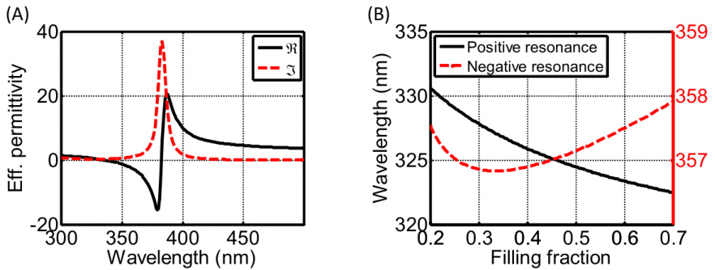{width=71%} Figure 4.12: (A) Effective permittivity of silver NPs (5 nm radius) that are arranged with a filling fraction of 0.34 in space. (B) Cloaking wavelength as a function of the filling fraction of the silver NPs that form the shell. The core is made of silica with a radius of 35 nm. Both the positive (black solid) and the negative (red dashed) cloaking resonance are shown. The right $y$-axis defines the wavelengths (in nm) for the negative cloaking resonance.

The Clausius-Mossotti results of the shell permittivity clearly reveal that both required real values of the permittivity can be obtained by a shell made of amorphously arranged silver NPs. The effective permittivity offers real values in-between zero and one, as required for the positive cloaking resonance, for wavelengths between 310 and 340 nm. In principle, there exists also a narrow wavelength domain around 380 nm where the effective permittivity provides the requested real parts. Anyhow, in this spectral region the imaginary part of the effective permittivity is huge which prevents a real valued solution of Eq. 4.1 and thus resulting in imperfect cloaking as discussed above. The required negative real values for the negative cloaking resonance are achieved in-between 350 and 380 nm.

The geometry of the core-shell cluster is now explicitly fixed for the remainder of the section. The core sphere, i.e. the object to be cloaked, consists of glass (with a constant permittivity $\varepsilon_{\mathrm{c}}=2.25$) and has a radius of 35 nm. The shell exhibits a radius of 45 nm, i.e. it is 10 nm thick. The surrounding is set to air ($\varepsilon_{\mathrm{b}}=1$). For these parameters Eq. 4.1 yields two solutions for the shell permittivity. The positive cloaking resonance, requires a permittivity of $\varepsilon_{\mathrm{s}}=0.49$ whereas the negative cloaking resonances is given by $\varepsilon_{\mathrm{s}}=-2.28$ [304].

Since the geometrical parameters and the applied materials had been fixed to the values given above, the only free parameter is the filling fraction of the silver NPs in the shell. Changing the filling fraction will change the dispersion relation of the effective permittivity and therefore the precise cloaking wavelengths. This dependency is given in Fig. 4.12 (B). For every filling fraction the effective shell parameters are calculated by the Clausius-Mossotti relation. The cloaking wavelengths are extracted by identifying the wavelength where the real part is either 0.49 for the positive cloaking resonance or $-2.28$ for the negative cloaking resonance. From Fig. 4.12 (B) it can be seen that the positive cloaking resonance should appear in-between 320 and 330 nm whereas the negative cloaking resonance stays nearly constant at 357 nm independently on the filling fraction.

In the following the performance of the cloaking device is evaluated by rigorous simulations. Therefore, a filling fraction of silver NPs of 0.34 is chosen which results in a total number of 131 amorphously arranged NPs forming the shell. The inset in Fig. 4.13 shows the structure as considered in simulations. The introduced formalism in Sec. 2.5 is used to simulate the optical response of the core-shell cluster. Plane wave incidence with a linear polarization is chosen as the illumination. In other words, the fine details of the amorphous arrangement of the silver NPs are fully taken into account. The simulations are performed for two different core permittivities of $\varepsilon_{\mathrm{c}}=2.25$ and $\varepsilon_{\mathrm{c}}=8$. The obtained results are shown as black solid curves in Fig. 4.13. Scattering efficiencies are given, i.e. the scattering cross section is normalized to the geometrical cross section. This serves as a quantitative measure of the visibility.

From Fig. 4.13 it can be clearly seen that in a finite wavelength range the scattering

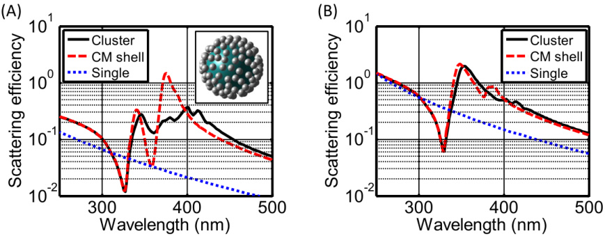{width=70%} Figure 4.13: Simulated scattering efficiency of the cloaking device made of a core sphere with 35 nm radius that is covered by silver NPs (5 nm radii; filling fraction of 0.34) forming the shell. The inset in (A) depicts the structure as considered in simulations. In (A) the core permittivity is $\varepsilon_{\mathrm{c}}=2.25$ whereas it is set to $\varepsilon_{\mathrm{c}}=8$ in (B). Rigorous simulations (black solid) are shown together with an approximation of the shell as a homogeneous material (red dashed). For comparison the scattering efficiency of the single core sphere (blue dotted) is presented as well.

efficiency of the core-shell cluster is dramatically reduced when compared to the scattering of the bare core sphere (blue dotted curve). The scattering efficiency is reduced about 75 % at 327 nm for a core permittivity of $\varepsilon_{\mathrm{c}}=2.25$ and even about 84 % at 329 nm for $\varepsilon_{\mathrm{c}}=8$. In conclusion the scattering of the core-shell cluster is much less compared to the bare core sphere. Thus the core is cloaked by a suitable shell made of amorphously arranged silver NPs and the core-shell clusters work as a scattering cancellation cloak.

The comparison of Fig. 4.13 with Fig. 4.12 (B) reveals that the observed cloaking effect stems form the positive cloaking resonance. In the spectral domain where the cloaking is most efficient, the real part of the effective permittivity of the shell takes values in-between zero and one. The rigorous simulations offer no reduction of the scattering efficiency for the negative cloaking resonance that should appear around 357 nm. This effect can be explained by the effective permittivity of the shell as given in Fig. 4.12 (A). For the negative cloaking resonance the imaginary part of the effective permittivity is huge. Since an analytical solution of Eq. 4.1 facilitates only real valued permittivities, this imaginary part causes imperfect cloaking. At the positive cloaking resonance the imaginary part of the effective permittivity is much less and therefore, the cloaking effect can be observed at these wavelengths.

To compare the previously given results, that assume the shell as an homogeneous material, with the rigorous solution of the problem, Fig. 4.13 includes a further simulation given by the red dashed curves. There, a perfect core-shell sphere was simulated and the permittivity of the shell was taken from the Clausius-Mossotti results as given in Fig. 4.12 (A). A perfect agreement of the scattering efficiency between the perfect core-shell sphere and the core-shell cluster can be observed around the positive cloaking resonance at around 327 nm.

However, the agreement is not that good for longer wavelengths in the spectral domain

where the effective permittivity has the strongest dispersion. For example the perfect core-shell sphere results suggest a reduction of the scattering efficiency at the negative cloaking resonance (around 360 nm) in Fig. 4.13 (A). This cannot be seen in the rigorous simulations. However, at even longer wavelengths well beyond the plasmonic resonance of the NP that causes the dispersion in the effective permittivity the excellent agreement is encountered again. This discrepancy suggests that the Clausius-Mossotti relation is only appropriate to describe the shell at wavelengths that are off-resonant, i.e. not too close to the single silver NP LSPR. A similar observation was made in Sec. 4.1.1 when comparing Fig. 4.3 with Fig. 4.2. The distance between neighboring NPs is in both cases really small due to the high filling fraction. Therefore, a hybridization of the LSPRs is observed for adjacent NPs which is not included in the Clausius-Mossotti results [304]. However, as can be seen by Fig. 4.13 the Clausius-Mossotti results work perfectly fine at wavelengths slightly detuned from the LSPR.

Finally, the revealed cloaking effect is once visualized by investigating the field distributions of the core-shell cluster. In Fig. 4.14 the amplitude of the electric field is given for the core sphere as well as for core-shell cluster. The excitation of an electric dipole moment of the core sphere is clearly visible in Fig. 4.14 (A) whereas this dipole moment appears to be sufficiently suppressed for the core-shell cluster in Fig. 4.14 (B). Of course some field enhancement in the close vicinity of the silver NPs is observed due to the excitation of LSPRs in the NPs. However, this enhancement takes only place in the near-field and cannot scatter into the far-field. Thus, the presence of the object, the core sphere, is concealed from an external observer in Fig. 4.14 (B) and the proper functionality of the scattering cancellation cloak is, again, verified.

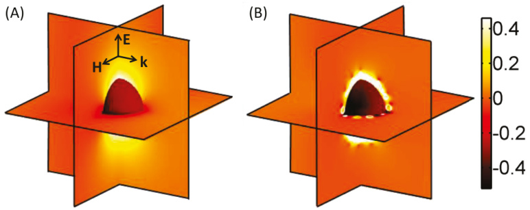{width=62%} Figure 4.14: Simulated field distributions in a logarithmic scale of the bare core sphere ($\varepsilon_{\mathrm{c}}=8$) in (A) and the core-shell cluster in (B). Both structures are illuminated by a unit amplitude plane wave at 329 nm as sketched by the black arrows in (A). The chosen wavelength corresponds to that of the positive cloaking resonance.

The concept of cloaking a dielectric sphere by a suitable shell of amorphously arranged silver NPs has been also experimentally realized [299]. For this purpose, the fabrication

method of Sec. 4.1.2 is adapted in the following way. Instead of gold NPs, silver NPs are synthesized by the Lee-Meisel method [255]. Therewith, negatively charged silver NPs with a mean radius of 6 nm are obtained. These NPs are attached to a fused silica sphere of 55 nm radius. In a previous fabrication step the surface of the silica sphere was altered to exhibit a net positive charge [252]. This allows an attachment of the silver NPs to the silica core by electrostatic forces. A filling fraction of around $10-15\%$ is achieved in experiments. Details about the fabrication procedure and respective SEM images can be found in Ref. [299]. The samples have been fabricated by Dr. Cunningham from the group of Prof. Bürgi, University Geneva.

Measurements of the scattered light were performed based on a Perkin Elmer spectrometer. Therefore, the core-shell clusters are deposited on a borosilicate substrate. Two samples have been investigated, one sample which contains only silica spheres for referential purposes and one with the core-shell clusters. The filling fraction of both samples was chosen identically.

Details about the measurements are documented likewise in Ref. [299]. In short, using different configurations, the following measurements are performed: the total transmittance, i.e. the share of energy that is transmitted into the half-space behind the sample, the diffuse transmittance, i.e. the same as the total transmittance but excluding a specular region of about ±5°, the total reflectance, and the diffuse reflectance. The latter ones are analogously defined as their transmittance counterparts. Various important parameters can be derived; but most notably the total scattering cross section. The scattering measurements were performed by Dr. Dintinger and Dr. Scharf from the EPFL.

The resulting scattering measurements are shown in Fig. 4.15 (A). A clear reduction of the scattering of the core-shell clusters (black solid curve) is observed with respect to the single silica spheres (red dashed curve). The scattering is reduced about 25 % at around 360 nm.

The position of the cloaking resonance and the strength of the reduction of the scattering are confirmed by underlying simulations, as presented in Fig. 4.15 (B). There, a single core-shell cluster with the experimentally defined parameters is rigorously simulated. The silver NPs forming the shell are again assumed as perfect spheres. The substrate was not considered and therefore, the results of the simulations differ from the experimental ones in the wavelength domain where the substrate is absorbing, i.e. in-between 250 and 300 nm. Furthermore, in simulations the functional dependency of the scattering around the cloaking resonance appears much sharper and narrower compared to experiments. The observed peak in scattering in simulations is not observed in the measurements. Both effects can be linked to the fact that in experiments an ensemble of a huge number of core-shell clusters is measured whereas in simulations only one single cluster is considered. Since the precise geometrical parameters differ from cluster to cluster in the experiments the measured optical response is broadened compared to simulations. This effect was frequently discovered in the

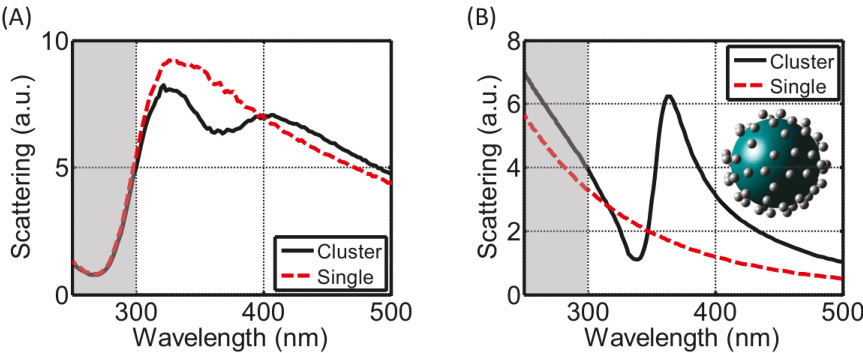{width=70%} Figure 4.15: Experimental realization of the cloaking device. In (A) measurements of the scattering of the core-shell cluster (black solid) are given together with the bare object (red dashed), a silica sphere. Details about the geometrical parameters are given in the text. In (B) the corresponding simulations are shown. The inset depicts a sketch of the core-shell cluster as considered in simulations. In both panels the wavelength range from 250 to 300 nm is shaded in gray. In this domain the applied substrate for the shown measurements in (A) is absorptive which affects the measured amount of scattered light in forward direction. Since the substrate is neglected in simulations this effect cannot be seen in (B).

previous subsections.

In conclusion, in this section a cloaking device has been developed to hide free-standing three-dimensional objects in the visible domain. The object to be cloaked is required to be of sub-wavelength dimensions in order to properly describe its scattering by electric dipole radiation. By designing a suitable shell made of silver NPs this dipole radiation could be crucially suppressed [304]. An reduction of the scattering efficiency up to 84 % can be obtained for high permittivity core objects. The respective reduction in scattering efficiency for core objects with a lower permittivity tends to be smaller. Along with rigorous simulations, an approximative model has been presented to provide an intuitive understanding on the working principle of the cloaking device. Finally, the proposed ideas of using a core-shell cluster as a scattering cancellation cloak have been experimentally realized by self-assembly techniques [299]. Although the reduction of the scattering has to be further improved, the functionality could be successfully demonstrated.

# 4.3 Concluding remarks

The focus of this chapter was on self-assembled three-dimensional meta-atoms and the resulting MMs. The major advantage of the discussed bottom-up strategies is the possibility to fabricate fully three-dimensional MMs instead of functional surfaces. Two important concepts of MMs have been realized by self-assembly techniques in this chapter. A meta-atom that offers a strong magnetic dipole response in the visible [118] and a cloaking device to

hide three-dimensional, free-standing objects at optical wavelengths [299].

Magnetic dipole resonances in meta-atoms had been previously realized by top-down techniques, e.g., in the case of a SRR. However, the results of this chapter have to be seen as one important step that further improved the field of self-assembled MMs. The demonstration of a magnetic response for meta-atoms made of resonant NPs, as they typically appear for a bottom-up fabrication, entails an extensive advantage. It serves as the first step to fabricate fully three-dimensional MMs with a tailored optical response as they are required for many envisioned applications.

The presented scattering cancellation cloak was realized for the first time for free-standing three-dimensional objects in the visible domain. Beside the principle demonstration of a self-assembled cloak the presented results are not achieved by top-down techniques so far. In other words, the possibility to arrange resonant NPs into a desired geometry with unprecedented precision by self-assembly techniques enables the implementation of the scattering cancellation cloak in the visible.

The next chapter includes a conclusion of the presented results of this thesis together with a small outlook on possible future research directions of the field of self-assembled MMs.

# 5 Conclusion

Die Hauptgebenes Stils sind eine unglückliche Neigung zu allzu dichterischen Formen.

ALEXANDER V. HUMBOLDT

The field of self-assembled bottom-up MMs has been quickly growing in the past several years. The results presented in this thesis considerably contributed to various developments in this field, as will be outlined in the following.

At first, a major contribution is on the theoretical side. The proposed concept of the multipole analysis of meta-atoms, as outlined in Chap. 2, represents a powerful tool to understand the optical response of self-assembled meta-atoms. Therewith, it is possible to link resonances of the far-field response to excited multipole moments of the meta-atom. In addition to a provided physical understanding for the origin of the meta-atom resonances, this enabled to tailor the optical response, as it has been demonstrated at the example of coupled split-ring resonators in Sec. 2.3. Thus, the proposed multipole analysis is not restricted to self-assembled meta-atoms but can be, in principle, applied for arbitrarily shaped meta-atoms.

Beside these mentioned advantages of the multipole analysis, it serves as a first step to understand and describe the light propagation in amorphous MMs, as it was equally developed in this thesis. The multipole analysis reveals under which circumstances the scattering response of a meta-atom can be sufficiently described by electric and magnetic dipole moments. In such situation it is possible to treat the light propagation in the resulting amorphous MM by effective medium theories, as shown in Sec. 2.4. Based on the Clausius-Mossotti relation effective material parameters were assigned to the amorphous MM by using the respective dipole moments of the meta-atoms. The accuracy of this formalism was proven by comparing predictions of the light propagation based on such effective medium theories with rigorous full wave simulations of the amorphous MM. This has been done while considering a well established meta-atom, i.e. the cut-plate pair. Maybe for the first time a formalism has been introduced to sufficiently describe the light propagation through amorphous MMs, which has been prior to the work of this thesis a very complex task. The key advantage of this effective medium theory is the reduction of the optical description of amorphous MMs to the simulation of the scattering response of the single meta-atom.

This constitutes a major advantage since the complexity of the problem could be drastically reduced. Apart from this, an important conclusion on the scattering response of the meta-atoms was drawn. The response of the single meta-atom is required to be isotropic in order to achieve a strong dispersion of the effective material parameters of the resulting amorphous MM.

Regarding all these previously given results the first goal of the thesis, as set in Chap. 1, has been reached. A theoretical description of amorphous MMs was introduced that allows a feasible description of the optical response of these highly complex structures. This laid the foundations for all the following results of this thesis.

The second goal of this thesis was on proposing concepts for experimental realizations of self-assembled MMs. Although no experiments have been directly performed by the author of this thesis, it was the intention to work together in close collaborations with various experimentalists. The aim was to guide them theoretically and numerically and to provide suggestions for feasible and relevant self-assembled MMs to be fabricated. Furthermore, the numerical support considerably contributed to the understanding of experimental results by providing insights that were inaccessible in an actual experimental situation.

In Chap. 3 planar self-assembled MMs, so-called meta-surfaces, are discussed in detail. Strongly coupled arrays of metallic NPs were in the focus of interest. The advantage of these MMs was the tunable distance between adjacent NP arrays in discrete steps of about one nm. This has been achieved by a self-assembly technique based on electrostatic forces. Symmetric as well as asymmetric resonances have been theoretically predicted and were experimentally demonstrated in these MMs. The achieved physical understanding of these resonances was exploited to develop an application for these planar self-assembled MMs. This is documented in Sec. 3.3 where self-assembled tunable SERS substrates have been theoretically investigated and were fabricated later on by a devoted self-assembly technique.

Chapter 4 presents an in-depth study of self-assembled three-dimensional MMs. In this thesis the fabrication of bulk MMs with a remarkable extension along the propagation direction of light was identified as one major advantage of self-assembly techniques. The first part of Chap. 4 focused on self-assembled meta-atoms with an isotropic magnetic dipole response in the visible. Theoretical considerations predicted two possible meta-atom geometries, a supramolecular cluster and a core-shell cluster. Both meta-atoms offered the desired isotropic magnetic dipole response that is required for many envisioned applications for the field of MMs. In addition, it has been demonstrated that the core-shell clusters yield such a strong magnetic dipole response that it dominates the entire scattering response of the meta-atom. Theoretical investigations of both proposed meta-atom geometries have been experimentally realized by distinct self-assembly techniques later on.

The second part of Chap. 4 discusses a self-assembled cloaking device. The proposed cloak is based on the concept of cancelling the scattering response of small objects. It

has been shown that the scattering of a silica sphere can be reduced up to an remarkable extend of 75 % by covering the sphere with tiny silver NPs. Again the theoretical concept was realized by self-assembly techniques and first principle demonstrations yield 25 % of scattering reduction.

To sum up, in strong collaborations with chemists various bottom-up MMs have been presented in Chap. 3 and 4. These MMs were self-assembled in order to achieve a desired optical response, i.e. not only the self-assembly process was in the focus of interest but also the optical properties of the fabricated MM. Based on an achieved theoretical understanding of amorphous MMs, various novel applications have been experimentally realized in this thesis, such as, self-assembled SERS substrates, a self-assembled MM with a strong response to the magnetic field and a self-assembled cloaking device. Therefore, the second goal of this thesis has been equally met for a variety of distinct self-assembled MMs.

The next section discusses open questions on the field of self-assembled MMs and, in addition, further research directions and perspectives with respect to the results of this thesis are given.

# 5.1 Open questions and perspectives

One open question is related to the description of light propagation in amorphous MMs. In this thesis the description was successfully treated by the Clausius-Mossotti relation and the respective dipole moments of the meta-atom. The important question is what are the limitations of this formalism, i.e. at which filling fraction this description might break down and what are the implications? This question is strongly linked to the interaction between neighboring meta-atoms in the amorphous MM and to the existence of higher order multipole moments that contribute to the scattering response of the meta-atoms. If the filling fraction is too large the coupling of neighboring meta-atoms will cause a hybridization of the single meta-atom resonances which cannot be described by the Clausius-Mossotti relation. Of course it is also not possible to consider higher order multipole moments by the applied effective medium theory in this thesis. One possible way to solve these problems was already touched in Sec. 2.5. There, it was stated that the T-Matrix formalism might be suitable to describe the optical response of a cluster of arbitrarily arranged meta-atoms. Although the spatial extension of the MM is required to be finite in this formalism, it might be a first step to understand the interaction of neighboring meta-atoms in amorphous MMs and to develop a description beyond effective medium theories.

A second open question is about the transition of the optical properties for different alignments of meta-atoms. So the question is which optical properties change and how they do it if the alignment of meta-atoms is changed from amorphous to quasiperiodic or periodic. First investigations of such effects were already done based on alignments of polarizable

entities [207, 212, 222]. However, these investigations should be put further by considering also higher order multipole moments of the meta-atom. The understanding of this point would help a lot to improve self-assembled MMs further since, in principle, it might be possible to control or even suppress unwanted effects of the amorphus arrangement such as the increased scattering losses.

The next open question is about the experimental realizations of self-assembled MMs. Although a lot of functional devices have been demonstrated (also in this thesis) some very important realizations still remain. One example is a MM with an isotropic negative permeability and permittivity as it is required, e.g., for a perfect lens. In principle, such a MM might be fabricated by self-assembly techniques, but up to date only self-assembled bulk MMs with a dispersive effective permeability are shown. However, it can be safely anticipated that these first demonstrations of a magnetic response can be improved further in order to self-assemble a bulky MM with negative material parameters.

A relatively new, but already prominent and profitable direction of research is related to the interaction of meta-atoms with atomic systems, such as atoms or molecules. The atomic systems have to be described by quantum physics. So the entire description of the coupled system requires a solution of Maxwell's equations for the meta-atom and the Schrödinger equation for the atomic system. In this context the meta-atoms are commonly termed nano-antennas [263] since they mediate far-field and near-field properties [332]. Several effects have been already intensively investigated, e.g., how the luminescence of molecules can be controlled by nano-antennas [333–340].

Interestingly, the proposed concept of the multipole analysis can be also used to investigate the interaction of nano-antennas with atomic systems. By slightly adopting the used eigenfunctions of the multipole analysis, it is possible to extract multipole moments of the near-field. In other words it can be revealed which multipole moment has a huge impact on the atomic system that is brought in close proximity to the nano-antenna [341]. These considerations already yield some very interesting results. For example, it has been shown that it is possible to excite dipole-forbidden transitions in atomic systems by applying a suitable designed nano-antenna [342]. The field of nano-antennas might be crucially effected by self-assembly techniques in order to fabricate structures with small feature sizes. Furthermore, the multipole analysis of meta-atoms remains a powerful tool to understand the optical response of these nano-antennas and to describe their interaction with atomic systems.

# Acknowledgements

Now after finishing the thesis and by working on these lines I become aware that this work would not have been possible without the amazing support of so many persons. These lines are for all of you who helped me during my time as a PhD student.

First of all I want to thank Prof. Lederer for giving me the chance to write my thesis at the Institute of Condensed Matter Theory and Solid State Optics at the Friedrich-Schiller Universität Jena. I am very grateful that I could attend your outstanding lecture in Theoretical Optics. For me it was the first time that I have really understood the concepts of modern optics.

Special thanks goes to Prof. Rockstuhl. I have started to work with you as a graduate student and you accompanied me till this day. Thank you so much for all the things that you have taught me during this long period, especially how to write perfect scientific articles, how to present results, and how to optimize my time management. Furthermore, I want to thank you for your amazing support and your unwavering confidence in my skills.

I also gratefully acknowledge the careful reading and evaluation of this thesis by all referees.

Special thanks goes to all members of the Photonics group. I always enjoyed the atmosphere in our group and our profound discussions. I worked so closely together with some members of the Photonics group that they even became friends. Therefore, it is hard for me to express my gratitude in some sentences. First of all I wish to thank you all for the great time. Especially, I would like to thank Dr. Christoph Menzel for introducing me to the complex topic of effective material parameters and for teaching me to have some tough discussions. I am indebted to Dr. Stephan Fahr who taught me to produce nice figures. Thank you also very much for the great time at the coffee breaks. Furthermore, I want to thank Dr. Thomas Paul for introducing me on how to sufficiently comment a MATLAB code and how to take care of a haircut.

Furthermore, I would like to thank Erik Hebestreit for sharing the office with me for the last year and for deriving the transformation rules between the symmetric and asymmetric multipole coefficients. Special thanks goes to Dr. Lutz Leine for taking care about the computational infrastructure. Last but not least I want to thank our secretary Szilvia Mammel for taking care of all administration issues.

This thesis would not have been possible without strong collaborations with many groups from all over the world. Many merci goes to Dr. Toralf Scharf from the École Polytechnique

Fédérale de Lausanne (EPFL), Switzerland. You are such an amazing and unorthodox project coordinator and I really enjoyed all our meetings. Thank you also very much for the great time in Neuchâtel; I will never forget it. Special thanks to Mr. Kim who has cleaned up one of his desks and let me sit behind his wall of monitors at the EPFL. I would like to thank Dr. José Dintinger for the experimental support and the great time in Switzerland. Many thanks to Julie Lenoble Zwahlen from the EPFL for taking care of all the administrative issues of the Nanogold project and for sharing her office with me.

From the University of Geneva I am indebted to Dr. Alastair Cunningham. Thank you so much for the perfect collaboration, the experimental support and the resulting publications. I really appreciated all our discussions and meetings. Special thanks goes to Prof. Bürgi from the University of Geneva for the experimental support and the development of rewarding ideas concerning self-assembly. I also want to thank Prof. Vassilis Yannopapas from the University of Patras for the great project meeting near Athens and the perfect support with the KKR method.

I gratefully acknowledge the collaboration with Reinhard Geiss and Florian Kretschmer within the PhoNa project. Thank you so much for your power of endurance even at hard times. I also want to thank Dr. Dana Cialla and Dr. Karina Weber from the Institute of Photonic Technologies (IPHT) Jena for providing the SERS measurements and for fruitful discussions. Furthermore, I like to thank Sebastian Scheeler and Dr. Claudia Pacholski from the MPI Stuttgart. Thank you very much for the experimental support and the development of new ideas on how to self-assemble meta-atoms. Last but not least I want to thank Martin Thomas and Dr. Philipp Marquetand from the University of Vienna for our collaboration about SERS enhancement mechanisms.

I also want to thank Karsten Verch for providing artistic views for many of my publications. Now, at the end of the acknowledgments, comes the most important part, my family. I want to thank all my family for the outstanding support during the last years. Especially my parents supported me financially during my study of physics. Furthermore, they watched our children many times which helped a lot to write down this thesis. Thank you very much. Special thanks goes to my sister Anna for the support as a baby sitter. I also want to thank Gerlind Hauser for proof reading the introduction of the thesis.

Last but not least many thanks to my girlfriend Anna. It is hard to imagine what I would do without you. Thank you very much for all the motivation, proof reading, the amusement, and in particular for our awesome kids Clara, Martha and Paul.

# Publications

All publications in peer reviewed journals that are directly relevant for this thesis will appear in **bold** letters in the following.

# Contributed book chapters

C. Rockstuhl, C. Menzel, S. Mühlig, and F. Lederer, Theory of Optical Metamaterials in Encyclopedia of Nanotechnology by Bharat Bhushan (Springer, 2012, ISBN: 978-90-481-9750-7).

S. Mühlig and C. Rockstuhl, Multipole analysis of self-assembled metamaterials in Amorphous Nanophotonics by C. Rockstuhl and T. Scharf (Springer, 2013, ISBN: 978-3-642-32474-1).

# Peer reviewed journals

S. Mühlig, C. Rockstuhl, J. Pniewski, C. R. Simovski, S. A. Tretyakov, and F. Lederer, Three-dimensional metamaterial nanotips, Phys. Rev. B 81, 075317 (2010).

A. Cunningham, S. Mühlig, C. Rockstuhl, and T. Bürgi, Coupling of plasmon resonances in tunable layered arrays of gold nanoparticles, J. Phys. Chem. C 115, 8955-8960 (2011).

S. Mühlig, C. Rockstuhl, V. Yannopapas, T. Bürgi, N. Shalkevich, and F. Lederer, Optical properties of a fabricated self-assembled bottom-up bulk metamaterial, Opt. Express 19, 9607–9616 (2011).

M.-S. Kim, T. Scharf, S. Mühlig, C. Rockstuhl, and H. P. Herzig, Engineering photonic nanojets, Opt. Express 19, 10206–10220 (2011).

S. Mühlig, M. Farhat, C. Rockstuhl, and F. Lederer, Cloaking dielectric spherical objects by a shell of metallic nanoparticles, Phys. Rev. B 84, 195116 (2011).

M.-S. Kim, T. Scharf, S. Mühlig, C. Rockstuhl, and H. P. Herzig, Gouy phase anomaly in photonic nanojets, Appl. Phys. Lett. 98, 191114 (2011).

C. Rockstuhl, C. Menzel, S. Mühlig, J. Peschtulat, C. Helgert, C. Etrich, A. Chipouline, T. Pertsch, and F. Lederer, Scattering properties of meta-atoms, Phys. Rev. B 83, 245119 (2011).

S. Mühlig, A. Cunningham, S. Scheler, C. Pacholski, T. Bürgi, C. Rockstuhl, and F. Lederer, Self-assembled plasmonic core-shell clusters with an isotropic magnetic dipole response in the visible range, ACS Nano 5, 6586-6592 (2011).

S. Mühlig, C. Menzel, C. Rockstuhl, and F. Lederer, Multipole analysis of meta-atoms, Metamaterials 5, 64-73 (2011).

J. Dintinger, S. Mühlig, C. Rockstuhl, and T. Scharf, A bottom-up approach to fabricate optical metamaterials by self-assembled metallic nanoparticles, Opt. Mater. Express 2, 269-278 (2012).

M. Farhat, S. Mühlig, C. Rockstuhl, and F. Lederer, Scattering cancellation of the magnetic dipole field from macroscopic spheres, Opt. Express 20, 13896-13906 (2012).

R. Filter, S. Mühlig, T. Eichelkraut, C. Rockstuhl, and F. Lederer, Controlling the dynamics of quantum mechanical systems sustaining dipole-forbidden transitions via optical nanoantennas, Phys. Rev. B 86, 035404 (2012).

A. Cunningham, S. Mühlig, C. Rockstuhl, and T. Bürgi, Exciting bright and dark eigenmodes in strongly coupled asymmetric metallic nanoparticle arrays, J. Phys. Chem. C 116, 17746-17752 (2012).

S. Mühlig, A. Cunningham, J. Dintinger, T. Scharf, T. Bürgi, F. Lederer, and C. Rockstuhl, Self-assembled plasmonic metamaterials, Nanophoton. 2, 211-240 (2013). [Review article]

S. Mühlig, A. Cunningham, J. Dintinger, M. Farhat, S. Bin Hasan, T. Scharf, T. Bürgi, F. Lederer, and C. Rockstuhl, A self-assembled three-dimensional cloak in the visible, Sci. Rep. 3, 02328 (2013).

# Conference proceedings

J. Pniewski, S. Mühlig, C. Rockstuhl, and C. Simovski, Metamaterial nanotips with multi-frequency local field enhancement, Proc. SPIE 7746, 774612 (2010).

M.-S. Kim, T. Scharf, S. Mühlig, C. Rockstuhl, and H. P. Herzig, Photonic nanojet engineering: focal point shaping with scattering phenomena of dielectric microspheres, Proc. SPIE 7941 (2011).

M. Farhat, S. Mühlig, A. Cunningham, T. Bürgi, C. Rockstuhl, and F. Lederer, Cloaking dielectric spheres by a shell of plasmonic nanoparticles, Proc. SPIE 8423, 84231D (2012).

M.-S. Kim, T. Scharf, H. P. Herzig, S. Mühlig, and C. Rockstuhl, Generation of highly confined optical bottle beams by exploiting the photonic nanojet effect, Proc. SPIE, 8274, 82740U, (2012).

S. Mühlig, J. Dintinger, A. Cunningham, T. Scharf, T. Bürgi, C. Rockstuhl, and F. Lederer, Bottom-up metamaterials with an isotropic magnetic response in the visible, Proc SPIE 8455, 84551G (2012).

# Invited talks

ivited talks

Self-organized bottom-up metamaterials based on spatially arranged nanoparticles: Concepts and realizations, T. Scharf, J. Dintinger, H. Selmane, G. Mehl, G. Ungar, X. Zeng, C. Rockstuhl, S. Mühlg, T. Bürgi, A. Cunningham, L. di Sio, R. Caputo, V. Yannopas, W. Meier, T. Schuster, METAMATERIALS 2010, Karlsruhe, Germany.

Amorphous metamaterials, C. Rockstuhl, C. Menzel, S. Mühlg, C. Helgert, B. Walther, A. Chipouline, C. Etrich, A. Cuningham, T. Bürgi, E.-B. Kley, T. Pertsch, F. Lederer, EOS AM 2010, Paris, France.

Self-organized bottom-up metamaterial based on spatially arranged nanoparticles, T. Scharf, J. Dintinger, H. Sellame, G. Mehl, G. Ungar, X. Zheng, C. Rockstuhl, S. Mühlg, T. Kienzler, T. Bürgi, A. Cunningham, NOMA 2011, Cetaro, Italy.

Amorphous plasmonics and metamaterials, C. Rockstuhl, S. Mühlg, T. Kienzler and F. Lederer, NOMA 2011, Cetaro, Italy.

Bottom-up metamaterials and plasmonic elements with metallic nanoparticles as building blocks, C. Rockstuhl, S. Mühlg, A. Cunningham, T. Bürgi, J. Dintinger, and T. Scharf, META 2012, Paris, France.

Bottom-up metamaterials and plasmonic elements with metallic nanoparticles as basic building blocks, C. Rockstuhl, S. Mühlg, R. Filter, A. Cunningham, T. Bürgi, J. Dintinger, and T. Scharf, PECS-X 2012, Santa Fe, New Mexico, USA.

Multipole analysis of meta-atoms, F. Lederer, C. Menzel, C. Rockstuhl, and S. Mühlig, Frontiers in Optics 2012, Rochester, New York, USA.

Liquid crystal plasmonic metamaterials, T. Scharf, J. Dintinger, B.-J. Tang, G. H. Mehl, X. Zeng, G. Ungar, S. Mühlig, T. Kienzler, and C. Rockstuhl, SPIE Photonics West 2012, San Francisco, USA.

A self assembled cloak, C. Rockstuhl, S. Mühlig, M. Farhat, F. Lederer, A. Cunningham, T. Bürgi, J. Dintinger, and T. Scharf, Nanometa 2013, Bad Seefeld, Austria.

Controlling the dynamics of quantum mechanical process using meta-atoms, C. Rockstuhl, R. Filter, S. Mühlig, T. Eichelkraut, S. Fischer, J. C. Goldschmidt, and F. Lederer, PIERS 2013, Taipai, Taiwan.

A cloak from self-assembled metallic nanoparticles, C. Rockstuhl, S. Mühlig, M. Farhat, S. Bin Hasan, A. Cunningham, T. Bürgi, J. Dintinger, T. Scharf, and F. Lederer, META 2013, Dubai, Arab Emirates.

Towards homogeneous magnetic metamaterials - a comprehensive multipole analysis, C. Menzel, E. Hebestreit, S. Mühlig, S. Burger, C. Rockstuhl, F. Lederer, and T. Pertsch, META 2013, Dubai, Arab Emirates.

# Conference contributions

Localizing light using metamaterial nanotips, C. Rockstuhl, S. Mühlig, C. R. Simovski, S. A. Tretyakov, and F. Lederer, CLEO Europe 2010, Munich, Germany.

Three-dimensional metamaterial nanotips, S. Mühlig, C. Rockstuhl, J. Pniewski, C. Simovski, and F. Lederer, OSA META 2010, Tuscon, USA.

Amorphous bulk metamaterials, C. Rockstuhl, C. Menzel, S. Mühlig, C. Helgert, B. Walther, A. Chipouline, C. Etrich, E.-B. Kley, T. Pertsch, and F. Lederer, METAMATERIALS 2010, Karlsruhe, Germany.

Effective properties of self-assembled bottom-up metamaterials, S. Mühlig, A. Cunningham, C. Rockstuhl, T. Bürgi, and F. Lederer, PECS 2010, Granada, Spain.

Amplitude and phase fields of photonic nanojets, M.-S. Kim, T. Scharf, H. P. Herzig, S. Mühlig, and C. Rockstuhl, EOS AM 2010, Paris, France.

Optical properties of bottom-up metamaterials, T. Kienzler, S. Mühlig, A. Cunningham, C. Rockstuhl, T. Bürgi, and F. Lederer, TaCoNa 2010, Bad Honnef, Germany.

Multifrequency local field enhancement by a metamaterial nanopyramid, C. Simovski, J. Pniewski, S. Mühlg and C. Rockstuhl, Days on Diffraction 2010, St. Petersburg, Russia.

Absorption enhancement in thin-film solar cells by nanophotonic structures, S. Fahr, T. Paul, S. Mühlg, C. Rockstuhl, and F. Lederer, PhoNa International Workshop 2010, Jena, Germany.

Chirality as a bulk property retrieved from the dispersion relation, C. Menzel, C. Rockstuhl, S. Mühlg, T. Paul, and F. Lederer, PhoNa International Workshop 2010, Jena, Germany.

Anomalous diffraction and refraction in negative-index metamaterials, T. Paul, C. Menzel, S. Fahr, S. Mühlg, C. Rockstuhl, and F. Lederer, PhoNa International Workshop 2010, Jena, Germany.

Photonic nanojet engineering: Focal point shaping with scattering phenomena of dielectric microspheres, M.-S. Kim, T. Scharf, S. Mühlg, C. Rockstuhl, and H. P. Herzig, SPIE Photonics West 2011, San Francisco, USA.

Cloaking dielectric spheres by a shell of metallic nanoparticles, M.-S. Kim, T. Scharf, S. Mühlg, C. Rockstuhl, and F. Lederer, NOMA 2011, Cetaro, Italy.

Observation of axial phase evolution of highly confined light fields, M.-S. Kim, T. Scharf, S. Mühlg, C. Rockstuhl, and H. P. Herzig. Frontiers in Optics 2011, San Jose, California.

Cloaking dielectric spheres by a shell of metallic nanoparticles, M. Farhat, S. Mühlg, C. Rockstuhl, and F. Lederer, Metamaterials 2011, Barcelona, Spain.

Assigning effective parameters to amorphous metamaterials, S. Mühlg, C. Menzel, T. Paul, C. Rockstuhl, and F. Lederer, Metamaterials 2011, Barcelona, Spain.

On the isotropic magnetic response of fabricated core-shell clusters and its ability to cloak, S. Mühlg, A. Cunningham, M. Farhat, C. Rockstuhl, T. Bürgi, and F. Lederer, CLEO/QELS 2011, Baltimore, Maryland, USA.

Generation of highly confined optical bottle beams by photonic nanojet effect, M.-S. Kim, T. Scharf, S. Mühlg, C. Rockstuhl, and H. P. Herzig, SPIE Photonics West 2012, San Francisco, USA.

Bottom-up fabrication and optical properties of metallic nanoparticle assemblies, A. Cunningham, S. Mühlg, C. Rockstuhl, and T. Bürgi, International Conference on Metamaterials 2012, Jena, Germany.

Bottom-up metamaterials with an isotropic magnetic response, S. Mühlig, A. Cunningham, J. Dintinger, T. Scharf, T. Bürgi, C. Rockstuhl, and F. Lederer, International Conference on Metamaterials 2012, Jena, Germany.

Coupling effects in tuneable layers of metal nanoparticles, S. Mühlig, A. Cunningham, D. Cialla, K. Weber, T. Bürgi, C. Rockstuhl, and F. Lederer, Metamaterials 2012, St. Petersburg, Russia.

Controlling the dynamics of quantum mechanical systems using meta-atoms, C. Rockstuhl, R. Filter, T. Eichelkraut, S. Mühlig, S. Fischer, J. C. Goldschmidt, and F. Lederer, Metamaterials 2012, St. Petersburg, Russia.

Bottom-up metamaterials with an isotropic magnetic response in the visible, S. Mühlig, J. Dintinger, A. Cunningham, T. Scharf, T. Bürgi, C. Rockstuhl, and F. Lederer, SPIE Optics Photonics 2012, San Diego, USA.

Plasmonic nanoparticles for a bottom-up approach to fabricate optical metamaterials, J. Dintinger, S. Mühlig, C. Rockstuhl, and T. Scharf, EMRS Fall Meeting 2012, Strasbourg, France.

Strong coupling effects in fabricated tunable layers of metal nanoparticles, S. Mühlig, C. Rockstuhl, F. Lederer, A. Cunningham, T. Bürgi, D. Cialla and K. Weber, CIMTEC 2012, Montecatini Terme, Italy.

Cloaking dielectric spheres by a shell of plasmonic nanoparticles, M. Farhat, S. Mühlig, C. Rockstuhl, F. Lederer, A. Cunningham, and T. Bürgi, SPIE Photonics Europe 2012, Brussels, Belgium.

A first-principles study of surface enhanced Raman spectra of molecules adsorbed to plasmonic nanocomposites, M. Thomas, S. Mühlig, E. Hebestreit, T. Deckert-Gaudig, V. Deckert, P. Marquetand, and C. Rockstuhl, META 2013, Dubai, Arab Emirates.

Tunable magnetic dipole response of core-shell clusters, M. Fruhnert, S. Mühlig, C. Rockstuhl, and F. Lederer, Metamaterials 2013, Bordeaux, France.

# Short Curriculum Vitae

# Personal data

Name Stefan MühligDate of birth 09/06/1984Place of birth Jena, Germany

# Academic career

| 11/2009–03/2012 | Scientific employee at Institute of Condensed Matter Theory and Solid State Optics (IFTO), at the Friedrich-Schiller Universität (FSU) Jena, Germany. |
| --- | --- |
| 03/2012–06/2012 | Scientific employee at Optics and Photonics Technology Laboratory, École Polytechnique Fédérale de Lausanne (EPFL), Neuchâtel, Switzerland. |
| 07/2012–current | Scientific employee at IFTO, FSU Jena, Germany. |
| 09/2013 | Submittance of PhD thesis entitled “Towards Self-Assembled Metamaterials”. |

# Teaching activity

Winter term 2011/12 Classical electrodynamics, seminar (2 SWS).

Winter term 2012/13 Classical electrodynamics, seminar (2 SWS).

# Education

09/1997-06/2003 Carl-Zeiss-Spezialschule Jena; Degree: Abitur.

09/2003-06/2004 Alternative national service.

10/2004-09/2006 Study of Physics at Technische Universität Dresden, Germany.

10/2006-09/2009 Study of Physics at FSU Jena, Germany.

09/2009 Diploma degree in physics from the FSU Jena, Germany.

# Ehrenwörtliche Erklärung

Hiermit erkläre ich ehrenwörtlich, dass ich die vorliegende Arbeit selbstständig, ohne unzulässige Hilfe Dritter und ohne Benutzung anderer als der angegebenen Hilfsmittel und Literatur angefertigt habe. Die aus anderen Quellen direkt oder indirekt übernommenen Daten und Konzepte sind unter Angabe der Quelle gekennzeichnet.

Bei der Auswahl und Auswertung folgenden Materials haben mir die nachstehend aufgeführten Personen in der jeweils beschriebenen Weise unentgeltlich geholfen

Die gezeigten Ergebnisse der Abbildung 2.4 und 2.5 wurden von Dr. Christoph Menzel (IFTO, FSU Jena) simuliert.

Die Transmissionsspekten in Abbildung 2.7 wurden von Dr. Christoph Etrich (IFTO, FSU Jena) simuliert. Die Auswertung in Abbildung 2.8 wurde von Prof. Rockstuhl (IFTO, FSU Jena) vorgenommen.

Die SEM Aufnahmen der Abbildungen 3.2 (A), 3.3 (A), 3.6 (A), 3.7 (A), 3.14 (B) und 4.10 (B) wurden von Dr. Alastair Cunningham (University of Geneva) angefertigt.

Die gezeigten Messergebnisse in den Abbildungen 3.2 (B), 3.4, 3.5 (A), 3.7 (B), 3.8 (A), 3.9 und 4.10 (D) wurden von Dr. Alastair Cunningham (University of Geneva) gemessen.

Die SERS Spectren der Abbildungen 3.14 (A) und (C) wurden von Dr. Dana Cialla und Dr. Karina Weber (IPHT Jena) aufgenommen und ausgewertet.

Die experimentellen Ergebnisse der Abbildung 4.5 wurden von Dr. José Dintinger und Dr. Toralf Scharf (EPFL Neuchâtel) erzeugt.

Die experimentellen Ergebnisse der Abbildungen 4.10 (A) und (C) wurden durch Se-bastian Scheeler und Dr. Claudia Pacholski (MPI Stuttgart) erzeugt.

Die experimentellen Ergebnisse der Abbildung 4.15 (A) wurden durch Dr. José Dintinger (EPFL Neuchâtel) und Dr. Alastair Cunningham (University of Geneva) erzeugt.

Carsten Verch hat die Abbildung 4.11 basierend auf einer Prinzipskizze von mir ge- zeignet.

Weitere Personen waren an der inhaltlich-materiellen Erstellung der vorliegenden Arbeit nicht beteiligt. Insbesondere habe ich hierfür nicht die entgeltliche Hilfe von Vermittlungs- bzw. Beratungsdiensten (Promotionsberater oder andere Personen) in Anspruch genommen. Niemand hat von mir unmittelbar oder mittelbar goldwerte Leistungen für Arbeiten erhalten, die im Zusammenhang mit dem Inhalt der vorgelegten Dissertation stehen.

Die Arbeit wurde bisher weder im In- noch im Ausland in gleicher oder ähnlicher Form einer anderen Prüfungsbehörde vorgelegt.

Die geltende Promotionsordnung der Physikalisch-Astronomischen Fakultät ist mir bekannt.

Ich versichere ehrenwörtlich, dass ich nach bestem Wissen die reine Wahrheit gesagt und nichts verschwegen habe.

# Zusammenfassung

Die vorliegende Arbeit befasst sich mit der theoretischen Beschreibung und der möglichen experimentellen Umsetzung von selbstorganisierten Metamaterialien, die ein sich schnell entwickelndes und sehr erfolgreiches Feld der Optik darstellen. Entscheidende Beiträge zur Weiterentwicklung dieses wissenschaftlichen Feldes wurden im Rahmen dieser Arbeit dokumentiert und sollen im Folgenden kurz zusammengefasst werden.

Der erste wesentliche Beitrag beschäftigt sich mit der theoretischen Beschreibung von selbstorganisierten Metamaterialien. Dazu wurde in Kap. 2 das Konzept der Multipolanalyse von Meta-Atom eingeführt. Dieses Konzept ermöglicht ein tiefes physikalisches Verständnis der optischen Antwort eines einzelnen Meta-Atoms. Im Speziellen ist es möglich, auftretende Resonanzen im Fernfeld mit angeregten Multipolmoments des Meta-Atoms in Verbindung zu bringen. Dies ermöglicht Rückschlüsse auf den Ursprung der angeregten Resonanzen. Weiterhin wurde am Beispiel von gekoppelten Split-Ring-Resonatoren gezeigt, dass durch die Multipolanalyse maßgeschneiderte Resonanzen im Meta-Atom eingestellt werden können. Ein weiterer Vorteil besteht darin, dass das Konzept der Multipolanalyse auf beliebige Geometrien angewendet werden kann und daher nicht auf selbstorganisierte Meta-Atom beschränkt ist.

Abgesehen von den eben diskutierten Vorteilen der Multipolanalyse bildet dieses Konzept einen wichtigen Grundstein zur Beschreibung der Ausbreitung von Licht in amorphen Meta-materialien, wie sie in dieser Arbeit entwickelt wurde. Mit Hilfe der Multipolanalyse kann entschieden werden, ob die Streuantwort eines Meta-Atoms rein durch elektrische und magnetische Dipolmomente beschrieben werden kann. Ist dies der Fall, dann ist es möglich, die Ausbreitung von Licht im resultierenden Metamaterial mit Hilfe von effektiven Medium-Theorie zu beschreiben, wie es in der vorliegenden Arbeit in Kap. 2 gezeigt ist. Die Clausius-Mossotti Relation ermöglicht es, den amorphen Metamaterialien effektive Materialparameter zuzuweisen. Dazu werden die entsprechenden Dipolmomente der Meta-Atomene benötigt. Die Exaktheit einer solchen Methode wurde wie folgt überprüft. Die Vorhersagen des effektiven Medium Modells wurden mit rigorosen Simulationen eines amorphen Meta-materials (bestehend aus sogenannten Cut-Plate Paaren) verglichen und ergaben qualitativ und quantitativ gleiche Ergebnisse. Damit wurde im Rahmen dieser Arbeit ein Formalismus entwickelt, der eine hinreichend genaue optische Beschreibung von amorphen Metamaterialien ermöglicht. Diese Beschreibung könnte vor den Ergebnissen dieser Arbeit nur durch

aufwendige Rechnungen erfolgen. Dies ist nun nicht mehr nötig, da die Verwendung von effektiven Medium-Theorien es erlaubt, die Lichtausbreitung in amorphen Metamaterialien unter Betrachtung der angeregten Dipolmomente der einzelnen Meta-Atomte zu beschreiben. Diese Vereinfachung stellt zugleich den wesentlichen Vorteil der hier vorgestellten Methode dar.

Weiterhin könnte im Rahmen der Betrachtungen in Kap. 2 die folgende wichtige Eigen- schaft für Meta-Atom abgeleitet werden. Um einen möglichst großen Einfluss der Resonan-zen der Meta-Atom auf die Dispersion der effektiven Materialparameter des resultierenden Metamaterials zu erzielen, ist es entscheidend, dass die Meta-Atom eine isotrope optische Antwort aufweisen.

Unter Betrachtung aller eben diskutierten Ergebnisse lässt sich festhalten, dass die vorliegende Arbeit wesentlich dazu beigetragen hat, eine kohäre optische Beschreibung von selbstorganisierten, amorphen Metamaterialien zu entwickeln und zu etablieren. Dies bildet die Grundlage für alle folgenden Ergebnisse.

Der zweite wesentliche Beitrag der vorliegenden Arbeit besteht in der experimentelle Umsetzung von selbstorganisierten Metamaterialien. Obgleich keinerlei Experimente vom Autor der Arbeit direkt durchgeführt wurden, war es eine entscheidende Intention dieser Arbeit, in enger Zusammenarbeit mit Experimentatoren funktionsfähige Metamaterialien durch Selbstorganisation zu entwickeln und herzustellen. Im Speziellen ist dazu ein grundsolides theoretisches Verständnis von amorphen Metamaterialien nötig, wie es in Kap. 2 dieser Arbeit dokumentiert ist. Auf dieser Basis konnten in Zusammenhang mit numerischen Simulationen Vorschläge für mögliche Meta-Atom Geometrien entwickelt werden, die im Anschluss durch ausgewählte Selbstorganisationsprozesse hergestellt werden konnten. Weiterhin erlaubten die numerischen Simulationen ein tieferes Verständnis der experimentellen Ergebnisse, da insbesondere Größen berechnet werden konnten, auf die man im Experiment keinen direkten Zugriff hatte.

Kapitel 3 der vorliegenden Arbeit beschäftigt sich mit planaren selbstorganisierten Metamaterialien, sogenannten Meta-Oberflächen. Im Speziellen wurden stark gekoppelte Lagen bestehend aus metallischen Nanopartikeln untersucht. Der Abstand dieser Lagen konnte in einem Selbstorganisationsprozess in diskreten Schritten von einem Nanometer eingestellt werden. Dies ermöglichte die Untersuchung von stark gekoppelten Nanopartikeln. Symmetrische und asymmetrische Resonanzen konnten in diesen Systemen nachgewiesen werden. Basierend auf einem tiefen physikalischen Verständnis dieser speziellen planaren Metamaterialien wurde eine Anwendung entwickelt. Substrate für oberflächenverstärkte Raman Spektroskopie, die sich in ihrer Resonanzwellenlänge durchstimmen lassen, wurden numerisch untersucht und im Anschluss durch einen speziellen Selbstorganisationsprozess hergestellt.

Kapitel. 4 beinhaltet eine Untersuchung dreiddimensionaler selbstorganisierter Metamaterialien. Die Möglichkeit Volumenstrukturen herzustellen, die eine entscheidende Ausdehnung

entlang der Propagationsrichtung des Lichtes aufweisen, stellt einen wesentlichen Vorteil von Selbstorganisationsprozessen dar. Der erste Teil von Kap. 4 diskutiert dreidimensionale Meta-Atom, die eine isotrope magnetische Dipolresonanz im sichtbaren Spektralbereich aufweisen. Durch theoretische Betrachtungen konnten zwei mögliche Meta-Atom Geometrien identifiziert werden, ein sogenanntes Supramolekulares Cluster und ein Core-Shell Cluster. Für beide Geometrien wurde das magnetische Dipolmoment durch numerische Rechnungen nachgewiesen, das eine entscheidende Voraussetzung für viele vorgeschlagene Anwendungen von Metamaterialien darstellt. Weiterhin könnte gezeigt werden, dass für Core-Shell Cluster das magnetische Dipolmoment stark genug ausgeprägt ist, um die Streuantwort des Meta-Atoms zu dominiieren. Beide vorgeschlagen Meta-Atom Geometrien wurden im Anschluss durch verschiedene Selbstorganisationsprozesse hergestellt.

Der zweite Teil von Kap. 4 beschäftigt sich mit der Herstellung einer optischen Tarnkappe durch Selbstorganisationsprozesse. Das im Rahmen dieser Arbeit vorgestellte Konzept basiert auf der Unterdrückung der Streuantwort von optisch kleinen Objekten. Es wurde gezeigt, dass die Streuantwort einer dieelektrischen Kugel um bis zu 75 % reduziert werden kann, wenn man sie mit kleinen Silber-Nanopartikeln umschließenst. Das theoretische Konzept wurde abermals durch Selbstorganisationsprozesse realisiert. Eine erste Demonstration des Konzeptes ermöglichte eine experimentelle Redaktion der Streuantwort von 25 %.

Zusammenfassend bleibt festzuhalten, dass in enger Zusammenarbeit mit experimentellen Partners eine große Vielfalt von selbstorganisierten Metamaterialen im Rahmen dieser Arbeit entwickelt und hergestellt wurden. Entscheidend dabei war der Fokus auf die resultierende optische Antwort der Metamaterialien und nicht auf den zugrunde liegenden Selbstorganisationsprozess. Basierend auf dem entwickelten theoretischen Verständnis für amorphpe Metamaterialien wurden verschiedenenartige Anwendungen von Metamaterialien im Rahmen dieser Arbeit umgesetzt, wie z. B. selbstorganisierte Substrate für oberflächenverstärkte Raman Spektroskopie, selbstorganisierte Metamaterialien mit einer starken magnetischen Dipolresonanz und eine selbstorganisierte optische Tarnkappe. Damit trägt die vorliegende Arbeit wesentlich zur Weiterentwicklung und experimentellen Umsetzung von selbstorganisierten Metamaterialien bei.

# Bibliography

[1] R. F. Service, How far can we push chemical self-assembly?, Science 309, 95 (2005). [1] R. r. Service, How jar can we push chemical self-assembly?, Science 309, 95 (2005).

[2] G. M. Whitesides, J. P. Mathias, and C. T. Seto, Molecular self-assembly and nanochemistry: A chemical strategy for the synthesis of nanostructures, Science 254, 1312–1319 (1991).

[3] G. M. Whitesides and B. Grzybowski, Self-assembly at all scales, Science 295, 2418–2421 (2002).

[4] K. J. M. Bishop, C. E. Wilmer, S. Soh, and B. A. Grzybowski, Nanoscale forces and their uses in self-assembly, Small 5, 1600–1630 (2009).

[5] C. L. Choi and A. P. Alivisatos, From artificial atoms to nanocrystal molecules: Preparation and properties of more complex nanostructures, Annu. Rev. Phys. Chem. 61, 369–389 (2010).

[6] J. M. Romo-Herrera, R. A. Alvarez-Puebla, and L. M. Liz-Marzán, Controlled assembly of plasmonic colloidal nanoparticle clusters, Nanoscale 3, 1304–1315 (2011).

[7] A. Guerrero-Martínez, J. L. Alonso-Gómez, B. Auguié, M. M. Cid, and L. M. Liz-Marzán, From individual to collective chirality in metal nanoparticles, Nano Today 6, 381–400 (2011).

[8] C. Rockstuhl and T. Scharf, Amorphous nanophotonics (Berlin, Springer, 2013), 1st ed.

[9] S. Mühlig, A. Cunningham, J. Dintinger, T. Scharf, T. Bürgi, F. Lederer, and C. Rockstuhl, Self-assembled plasmonic metamaterials, Nanophoton. 2, 211–240 (2013).

[10] V. M. Shalaev, Optical negative-index metamaterials, Nature Photon. 1, 41–48 (2007).

[11] C. M. Soukoulis and M. Wegener, Past achievements and future challenges in the development of three-dimensional photonic metamaterials, Nature Photon. 5, 523–530 (2011).

[12] J. B. Pendry, D. Schurig, and D. R. Smith, Controlling electromagnetic fields, Science 312, 1780–1782 (2006).

[13] U. Leonhardt, Optical conformal mapping, Science 312, 1777–1780 (2006).

[14] J. B. Pendry, A. Aubry, D. R. Smith, and S. A. Maier, Transformation optics and subwavelength control of light, Science 337, 549–552 (2012).

[15] A. Greenleaf, Y. Kurylev, M. Lassas, U. Leonhardt, and G. Uhlmann, Cloaked electromagnetic, acoustic, and quantum amplifiers via transformation optics, PNAS 109, 10169–10174 (2012).

[16] J. B. Pendry, Negative Refraction Makes a Perfect Lens, Phys. Rev. Lett. 85, 3966–3969 (2000).

[17] Z. Jacob, L. V. Alekseyev, and E. Narimanov, Optical hyperlens: Far-field imaging beyond the diffraction limit, Opt. Express 14, 8247–8256 (2006).

[18] Z. Liu, H. Lee, Y. Xiong, C. Sun, and X. Zhang, Far-field optical hyperlens magnifying sub-diffraction-limited objects, Science 315, 1686–1686 (2007).

[19] D. Schurig, J. J. Mock, B. J. Justice, S. A. Cummer, J. B. Pendry, A. F. Starr, and D. R. Smith, Metamaterial electromagnetic cloak at microwave frequencies, Science 314, 977–980 (2006).

[20] J. Valentine, J. Li, T. Zentgraf, G. Bartal, and X. Zhang, An optical cloak made of dielectrics, Nature Mater. 8, 568–571 (2009).

[21] R. Liu, C. Ji, J. J. Mock, J. Y. Chin, T. J. Cui, and D. R. Smith, Broadband groundplane cloak, Science 323, 366–369 (2009).

[22] L. H. Gabrielli, J. Cardenas, C. B. Poitras, and M. Lipson, Silicon nanostructure cloak operating at optical frequencies, Nature Photon. 3, 461–463 (2009).

[23] T. Ergin, N. Stenger, P. Brenner, J. B. Pendry, and M. Wegener, Three-dimensional invisibility cloak at optical wavelengths, Science 328, 337–339 (2010).

[24] H. F. Ma and T. J. Cui, Three-dimensional broadband ground-plane cloak made of metamaterials, Nature Commun. 1, 21 (2010).

[25] X. Chen, Y. Luo, J. Zhang, K. Jiang, J. B. Pendry, and S. Zhang, Macroscopic invisibility cloaking of visible light, Nature Commun. 2, 176 (2011).

[26] B. Zhang, Y. Luo, X. Liu, and G. Barbastathi, Macroscopic invisibility cloak for visible light, Phys. Rev. Lett. 106, 033901 (2011).

[27] P.-Y. Chen, J. Soric, and A. Alü, Invisibility and cloaking based on scattering cancellation, Adv. Mater. 24, OP281-OP304 (2012).

[28] N. I. Landy, S. Sajuyigbe, J. J. Mock, D. R. Smith, and W. J. Padilla, Perfect metamaterial absorber, Phys. Rev. Lett. 100, 207402 (2008).

[29] N. Liu, M. Mesch, T. Weiss, M. Hentschel, and H. Giessen, Infrared perfect absorber and its application as plasmonic sensor, Nano Lett. 10, 2342-2348 (2010).

[30] K. Aydin, V. E. Ferry, R. M. Briggs, and H. A. Atwater, Broadband polarization-independent resonant light absorption using ultrathin plasmonic super absorbers, Nature Commun. 2, 517 (2011).

[31] C. M. Watts, X. Liu, and W. J. Padilla, Metamaterial electromagnetic wave absorbers, Adv. Mater. 24, OP98-OP120 (2012).

[32] C. Wu, B. Neuner III, J. John, A. Milder, B. Zollars, S. Savoy, and G. Shvets, Metamaterial-based integrated plasmonic absorber/emitter for solar thermophotovoltaic systems, J. Opt. 14, 024005 (2012).

[33] R. Alae, C. Menzel, U. Huebner, E. Pshenay-Severin, S. Bin Hasan, T. Pertsch, C. Rockstuhl, and F. Lederer, Deep-subwavelength plasmonic nanoresonators exploiting extreme coupling, Nano Lett. 13, 3482-3486 (2013).

[34] U. Huebner, E. Pshenay-Severin, R. Alaee, C. Menzel, M. Ziegler, C. Rockstuhl, F. Lederer, T. Pertsch, H.-G. Meyer, and J. Popp, Exploiting extreme coupling to realize a metamaterial perfect absorber, Microelectron. Eng. 111, 110-113 (2013).

[35] V. A. Fedotov, P. L. Mladyonov, S. L. Prosvirnin, A. V. Rogacheva, Y. Chen, and N. I. Zheludev, Asymmetric propagation of electromagnetic waves through a planar chiral structure, Phys. Rev. Lett. 97, 167401 (2006).

[36] V. A. Fedotov, A. S. Schwanecke, N. I. Zheludev, V. V. Khardikov, and S. L. Prosvirnin, Asymmetric transmission of light and enantiomerically sensitive plasmon resonance in planar chiral nanostructures, Nano Lett. 7, 1996-1999 (2007).

[37] A. S. Schwanecke, V. A. Fedotov, V. V. Khardikov, S. L. Prosvirnin, Y. Chen, and N. I. Zheludev, Nanostructured metal film with asymmetric optical transmission, Nano Lett. 8, 2940-2943 (2008).

[38] R. Singh, E. Plum, C. Menzel, C. Rockstuhl, A. K. Azad, R. A. Cheville, F. Lederer, W. Zhang, and N. I. Zheludev, Terahertz metamaterial with asymmetric transmission, Phys. Rev. B 80, 153104 (2009).

[39] C. Menzel, C. Helgert, C. Rockstuhl, E.-B. Kley, A. Tünnermann, T. Pertsch, and F. Lederer, Asymmetric transmission of linearly polarized light at optical metamaterials, Phys. Rev. Lett. 104, 253902 (2010).

[40] J. K. Gansel, M. Thiel, M. S. Rill, M. Decker, K. Bade, V. Saile, G. von Freymann, S. Linden, and M. Wegener, Gold helix photonic metamaterial as broadband circular polarizer, Science 325, 1513–1515 (2009).

[41] A. V. Rogacheva, V. A. Fedotov, A. S. Schwanecke, and N. I. Zheludev, Giant gyrotropy due to electromagnetic-field coupling in a bilayered chiral structure, Phys. Rev. Lett. 97, 177401 (2006).

[42] C. Rockstuhl, C. Menzel, T. Paul, and F. Lederer, Optical activity in chiral media composed of three-dimensional metallic meta-atoms, Phys. Rev. B 79, 035321 (2009).

[43] C. Helgert, E. Pshenay-Severin, M. Falkner, C. Menzel, C. Rockstuhl, E.-B. Kley, A. Tünnermann, F. Lederer, and T. Pertsch, Chiral metamaterial composed of three-dimensional plasmonic nanostructures, Nano Lett. 11, 4400–4404 (2011).

[44] K. L. Tsakmakidis, A. D. Boardman, and O. Hess, 'Trapped' rainbow storage of light in metamaterials, Nature 450, 397–401 (2007).

[45] S. Enoch, G. Tayeb, P. Sabouroux, N. Guérin, and P. Vincent, A metamaterial for directive emission, Phys. Rev. Lett. 89, 213902 (2002).

[46] M. Silveirinha and N. Engheta, Tunneling of electromagnetic energy through subwavelength channels and bends using $\varepsilon$-near-zero materials, Phys. Rev. Lett. 97, 157403 (2006).

[47] A. Alù, M. G. Silveirinha, A. Salandrino, and N. Engheta, Epsilon-near-zero metamaterials and electromagnetic sources: Tailoring the radiation phase pattern, Phys. Rev. B 75, 155410 (2007).

[48] R. Liu, Q. Cheng, T. Hand, J. J. Mock, T. J. Cui, S. A. Cummer, and D. R. Smith, Experimental demonstration of electromagnetic tunneling through an epsilon-near-zero metamaterial at microwave frequencies, Phys. Rev. Lett. 100, 023903 (2008).

[49] B. Edwards, A. Alù, M. E. Young, M. Silveirinha, and N. Engheta, Experimental verification of epsilon-near-zero metamaterial coupling and energy squeezing using a microwave waveguide, Phys. Rev. Lett. 100, 033903 (2008).

[50] J. D. Joannopoulos, S. G. Johnson, J. N. Winn, and R. D. Meade, Photonic crystals: molding the flow of light (Princeton university press, 2011), 2nd ed.

[51] C. M. Soukoulis, S. Linden, and M. Wegener, Negative refractive index at optical wavelengths, Science 315, 47–49 (2007).

[52] J. D. Jackson, Classical electrodynamics (New York, Wiley, 1998), 3rd ed.

[53] U. Kreibig and M. Vollmer, Optical properties of metal clusters (Berlin, Springer, 1995).

[54] C. F. Bohren and D. R. Huffman, Absorption and scattering of light by small particles (Weinheim, Wiley, 2004), 1st ed.

[55] A. Boltasseva and H. A. Atwater, Low-loss plasmonic metamaterials, Science 331, 290–291 (2011).

[56] N. J. Halas, S. Lal, W.-S. Chang, S. Link, and P. Nordlander, Plasmons in strongly coupled metallic nanostructures, Chem. Rev. 111, 3913–3961 (2011).

[57] A. P. Alivisatos, K. P. Johnsson, X. Peng, T. E. Wilson, C. J. Loweth, M. P. Bruchez, and P. G. Schultz, Organization of ‘nanocrystal molecules’ using DNA, Nature 382, 609–611 (1996).

[58] L. C. Broussseau III, J. P. Novak, S. M. Marinakos, and D. L. Feldheim, Assembly of phenylacetylene-bridged gold nanocluster dimers and trimers, Adv. Mater. 11, 447–449 (1999).

[59] J. Y. Cheng, C. A. Ross, E. L. Thomas, H. I. Smith, and G. J. Bancso, Fabrication of nanostructures with long-range order using block copolymer lithography, Appl. Phys. Lett. 81, 3657–3659 (2002).

[60] S. B. Darling, Directing the self-assembly of block copolymers, Prog. Polym. Sci. 32, 1152–1204 (2007).

[61] T. Smart, H. Lomas, M. Massignani, M. V. Flores-Merino, L. R. Perez, and G. Battaglia, Block copolymer nanostructures, Nano Today 3, 38–46 (2008).

[62] J. Bang, U. Jeong, D. Y. Ryu, T. P. Russell, and C. J. Hawker, Block copolymer nanolithography: Translation of molecular level control to nanoscale patterns, Adv. Mater. 21, 4769–4792 (2009).

[63] J. Polleux, M. Rasp, I. Louban, N. Plath, A. Feldhoff, and J. P. Spatz, Benzyl alcohol and block copolymer micellar lithography: A versatile route to assembling gold and in situ generated titania nanoparticles into uniform binary nanoarrays, ACS Nano 5, 6355–6364 (2011).

[64] S. Vignolini, N. A. Yufa, P. S. Cunha, S. Guldin, I. Rushkin, M. Stefik, K. Hur, U. Wiesner, J. J. Baumberg, and U. Steiner, A 3d optical metamaterial made by self-assembly, Adv. Mater. 24, OP23–OP27 (2012).

[65] X. Wang, D.-H. Kwon, D. H. Werner, I.-C. Khoo, A. V. Kildishev, and V. M. Sha- laev, Tunable optical negative-index metamaterials employing anisotropic liquid crystals, Appl. Phys. Lett. 91, 143122 (2007).

[66] R. Pratibha, K. Park, I. I. Smalyukh, and W. Park, Tunable optical metamaterial based on liquid crystal-gold nanosphere composite, Opt. Express 17, 19459–19469 (2009).

[67] X. Zeng, F. Liu, A. G. Fowler, G. Ungar, L. Cseh, G. H. Mehl, and J. E. Macdonald, 3d ordered gold strings by coating nanoparticles with mesogens, Adv. Mater. 21, 1746–1750 (2009).

[68] R. Pratibha, W. Park, and I. I. Smalyukh, Colloidal gold nanosphere dispersions in smectic liquid crystals and thin nanoparticle-decorated smectic films, J. Appl. Phys. 107, 063511 (2010).

[69] B. Zappone, E. Lacaze, H. Hayeb, M. Goldmann, N. Boudet, P. Barois, and M. Alba, Self-ordered arrays of linear defects and virtual singularities in thin smectic-a films, Soft Matter 7, 1161–1167 (2011).

[70] J. Dintinger, B.-J. Tang, X. Zeng, F. Liu, T. Kienzler, G. H. Mehl, G. Ungar, C. Rock- stuhl, and T. Scharf, A self-organized anisotropic liquid-crystal plasmonic metamaterial, Adv. Mater. 25, 1999–2004 (2013).

[71] A. R. Tao, D. P. Ceperley, P. Sinsermsukšakul, A. R. Neureuther, and P. Yang, Self-organized silver nanoparticles for three-dimensional plasmonic crystals, Nano Lett. 8, 4033–4038 (2008).

[72] J. Henzie, M. Grünwald, A. Widmer-Cooper, P. L. Geissler, and P. Yang, Self-assembly of uniform polyhedral silver nanocrystals into densest packings and exotic superlattices, Nature Mater. 11, 131–137 (2012).

[73] D. V. Talapin, E. V. Shevchenko, M. I. Bodnarchuk, X. Ye, J. Chen, and C. B. Murray, Quasicrystalline order in self-assembled binary nanoparticle superlattices, Nature 461, 964–967 (2009).

[74] R. J. Macfarlane, B. Lee, M. R. Jones, N. Harris, G. C. Schatz, and C. A. Mirkin, Nanoparticle superlattice engineering with DNA, Science 334, 204–208 (2011).

[75] W. Cheng, M. J. Campolongo, J. J. Cha, S. J. Tan, C. C. Umbach, D. A. Muller, and D. Luo, Free-standing nanoparticle superlattice sheets controlled by DNA, Nature Mater. 8, 519–525 (2009).

[76] A. M. Hung, C. M. Michele, L. D. Bozano, L. W. Osterbur, G. M. Wallraff, and J. N. Cha, Large-area spatially ordered arrays of gold nanoparticles directed by lithographically confined DNA origami, Nature Nanotech. 5, 121–126 (2010).

[77] Y. Chen, J. Fu, K. C. Ng, Y. Tang, and W. Cheng, Free-standing polymer nanoparticle superlattice sheets self-assembled at the air liquid interface, Cryst. Growth Des. 11, 4742–4746 (2011).

[78] K. C. Ng, I. B. Udagedara, I. D. Rukhlenko, Y. Chen, Y. Tang, M. Premaratne, and W. Cheng, Free-standing plasmonic-nanorod superlattice sheets, ACS Nano 6, 925–934 (2012).

[79] T. Wen and S. A. Majetich, Ultra-large-area self-assembled monolayers of nanoparticles, ACS Nano 5, 8868–8876 (2011).

[80] K. J. Stebe, E. Lewandowski, and M. Ghosh, Oriented assembly of metamaterials, Science 325, 159–160 (2009).

[81] V. A. Tamma, J.-H. Lee, Q. Wu, and W. Park, Visible frequency magnetic activity in silver nanocluster metamaterial, Appl. Opt. 49, A11–A17 (2009).

[82] J. H. Lee, Q. Wu, and W. Park, Metal nanocluster metamaterial fabricated by the colloidal self-assembly, Opt. Lett. 34, 443–445 (2009).

[83] T. Lerond, J. Proust, H. Yockell-Lelièvre, D. Gérard, and J. Plain, Self-assembly of metallic nanoparticles into plasmonic rings, Appl. Phys. Lett. 99, 123110 (2011).

[84] Y. Cui, M. T. Björk, J. A. Liddle, C. Sönnichsen, B. Boussert, and A. P. Alivisatos, Integration of colloidal nanocrystals into lithographically patterned devices, Nano Lett. 4, 1093–1098 (2004).

[85] T. Kraus, L. Malaquin, H. Schmid, W. Riess, N. D. Spencer, and H. Wolf, Nanoparticle printing with single-particle resolution, Nature Nanotech. 2, 570–576 (2007).

[86] J. A. Fan, K. Bao, L. Sun, J. Bao, V. N. Manoharan, P. Nordlander, and F. Capasso, Plasmonic mode engineering with templated self-assembled nanoclusters, Nano Lett. 12, 5318–5324 (2012).

[87] Z. Guo, Y. Zhang, Y. DuanMu, L. Xu, S. Xie, and N. Gu, Facile synthesis of micrometer-sized gold nanoplates through an aniline-assisted route in ethylene glycol solution, Colloids and Surfaces A: Physicochem. Eng. Aspects 278, 33–38 (2006).

[88] J. E. Millstone, S. J. Hurst, G. S. Métraux, J. I. Cutler, and C. A. Mirkin, Colloidal gold and silver triangular nanoprisms, Small 5, 646–664 (2009).

[89] J.-S. Huang, V. Callegari, P. Geisler, C. Brüning, J. Kern, J. C. Prangsma, X. Wu, T. Feichtner, J. Ziegler, P. Weinmann, M. Kamp, A. Forchel, P. Biagioni, U. Sennhauser, and B. Hecht, Atomically flat single-crystalline gold nanostructures for plasmonic nanocircuitry, Nature Comm. 1, 150 (2010).

[90] J. A. Fan, C. Wu, K. Bao, J. Bao, R. Bardhan, N. J. Halas, V. N. Manoharan, P. Nordlander, G. Shvets, and F. Capasso, Self-assembled plasmonic nanoparticle clusters, Science 328, 1135–1138 (2010).

[91] L. Chuntonov and G. Haran, Trimeric plasmonic molecules: The role of symmetry, Nano Lett. 11, 2440–2445 (2011).

[92] J. A. Fan, K. Bao, C. Wu, J. Bao, R. Bardhan, N. J. Halas, V. N. Manoharan, G. Shvets, P. Nordlander, and F. Capasso, Fano-like interference in self-assembled plasmonic quadrumer clusters, Nano Lett. 10, 4680–4685 (2010).

[93] S. J. Tan, M. J. Campolongo, D. Luo, and W. Cheng, Building plasmonic nanostructures with DNA, Nature Nanotech. 6, 268–276 (2011).

[94] C. A. Mirkin, R. L. Letsinger, R. C. Mucic, and J. J. Storhoff, A DNA-based method for rationally assembling nanoparticles into macroscopic materials, Nature 382, 607–609 (1996).

[95] O. I. Wilner and I. Willner, Functionalized DNA nanostructures, Chem. Rev. 112, 2528–2556 (2012).

[96] R. Watanabe-Tamaki, A. Ishikawa, T. Tanaka, T. Zako, and M. Maeda, DNA-templating mass production of gold trimer rings for optical metamaterials, J. Phys. Chem. C 116, 15028–15033 (2012).

[97] S. A. Claridge, S. L. Goh, J. M. J. Fréchet, S. C. Williams, C. M. Michele, and A. P. Alivisatos, Directed assembly of discrete gold nanoparticle groupings using branched DNA scaffolds, Chem. Mater. 17, 1628–1635 (2005).

[98] C. M. Soto, A. Srinivasan, and B. R. Ratna, Controlled assembly of mesoscale structures using DNA as molecular bridges, J. Am. Chem. Soc. 124, 8508–8509 (2002).

[99] S. Sheikholeslami, Y.-w. Jun, P. K. Jain, and A. P. Alivisatos, Coupling of optical resonances in a compositionally asymmetric plasmonic nanoparticle dimer, Nano Lett. 10, 2655–2660 (2010).

[100] J. A. Fan, Y. He, K. Bao, C. Wu, J. Bao, N. B. Schade, V. N. Manoharan, G. Shvets, P. Nordlander, D. R. Liu, and F. Capasso, DNA-enabled self-assembly of plasmonic nanoclusters, Nano Lett. 11, 4859–4864 (2011).

[101] S. J. Barrow, A. M. Funston, D. E. Gómez, T. J. Davis, and P. Mulvaney, Surface plasmon resonances in strongly coupled gold nanosphere chains from monomer to hexamer, Nano Lett. 11, 4180-4187 (2011).

[102] H. Xing, Z. Wang, Z. Xu, N. Y. Wong, Y. Xiang, G. L. Liu, and Y. Lu, DNA-directed assembly of asymmetric nanoclusters using janus nanoparticles, ACS Nano 6, 802-809 (2012).

[103] D. Nykypanchuk, M. M. Maye, D. van der Lelie, and O. Gang, DNA-guided crystallization of colloidal nanoparticles, Nature 451, 549-552 (2008).

[104] A. J. Mastroianni, S. A. Claridge, and A. P. Alivisatos, Pyramidal and chiral groupings of gold nanocrystals assembled using DNA scaffolds, J. Am. Chem. Soc. 131, 8455-8459 (2009).

[105] J. Sharma, R. Chhabra, A. Cheng, J. Brownell, Y. Liu, and H. Yan, Control of self-assembly of DNA tubules through integration of gold nanoparticles, Science 323, 112-116 (2009).

[106] P. W. Rothemund, Folding DNA to create nanoscale shapes and patterns, Nature 440, 297-302 (2006).

[107] X. Shen, C. Song, J. Wang, D. Shi, Z. Wang, N. Liu, and B. Ding, Rolling up gold nanoparticle-dressed DNA origami into three-dimensional plasmonic chiral nanostructures, J. Am. Chem. Soc. 134, 146-149 (2011).

[108] A. Kuzyk, R. Schreiber, Z. Fan, G. Pardatscher, E.-M. Roller, A. Hôgele, F. C. Simmel, A. O. Govorov, and T. Liedl, DNA-based self-assembly of chiral plasmonic nanostructures with tailored optical response, Nature 483, 311-314 (2012).

[109] J. P. Novak and D. L. Feldheim, Assembly of phenylacetylene-bridged silver and gold nanoparticle arrays, J. Am. Chem. Soc. 122, 3979-3980 (2000).

[110] S. Mühlig, C. Rockstuhl, V. Yannopapas, T. Bürgi, N. Shalkevich, and F. Lederer, Optical properties of a fabricated self-assembled bottom-up bulk metamaterial, Opt. Express 19, 9607-9616 (2011).

[111] N. Shalkevich, A. Shalkevich, L. Si-Ahmed, and T. Bürgi, Reversible formation of gold nanoparticle-surfactant composite assemblies for the preparation of concentrated colloidal solutions, Phys. Chem. Chem. Phys. 11, 10175 (2009).

[112] J. Dintinger, S. Mühlig, C. Rockstuhl, and T. Scharf, A bottom-up approach to fabricate optical metamaterials by self-assembled metallic nanoparticles, Opt. Mater. Express 2, 269-278 (2012).

[113] D. A. Walker, B. Kowalczyk, M. O. de La Cruz, and B. A. Grzybowski, Electrostatics at the nanoscale, Nanoscale 3, 1316–1344 (2011).

[114] A. Cunningham, S. Mühlig, C. Rockstuhl, and T. Bürgi, Coupling of plasmon resonances in tunable layered arrays of gold nanoparticles, J. Phys. Chem. C 115, 8955–8960 (2011).

[115] L. V. Brown, H. Sobhani, J. B. Lassiter, P. Nordlander, and N. J. Halas, Heterodimers: Plasmonic properties of mismatched nanoparticle pairs, ACS Nano 4, 819–832 (2010).

[116] M. N. Hyder, S. W. Lee, F. C. Cebeci, D. J. Schmidt, Y. Shao-Horn, and P. T. Hammond, Layer-by-layer assembled polyaniline nanofiber/multiwall carbon nanotube thin film electrodes for high-power and high-energy storage applications, ACS Nano 5, 8552–8561 (2011).

[117] A. Cunningham, S. Mühlig, C. Rockstuhl, and T. Bürgi, Exciting bright and dark eigenmodes in strongly coupled asymmetric metallic nanoparticle arrays, J. Phys. Chem. C 116, 17746–17752 (2012).

[118] S. Mühlig, A. Cunningham, S. Scheeler, C. Pacholski, T. Bürgi, C. Rockstuhl, and F. Lederer, Self-assembled plasmonic core-shell clusters with an isotropic magnetic dipole response in the visible range, ACS Nano 5, 6586–6592 (2011).

[119] M. Gellner, S. Niebling, H. Y. Kuchelmeister, C. Schmuck, and S. Schlücker, Plasmonically active micron-sized beads for integrated solid-phase synthesis and label-free SERS analysis, Chem. Comm. 47, 12762–12764 (2011).

[120] M. Gellner, D. Steinigeweg, S. Ichilmann, M. Salehi, M. Schütz, K. Kömpe, M. Haase, and S. Schlücker, 3d self-assembled plasmonic superstructures of gold nanospheres: Synthesis and characterization at the single-particle level, Small 7, 3445–3451 (2011).

[121] Y. Hong, M. Pourmand, S. V. Boriskina, and B. M. Reinhard, Enhanced light focusing in self-assembled optoplasmonic clusters with subwavelength dimensions, Adv. Mater. 25, 115–119 (2013).

[122] N. R. Jana, L. A. Gearheart, S. O. Obare, C. J. Johnson, K. J. Edler, S. Mann, and C. J. Murphy, Liquid crystalline assemblies of ordered gold nanorods, J. Mater. Chem. 12, 2909–2912 (2002).

[123] G. Kawamura, Y. Yang, and M. Nogami, Facile assembling of gold nanorods with large aspect ratio and their surface-enhanced raman scattering properties, Appl. Phys. Lett. 90, 261908–261908 (2007).

[124] B. Nicoobakht, Z. L. Wang, and M. A. El-Sayed, Self-assembly of gold nanorods, J. Phys. Chem. B 104, 8635-8640 (2000).

[125] J. Kern, S. Großmann, N. V. Tarakina, T. Häckel, M. Emmerling, M. Kamp, J.-S. Huang, P. Biagioni, J. C. Prangsma, and B. Hecht, Atomic-scale confinement of resonant optical fields, Nano Lett. 12, 5504-5509 (2012).

[126] D. A. Pawlak, S. Turczynski, M. Gajc, K. Kolodziejak, R. Diduszko, K. Rozniatowski, J. Smalc, and I. Vendik, How far are we from making metamaterials by self-organization? The microstructure of highly anisotropic particles with an SRR-like geometry, Adv. Funct. Mater. 20, 1116-1124 (2010).

[127] A. Reyes-Coronado, M. F. Acosta, R. I. Merino, V. M. Orera, G. Kenanakis, N. Katsarakis, M. Kafesaki, C. Mavidis, J. Garciá de Abajo, E. N. Economou, and C. M. Soukoulis, Self-organization approach for THz polaritonic metamaterials, Opt. Express 20, 14663-14682 (2012).

[128] B. Senyuk, J. S. Evans, P. J. Ackerman, T. Lee, P. Manna, L. Vigderman, E. R. Zubarev, J. v. d. Lagemaat, and I. I. Smalyukh, Shape-dependent oriented trapping and scaffolding of plasmonic nanoparticles by topological defects for self-assembly of colloidal dimers in liquid crystals, Nano Lett. 12, 955-963 (2012).

[129] H. O. Moser and C. Rockstuhl, 3d thz metamaterials from micro/nanomanufacturing, Laser Photon. Rev. 6, 219-244 (2012).

[130] N. Liu, H. Guo, L. Fu, S. Kaiser, H. Schweizer, and H. Giessen, Three-dimensional photonic metamaterials at optical frequencies, Nature Mater. 7, 31-37 (2008).

[131] M. J. Word, I. Adesida, and P. R. Berger, Nanometer-period gratings in hydrogen silsesquioxane fabricated by electron beam lithography, J. Vac. Sci. Technol. B 21, L12-L15 (2003).

[132] J. K. W. Yang and K. K. Berggren, Using high-contrast salty development of hydrogen silsesquioxane for sub-10-nm half-pitch lithography, J. Vac. Sci. Technol. B 25, 2025-2029 (2007).

[133] International Technology Roadmap for Semiconductors http://www.itrs.net (visited on 27.08.13).

[134] J. J. Bowman, T. B. A. Senior, and P. L. E. Uslenghi, Electromagnetic and acoustic scattering by simple shapes (New York, Hemisphere Publishing Corp., 1987), 2nd ed.

[135] L. Novotny and B. Hecht, Principles of nano-optics (New York, Cambridge University Press, 2012), 2nd ed.

[136] J. A. Stratton, Electromagnetic theory (New York, McGraw-Hill Companies, 1941), 1st ed.

[137] P. C. Waterman, Symmetry, unitarity, and geometry in electromagnetic scattering, Phys. Rev. D 3, 825–839 (1971).

[138] G. Guesbet, T-matrix formulation and generalized Lorenz-Mie theories in spherical coordinates, Opt. Commun. 283, 517–521 (2010).

[139] V. Yannopapas and N. V. Vitanov, Electromagnetic Green's tensor and local density of states calculations for collections of spherical scatterers, Phys. Rev. B 75, 115124 (2007).

[140] J. B. Schneider and I. C. Peden, Differential cross section of a dielectric ellipsoid by the T-matrix extended boundary condition method, IEEE Trans. Antennas Propag. 36, 1317–1321 (1988).

[141] Y. Tzeng and A. Fung, T-matrix approach to multiple scattering of EM waves from N-spheres, J. Electromagn. Waves Appl. 8, 61–84 (1994).

[142] D. W. Mackowski and M. I. Mishchenko, Calculation of the T matrix and the scattering matrix for ensembles of spheres, J. Opt. Soc. Am. A 13, 2266–2278 (1996).

[143] M. I. Mishchenko, L. D. Travis, and D. W. Mackowski, T-matrix computations of light scattering by nonspherical particles: A review, J. Quant. Spectrosc. Radiat. Transfer 55, 535–575 (1996).

[144] T. A. Nieminen, H. Rubinsztein-Dunlop, and N. R. Heckenberg, Calculation of the T-matrix: general considerations and application of the point-matching method, J. Quant. Spectrosc. Radiat. Transfer 79, 1019–1029 (2003).

[145] T. A. Nieminen, N. R. Heckenberg, and H. Rubinsztein-Dunlop, Computational modeling of optical tweezers in "(SPIE) Conference Series," vol. 5514 of (SPIE) Conference Series, K. Dholakia & G. C. Spalding, ed. (2004), pp. 514–523.

[146] G. Mie, Beiträge zur Optik trüber Medien, speziell kolloidaler Metallösungen, Ann. Phys. 330, 377–445 (1908).

[147] Lord Rayleigh, On the electromagnetic theory of light, Philos. Mag. 12, 81–101 (1881).

[148] D. W. Mackowski, Analysis of radiative scattering for multiple sphere configurations, Proc. R. Soc. Lond. A 433, 599–614 (1991).

[149] Y. lin Xu, Electromagnetic scattering by an aggregate of spheres, Appl. Opt. 34, 4573–4588 (1995).

[150] G. Gouesbet, G. Gréhan, B. Maheu, and K. F. Ren, Electromagnetic scattering of shaped beams (textbook available from www.coria.fr, 1998), 1st ed.

[151] S. Mühlig, C. Menzel, C. Rockstuhl, and F. Lederer, Multipole analysis of meta-atoms, Metamaterials 5, 64–73 (2011).

[152] C. Menzel, T. Paul, C. Rockstuhl, T. Pertsch, S. Tretyakov, and F. Lederer, Validity of effective material parameters for optical fishnet metamaterials, Phys. Rev. B 81, 035320 (2010).

[153] E. D. Palik, Handbook of optical constants of solids (New York, Academic Press, 1985).

[154] A. B. Evlyukhin, C. Reinhardt, A. Seidel, B. S. Luk'Yanchuk, and B. N. Chichkov, Optical response features of Si-nanoparticle arrays, Phys. Rev. B 82, 045404 (2010).

[155] A. García-Etxarri, R. Gómez-Medina, L. S. Froufe-Pérez, C. López, L. Chantada, F. Scheffold, J. Aizpurua, M. Nieto-Vesperinas, and J. J. Sáenz, Strong magnetic response of submicron silicon particles in the infrared, Opt. Express 19, 4815–4826 (2011).

[156] Q. Zhao, J. Zhou, F. Zhang, and D. Lippens, Mie resonance-based dielectric metamaterials, Mater. Today 12, 60–69 (2009).

[157] V. Yannopapas and A. Moroz, Negative refractive index metamaterials from inherently non-magnetic materials for deep infrared to terahertz frequency ranges, J. Phys.: Condens. Matter 17, 3717–3734 (2005).

[158] M. S. Wheeler, J. S. Aitchison, and M. Mojahedi, Three-dimensional array of dielectric spheres with an isotropic negative permeability at infrared frequencies, Phys. Rev. B 72, 193103 (2005).

[159] B.-J. Seo, T. Ueda, T. Itoh, and H. Fetterman, Isotropic left handed material at optical frequency with dielectric spheres embedded in negative permittivity medium, Appl. Phys. Lett. 88, 161122 (2006).

[160] L. Jylhä, I. Kolmakov, S. Maslovski, and S. Tretyakov, Modeling of isotropic backward-wave materials composed of resonant spheres, J. Appl. Phys. 99, 043102 (2006).

[161] V. Yannopapas, Negative refraction in random photonic alloys of polaritonic and plasmonic microspheres, Phys. Rev. B 75, 035112 (2007).

[162] V. Yannoparas, Artificial magnetism and negative refractive index in three-dimensional metamaterials of spherical particles at near-infrared and visible frequencies, Appl. Phys. A 87, 259–264 (2007).

[163] J. A. Schuller, R. Zia, T. Taubner, and M. L. Brongersma, Dielectric metamaterials based on electric and magnetic resonances of silicon carbide particles, Phys. Rev. Lett. 99, 107401 (2007).

[164] M. S. Wheeler, J. S. Aitchison, J. I. L. Chen, G. A. Ozin, and M. Mojahedi, Infrared magnetic response in a random silicon carbide micropowder, Phys. Rev. B 79, 073103 (2009).

[165] R. Paniagua-Dominguez, F. López-Tejeira, R. Marqués, and J. A. Sánchez-Gil, Metallo-dielectric core-shell nanospheres as building blocks for optical three-dimensional isotropic negative-index metamaterials, New J. Phys. 13, 123017 (2011).

[166] A. B. Evlyukhin, S. M. Novikov, U. Zywietz, R. L. Eriksen, C. Reinhardt, S. I. Bozhevolnyi, and B. N. Chichkov, Demonstration of magnetic dipole resonances of dielectric nanospheres in the visible region, Nano Lett. 12, 3749–3755 (2012).

[167] A. I. Kuznetsov, A. E. Miroshnichenko, Y. H. Fu, J. Zhang, and B. Luk’Yanchuk, Magnetic light, Sci. Rep. 2, 492 (2012).

[168] D. Morits and C. Simovski, Isotropic negative refractive index at near infrared, J. Opt. 14, 125102 (2012).

[169] R. Paniagua-Dominguez, D. R. Abujetas, and J. A. Sánchez-Gil, Ultra low-loss, isotropic optical negative-index metamaterial based on hybrid metal-semiconductor nanowires, Sci. Rep. 3, 1507 (2013).

[170] L. Shi, J. T. Harris, R. Fenollosa, I. Rodriguez, X. Lu, B. A. Korgel, and F. Meseguer, Monodisperse silicon nanocavities and photonic crystals with magnetic response in the optical region, Nature Comm. 4, 1904 (2013).

[171] A. C. Atre, A. García-Etxarri, H. Alaeian, and J. A. Dionne, A broadband negative index metamaterial at optical frequencies, Adv. Opt. Mater. 1, 327–333 (2013).

[172] S. A. Maier, Plasmonics - fundamentals and applications (Springer, New York, 2007), 1st ed.

[173] P. Nordlander, C. Oubre, E. Prodan, K. Li, and M. I. Stockman, Plasmon hybridization in nanoparticle dimers, Nano Lett. 4, 899–903 (2004).

[174] S. Riikonen, I. Romero, and F. J. Garcia de Abajo, Plasmon tunability in metallodi-electric metamaterials, Phys. Rev. B 71, 235104 (2005).

[175] W. Rechberger, A. Hohenau, A. Leitner, J. R. Krenn, B. Lamprecht, and F. R. Aussenegg, Optical properties of two interacting gold nanoparticles, Optics Commun. 220, 137–141 (2003).

BIBLIOGRAPHY

[176] A. Aubry, D. Y. Lei, S. A. Maier, and J. B. Pendry, Interaction between plasmonic nanoparticles revisited with transformation optics, Phys. Rev. Lett. 105, 233901 (2010).

[177] P. Grahn, A. Shevchenko, and M. Kaivola, Electric dipole-free interaction of visible light with pairs of subwavelength-size silver particles, Phys. Rev. B 86, 035419 (2012).

[178] A. N. Serdyukov, I. V. Semchenko, S. A. Tretyakov, and A. Silvola, Electromagnetics of bi-anisotropic materials: Theory and applications (Amsterdam, Gordon and Breach Science Publishers, 2001), 1st ed.

[179] W. S. Weiglhofer and A. Lakhtakia, Introduction to complex mediums for optics and electromagnetics (Washington, SPIE, 2003), 1st ed.

[180] C. Rockstuhl, C. Menzel, S. Mühlig, J. Petschulat, C. Helgert, C. Etrich, A. Chipouline, T. Pertsch, and F. Lederer, Scattering properties of meta-atoms, Phys. Rev. B 83, 245119 (2011).

[181] G. Dolling, C. Enkrich, M. Wegener, J. F. Zhou, C. M. Soukoulis, and S. Linden, Cut-wire pairs and plate pairs as magnetic atoms for optical metamaterials, Opt. Lett. 30, 3198-3200 (2005).

[182] Y. Ekinci, A. Christ, M. Agio, O. J. F. Martin, H. H. Solak, J. F. Löffler et al., Electric and magnetic resonances in arrays of coupled gold nanoparticle in-tandem pairs, Opt. Express 16, 13287-13295 (2008).

[183] C. Rockstuhl, F. Lederer, C. Etrich, T. Zentgraf, J. Kuhl, and H. Giessen, On the reinterpretation of resonances in split-ring-resonators at normal incidence, Opt. Express 14, 8827-8836 (2006).

[184] S. Linden, C. Enkrich, M. Wegener, J. Zhou, T. Koschny, and C. M. Soukoulis, Magnetic response of metamaterials at 100 terahertz, Science 306, 1351-1353 (2004).

[185] N. Katsarakis, T. Koschny, M. Kafesaki, E. N. Economou, and C. M. Soukoulis, Electric coupling to the magnetic resonance of split ring resonators, Appl. Phys. Lett. 84, 2943-2945 (2004).

[186] N. Katsarakis, G. Konstantinidis, A. Kostopoulos, R. S. Penciu, T. F. Gundogdu, M. Kafesaki, E. N. Economou, T. Koschny, and C. M. Soukoulis, Magnetic response of split-ring resonators in the far-infrared frequency regime, Opt. Lett. 30, 1348-1350 (2005).

[187] F. B. Arango and A. F. Koenderink, Polarizability tensor retrieval for magnetic and plasmonic antenna design, New J. Phys. 15, 073023 (2013).

[188] I. Sersic, M. Frimmer, E. Verhagen, and A. F. Koenderink, Electric and magnetic dipole coupling in near-infrared split-ring metamaterial arrays, Phys. Rev. Lett. 103, 213902 (2009).

[189] J. García-García, F. Martín, J. D. Baena, R. Marqués, and L. Jelinek, On the resonances and polarizabilities of split ring resonators, J. Appl. Phys. 98, 033103 (2005).

[190] Y. Zeng, C. Dineen, and J. V. Moloney, Magnetic dipole moments in single and coupled split-ring resonators, Phys. Rev. B 81, 075116 (2010).

[191] C. R. Simovski, Bloch material parameters of magneto-dielectric metamaterials and the concept of Bloch lattices, Metamaterials 1, 62–80 (2007).

[192] C. Rockstuhl, C. Menzel, T. Paul, T. Pertsch, and F. Lederer, Light propagation in a fishnet metamaterial, Phys. Rev. B 78, 155102 (2008).

[193] T. Paul, C. Rockstuhl, C. Menzel, and F. Lederer, Anomalous refraction, diffraction, and imaging in metamaterials, Phys. Rev. B 79, 115430 (2009).

[194] T. Paul, C. Menzel, W. Šmigaj, C. Rockstuhl, P. Lalanne, and F. Lederer, Reflection and transmission of light at periodic layered metamaterial films, Phys. Rev. B 84, 115142 (2011).

[195] S. Tretyakov, Analytical modeling in applied electrodynamics (Norwood, Artech House, 2003), 1st ed.

[196] K. Henneberger, Additional boundary conditions: An historical mistake, Phys. Rev. Lett. 80, 2889–2892 (1998).

[197] C. R. Simovski and S. A. Tretyakov, Local constitutive parameters of metamaterials from an effective-medium perspective, Phys. Rev. B 75, 195111 (2007).

[198] V. M. Agranovich and V. L. Ginzburg, Crystal optics with spatial dispersion and excitons (Berlin, Springer, 1984), 1st ed.

[199] S. I. Maslovski, C. R. Simovski, and S. A. Tretyakov, Constitutive equations for media with second-order spatial dispersion (1998), Bianisotropics '98; Proceedings of the 7th International Conference on Complex Media.

[200] C. Menzel, Characterization of optical metamaterials - effective parameters and beyond, PhD thesis, FSU Jena (2011).

[201] J. Petschulat, C. Menzel, A. Chipouline, C. Rockstuhl, A. Tünnermann, F. Lederer, and T. Pertsch, Multipole approach to metamaterials, Phys. Rev. A 78, 043811 (2008).

[202] J. Petschulat, A. Chipouline, A. Tünnermann, T. Pertsch, C. Menzel, C. Rockstuhl, T. Paul, and F. Lederer, Simple and versatile analytical approach for planar metamaterials, Phys. Rev. B 82, 075102 (2010).

[203] M. G. Silveirinha, Metamaterial homogenization approach with application to the characterization of microstructured composites with negative parameters, Phys. Rev. B 75, 115104 (2007).

[204] C. Menzel, C. Rockstuhl, and F. Lederer, Advanced Jones calculus for the classification of periodic metamaterials, Phys. Rev. A 82, 053811 (2010).

[205] A. Sihvola, Electromagnetic mixing formulas and applications (London, The Institution of Engineering and Thechnology, 1999), 1st ed.

[206] I. V. Lindell, A. H. Sihvola, S. A. Tretyakov, and A. J. Viitanan, Electromagnetic waves in chiral and bi-isotropic media (Boston, Artech House, 1994), 1st ed.

[207] I. Sersic, C. Tuambilangana, T. Kampfrath, and A. F. Koenderink, Magnetoelectric point scattering theory for metamaterial scatterers, Phys. Rev. B 83, 245102 (2011).

[208] A. Kwadrin and A. F. Koenderink, Probing the electrodynamic local density of states with magnetoelectric point scatterers, Phys. Rev. B 87, 125123 (2013).

[209] D. R. Smith, S. Schultz, P. Markoš, and C. M. Soukoulis, Determination of effective permittivity and permeability of metamaterials from reflection and transmission coefficients, Phys. Rev. B 65, 195104 (2002).

[210] C. Menzel, C. Rockstuhl, T. Paul, F. Lederer, and T. Pertsch, Retrieving effective parameters for metamaterials at oblique incidence, Phys. Rev. B 77, 195328 (2008).

[211] C. Helgert, C. Rockstuhl, C. Etrich, C. Menzel, E.-B. Kley, A. Tünnermann, F. Lederer, and T. Pertsch, Effective properties of amorphous metamaterials, Phys. Rev. B 79, 233107 (2009).

[212] M. Albooyeh, D. Morits, and S. A. Tretyakov, Effective electric and magnetic properties of metasurfaces in transition from crystalline to amorphous state, Phys. Rev. B 85, 205110 (2012).

[213] K. Urano and M. Inoue, Clausius-Mossotti formula for anisotropic dielectrics, J. Chem. Phys. 66, 791-794 (1977).

[214] A. Sihvola and I. Lindell, Polarizability and effective permittivity of layered and continuously inhomogeneous dielectric ellipsoids, J. Electromagn. Waves Appl. 4, 1-26 (1990).

BIBLIOGRAPHY XXXX11

[215] A. Silvola, Anisotropic effective medium theories: Random orientation of scatterers, J. Electromagn. Waves Appl. 8, 115–128 (1994).

[216] J. A. Kong, Electromagnetic wave theory (New York, Wiley, 1986), 1st ed.

[217] E. B. Graham, J. Pierrus, and R. E. Raab, Multipole moments and Maxwell’s equations, J. Phys. B: At. Mol. Opt. Phys. 25, 4673–4684 (1992).

[218] R. R. Biierss, Symmetry and magnetism (Amsterdam, Noth Holland Publishing Company, 1966), 1st ed.

[219] B. Abeles and J. I. Gittleman, Composite material films: optical properties and applications, Appl. Opt. 15, 2328–2332 (1976).

[220] G. Koh, Effective dielectric constant of a medium with spherical inclusions, IEEE Trans. Geosci. Remote Sens. 30, 184–186 (1992).

[221] L. Kolokolova and B. A. S. Gustafsonm, Scattering by inhomogeneous particles: Microwave analog experiments and comparison to effective medium theories, J. Quant. Spectrosc. Radiat. Transfer 70, 611–625 (2001).

[222] P. Mallet, C. A. Guérin, and A. Sentenac, Maxwell-Garnett mixing rule in the presence of multiple scattering: Derivation and accuracy, Phys. Rev. B 72, 014205 (2005).

[223] A. S. Clarke and J. D. Wiley, Numerical simulation of the dense random packing of a binary mixture of hard spheres: Amorphous metals, Phys. Rev. B 35, 7350–7356 (1987).

[224] D. Nau, A. Schönhardt, C. Bauer, A. Christ, T. Zentgraf, J. Kuhl, M. W. Klein, and H. Giessen, Correlation effects in disordered metallic photonic crystal slabs, Phys. Rev. Lett. 98, 133902 (2007).

[225] S. Allen and E. Thomas, The structure of materials (New York, Wiley, 1998), 1st ed.

[226] R. Ruppin, Evaluation of extended Maxwell-Garnett theories, Opt. Commun. 182, 273–279 (2000).

[227] D. A. G. Bruggeman, Berechnung verschiedener physikalischer Konstanten von heterogenen Substanzen. I. Dielektrizitätskonstanten und Leitfähigkeiten der Mischkörper aus isotropen Substanzen, Ann. Phys. 416, 636–664 (1935).

[228] D. Polder and J. H. van Santeen, The effective permeability of mixtures of solids, Physica 12, 257–271 (1946).

[229] L. Tsang, J. A. Kong, and R. T. Shin, Theory of microwave remote sensing (New York, Wiley, 1985), 1st ed.

[230] R. J. Elliott, J. A. Krumhansl, and P. L. Leath, The theory and properties of randomly disordered crystals and related physical systems, Rev. Mod. Phys. 46, 465-543 (1974).

[231] W. E. Kohler and G. C. Papanicolaou, Some applications of the coherent potential approximation in "Multiple scattering and waves in random media," , P. L. Chow, W. E. Kohler, and G. C. Papanicolaou, eds. (New York, North Holand Publishing Company, 1981), p. 199.

[232] S. Mühlig, C. Rockstuhl, J. Pniewski, C. R. Simovski, S. A. Tretyakov, and F. Lederer, Three-dimensional metamaterial nanotips, Phys. Rev. B 81, 075317 (2010).

[233] B. Friedman and J. Russek, Addition theorems for spherical waves, Q. Appl. Math. 12, 13-23 (1954).

[234] A. Stein, Addition theorems for spherical wave functions, Q. Appl. Math. 19, 15-24 (1961).

[235] O. R. Stein, Translational addition theorems for spherical vector wave functions, Q. Appl. Math. 20, 33-40 (1962).

[236] Y. I. Xu, Efficient evaluation of vector translation coefficients in multiparticle light-scattering theories, J. Comput. Phys. 139, 137-165 (1998).

[237] Y. I. Xu, Calculation of the addition coefficients in electromagnetic multisphere-scattering theory, J. Comput. Phys. 127, 285-298 (1996).

[238] F. Borghese, P. Denti, R. Saija, G. Toscano, and O. I. Sindoni, Multiple electromagnetic scattering from a cluster of spheres. I. Theory, Aerosol Sci. Technol. 3, 227-235 (1984).

[239] P. Grahn, A. Shevchenko, and M. Kaivola, Electromagnetic multipole theory for optical nanomaterials, New J. Phys. 14, 093033 (2012).

[240] A. V. Kildishev, A. Boltasseva, and V. M. Shalaev, Planar photonics with metasurfaces, Science 339 (2013).

[241] N. Yu, P. Genevet, M. A. Kats, F. Aieta, J.-P. Tetienne, F. Capasso, and Z. Gaburro, Light propagation with phase discontinuities: Generalized laws of reflection and refraction, Science 334, 333-337 (2011).

[242] X. Ni, N. K. Emani, A. V. Kildishev, A. Boltasseva, and V. M. Shalaev, Broadband light bending with plasmonic nanoantennas, Science 335, 427 (2012).

[243] F. Aieta, P. Genevet, M. A. Kats, N. Yu, R. Blanchard, Z. Gaburro, and F. Capasso, Aberration-free ultrathin flat lenses and axicons at telecom wavelengths based on plasmonic metasurfaces, Nano Lett. 12, 4932–4936 (2012).

[244] T. Roy, E. T. F. Rogers, and N. I. Zheludev, Sub-wavelength focusing meta-lens, Opt. Express 21, 7577–7582 (2013).

[245] B. Walther, C. Helgert, C. Rockstuhl, F. Setzpfandt, F. Eilenberger, E.-B. Kley, F. Lederer, A. Tünnermann, and T. Pertsch, Spatial and spectral light shaping with metamaterials, Adv. Mater. 24, 6300–6304 (2012).

[246] S. Larouche, Y.-J. Tsai, T. Tyler, N. M. Jokerst, and D. R. Smith, Infrared metamaterial phase holograms, Nature Mater. 11, 450–454 (2012).

[247] P. Genevet, J. Lin, M. A. Kats, and F. Capasso, Holographic detection of the orbital angular momentum of light with plasmonic photodiodes, Nature Comm. 3, 1278 (2012).

[248] S. Sun, Q. He, S. Xiao, Q. Xu, X. Li, and L. Zhou, Gradient-index meta-surfaces as a bridge linking propagating waves and surface waves, Nature Mater. 11, 426–431 (2012).

[249] J. Lin, J. B. Mueller, Q. Wang, G. Yuan, N. Antoniou, X.-C. Yuan, and F. Capasso, Polarization-controlled tunable directional coupling of surface plasmon polaritons, Science 340, 331–334 (2013).

[250] G. Decher, Fuzzy nanoassemblies: Toward layered polymeric multicomposites, Science 277, 1232–1237 (1997).

[251] G. Decher, J. Hong, and J. Schmitt, Buildup of ultrathin multilayer films by a self-assembly process: III. consecutively alternating adsorption of anionic and cationic polyelectrolytes on charged surfaces, Thin Solid Films 210, 831–835 (1992).

[252] R. K. Iler, The chemistry of silica: Solubility, polymerization, colloid and surface properties, and biochemistry (New York, Wiley, 1979), 1st ed.

[253] B. Enustun and J. Turkevich, Coagulation of colloidal gold, J. Am. Chem. Soc. 85, 3317–3328 (1963).

[254] J. Kimling, M. Maier, B. Okenve, V. Kotaidis, H. Ballot, and A. Plech, Turkevich method for gold nanoparticle synthesis revisited, J. Phys. Chem. B 110, 15700–15707 (2006).

[255] P. C. Lee and D. Meisel, Adsorption and surface-enhanced Raman of dyes on silver and gold sols, J. Phys. Chem. 86, 3391–3395 (1982).

BIBLIOGRAPHY

[256] T. Sato, D. Brown, and B. G. Johnson, Nucleation and growth of nano-gold colloidal lattices, Chem. Comm. 11, 1007-1008 (1997).

[257] A. Tronin, Y. Lvov, and C. Nicolini, Ellipsometry and x-ray reflectometry characterization of self-assembly process of polystyrenesulfonate and polyallylamine, Colloid Polym. Sci. 272, 1317-1321 (1994).

[258] J. Schmitt, G. Decher, W. J. Dressick, S. L. Brandow, R. E. Geer, R. Shashidhar, and J. M. Calvert, Metal nanoparticle/polymer superlattice films: Fabrication and control of layer structure, Adv. Mater. 9, 61-65 (1997).

[259] N. Stefanou, V. Yannopapas, and A. Modinos, Multem 2: A new version of the program for transmission and band-structure calculations of photonic crystals, Comput. Phys. Commun. 132, 189-196 (2000).

[260] P. B. Johnson and R. W. Christy, Optical constants of the noble metals, Phys. Rev. B 6, 4370-4379 (1972).

[261] T. Okamoto, Near-field spectral analysis of metallic beads in "Near-field optics and surface plasmon polaritons", vol. 81 of Topics Appl. Phys., S. Kawata, ed. (Springer, 2001), pp. 97-123.

[262] M. Danckwerts and L. Novotny, Optical frequency mixing at coupled gold nanoparticles, Phys. Rev. Lett. 98, 026104 (2007).

[263] P. Biagioni, J.-S. Huang, and B. Hecht, Nanoantennas for visible and infrared radiation, Rep. Prog. Phys. 75, 024402 (2012).

[264] A. Christ, O. J. F. Martin, Y. Ekinci, N. A. Gippius, and S. G. Tikhodeev, Symmetry breaking in a plasmonic metamaterial at optical wavelength, Nano Lett. 8, 2171-2175 (2008).

[265] G. Bachelier, I. Russier-Antoine, E. Benichou, C. Jonin, N. Del Fatti, F. Vallée, and P.-F. Brevet, Fano profiles induced by near-field coupling in heterogeneous dimers of gold and silver nanoparticles, Phys. Rev. Lett. 101, 197401 (2008).

[266] O. Peña-Rodríguez, U. Pal, M. Campoy-Quiles, L. Rodríguez-Fernández, M. Garriga, and M. Alonso, Enhanced Fano resonance in asymmetrical Au: Ag heterodimers, J. Phys. Chem. C 115, 6410-6414 (2011).

[267] J.-S. Huang, J. Kern, P. Geisler, P. Weinmann, M. Kamp, A. Forchel, P. Biagioni, and B. Hecht, Mode imaging and selection in strongly coupled nanoantennas, Nano Lett. 10, 2105-2110 (2010).

BIBLIOGRAPHY XXXVI

[268] S. Zhang, D. A. Genov, Y. Wang, M. Liu, and X. Zhang, Plasmon-induced transparency in metamaterials, Phys. Rev. Lett. 101, 47401 (2008).

[269] N. Liu, L. Langguth, T. Weiss, J. Kästel, M. Fleischhauer, T. Pfau, and H. Giessen, Plasmonic analogue of electromagnetically induced transparency at the drude damping limit, Nature Mater. 8, 758–762 (2009).

[270] P. Mühlschlegel, H.-J. Eisler, O. J. F. Martin, B. Hecht, and D. W. Pohl, Resonant optical antennas, Science 308, 1607–1609 (2005).

[271] H. Fischer and O. J. F. Martin, Engineering the optical response of plasmonic nanoantennas, Opt. Express 16, 9144–9154 (2008).

[272] W. Zhang, L. Huang, C. Santschi, and O. J. F. Martin, Trapping and sensing 10 nm metal nanoparticles using plasmonic dipole antennas, Nano Lett. 10, 1006–1011 (2010).

[273] M. Fleischmann, P. J. Hendra, and A. J. McQuillan, Raman spectra of pyridine adsorbed at a silver electrode, Chem. Phys. Lett. 26, 163–166 (1974).

[274] D. L. Jeannaire and R. P. V. Duyne, Surface Raman spectroelectrochemistry: Part I heterocyclic, aromatic, and aliphatic amines adsorbed on the anodized silver electrode, J. Electroanal. Chem. 84, 1–20 (1977).

[275] D. Cialla, A. März, R. Böhme, F. Theil, K. Weber, M. Schmitt, and J. Popp, Surface-enhanced Raman spectroscopy (SERS): Progress and trends, Anal. Bioanal. Chem. 403, 27–54 (2012).

[276] T. Vo-Dinh, L. R. Allain, and D. L. Stokes, Cancer gene detection using surface-enhanced Raman scattering (SERS), J. Raman Spectrosc. 33, 511–516 (2002).

[277] W. R. Premasiri, D. T. Moir, M. S. Klempner, N. Krieger, G. Jones, and L. D. Ziegler, Characterization of the surface enhanced Raman scattering (SERS) of bacteria, J. Phys. Chem. B 109, 312–320 (2005).

[278] J. Mullin, N. Valley, M. G. Blaber, and G. C. Schatz, Combined quantum mechanics (TDDFT) and classical electrodynamics (Mie theory) methods for calculating surface enhanced Raman and hyper-Raman spectra, J. Phys. Chem. A 116, 9574–9581 (2012).

[279] M. Thomas, S. Mühlig, T. Deckert-Gauding, C. Rockstuhl, V. Deckert, and P. Marque-tand, Distinguishing chemical and electromagnetic enhancement in surface-enhanced Raman spectra: The case of para-nitrothiophenol, J. Raman Sepctrosc. (accepted).

[280] C. E. Talley, J. B. Jackson, C. Oubre, N. K. Grady, C. W. Hollars, S. M. Lane, T. R. Huser, P. Nordlander, and N. J. Halas, Surface-enhanced Raman scattering from individual Au nanoparticles and nanoparticle dimer substrates, Nano Lett. 5, 1569-1574 (2005).

[281] J. Xie, Q. Zhang, J. Y. Lee, and D. I. C. Wang, The synthesis of SERS-active gold nanoflower tags for in vivo applications, ACS Nano 2, 2473-2480 (2008).

[282] S. Y. Lee, L. Hung, G. S. Lang, J. E. Cornett, I. D. Mayergoyz, and O. Rabin, Dispersion in the SERS enhancement with silver nanocube dimers, ACS Nano 4, 5763-5772 (2010).

[283] A. Gopinath, S. V. Boriskina, W. R. Premasiri, L. Ziegler, B. M. Reinhard, and L. Dal Negro, Plasmonic nanogalaxies: Multiscale aperiodic arrays for surface-enhanced Raman sensing, Nano Lett. 9, 3922-3929 (2009).

[284] V. Joseph, M. Gensler, S. Seifert, U. Gernert, J. P. Rabe, and J. Kneipp, Nanoscopic properties and application of mix-and-match plasmonic surfaces for microscopic SERS, J. Phys. Chem. C 116, 6859-6865 (2012).

[285] J. Ye, F. Wen, H. Sobhani, J. B. Lassiter, P. V. Dorpe, P. Nordlander, and N. J. Halas, Plasmonic nanoclusters: Near field properties of the Fano resonance interrogated with SERS, Nano Lett. 12, 1660-1667 (2012).

[286] A. M. Kern, A. J. Meixner, and O. J.F. Martin, Molecule-dependent plasmonic enhancement of fluorescence and Raman scattering near realistic nanostructures, ACS Nano 6, 9828-9836 (2012).

[287] B. Yan, A. Thubagere, W. R. Premasiri, L. D. Ziegler, L. Dal Negro, and B. M. Reinhard, Engineered SERS substrates with multiscale signal enhancement: Nanoparticle cluster arrays, ACS Nano 3, 1190-1202 (2009).

[288] J. Theiss, P. Pavaskar, P. M. Echternach, R. E. Muller, and S. B. Cronin, Plasmonic nanoparticle arrays with nanometer separation for high-performance SERS substrates, Nano Lett. 10, 2749-2754 (2010).

[289] R. W. Taylor, T.-C. Lee, O. A. Scherman, R. Esteban, J. Aizpurua, F. M. Huang, J. J. Baumberg, and S. Mahajan, Precise subnanometer plasmonic junctions for sers within gold nanoparticle assemblies using cucurbit[n]uril "glue", ACS Nano 5, 3878-3887 (2011).

[290] N. Pazos-Perez, C. S. Wagner, J. M. Romo-Herrera, L. M. Liz-Marzán, F. J. García de Abajo, A. Wittemann, A. Ferry, and R. A. Alvarez-Puebla, Organized plasmonic clusters with high coordination number and extraordinary enhancement in surface-enhanced Raman scattering (SERS), Angew. Chem. Int. Ed. 51, 12688–12693 (2012).

[291] S. Kasera, F. Biedermann, J. J. Baumberg, O. A. Scherman, and S. Mahajan, Quantitative SERS using the sequestration of small molecules inside precise plasmonic nanoconstructs, Nano Lett. 12, 5924–5928 (2012).

[292] W. J. Cho, Y. Kim, and J. K. Kim, Ultrahigh-density array of silver nanoclusters for SERS substrate with high sensitivity and excellent reproducibility, ACS Nano 6, 249–255 (2012).

[293] T. C. Strekas, D. H. Adams, A. Packer, and T. G.Spiro, Absorption corrections and concentration optimization for absorbing samples in resonance Raman spectroscopy, Appl. Spectrosc. 28, 324–327 (1974).

[294] M. K. Lawless and R. A. Mathies, Excited-state structure and electronic dephasing time of nile blue from absolute resonance Raman intensities, J. Chem. Phys. 96, 8037–8045 (1992).

[295] Z. G. Estephan, Z. Qian, D. Lee, J. C. Crocker, and S.-J. Park, Responsive multidomain free-standing films of gold nanoparticles assembled by DNA-directed layer-by-layer approach, Nano Lett. ASAP, (2013).

[296] S. P. Scheeler, S. Mühlig, C. Rockstuhl, S. bin Hasan, S. Ullrich, F. Neubrecht, S. Kudera, and C. Pacholski, Plasmon coupling in self-assembled gold nanoparticle based honeycomb islands, J. Phys. Chem. C ASAP (2013).

[297] D. V. Guzatov, S. V. Vaschenko, V. V. Stankevich, A. Y. Lunevich, Y. F. Glukhov, and S. V. Gaponenko, Plasmonic enhancement of molecular fluorescence near silver nanoparticles: Theory, modeling, and experiment, J. Phys. Chem. C 116, 10723–10733 (2012).

[298] M. Kadic, S. Guenneau, S. Enoch, P. A. Huidobro, L. Martín-Moreno, F. J. García-Vidal, J. Renger, and R. Quidant, Transformation plasmonics, Nanophoton. 1, 51–64 (2012).

[299] S. Mühlig, A. Cunningham, J. Dintinger, M. Farhat, S. bin Hasan, T. Scharf, T. Bürgi, F. Lederer, and C. Rockstuhl, A self-assembled three-dimensional cloak in the visible, Sci. Rep. 3, 2328 (2013).

[300] V. G. Veselago, The electrodynamics of substances with simultaneously negative values of $\epsilon$ and $\mu$, Sov. Phys. Usp. 10, 509–514 (1968).

[301] S. P. Burgos, R. de Waele, A. Polman, and H. A. Atwater, A single-layer wide-angle negative-index metamaterial at visible frequencies, Nature Mater. 9, 407–412 (2010).

[302] C. Enkrich, M. Wegener, S. Linden, S. Burger, L. Zschiedrich, F. Schmidt, J. F. Zhou, T. Koschny, and C. M. Soukoulis, Magnetic metamaterials at telecommunication and visible frequencies, Phys. Rev. Lett. 95, 203901 (2005).

[303] C. Rockstuhl, F. Lederer, C. Etrich, T. Pertsch, and T. Scharf, Design of an artificial three-dimensional composite metamaterial with magnetic resonances in the visible range of the electromagnetic spectrum, Phys. Rev. Lett. 99, 017401 (2007).

[304] S. Mühlig, M. Farhat, C. Rockstuhl, and F. Lederer, Cloaking dielectric spherical objects by a shell of metallic nanoparticles, Phys. Rev. B 83, 195116 (2011).

[305] U. S. Schubert, U. Mansfeld, F. Kretschmer, S. Hoeppener, and M. Hager, Tunable synthesis of poly (ethylene imine)-gold-nanoparticle clusters, Chem. Comm., accepted (2013).

[306] A. Alù, A. Salandrino, and N. Engheta, Negative effective permeability and left-handed materials at optical frequencies, Opt. Express 14, 1557–1567 (2006).

[307] C. R. Simovski and S. A. Tretyakov, Model of isotropic resonant magnetism in the visible range based on core-shell clusters, Phys. Rev. B 79, 045111 (2009).

[308] D. K. Morits and C. R. Simovski, Negative effective permeability at optical frequencies produced by rings of plasmonic dimers, Phys. Rev. B 81, 205112 (2010).

[309] D. Morits and C. Simovski, Isotropic negative effective permeability in the visible range produced by clusters of plasmonic triangular nanoprisms, Metamaterials 5, 162–168 (2011).

[310] A. Vallecchi, M. Albani, and F. Capolino, Collective electric and magnetic plasmonic resonances in spherical nanoclusters, Opt. Express 19, 2754–2772 (2011).

[311] C. Simovski, Material parameters of metamaterials (a review), Opt. Spectrosc. 107, 726–753 (2009).

[312] A. Alù and N. Engheta, Achieving transparency with plasmonic and metamaterial coatings, Phys. Rev. E 72, 016623 (2005).

[313] J. C. Halimeh, T. Ergin, J. Mueller, N. Stenger, and M. Wegener, Photorealistic images of carpet cloaks, Opt. Express 17, 19328–19336 (2009).

[314] J. Li and J. B. Pendry, Hiding under the carpet: A new strategy for cloaking, Phys. Rev. Lett. 101, 203901 (2008).

[315] D. Liang, J. Gu, J. Han, Y. Yang, S. Zhang, and W. Zhang, Robust large dimension terahertz cloaking, Adv. Mater. 24, 916–921 (2012).

[316] H. Chen and B. Zheng, Broadband polygonal invisibility cloak for visible light, Sci. Rep. 2, 255 (2012).

[317] B. Edwards, A. Alù, M. G. Silveirinha, and N. Engheta, Experimental verification of plasmonic cloaking at microwave frequencies with metamaterials, Phys. Rev. Lett. 103, 153901 (2009).

[318] F. Zhou, Y. Bao, W. Cao, C. T. Stuart, J. Gu, W. Zhang, and C. Sun, Hiding a realistic object using a broadband terahertz invisibility cloak, Sci. Rep. 1, 78 (2011).

[319] D. Rainwater, A. Kerkhoff, K. Melin, J. Soric, G. Moreno, and A. Alù, Experimental verification of three-dimensional plasmonic cloaking in free-space, New J. Phys. 14, 013054 (2012).

[320] M. Kerker, Invisible bodies, J. Opt. Soc. A 65, 376–379 (1975).

[321] A. Alù and N. Engheta, Plasmonic and metamaterial cloaking: Physical mechanisms and potentials, J. Opt. A: Pure Appl. Opt. 10, 093002 (2008).

[322] A. Monti, F. Bilotti, A. Toscano, and L. Vegni, Possible implementation of epsilon-near-zero metamaterials working at optical frequencies, Opt. Commun. 285, 3412–3418 (2012).

[323] A. Monti, J. Soric, A. Alù, F. Bilotti, A. Toscano, and L. Vegni, Overcoming mutual blockage between neighboring dipole antennas using a low-profile patterned metasurface, IEEE Antennas Wireless Propag. Lett. 11, 1414–1417 (2012).

[324] R. Vogelgesang and A. Dmitriev, Real-space imaging of nanoplasmonic resonances, Analyst. 135, 1175–1181 (2010).

[325] A. Alù and N. Engheta, Cloaked near-field scanning optical microscope tip for noninvasive near-field imaging, Phys. Rev. Lett. 105, 263906 (2010).

[326] F. Bilotti, S. Tricarico, F. Pierini, and L. Vegni, Cloaking apertureless near-field scanning optical microscopy tips, Opt. Lett. 36, 211–213 (2011).

[327] S. Tricarico, F. Bilotti, and L. Vegni, Reduction of optical forces exerted on nanoparticles covered by scattering cancellation based plasmonic cloaks, Phys. Rev. B 82, 045109 (2010).

[328] F. Bilotti, S. Tricarico, and L. Vegni, Electromagnetic cloaking devices for TE and TM polarizations, New J. Phys. 10, 115035 (2008).

polarizations, New J. Phys. 10, 115035 (2008).

[329] P. Fan, U. K. Chettiar, L. Cao, F. Afshinmanesh, N. Engheta, and M. L. Brongersma, An invisible metal-semiconductor photodetector, Nature Photon. 6, 380-385 (2012).

[330] A. Alù and N. Engheta, Cloaking a sensor, Phys. Rev. Lett. 102, 233901 (2009).

[331] A. Monti, F. Bilotti, and A. Toscano, Optical cloaking of cylindrical objects by using covers made of core-shell nanoparticles, Opt. Lett. 36, 4479-4481 (2011).

[332] L. Novotny and N. van Hulst, Antennas for light, Nature Photon. 5, 83-90 (2011).

[333] J. N. Farahani, D. W. Pohl, H.-J. Eisler, and B. Hecht, Single quantum dot coupled to a scanning optical antenna: A tunable superemitter, Phys. Rev. Lett. 95, 017402 (2005).

[334] S. Kühn, U. Hákanson, L. Rogobete, and V. Sandoghdar, Enhancement of single-molecule fluorescence using a gold nanoparticle as an optical nanoantenna, Phys. Rev. Lett. 97, 017402 (2006).

[335] P. Anger, P. Bharadwaj, and L. Novotny, Enhancement and quenching of single-molecule fluorescence, Phys. Rev. Lett. 96, 113002 (2006).

[336] H. Mertens, A. F. Koenderink, and A. Polman, Plasmon-enhanced luminescence near noble-metal nanospheres: Comparison of exact theory and an improved Gersten and Nitzan model, Phys. Rev. B 76, 115123 (2007).

[337] A. Kinkhabwala, Z. Yu, S. Fan, Y. Avlasevich, K. Mühlen, and W. Moerner, Large single-molecule fluorescence enhancements produced by a bowtie nanoantenna, Nature Photon. 3, 654-657 (2009).

[338] A. G. Curto, G. Volpe, T. H. Taminiau, M. P. Kreuzer, R. Quidant, and N. F. van Hulst, Unidirectional emission of a quantum dot coupled to a nanoantenna, Science 329, 930-933 (2010).

[339] M. Pfeiffer, K. Lindfors, C. Wolpert, P. Atkinson, M. Benyoucef, A. Rastelli, O. G. Schmidt, H. Giessen, and M. Lippitz, Enhancing the optical excitation efficiency of a single self-assembled quantum dot with a plasmonic nanoantenna, Nano Lett. 10, 4555-4558 (2010).

[340] T. Coenen, E. J. R. Vesseur, A. Polman, and A. F. Koenderink, Directional emission from plasmonic Yagi-Uda antennas probed by angle-resolved cathodoluminescence spectroscopy, Nano Lett. 11, 3779-3784 (2011).

[341] R. Filter, S. Mühlig, T. Eichelkraut, C. Rockstuhl, and F. Lederer, Controlling the dynamics of quantum mechanical systems sustaining dipole-forbidden transitions via optical nanoantennas, Phys. Rev. B 86, 035404 (2012).

[342] A. M. Kern and O. J. F. Martin, Strong enhancement of forbidden atomic transitions using plasmonic nanostructures, Phys. Rev. A 85, 022501 (2012).